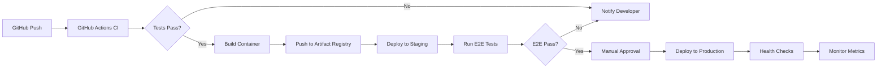

# DevOps Pipeline Assessment Report

## Executive Summary

Your CI/CD pipeline shows a **mixed DevOps architecture** with both GitHub Actions and Google Cloud Build, but there are critical issues causing failures in GitHub Actions. The primary problems are:

1. **Frequent workflow cancellations** due to rapid commits triggering concurrency limits
2. **Missing Google Cloud authentication** in CI environment 
3. **Incomplete deployment automation** - no automated path from GitHub Actions to production
4. **Configuration misalignment** between GitHub Actions and Google Cloud Build

## Current State Analysis

### ✅ Strengths

1. **Performance Optimization**
   - Parallel test execution using matrix strategy
   - Aggressive caching (UV, Python deps, Node modules)
   - Smart change detection to skip unnecessary tests
   - Concurrency controls to prevent resource waste

2. **Security**
   - Security scanning with Bandit
   - Dependency vulnerability checks
   - No hardcoded secrets found
   - Proper permissions scoping in workflows

3. **Test Coverage**
   - Unit, integration, and e2e test suites configured
   - Comprehensive pytest configuration
   - Frontend testing with Jest/Vitest

### ❌ Critical Issues

#### 1. GitHub Actions Failures (HIGH PRIORITY)

**Pattern Observed**: Multiple cancelled runs in succession
```
- 10+ cancelled runs for same PR within minutes
- Concurrency group causing automatic cancellations
- No successful runs visible in recent history
```

**Root Cause**: The `concurrency` configuration is too aggressive:
```yaml
concurrency:
  group: ${{ github.workflow }}-${{ github.ref }}
  cancel-in-progress: true
```

**Impact**: Developers can't get CI feedback, blocking PR merges

#### 2. Google Cloud Authentication Issues

**Problem**: CI environment lacks proper GCP credentials
```python
# In smoke tests (line 152-204):
env:
  GOOGLE_CLOUD_PROJECT: "analystai-454200"
  GOOGLE_APPLICATION_CREDENTIALS: ""  # Empty!
  CI: "true"
```

**Impact**: Tests fail when trying to import Google Cloud dependencies

#### 3. Deployment Gap

**Current Setup**:
- GitHub Actions: Only runs tests, no deployment
- Google Cloud Build: Configured but not triggered from GitHub Actions
- Manual deployment required

**Missing**:
- No automated deployment workflow in GitHub Actions
- No integration between GitHub Actions and Cloud Build
- No staging → production promotion pipeline

## Failure Analysis

### Recent Workflow Runs (Last 20)
- **1 In Progress** (current)
- **9 Cancelled** (rapid commits)
- **10 Skipped** (CodeRabbit notifications)
- **0 Successful** visible

### Failure Points

1. **Import Validation Errors**
   ```python
   # Smoke tests trying to handle missing Google Cloud auth
   if 'google.cloud' in str(e) or 'google.auth' in str(e):
       print('⚠️ Google Cloud imports unavailable in CI (expected)')
   ```

2. **Dependency Resolution**
   - UV version mismatch (0.5.11 in CI vs 0.6.12 in Docker)
   - Missing test dependencies in some environments

## Recommendations

### 🔥 Immediate Fixes (Do Today)

#### 1. Fix Concurrency Configuration
```yaml
# .github/workflows/main-ci.yml
concurrency:
  group: ${{ github.workflow }}-${{ github.event.pull_request.number || github.ref }}
  cancel-in-progress: ${{ github.event_name == 'pull_request' }}
```

#### 2. Add GCP Authentication for CI
```yaml
# Add to main-ci.yml jobs
- name: Setup GCP Auth
  uses: google-github-actions/auth@v2
  with:
    credentials_json: ${{ secrets.GCP_SA_KEY }}
    create_credentials_file: true
    export_environment_variables: true
```

#### 3. Mock Cloud Dependencies in Tests
```python
# tests/conftest.py
@pytest.fixture(autouse=True)
def mock_gcp_in_ci(monkeypatch):
    if os.getenv('CI'):
        monkeypatch.setenv('GOOGLE_CLOUD_PROJECT', 'test-project')
        # Mock imports as needed
```

### 📋 Short-term Improvements (This Week)

#### 1. Create Deployment Workflow
```yaml
# .github/workflows/deploy.yml
name: Deploy to Cloud Run
on:
  push:
    branches: [main]
  workflow_dispatch:

jobs:
  deploy-staging:
    runs-on: ubuntu-latest
    steps:
      - uses: actions/checkout@v4
      - uses: google-github-actions/auth@v2
      - name: Deploy to Cloud Run
        run: |
          gcloud run deploy vana \
            --image gcr.io/$PROJECT_ID/vana:${{ github.sha }} \
            --region us-central1 \
            --platform managed
```

#### 2. Unify Package Manager Versions
```yaml
# Standardize on UV 0.6.12 everywhere
UV_VERSION: '0.6.12'  # in all workflows and Dockerfile
```

#### 3. Add Workflow Status Badges
```markdown
# README.md


```

### 🎯 Long-term Strategy (This Month)

#### 1. Implement GitOps
- Use ArgoCD or Flux for declarative deployments
- Separate config repo for environment configurations
- Automated rollback capabilities

#### 2. Establish Proper Environments
```
Feature Branch → PR → Main → Staging → Production
     ↓           ↓      ↓        ↓          ↓
   Tests      Tests  Build   E2E Tests  Manual Approval
```

#### 3. Monitoring & Observability
- Add deployment tracking to GitHub Actions
- Integrate with Cloud Monitoring
- Set up alerts for failed deployments

## Recommended DevOps Pipeline Architecture



## Priority Action Items

### Week 1
- [ ] Fix concurrency configuration
- [ ] Add GCP service account secret
- [ ] Mock cloud dependencies in tests
- [ ] Standardize UV version

### Week 2
- [ ] Create deployment workflow
- [ ] Integrate GitHub Actions with Cloud Build
- [ ] Add staging environment tests
- [ ] Set up deployment notifications

### Week 3
- [ ] Implement blue-green deployments
- [ ] Add automated rollback
- [ ] Create runbooks for common issues
- [ ] Set up monitoring dashboards

## Configuration Files to Update

1. **`.github/workflows/main-ci.yml`**
   - Fix concurrency settings
   - Add GCP authentication
   - Add deployment job

2. **`pyproject.toml`**
   - Add CI-specific test markers
   - Configure test environments

3. **`Dockerfile`**
   - Ensure UV version matches CI

4. **`.cloudbuild/staging.yaml`**
   - Add GitHub status reporting
   - Include rollback triggers

## Success Metrics

Track these KPIs after implementing fixes:

- **CI Success Rate**: Target >95% (currently ~0%)
- **Build Time**: Target <5 minutes (currently N/A)
- **Deployment Frequency**: Target daily (currently manual)
- **MTTR**: Target <30 minutes (currently unknown)
- **Failed Deployment Rate**: Target <5%

## Conclusion

Your DevOps pipeline has good foundations but critical gaps preventing reliable CI/CD. The immediate priority is fixing GitHub Actions to restore CI feedback. Once stable, focus on automating deployments and improving observability. The split between GitHub Actions and Cloud Build adds complexity - consider consolidating or clearly defining responsibilities for each system.

**Overall Grade**: C- (Good architecture, poor execution)

**Next Step**: Implement the immediate fixes to restore CI functionality, then work through the priority action items systematically.