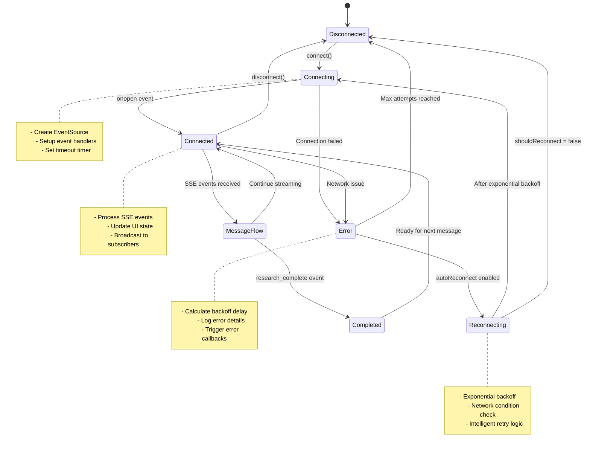
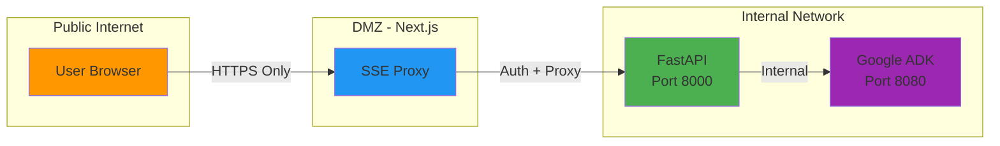

# SSE Architecture - Service Components

## C4 Component Diagram - SSE System Architecture

```mermaid
graph TB
    subgraph "Browser - Port 3000"
        subgraph "React Frontend"
            UI[Chat UI Component]
            Stream[useChatStream Hook]
            SSE[useSSE Hook]
            OptSSE[useOptimizedSSE Hook]
            Store[Zustand State Store]

            UI --> Stream
            Stream --> SSE
            Stream --> OptSSE
            Stream --> Store
            SSE --> Store
            OptSSE --> Store
        end

        ES[Browser EventSource API]
        SSE --> ES
        OptSSE --> ES
    end

    subgraph "Next.js Server - Port 3000"
        subgraph "API Routes"
            ProxyMain[/api/sse/[...route]/route.ts]
            ProxyQuery[/api/sse/route.ts]
        end

        Auth[Cookie/Header Auth<br/>Extraction]
        ProxyMain --> Auth
        ProxyQuery --> Auth
    end

    subgraph "Backend Server - Port 8000"
        subgraph "FastAPI Application"
            Router[ADK Router<br/>/apps/{app}/users/{user}/sessions/{session}]
            Validation[Input Validation<br/>OWASP Protection]
            RateLimit[Rate Limiter<br/>Token Bucket Algorithm]
            SessionMgr[Session Store<br/>GCS Persistence]
            Broadcaster[SSE Broadcaster<br/>Event Streaming]

            Router --> Validation
            Router --> RateLimit
            Router --> SessionMgr
            Router --> Broadcaster
        end

        subgraph "Supporting Services"
            LiteLLM[LiteLLM Proxy]
            Security[JWT Validation]
        end
    end

    subgraph "ADK Service - Port 8080"
        subgraph "Google Agent Development Kit"
            ADKRouter[ADK /run_sse Endpoint]
            Agents[8 Research Agents<br/>Team Leader, Planner, etc.]
            LLM[Gemini 2.5 Pro Flash]

            ADKRouter --> Agents
            Agents --> LLM
        end
    end

    subgraph "External Services"
        GCS[(Google Cloud Storage<br/>Session Persistence)]
        Gemini[Google AI Studio<br/>Gemini API]
        OpenRouter[OpenRouter API<br/>Fallback Models]
    end

    %% Data Flow Connections
    ES -.->|HTTP GET<br/>EventSource| ProxyMain
    ES -.->|HTTP GET<br/>EventSource| ProxyQuery

    ProxyMain -->|Forward with<br/>Auth Header| Router
    ProxyQuery -->|Forward with<br/>Auth Header| Router

    Router -->|POST /run_sse<br/>ADK Event Format| ADKRouter
    Router <-.->|SSE Stream<br/>text/event-stream| Broadcaster
    Broadcaster <-.->|SSE Events| ProxyMain

    ADKRouter <-.->|SSE Response<br/>Content Chunks| Router

    SessionMgr --> GCS
    LLM --> Gemini
    LLM --> OpenRouter
    RateLimit --> LLM

    Router --> Security
    Router --> LiteLLM

    %% Styling
    classDef frontend fill:#e1f5ff,stroke:#01579b,stroke-width:2px
    classDef proxy fill:#fff9c4,stroke:#f57f17,stroke-width:2px
    classDef backend fill:#f3e5f5,stroke:#4a148c,stroke-width:2px
    classDef adk fill:#e8f5e9,stroke:#1b5e20,stroke-width:2px
    classDef external fill:#fce4ec,stroke:#880e4f,stroke-width:2px

    class UI,Stream,SSE,OptSSE,Store,ES frontend
    class ProxyMain,ProxyQuery,Auth proxy
    class Router,Validation,RateLimit,SessionMgr,Broadcaster,LiteLLM,Security backend
    class ADKRouter,Agents,LLM adk
    class GCS,Gemini,OpenRouter external
```

## SSE Connection Lifecycle



## Component Responsibilities

### Frontend Layer (Port 3000)
- **Chat UI**: User interaction, display, input handling
- **useChatStream**: Orchestrates chat flow, manages sessions
- **useSSE/useOptimizedSSE**: SSE connection management, event parsing
- **Zustand Store**: Centralized state, message/session persistence
- **EventSource API**: Browser-native SSE client

### Proxy Layer (Next.js)
- **API Routes**: `/api/sse/[...route]` and `/api/sse?path=...`
- **Authentication**: Extract JWT from HTTP-only cookies
- **Security**: Prevent token exposure in URLs
- **Forwarding**: Proxy SSE streams with proper headers

### Backend Layer (Port 8000)
- **ADK Router**: ADK-compliant REST endpoints
- **Input Validation**: OWASP protection, XSS prevention
- **Rate Limiting**: Token bucket algorithm (Gemini API)
- **Session Management**: GCS persistence, lifecycle tracking
- **SSE Broadcaster**: Event streaming, session-based routing

### ADK Layer (Port 8080)
- **Agent Network**: 8 specialized research agents
- **LLM Integration**: Gemini 2.5 Pro Flash
- **Streaming**: SSE response generation
- **Orchestration**: Multi-agent coordination

## Data Flow Patterns

### Request Flow (User → ADK)
```
User Input → ChatUI → useChatStream → FastAPI Router →
Input Validation → Rate Limiter → ADK /run_sse → Agents → LLM
```

### Response Flow (ADK → User)
```
LLM → Agents → ADK SSE Stream → FastAPI Broadcaster →
Next.js Proxy → EventSource → useSSE → Store → ChatUI
```

### Session Persistence Flow
```
Message Event → Store → FastAPI SessionStore → GCS →
On Load → GCS → SessionStore → Store → ChatUI
```

## Security Boundaries



## Performance Optimizations

### Connection Pooling (useOptimizedSSE)
- Shared EventSource instances across components
- Subscriber-based lifecycle management
- Automatic cleanup when no subscribers

### Memory Management
- Event buffer limiting (maxEvents: 1000)
- Automatic old event pruning
- Debounced state updates

### Network Intelligence
- Adaptive reconnection delays
- Network status monitoring (online/offline)
- Consecutive failure tracking
- Browser native EventSource with automatic reconnection
