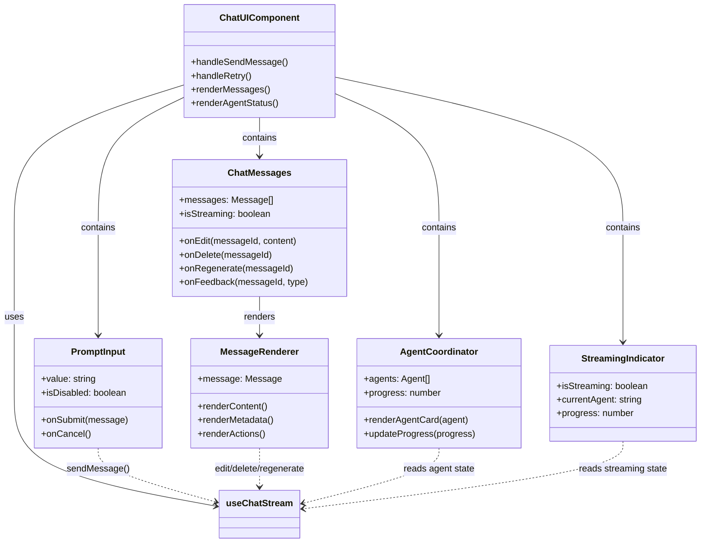
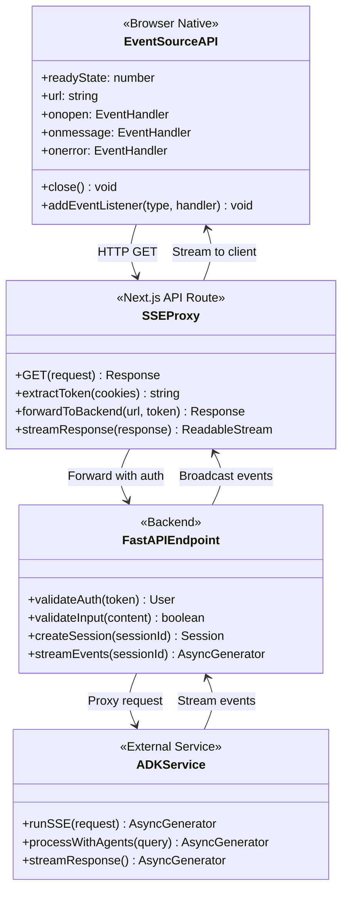
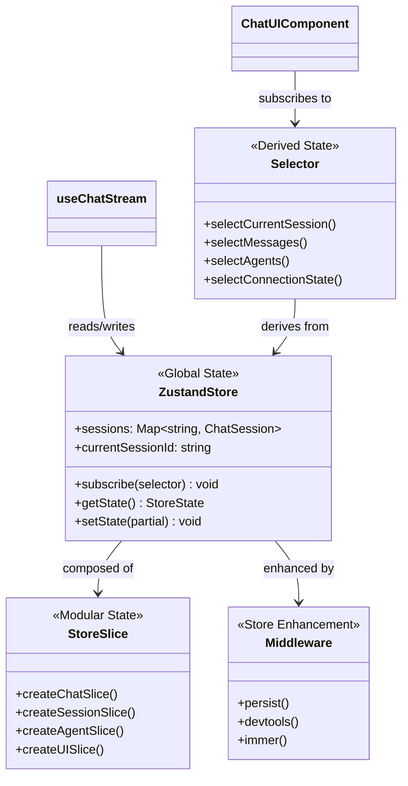
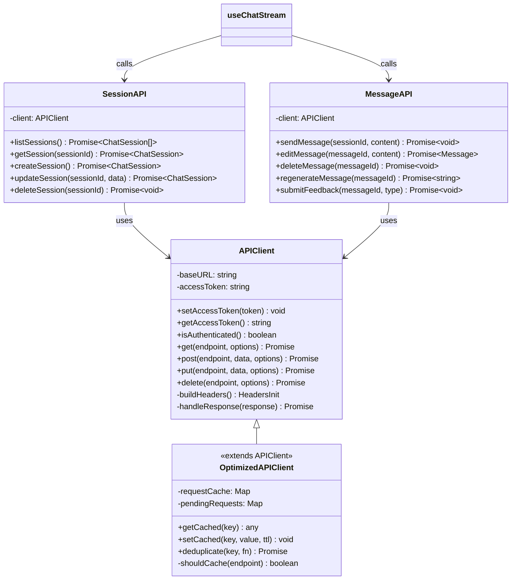

# SSE Implementation Class Diagram

## Core Classes and Interfaces

```mermaid
classDiagram
    %% Frontend Hooks
    class useSSE {
        -eventSourceRef: EventSource
        -reconnectTimeoutRef: NodeJS.Timeout
        -shouldReconnectRef: boolean
        -mountedRef: boolean
        -callbacksRef: Object
        +connectionState: SSEConnectionState
        +lastEvent: AgentNetworkEvent
        +events: AgentNetworkEvent[]
        +error: string
        +isConnected: boolean
        +reconnectAttempt: number
        +connect() void
        +disconnect() void
        +reconnect() void
        +clearEvents() void
        -buildSSEUrl() string
        -parseEventData(data, fallbackType) AgentNetworkEvent
        -getReconnectDelay(attempt) number
    }

    class useOptimizedSSE {
        -subscriberIdRef: string
        -connectionPoolRef: SSEConnectionPool
        -lastEventTimeRef: number
        -networkStateRef: Object
        +connectionState: SSEConnectionState
        +metrics: PerformanceMetrics
        +connect() void
        +disconnect() void
        -getIntelligentReconnectDelay(attempt) number
        -handleEvent(event) void
    }

    class SSEConnectionPool {
        -connections: Map~string, ConnectionInfo~
        +static getInstance() SSEConnectionPool
        +addSubscriber(url, subscriberId) void
        +removeSubscriber(url, subscriberId) void
        +getConnection(url) EventSource
        +setConnection(url, eventSource) void
        +updateActivity(url) void
        +recordLatency(url, latency) void
        +getMetrics(url) ConnectionMetrics
    }

    class useChatStream {
        +currentSession: ChatSession
        +sessionId: string
        +messages: Message[]
        +agents: Agent[]
        +isStreaming: boolean
        +connectionState: SSEConnectionState
        +error: string
        +sendMessage(query) Promise~void~
        +createNewSession() string
        +switchSession(sessionId) void
        +clearCurrentSession() void
        +retryLastMessage() void
        +connect() void
        +disconnect() void
    }

    class useChatStore {
        +sessions: Record~string, ChatSession~
        +currentSessionId: string
        +createSession() string
        +setCurrentSession(id) void
        +addMessage(sessionId, message) void
        +updateMessage(sessionId, messageId, updates) void
        +clearSession(sessionId) void
        +getSession(sessionId) ChatSession
    }

    %% Backend Components
    class ADKRouter {
        +router: APIRouter
        +run_session_sse(app_name, user_id, session_id, request) dict
        +get_session_sse(app_name, user_id, session_id) StreamingResponse
        +list_user_sessions(app_name, user_id) dict
        +get_user_session(app_name, user_id, session_id) dict
        +update_user_session(app_name, user_id, session_id, payload) dict
        +delete_user_session(app_name, user_id, session_id) dict
        +append_session_message(app_name, user_id, session_id, payload) dict
        -call_adk_and_stream() AsyncGenerator
    }

    class SSEBroadcaster {
        -_queues: dict~str, Queue~
        -_session_manager: SessionManager
        +broadcast_event(session_id, event) void
        +subscribe(session_id) AsyncGenerator
        +unsubscribe(session_id) void
        +clear_session(session_id) void
        -_event_generator(session_id) AsyncGenerator
    }

    class SessionStore {
        -sessions: dict~str, SessionRecord~
        +ensure_session(session_id, **kwargs) SessionRecord
        +get_session(session_id, **kwargs) dict
        +update_session(session_id, **kwargs) SessionRecord
        +add_message(session_id, message) MessageRecord
        +list_sessions() list
        +delete_session(session_id) bool
        -_load_from_gcs(session_id) dict
        -_save_to_gcs(session_id, data) void
    }

    class RateLimiter {
        -_tokens: float
        -_last_refill: float
        -_max_tokens: int
        -_refill_rate: float
        -_lock: asyncio.Lock
        +acquire() AsyncContextManager
        +get_stats() dict
        -_refill() void
    }

    %% Data Models
    class AgentNetworkEvent {
        +type: EventType
        +data: dict
        +timestamp: string
    }

    class ChatSession {
        +id: string
        +title: string
        +messages: Message[]
        +agents: Agent[]
        +status: SessionStatus
        +created_at: string
        +updated_at: string
        +isStreaming: boolean
        +progress: number
        +error: string
    }

    class Message {
        +id: string
        +role: MessageRole
        +content: string
        +timestamp: string
        +metadata: dict
    }

    class Agent {
        +agent_id: string
        +agent_type: string
        +name: string
        +status: AgentStatus
        +progress: number
        +current_task: string
    }

    class SSEOptions {
        +sessionId: string
        +autoReconnect: boolean
        +enabled: boolean
        +maxReconnectAttempts: number
        +reconnectDelay: number
        +maxReconnectDelay: number
        +withCredentials: boolean
        +onConnect: Function
        +onDisconnect: Function
        +onError: Function
        +onReconnect: Function
    }

    class OptimizedSSEOptions {
        <<extends SSEOptions>>
        +maxEvents: number
        +intelligentReconnect: boolean
        +connectionTimeout: number
    }

    class SessionMessagePayload {
        +id: string
        +role: string
        +content: string
        +timestamp: datetime
        +metadata: dict
    }

    class MessageEditRequest {
        +content: string
        +trigger_regeneration: boolean
    }

    class MessageRegenerateRequest {
        +model_parameters: dict
        +context: dict
    }

    class RegenerationTask {
        +id: string
        +message_id: string
        +session_id: string
        +original_message_id: string
        +status: TaskStatus
        +progress: number
        +created_at: datetime
        +started_at: datetime
        +completed_at: datetime
        +error_message: string
    }

    %% Enums
    class SSEConnectionState {
        <<enumeration>>
        disconnected
        connecting
        connected
        error
        reconnecting
    }

    class EventType {
        <<enumeration>>
        research_update
        research_complete
        agent_status
        agent_start
        agent_complete
        connection
        keepalive
        error
        message_edited
        message_deleted
        message_regenerating
        regeneration_progress
        message_regenerated
        feedback_received
    }

    class MessageRole {
        <<enumeration>>
        user
        assistant
        system
    }

    class AgentStatus {
        <<enumeration>>
        idle
        active
        processing
        complete
        error
    }

    class SessionStatus {
        <<enumeration>>
        starting
        running
        completed
        error
        cancelled
        regenerating
    }

    %% Relationships - Frontend
    useChatStream --> useSSE : uses
    useChatStream --> useOptimizedSSE : uses (optimized)
    useChatStream --> useChatStore : manages
    useSSE --> AgentNetworkEvent : emits
    useOptimizedSSE --> SSEConnectionPool : uses
    useOptimizedSSE --> AgentNetworkEvent : emits
    useChatStore --> ChatSession : stores
    ChatSession --> Message : contains
    ChatSession --> Agent : tracks

    %% Relationships - Options
    useSSE ..> SSEOptions : accepts
    useOptimizedSSE ..> OptimizedSSEOptions : accepts

    %% Relationships - Backend
    ADKRouter --> SSEBroadcaster : uses
    ADKRouter --> SessionStore : uses
    ADKRouter --> RateLimiter : uses
    ADKRouter --> SessionMessagePayload : accepts
    SSEBroadcaster --> AgentNetworkEvent : broadcasts
    SessionStore --> ChatSession : persists
    SessionStore --> Message : stores

    %% Relationships - Message Actions
    ADKRouter --> MessageEditRequest : handles
    ADKRouter --> MessageRegenerateRequest : handles
    ADKRouter --> RegenerationTask : manages

    %% Relationships - State
    useSSE ..> SSEConnectionState : uses
    useChatStream ..> SSEConnectionState : uses
    AgentNetworkEvent --> EventType : has
    Message --> MessageRole : has
    Agent --> AgentStatus : has
    ChatSession --> SessionStatus : has
```

## Component Interaction Diagram

## Data Flow Between Components

## State Management Architecture

## API Client Architecture

