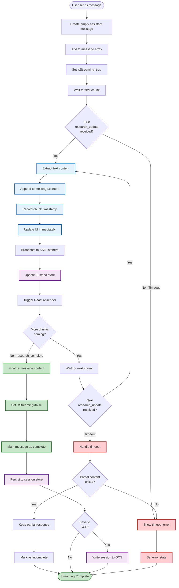
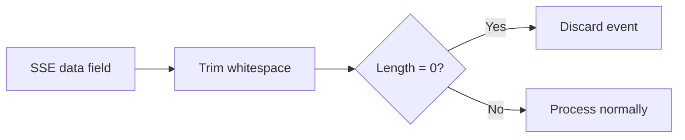
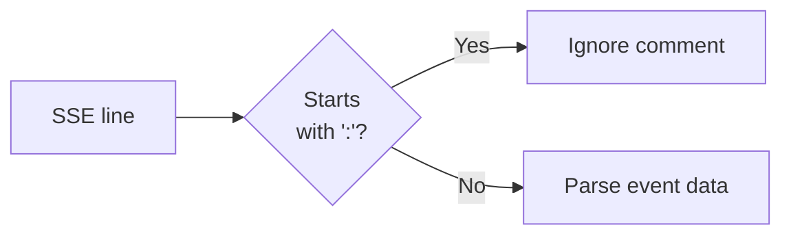

# SSE Message Processing Flowchart

## Message Type Router & Processing Logic

```mermaid
flowchart TD
    Start([SSE Event Received]) --> Extract[Extract event fields<br/>event, data, id]

    Extract --> ParseData{Valid JSON<br/>in data field?}

    ParseData -->|No| LogWarn[Log warning:<br/>Invalid SSE data]
    LogWarn --> End([Discard Event])

    ParseData -->|Yes| CheckEmpty{Data is empty<br/>or whitespace?}

    CheckEmpty -->|Yes| End
    CheckEmpty -->|No| CheckDone{Data equals<br/>'[DONE]'?}

    CheckDone -->|Yes| CreateComplete[Create stream_complete event]
    CreateComplete --> UpdateStore

    CheckDone -->|No| CheckComment{Starts with ':'<br/>SSE comment?}

    CheckComment -->|Yes| End
    CheckComment -->|No| ParseJSON[Parse JSON payload]

    ParseJSON --> CheckFormat{Has 'type'<br/>and 'data'<br/>fields?}

    CheckFormat -->|Yes - New Format| ExtractNew[Extract type and data<br/>from structured payload]
    CheckFormat -->|No - Legacy Format| UseFallback[Use event field as type<br/>Use entire payload as data]

    ExtractNew --> RouteEvent
    UseFallback --> RouteEvent

    RouteEvent{Route by<br/>event type}

    %% Research Events
    RouteEvent -->|research_update| ResearchUpdate[Process Research Update]
    ResearchUpdate --> ExtractContent[Extract content from data]
    ExtractContent --> AppendContent[Append to message content]
    AppendContent --> RecordLatency[Record latency if timestamp present]
    RecordLatency --> UpdateStore

    RouteEvent -->|research_complete| ResearchComplete[Process Completion]
    ResearchComplete --> SetComplete[Set streaming=false]
    SetComplete --> FinalStatus[Update session status='completed']
    FinalStatus --> UpdateStore

    %% Agent Events
    RouteEvent -->|agent_status| AgentStatus[Process Agent Status]
    AgentStatus --> UpdateAgents[Update agents array in session]
    UpdateAgents --> UpdateProgress[Update progress indicators]
    UpdateProgress --> UpdateStore

    RouteEvent -->|agent_start| AgentStart[Process Agent Start]
    AgentStart --> AddAgent[Add agent to active list]
    AddAgent --> UpdateStore

    RouteEvent -->|agent_complete| AgentComplete[Process Agent Complete]
    AgentComplete --> RemoveAgent[Mark agent as complete]
    RemoveAgent --> UpdateStore

    %% Connection Events
    RouteEvent -->|connection| ConnectionEvent[Process Connection Event]
    ConnectionEvent --> LogConnection[Log connection info]
    LogConnection --> UpdateStore

    RouteEvent -->|keepalive| KeepAlive[Process Keep-Alive]
    KeepAlive --> UpdateActivity[Update last activity timestamp]
    UpdateActivity --> End

    %% Error Events
    RouteEvent -->|error| ErrorEvent[Process Error Event]
    ErrorEvent --> CheckRateLimit{Error code =<br/>RATE_LIMIT_EXCEEDED?}
    CheckRateLimit -->|Yes| ShowRateLimit[Show rate limit message]
    CheckRateLimit -->|No| ShowGenericError[Show error message]
    ShowRateLimit --> SetErrorState[Set session status='error']
    ShowGenericError --> SetErrorState
    SetErrorState --> UpdateStore

    %% Message Action Events
    RouteEvent -->|message_edited| MessageEdited[Process Edit Event]
    MessageEdited --> FindMessage[Find message by ID]
    FindMessage --> UpdateContent[Update message content]
    UpdateContent --> MarkEdited[Set metadata.edited=true]
    MarkEdited --> UpdateStore

    RouteEvent -->|message_deleted| MessageDeleted[Process Delete Event]
    MessageDeleted --> RemoveMessages[Remove message and subsequent]
    RemoveMessages --> UpdateStore

    RouteEvent -->|message_regenerating| Regenerating[Process Regeneration Start]
    Regenerating --> ClearContent[Clear existing content]
    ClearContent --> SetRegenerating[Set metadata.regenerating=true]
    SetRegenerating --> UpdateStore

    RouteEvent -->|regeneration_progress| RegenProgress[Process Regeneration Progress]
    RegenProgress --> UpdateProgress2[Update progress %]
    UpdateProgress2 --> PartialContent{Has partial<br/>content?}
    PartialContent -->|Yes| UpdateContent2[Update message content]
    PartialContent -->|No| UpdateStore
    UpdateContent2 --> UpdateStore

    RouteEvent -->|message_regenerated| Regenerated[Process Regeneration Complete]
    Regenerated --> FinalContent[Set final content]
    FinalContent --> UnsetRegenerating[Set metadata.regenerating=false]
    UnsetRegenerating --> MarkRegenerated[Set metadata.regenerated=true]
    MarkRegenerated --> UpdateStore

    RouteEvent -->|feedback_received| Feedback[Process Feedback Event]
    Feedback --> UpdateFeedback[Update message feedback counts]
    UpdateFeedback --> UpdateStore

    %% Unknown event type
    RouteEvent -->|Unknown Type| LogUnknown[Log unknown event type]
    LogUnknown --> StoreAnyway{Store anyway?}
    StoreAnyway -->|Yes| UpdateStore
    StoreAnyway -->|No| End

    %% Final state updates
    UpdateStore[Update Store State]
    UpdateStore --> CheckLimit{events.length ><br/>maxEvents?}

    CheckLimit -->|Yes| TrimEvents[Trim to last maxEvents<br/>Default: 1000]
    CheckLimit -->|No| BroadcastUpdate

    TrimEvents --> BroadcastUpdate[Broadcast to Zustand Store]
    BroadcastUpdate --> TriggerRerender[Trigger React Re-render]
    TriggerRerender --> NotifyCallbacks[Call event callbacks]
    NotifyCallbacks --> End

    %% Styling
    classDef errorStyle fill:#ffcdd2,stroke:#c62828,stroke-width:2px
    classDef successStyle fill:#c8e6c9,stroke:#2e7d32,stroke-width:2px
    classDef processStyle fill:#bbdefb,stroke:#1565c0,stroke-width:2px
    classDef decisionStyle fill:#fff9c4,stroke:#f57f17,stroke-width:2px

    class ErrorEvent,CheckRateLimit,ShowRateLimit,ShowGenericError,SetErrorState errorStyle
    class ResearchComplete,SetComplete,FinalStatus,UpdateStore,BroadcastUpdate successStyle
    class ResearchUpdate,AgentStatus,MessageEdited,Regenerated processStyle
    class ParseData,CheckEmpty,CheckDone,CheckComment,CheckFormat,RouteEvent,PartialContent,StoreAnyway,CheckLimit decisionStyle
```

## Error Handling Decision Tree

```mermaid
flowchart TD
    Error([Error Detected]) --> ClassifyError{Classify<br/>Error Type}

    ClassifyError -->|Network Error| NetworkError[Network Failure]
    ClassifyError -->|Parse Error| ParseError[JSON Parse Failure]
    ClassifyError -->|Auth Error| AuthError[Authentication Failure]
    ClassifyError -->|Rate Limit| RateLimit[API Rate Limit]
    ClassifyError -->|Timeout| TimeoutError[Connection Timeout]
    ClassifyError -->|Unknown| UnknownError[Unclassified Error]

    NetworkError --> CheckOnline{Browser<br/>online?}
    CheckOnline -->|Yes| CheckRetry
    CheckOnline -->|No| WaitOnline[Wait for online event]
    WaitOnline --> CheckRetry

    ParseError --> LogDetails[Log parse error details]
    LogDetails --> ContinueStream{Continue<br/>stream?}
    ContinueStream -->|Yes| IgnoreEvent[Ignore malformed event]
    ContinueStream -->|No| Disconnect

    AuthError --> CheckDevMode{Development<br/>mode?}
    CheckDevMode -->|Yes| AllowAnonymous[Allow without auth]
    CheckDevMode -->|No| ShowAuthError[Show auth error to user]
    AllowAnonymous --> CheckRetry
    ShowAuthError --> Disconnect

    RateLimit --> ShowUserMessage[Show rate limit message]
    ShowUserMessage --> SetErrorSession[Set session status='error']
    SetErrorSession --> StopStream[Stop streaming]
    StopStream --> End([Error Handled])

    TimeoutError --> CheckIntelligent{Intelligent<br/>reconnect<br/>enabled?}
    CheckIntelligent -->|Yes| AdaptiveBackoff[Calculate adaptive delay]
    CheckIntelligent -->|No| StandardBackoff[Standard exponential backoff]
    AdaptiveBackoff --> CheckRetry
    StandardBackoff --> CheckRetry

    UnknownError --> LogError[Log error details]
    LogError --> CheckRetry

    CheckRetry{Should<br/>retry?}
    CheckRetry -->|Yes| CheckAttempts{attempts <<br/>maxAttempts?}
    CheckRetry -->|No| Disconnect

    CheckAttempts -->|Yes| CalculateDelay[Calculate backoff delay]
    CheckAttempts -->|No| MaxRetriesReached[Max retries exceeded]

    CalculateDelay --> IncrementAttempt[Increment attempt counter]
    IncrementAttempt --> SetReconnecting[Set state='reconnecting']
    SetReconnecting --> ScheduleReconnect[setTimeout for reconnect]
    ScheduleReconnect --> End

    MaxRetriesReached --> NotifyUser[Notify user: connection failed]
    NotifyUser --> Disconnect

    Disconnect[Disconnect & cleanup]
    Disconnect --> SetDisconnected[Set state='disconnected']
    SetDisconnected --> ClearEventSource[eventSource.close()]
    ClearEventSource --> RemoveHandlers[Remove event handlers]
    RemoveHandlers --> End

    IgnoreEvent --> End

    %% Styling
    classDef errorClass fill:#ffcdd2,stroke:#c62828,stroke-width:2px
    classDef retryClass fill:#fff9c4,stroke:#f57f17,stroke-width:2px
    classDef successClass fill:#c8e6c9,stroke:#2e7d32,stroke-width:2px
    classDef decisionClass fill:#e1bee7,stroke:#6a1b9a,stroke-width:2px

    class NetworkError,ParseError,AuthError,RateLimit,TimeoutError,UnknownError errorClass
    class CheckRetry,CalculateDelay,ScheduleReconnect,SetReconnecting retryClass
    class AllowAnonymous,IgnoreEvent successClass
    class ClassifyError,CheckOnline,ContinueStream,CheckDevMode,CheckIntelligent,CheckAttempts decisionClass
```

## Content Accumulation Flow (Streaming)



## Edge Cases & Special Handling

### Empty Data Handling


### [DONE] Marker Handling
```mermaid
flowchart LR
    Data[data: '[DONE]'] --> Detect{Equals<br/>'[DONE]'?}
    Detect -->|Yes| Create[Create stream_complete event]
    Create --> Broadcast[Broadcast completion]
    Detect -->|No| Normal[Normal processing]
```

### Comment Line Handling


### Latency Tracking
```mermaid
flowchart LR
    Event[SSE event] --> HasTime{Has server<br/>timestamp?}
    HasTime -->|Yes| Calculate[latency = now() - timestamp]
    Calculate --> Validate{0 < latency<br/>< 60000ms?}
    Validate -->|Yes| Record[Record in metrics]
    Validate -->|No| Discard[Discard outlier]
    HasTime -->|No| Skip[Skip latency tracking]
```

### Memory Management
```mermaid
flowchart LR
    NewEvent[New event added] --> CheckSize{events.length ><br/>maxEvents?}
    CheckSize -->|Yes| Trim[events.slice(-maxEvents)]
    CheckSize -->|No| Keep[Keep all events]
    Trim --> Update[Update state]
    Keep --> Update
```
