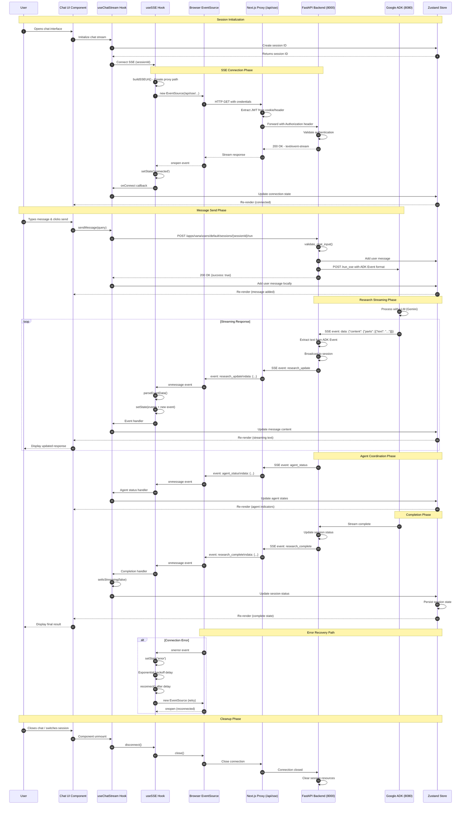
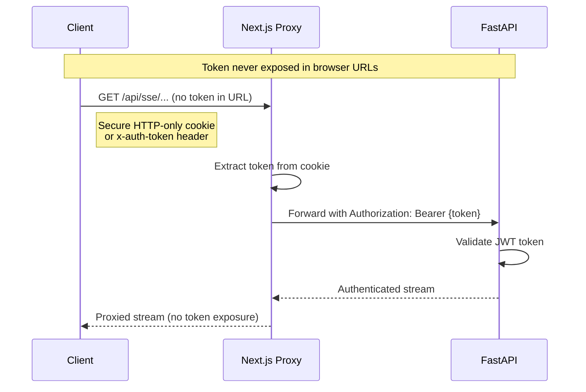

# SSE Message Flow - Sequence Diagram

## Complete SSE Sequence from User Action to UI Update

## Key Timing Considerations

### Async Operations Timeline

```mermaid
gantt
    title SSE Message Processing Timeline
    dateFormat X
    axisFormat %L ms

    section Connection
    EventSource Creation :a1, 0, 50
    Proxy Authentication :a2, after a1, 100
    Backend Validation :a3, after a2, 50
    Stream Established :milestone, after a3, 0

    section Message Send
    User Input :b1, 200, 10
    API Request :b2, after b1, 50
    Input Validation :b3, after b2, 30
    ADK Forwarding :b4, after b3, 100

    section Streaming
    LLM Processing :c1, after b4, 2000
    First Chunk :milestone, 500, 0
    Chunk Processing (10x) :c2, after c1, 100
    Final Chunk :milestone, 2500, 0

    section UI Update
    Parse Event :d1, 0, 20
    Update Store :d2, after d1, 10
    React Re-render :d3, after d2, 30
    DOM Update :d4, after d3, 20
    Paint :milestone, after d4, 0
```

## Event Types & Data Structures

### Research Events
- `research_update`: Incremental content chunks
- `research_complete`: Final status (no content)
- `agent_status`: Agent coordination updates
- `error`: Error messages with codes

### Message Action Events
- `message_regenerating`: Regeneration started
- `regeneration_progress`: Progress updates
- `message_regenerated`: Regeneration complete
- `message_edited`: Content edited
- `message_deleted`: Message removed

## Security Flow

