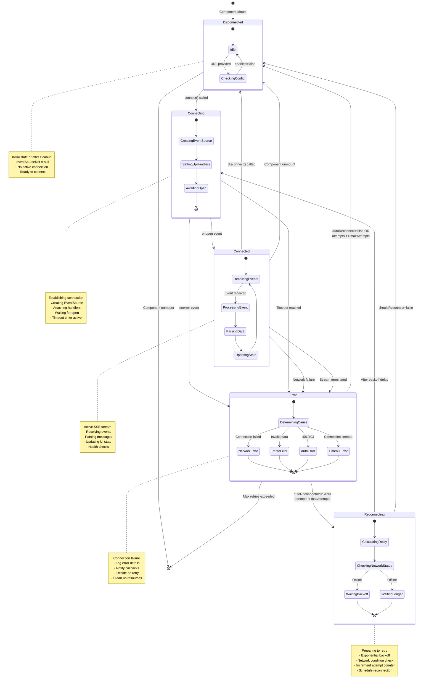
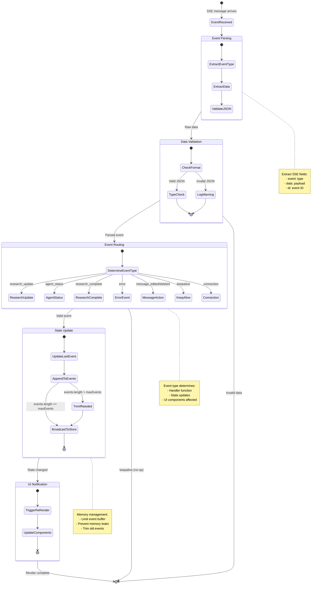
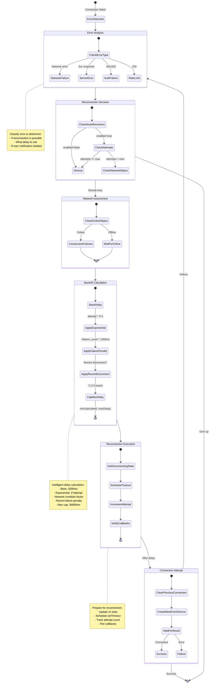
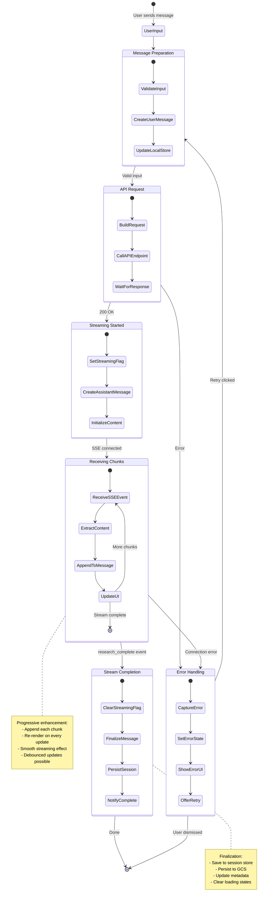

# SSE Connection State Machine

## Connection Lifecycle State Transitions

## Event Processing State Flow

## Reconnection Strategy State Machine

## Message Streaming State Flow

## State Transition Triggers

### External Triggers
- **User Actions**: connect(), disconnect(), sendMessage()
- **Network Events**: online, offline, connection lost
- **Component Lifecycle**: mount, unmount, prop changes
- **Backend Events**: SSE messages, connection close

### Internal Triggers
- **Timers**: Reconnection backoff, connection timeout
- **Conditions**: Max retries reached, validation failed
- **Callbacks**: onConnect, onDisconnect, onError, onReconnect
- **State Changes**: enabled flag, URL change

### Automatic Transitions
- **Auto-connect**: When component mounts with valid URL
- **Auto-reconnect**: After connection loss (if enabled)
- **Auto-cleanup**: On component unmount
- **Auto-retry**: After exponential backoff delay
