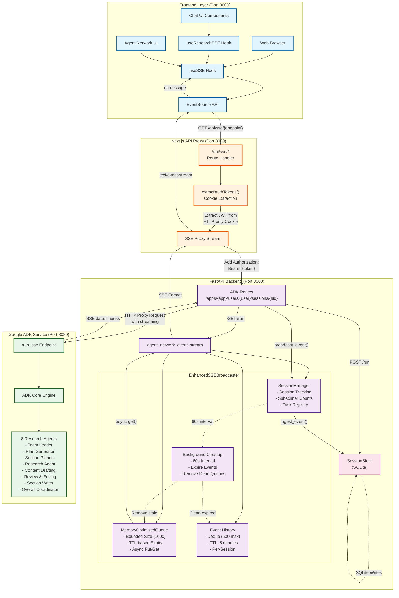
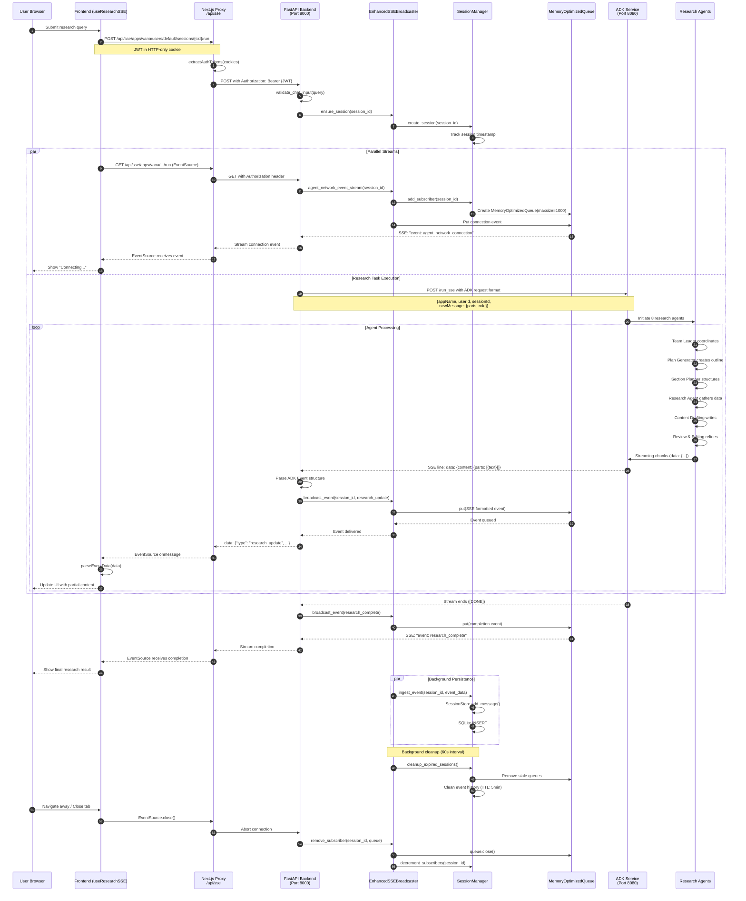
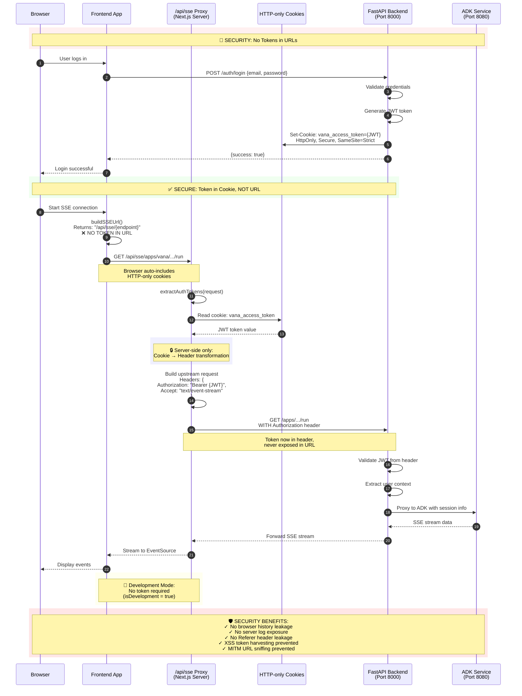
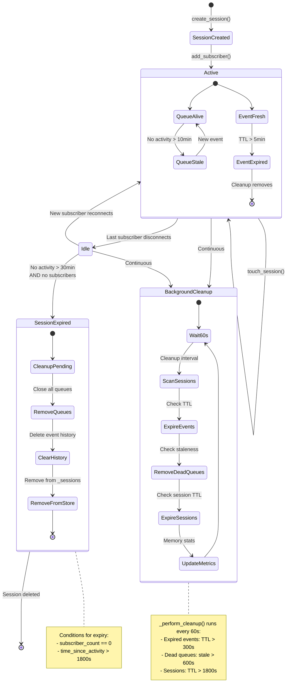

# Vana SSE Architecture - Comprehensive Mermaid Diagrams

This document contains detailed Mermaid diagrams for the Vana SSE (Server-Sent Events) architecture, covering system components, event flows, security, and data structures.

---

## 1. System Architecture Diagram



**Key Components:**

1. **Frontend (Port 3000)**: React hooks manage EventSource connections
2. **Next.js Proxy**: Secure JWT handling, no tokens in URLs
3. **FastAPI Backend (Port 8000)**: SSE broadcasting, session management
4. **Google ADK (Port 8080)**: 8 specialized research agents
5. **Storage**: SQLite for session persistence

---

## 2. Event Flow Sequence Diagram



**Flow Highlights:**

1. **Parallel Streams**: SSE connection + ADK research run concurrently
2. **Event Broadcasting**: ADK chunks → FastAPI → Proxy → Frontend
3. **Session Persistence**: Events saved to SQLite in background
4. **Automatic Cleanup**: 60s interval removes expired events/queues

---

## 3. EnhancedSSEBroadcaster Component Architecture

```mermaid
graph TB
    subgraph "EnhancedSSEBroadcaster"
        direction TB

        subgraph "Core Components"
            Config["BroadcasterConfig<br/>- max_queue_size: 1000<br/>- max_history: 500<br/>- event_ttl: 300s<br/>- session_ttl: 1800s<br/>- cleanup_interval: 60s"]

            Subscribers["_subscribers<br/>Dict[session_id, List[Queue]]<br/>Session-specific queues"]

            History["_event_history<br/>Dict[session_id, deque]<br/>Bounded deque (maxlen=500)"]

            Lock["asyncio.Lock<br/>Thread-safe operations"]
        end

        subgraph "SessionManager"
            Sessions["_sessions<br/>Dict[session_id, timestamp]"]
            SubCount["_subscriber_counts<br/>Dict[session_id, int]"]
            Tasks["_tasks<br/>Dict[session_id, Task]<br/>Background task registry"]
            SMLock["asyncio.Lock"]
        end

        subgraph "MemoryOptimizedQueue"
            Deque["deque<br/>Bounded queue"]
            Condition["asyncio.Condition<br/>Lazy init on first use"]
            Closed["_closed: bool"]
            LastActivity["_last_activity<br/>Timestamp for staleness"]
        end

        subgraph "Background Tasks"
            CleanupTask["_cleanup_task<br/>asyncio.Task<br/>60s interval loop"]
            PerformCleanup["_perform_cleanup()<br/>- Expire old events<br/>- Remove dead queues<br/>- Clear sessions"]
        end

        subgraph "Metrics"
            MemMetrics["MemoryMetrics<br/>- process_memory_mb<br/>- total_sessions<br/>- total_subscribers<br/>- expired_events_cleaned<br/>- sessions_expired"]
            PSUtil["psutil.Process<br/>Memory monitoring"]
        end

        subgraph "Public API"
            AddSub["add_subscriber(session_id)<br/>→ Queue"]
            RemoveSub["remove_subscriber(session_id, queue)"]
            Subscribe["subscribe(session_id)<br/>Context Manager"]
            Broadcast["broadcast_event(session_id, data)"]
            BroadcastAgent["broadcast_agent_network_event()"]
            GetHistory["get_event_history(session_id, limit)"]
            ClearSession["clear_session(session_id)"]
            ResetSubs["reset_subscribers(session_id)"]
            GetStats["get_stats()"]
            Shutdown["shutdown()"]
        end
    end

    subgraph "External Dependencies"
        SessionStore["session_store<br/>SQLite persistence"]
        EventStream["agent_network_event_stream()<br/>AsyncGenerator"]
    end

    %% Connections
    Config --> Subscribers
    Config --> History
    Config --> SessionManager

    SessionManager --> Sessions
    SessionManager --> SubCount
    SessionManager --> Tasks
    SessionManager --> SMLock

    Subscribers --> MemoryOptimizedQueue
    MemoryOptimizedQueue --> Deque
    MemoryOptimizedQueue --> Condition
    MemoryOptimizedQueue --> Closed
    MemoryOptimizedQueue --> LastActivity

    CleanupTask --> PerformCleanup
    PerformCleanup --> History
    PerformCleanup --> Subscribers
    PerformCleanup --> SessionManager

    PSUtil --> MemMetrics
    MemMetrics -.-> GetStats

    AddSub --> Subscribers
    AddSub --> SessionManager
    RemoveSub --> Subscribers
    RemoveSub --> SessionManager
    Subscribe --> AddSub
    Subscribe --> RemoveSub
    Broadcast --> Subscribers
    Broadcast --> History
    Broadcast --> SessionStore
    BroadcastAgent --> Broadcast
    GetHistory --> History
    ClearSession --> Subscribers
    ClearSession --> History
    ClearSession --> SessionManager
    ResetSubs --> Subscribers
    ResetSubs --> SessionManager

    EventStream --> Subscribe
    EventStream --> MemoryOptimizedQueue

    %% Styling
    classDef core fill:#e3f2fd,stroke:#1565c0,stroke-width:2px
    classDef manager fill:#f3e5f5,stroke:#6a1b9a,stroke-width:2px
    classDef queue fill:#fff3e0,stroke:#ef6c00,stroke-width:2px
    classDef task fill:#e8f5e9,stroke:#2e7d32,stroke-width:2px
    classDef metric fill:#fce4ec,stroke:#c2185b,stroke-width:2px
    classDef api fill:#fff9c4,stroke:#f57f17,stroke-width:2px
    classDef external fill:#eceff1,stroke:#455a64,stroke-width:2px

    class Config,Subscribers,History,Lock core
    class SessionManager,Sessions,SubCount,Tasks,SMLock manager
    class MemoryOptimizedQueue,Deque,Condition,Closed,LastActivity queue
    class CleanupTask,PerformCleanup task
    class MemMetrics,PSUtil metric
    class AddSub,RemoveSub,Subscribe,Broadcast,BroadcastAgent,GetHistory,ClearSession,ResetSubs,GetStats,Shutdown api
    class SessionStore,EventStream external
```



**Component Details:**

1. **BroadcasterConfig**: Tunable limits for memory management
2. **SessionManager**: Tracks active sessions, subscribers, background tasks
3. **MemoryOptimizedQueue**: Bounded async queue with TTL and staleness detection
4. **Background Cleanup**: 60s interval garbage collection
5. **Metrics**: Real-time memory monitoring with psutil

---

## 4. Security Architecture - JWT Token Flow



**Security Layers:**

1. **HTTP-only Cookies**: JWT stored securely, inaccessible to JavaScript
2. **Server-side Proxy**: Next.js extracts cookie → adds Authorization header
3. **No URL Tokens**: All SSE URLs are clean, e.g., `/api/sse/apps/.../run`
4. **Development Fallback**: Optional x-auth-token header for dev mode
5. **Attack Prevention**: Blocks browser history, logs, Referer, XSS, MITM

---

## 5. Event Type Taxonomy

```mermaid
graph TB
    Root[SSE Event Types]

    Root --> AgentNet[Agent Network Events]
    Root --> Research[Research Events]
    Root --> Chat[Chat Action Events]
    Root --> AI[AI Thought Process Events]
    Root --> System[System Events]

    subgraph "Agent Network (agent_network_*)"
        AgentNet --> ANU["agent_network_update<br/>Real-time agent status changes"]
        AgentNet --> ANS["agent_network_snapshot<br/>Complete network state"]
        AgentNet --> AS["agent_start<br/>Agent begins task"]
        AgentNet --> AC["agent_complete<br/>Agent finishes task"]
        AgentNet --> ANC["agent_network_connection<br/>Connection status changes<br/>{connected, disconnected}"]
        AgentNet --> KA["keepalive<br/>30s timeout heartbeat"]
    end

    subgraph "Research (research_*)"
        Research --> RU["research_update<br/>Partial content streaming<br/>from ADK agents"]
        Research --> RC["research_complete<br/>Final completion signal<br/>{status: 'completed'}"]
        Research --> AStatus["agent_status<br/>Individual agent progress<br/>(from ADK)"]
    end

    subgraph "Chat Actions (message_*, feedback_*, regeneration_*)"
        Chat --> MR["MESSAGE_REGENERATING<br/>Regeneration started"]
        Chat --> RP["REGENERATION_PROGRESS<br/>Progress updates<br/>{progress: 0-1, partialContent}"]
        Chat --> MReg["MESSAGE_REGENERATED<br/>Regeneration complete"]
        Chat --> ME["MESSAGE_EDITED<br/>Edit applied<br/>{previousContent, content}"]
        Chat --> MD["MESSAGE_DELETED<br/>Deletion confirmed<br/>{deletedCount, deletedMessageIds}"]
        Chat --> FS["FEEDBACK_SUBMITTED<br/>User feedback received<br/>{feedbackType}"]
    end

    subgraph "AI Thought Process (thought_process_*)"
        AI --> TPS["THOUGHT_PROCESS_START<br/>AI begins reasoning<br/>{thinkingAbout}"]
        AI --> TPStep["THOUGHT_PROCESS_STEP<br/>Individual reasoning step<br/>{step, reasoning}"]
        AI --> TPC["THOUGHT_PROCESS_COMPLETE<br/>Reasoning concluded<br/>{conclusion, totalSteps}"]
    end

    subgraph "System Events"
        System --> SU["SESSION_UPDATED<br/>Session metadata changed<br/>{status}"]
        System --> CS["CONNECTION_STATUS<br/>SSE connection state<br/>{status}"]
        System --> ERR["error<br/>Error occurred<br/>{error, errorCode}"]
        System --> SC["stream_complete<br/>SSE stream ended<br/>[DONE] marker"]
    end

    %% Styling
    classDef agent fill:#e8f5e9,stroke:#2e7d32,stroke-width:2px
    classDef research fill:#e3f2fd,stroke:#1565c0,stroke-width:2px
    classDef chat fill:#fff3e0,stroke:#ef6c00,stroke-width:2px
    classDef ai fill:#f3e5f5,stroke:#6a1b9a,stroke-width:2px
    classDef system fill:#fce4ec,stroke:#c2185b,stroke-width:2px

    class ANU,ANS,AS,AC,ANC,KA agent
    class RU,RC,AStatus research
    class MR,RP,MReg,ME,MD,FS chat
    class TPS,TPStep,TPC ai
    class SU,CS,ERR,SC system
```



**Event Categories:**

1. **Agent Network**: Real-time coordination between 8 research agents
2. **Research**: Content streaming from Google ADK (`research_update`, `research_complete`)
3. **Chat Actions**: User interactions (regenerate, edit, delete, feedback)
4. **AI Thought Process**: Transparent AI reasoning steps
5. **System**: Connection management, errors, session updates

---

## 6. Data Flow Architecture

```mermaid
flowchart LR
    subgraph "Data Sources"
        User[User Input]
        ADK[ADK Agents<br/>8 Specialists]
    end

    subgraph "Transformation Layer"
        Validate[Input Validation<br/>validate_chat_input]
        Parse[Parse ADK Event<br/>content.parts[].text]
        Format[SSE Event Builder<br/>SSEEventBuilder.*]
    end

    subgraph "Broadcasting Pipeline"
        Create[Create SSEEvent<br/>type, data, id, ttl]
        Queue[MemoryOptimizedQueue<br/>bounded, TTL]
        Stream[agent_network_event_stream<br/>AsyncGenerator]
    end

    subgraph "Persistence"
        SQLite[(SQLite Database<br/>session_store)]
        EventHistory[Event History<br/>deque maxlen=500]
    end

    subgraph "Delivery"
        Proxy[Next.js Proxy<br/>SSE → EventSource]
        Frontend[Frontend Hook<br/>useSSE parseEventData]
        UI[React Components<br/>Real-time Updates]
    end

    %% Flow
    User --> Validate
    Validate --> Create

    ADK --> Parse
    Parse --> Format
    Format --> Create

    Create --> Queue
    Create --> EventHistory
    Create --> SQLite

    Queue --> Stream
    Stream --> Proxy
    Proxy --> Frontend
    Frontend --> UI

    EventHistory -.->|History replay| Queue
    SQLite -.->|Session restore| Queue

    %% Styling
    classDef source fill:#e8f5e9,stroke:#2e7d32,stroke-width:2px
    classDef transform fill:#fff3e0,stroke:#ef6c00,stroke-width:2px
    classDef pipeline fill:#e3f2fd,stroke:#1565c0,stroke-width:2px
    classDef storage fill:#f3e5f5,stroke:#6a1b9a,stroke-width:2px
    classDef delivery fill:#fce4ec,stroke:#c2185b,stroke-width:2px

    class User,ADK source
    class Validate,Parse,Format transform
    class Create,Queue,Stream pipeline
    class SQLite,EventHistory storage
    class Proxy,Frontend,UI delivery
```

**Data Pipeline:**

1. **Sources**: User queries + ADK agent responses
2. **Transformation**: Validation, parsing, SSE formatting
3. **Broadcasting**: Queuing, streaming, event delivery
4. **Persistence**: SQLite storage + in-memory history
5. **Delivery**: Proxy → Frontend → UI updates

---

## 7. Memory Management & Cleanup



**Cleanup Mechanisms:**

1. **TTL-based Event Expiry**: 5 minutes (300s)
2. **Queue Staleness**: 10 minutes (600s) of inactivity
3. **Session Expiry**: 30 minutes (1800s) with no subscribers
4. **Background Task**: 60s interval cleanup loop
5. **Memory Monitoring**: psutil tracks process memory

---

## 8. ADK Integration Flow

```mermaid
graph LR
    subgraph "FastAPI (Port 8000)"
        ADKRoute["/apps/{app}/users/{user}/<br/>sessions/{sid}/run"]
        BuildReq["Build ADK Request<br/>{appName, userId, sessionId,<br/>newMessage: {parts, role}}"]
        HTTPClient["httpx.AsyncClient<br/>Streaming POST"]
    end

    subgraph "Google ADK (Port 8080)"
        ADKEndpoint["/run_sse"]
        ADKCore["ADK Core"]

        subgraph "8 Research Agents"
            TL[Team Leader]
            PG[Plan Generator]
            SP[Section Planner]
            RA[Research Agent]
            CD[Content Drafting]
            RE[Review & Editing]
            SW[Section Writer]
            OC[Overall Coordinator]
        end
    end

    subgraph "Response Processing"
        SSEIter["aiter_lines()<br/>Parse SSE stream"]
        ExtractContent["Extract content.parts[].text<br/>from ADK Event"]
        AccumulateContent["Accumulate text chunks"]
        BroadcastUpdate["broadcast_event()<br/>{type: 'research_update',<br/>content: accumulated}"]
    end

    subgraph "Completion"
        StreamEnd["Stream ends: [DONE]"]
        BroadcastComplete["broadcast_event()<br/>{type: 'research_complete',<br/>status: 'completed'}"]
        UpdateSession["session_store.update_session<br/>(status='completed')"]
    end

    %% Flow
    ADKRoute --> BuildReq
    BuildReq --> HTTPClient
    HTTPClient -->|"POST /run_sse<br/>timeout: 300s<br/>read: None"| ADKEndpoint

    ADKEndpoint --> ADKCore
    ADKCore --> TL
    TL --> PG
    PG --> SP
    SP --> RA
    RA --> CD
    CD --> RE
    RE --> SW
    SW --> OC

    OC -->|"SSE chunks<br/>data: {content: {...}}"| SSEIter
    SSEIter --> ExtractContent
    ExtractContent --> AccumulateContent
    AccumulateContent --> BroadcastUpdate

    BroadcastUpdate -.->|"Repeat per chunk"| SSEIter

    SSEIter --> StreamEnd
    StreamEnd --> BroadcastComplete
    BroadcastComplete --> UpdateSession

    %% Styling
    classDef fastapi fill:#e3f2fd,stroke:#1565c0,stroke-width:2px
    classDef adk fill:#e8f5e9,stroke:#2e7d32,stroke-width:2px
    classDef process fill:#fff3e0,stroke:#ef6c00,stroke-width:2px
    classDef complete fill:#f3e5f5,stroke:#6a1b9a,stroke-width:2px

    class ADKRoute,BuildReq,HTTPClient fastapi
    class ADKEndpoint,ADKCore,TL,PG,SP,RA,CD,RE,SW,OC adk
    class SSEIter,ExtractContent,AccumulateContent,BroadcastUpdate process
    class StreamEnd,BroadcastComplete,UpdateSession complete
```



**ADK Integration Details:**

1. **Request Format**: ADK-compliant structure with `newMessage.role` and `parts`
2. **Agent Coordination**: 8 specialized agents process research sequentially
3. **Streaming**: SSE chunks parsed from `content.parts[].text` structure
4. **Accumulation**: Text chunks joined into final research content
5. **Completion**: `[DONE]` marker triggers final events

---

## 9. Error Handling & Recovery

```mermaid
flowchart TD
    Start[SSE Request Initiated]

    Start --> ValidateInput{Input<br/>Validation}
    ValidateInput -->|Invalid| ReturnError400["HTTP 400<br/>validation error response"]
    ValidateInput -->|Valid| CheckAuth{Authentication<br/>Required?}

    CheckAuth -->|Production + No Token| ReturnError401["HTTP 401<br/>Unauthorized"]
    CheckAuth -->|Dev Mode / Has Token| CreateSession[Create/Ensure Session]

    CreateSession --> StartADK[Start ADK Request]

    StartADK --> ADKResponse{ADK<br/>Response}
    ADKResponse -->|Timeout| HandleTimeout[asyncio.TimeoutError]
    ADKResponse -->|Connection Error| HandleConnError[httpx.ConnectError]
    ADKResponse -->|Rate Limit 429| HandleRateLimit[Rate Limit Hit]
    ADKResponse -->|Success| StreamEvents[Stream SSE Events]

    HandleTimeout --> BroadcastError["broadcast_event()<br/>{type: 'error',<br/>error: 'timeout'}"]
    HandleConnError --> BroadcastError
    HandleRateLimit --> BroadcastRateLimitError["broadcast_event()<br/>{type: 'error',<br/>error_code: 'RATE_LIMIT_EXCEEDED'}"]

    BroadcastError --> UpdateSessionError["session_store.update_session<br/>(status='error')"]
    BroadcastRateLimitError --> UpdateSessionError

    StreamEvents --> ParseEvent{Parse<br/>SSE Data}
    ParseEvent -->|JSON Error| LogWarning[Log Warning]
    ParseEvent -->|Valid| AccumulateContent[Accumulate Content]

    LogWarning --> StreamEvents
    AccumulateContent --> BroadcastUpdate["broadcast_event()<br/>{type: 'research_update'}"]

    BroadcastUpdate --> CheckComplete{Stream<br/>Complete?}
    CheckComplete -->|No| StreamEvents
    CheckComplete -->|Yes: [DONE]| BroadcastComplete["broadcast_event()<br/>{type: 'research_complete'}"]

    BroadcastComplete --> UpdateSessionSuccess["session_store.update_session<br/>(status='completed')"]

    UpdateSessionSuccess --> End[SSE Stream Ends]
    UpdateSessionError --> End
    ReturnError400 --> End
    ReturnError401 --> End

    %% Task Cancellation
    StreamEvents -.->|User disconnects| TaskCancelled[asyncio.CancelledError]
    TaskCancelled --> CleanupSession["clear_session(session_id)<br/>Cancel background tasks"]
    CleanupSession --> End

    %% Styling
    classDef error fill:#ffebee,stroke:#c62828,stroke-width:2px
    classDef success fill:#e8f5e9,stroke:#2e7d32,stroke-width:2px
    classDef warning fill:#fff3e0,stroke:#ef6c00,stroke-width:2px
    classDef decision fill:#e3f2fd,stroke:#1565c0,stroke-width:2px

    class ReturnError400,ReturnError401,HandleTimeout,HandleConnError,HandleRateLimit,BroadcastError,BroadcastRateLimitError,UpdateSessionError,TaskCancelled error
    class BroadcastComplete,UpdateSessionSuccess,End success
    class LogWarning warning
    class ValidateInput,CheckAuth,ADKResponse,ParseEvent,CheckComplete decision
```

**Error Recovery:**

1. **Input Validation**: Server-side checks prevent malicious input
2. **Authentication**: Production requires JWT, dev mode optional
3. **Timeout Handling**: 300s (5min) limit with graceful degradation
4. **Rate Limiting**: Gemini API rate limit detection + user-friendly messages
5. **Task Cancellation**: Proper cleanup on user disconnect (CRIT-006 fix)

---

## 10. Key Endpoint Reference

| Endpoint | Method | Purpose | Port |
|----------|--------|---------|------|
| `/api/sse/{endpoint}` | GET | Next.js SSE proxy with JWT extraction | 3000 |
| `/apps/{app}/users/{user}/sessions/{sid}/run` | POST | Start research session (ADK-compliant) | 8000 |
| `/apps/{app}/users/{user}/sessions/{sid}/run` | GET | SSE stream for research progress | 8000 |
| `/apps/{app}/users/{user}/sessions` | GET | List user sessions | 8000 |
| `/apps/{app}/users/{user}/sessions/{sid}` | GET | Get session details | 8000 |
| `/apps/{app}/users/{user}/sessions/{sid}` | PUT | Update session metadata | 8000 |
| `/apps/{app}/users/{user}/sessions/{sid}` | DELETE | Delete session + cleanup tasks | 8000 |
| `/run_sse` | POST | ADK built-in research endpoint | 8080 |

---

## Summary

This comprehensive diagram set covers:

1. **System Architecture**: Full stack from browser to ADK agents
2. **Event Flow**: Detailed sequence of research request → streaming → completion
3. **Component Architecture**: EnhancedSSEBroadcaster internals
4. **Security**: JWT cookie-based authentication flow
5. **Event Taxonomy**: All 30+ event types categorized
6. **Data Flow**: End-to-end data transformation pipeline
7. **Memory Management**: Cleanup mechanisms and TTL policies
8. **ADK Integration**: 8-agent research workflow
9. **Error Handling**: Comprehensive error recovery flows
10. **Endpoint Reference**: Key API endpoints and ports

These diagrams provide a complete technical reference for understanding, debugging, and extending the Vana SSE architecture.
