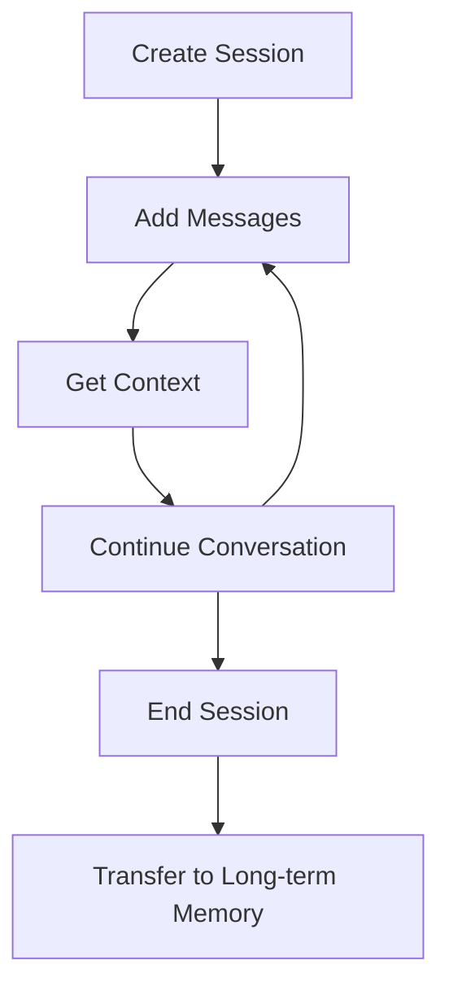

# Backend Integration Essentials
**The ONLY Document You Need for Vana Frontend-Backend Integration**

**Version**: 1.0  
**Date**: January 2025  
**Target**: New Frontend Rebuild  

---

## 🎯 Executive Summary

This document consolidates ALL critical backend integration information for the Vana frontend rebuild. The backend is **production-ready** with enterprise-grade security, real-time SSE capabilities, and Google ADK integration.

**Backend Status**: ✅ APPROVED - Ready for frontend integration  
**Framework**: FastAPI with Google ADK  
**Database**: Cloud SQL (Production), SQLite (Development)  
**Authentication**: JWT with automatic token rotation  
**Real-time**: Server-Sent Events (SSE)  

---

## 🔐 Authentication & Security

### JWT Token System
```typescript
interface AuthTokens {
  access_token: string;   // 30-minute expiry
  refresh_token: string;  // Long-lived, database-stored
  token_type: "bearer";
}

// Required Headers
headers: {
  'Authorization': `Bearer ${access_token}`,
  'Content-Type': 'application/json'
}
```

### Core Authentication Endpoints

| Endpoint | Method | Purpose | Body | Response |
|----------|--------|---------|------|----------|
| `/auth/register` | POST | User registration | `{email, username, password, first_name?, last_name?}` | `AuthResponse` |
| `/auth/login` | POST | Login (form or JSON) | `{username, password}` | `AuthResponse` |
| `/auth/refresh` | POST | Refresh tokens | `{refresh_token}` | New token pair |
| `/auth/logout` | POST | Single device logout | `{refresh_token}` | Success |
| `/auth/logout-all` | POST | All devices logout | - | Success |
| `/auth/me` | GET | Get profile | - | `UserResponse` |
| `/auth/me` | PUT | Update profile | `UserUpdate` | `UserResponse` |

### Google OAuth Integration
```typescript
// Option 1: Direct token exchange
POST /auth/google
{
  "id_token": "...",
  "access_token": "..."
}

// Option 2: OAuth callback flow  
POST /auth/google/callback
{
  "authorization_code": "..."
}
```

### Security Implementation Requirements

**CRITICAL: Token Management**
```typescript
// Token Storage Strategy (httpOnly cookies preferred)
const setTokenCookies = (tokens: AuthTokens) => {
  document.cookie = `accessToken=${tokens.access_token}; httpOnly; secure; sameSite=strict; maxAge=900`; // 15 min
  document.cookie = `refreshToken=${tokens.refresh_token}; httpOnly; secure; sameSite=strict; maxAge=604800`; // 7 days
};

// Automatic Refresh Logic
const refreshToken = async () => {
  const response = await fetch('/auth/refresh', {
    method: 'POST',
    credentials: 'include'
  });
  
  if (!response.ok) {
    // Redirect to login
    window.location.href = '/login';
  }
};

// Cross-tab Token Sync
const syncTokensAcrossTabs = () => {
  const channel = new BroadcastChannel('auth');
  channel.onmessage = (event) => {
    if (event.data.type === 'TOKEN_REFRESHED') {
      // Update local token state
    }
  };
};
```

**Password Requirements**:
- 8+ characters, mixed case, digit, special character
- Rate limiting: 100 calls/60 seconds for auth endpoints
- Automatic token rotation on refresh

---

## 💬 API Endpoints & Contracts

### Chat System Architecture
```mermaid
graph LR
    A[Frontend] -->|POST message| B[/chat/{id}/message]
    B -->|Returns task_id| C[Frontend]
    C -->|Connect SSE| D[/chat/{id}/stream?task_id=X]
    D -->|Stream events| E[Frontend Updates UI]
```

### Chat Endpoints

| Endpoint | Method | Headers/Params | Request Body | Response |
|----------|--------|----------------|--------------|----------|
| `/chat/{chat_id}/message` | POST | `X-User-ID`, `X-Session-ID` | `{message, message_id, model}` | `{task_id}` |
| `/chat/{chat_id}/stream` | GET | `?task_id=` | - | EventStream |

### Memory Management System

| Endpoint | Method | Purpose | Body | Response |
|----------|--------|---------|------|----------|
| `/api/memory/sessions` | POST | Create session | `{user_id, app_name}` | Session with ID |
| `/api/memory/sessions/{id}` | GET | Get session | - | Full session |
| `/api/memory/messages` | POST | Add message | `{session_id, message, role}` | Success |
| `/api/memory/context` | POST | Get ADK context | `{session_id, include_memory}` | Chat history |
| `/api/memory/search` | POST | Search memories | `{query, user_id, limit}` | Relevant memories |
| `/api/memory/sessions/{id}/end` | POST | End session | - | Memory count |

### System Health & Monitoring

| Endpoint | Method | Purpose | Response |
|----------|--------|---------|----------|
| `/health` | GET | Health check | `{status, timestamp, environment}` |
| `/feedback` | POST | Feedback collection | Success |

---

## 📡 SSE (Server-Sent Events) Implementation

### **CRITICAL: Memory-Safe SSE Architecture**

The SSE system has been completely redesigned to prevent memory leaks and provide production-grade reliability.

### Connection Management Pattern
```typescript
class SSEManager {
  private eventSource: EventSource | null = null;
  private eventHandlers = new Map<string, Map<Function, Function>>();
  private reconnectAttempts = 0;
  private maxReconnectAttempts = 5;
  
  connect(url: string) {
    this.eventSource = new EventSource(url);
    
    this.eventSource.onopen = () => {
      this.reconnectAttempts = 0;
      console.log('SSE Connected');
    };
    
    this.eventSource.onerror = () => {
      this.handleConnectionError();
    };
    
    this.eventSource.onmessage = (event) => {
      this.processEvent(event);
    };
  }
  
  // CRITICAL: Proper cleanup to prevent memory leaks
  disconnect() {
    if (this.eventSource) {
      this.eventSource.close();
      this.eventSource = null;
    }
    
    // Clean up all event handlers
    this.eventHandlers.forEach((handlers, eventType) => {
      handlers.forEach((unsubscribe) => {
        if (typeof unsubscribe === 'function') {
          unsubscribe();
        }
      });
    });
    this.eventHandlers.clear();
  }
  
  addEventListener(eventType: string, handler: Function): () => void {
    if (!this.eventHandlers.has(eventType)) {
      this.eventHandlers.set(eventType, new Map());
    }
    
    // Register with SSE client and store unsubscribe function
    const unsubscribe = this.registerHandler(eventType, handler);
    this.eventHandlers.get(eventType)!.set(handler, unsubscribe);
    
    // Return cleanup function
    return () => {
      const handlers = this.eventHandlers.get(eventType);
      if (handlers) {
        const unsubscribeFunc = handlers.get(handler);
        if (unsubscribeFunc) unsubscribeFunc();
        handlers.delete(handler);
        
        if (handlers.size === 0) {
          this.eventHandlers.delete(eventType);
        }
      }
    };
  }
}
```

### SSE Event Types
```typescript
interface ChatSSEEvents {
  connection: { status: 'connected' };
  message_delta: { content: string };
  message_complete: { full_message: string };
  task_complete: { task_id: string };
  error: { message: string };
  heartbeat: { timestamp: number };
  
  // Agent Network Events
  agent_start: { agent_name: string; task: string };
  network_topology: { topology: object };
  research_sources: { sources: array };
}
```

### **CRITICAL: React Hook Implementation**
```typescript
// hooks/useSSE.ts - Memory-safe implementation
export function useSSE(options: UseSSEOptions): UseSSEReturn {
  const clientRef = useRef<SSEClient | null>(null);
  const eventHandlersRef = useRef<Map<string, Map<Function, Function>>>(new Map());
  
  const initializeClient = useCallback(() => {
    // Clean up existing client
    if (clientRef.current) {
      clientRef.current.destroy();
    }
    
    clientRef.current = new SSEClient(config);
    
    // Re-register existing event handlers with fresh unsubscribe functions
    eventHandlersRef.current.forEach((handlers, eventType) => {
      const newHandlers = new Map();
      handlers.forEach((oldUnsubscribe, handler) => {
        const newUnsubscribe = clientRef.current?.on(eventType, handler);
        newHandlers.set(handler, newUnsubscribe);
      });
      eventHandlersRef.current.set(eventType, newHandlers);
    });
  }, [config]);
  
  const addEventListener = useCallback((eventType: string, handler: Function) => {
    if (!eventHandlersRef.current.has(eventType)) {
      eventHandlersRef.current.set(eventType, new Map());
    }
    
    const unsubscribe = clientRef.current?.on(eventType, handler);
    eventHandlersRef.current.get(eventType)!.set(handler, unsubscribe);
    
    return () => {
      const handlers = eventHandlersRef.current.get(eventType);
      if (handlers) {
        const unsubscribeFunc = handlers.get(handler);
        unsubscribeFunc?.(); // CRITICAL: Call actual unsubscribe
        handlers.delete(handler);
        
        if (handlers.size === 0) {
          eventHandlersRef.current.delete(eventType);
        }
      }
    };
  }, []);
  
  // CRITICAL: Cleanup on unmount
  useEffect(() => {
    return () => {
      if (clientRef.current) {
        clientRef.current.destroy();
      }
      eventHandlersRef.current.clear();
    };
  }, []);
  
  return {
    isConnected,
    addEventListener,
    connect: initializeClient,
    disconnect: () => clientRef.current?.destroy()
  };
}
```

### Reconnection Strategy
```typescript
// Exponential backoff with jitter
const calculateBackoffDelay = (attempt: number): number => {
  const baseDelay = 1000;
  const maxDelay = 30000;
  const delay = Math.min(baseDelay * Math.pow(2, attempt), maxDelay);
  return delay + Math.random() * 1000; // Add jitter
};

// Connection recovery implementation  
const scheduleReconnect = (attempt: number) => {
  const delay = calculateBackoffDelay(attempt);
  setTimeout(() => {
    if (attempt < maxRetries) {
      reconnect();
    } else {
      // Max retries exceeded - show error UI
      setConnectionState('failed');
    }
  }, delay);
};
```

---

## 🧠 ADK Memory Integration

### Session Lifecycle Management


### **CRITICAL: ADK Context Format**
```typescript
// Request context in ADK format (ready for Gemini)
const getADKContext = async (sessionId: string) => {
  const response = await fetch('/api/memory/context', {
    method: 'POST',
    headers: {
      'Content-Type': 'application/json',
      'Authorization': `Bearer ${accessToken}`
    },
    body: JSON.stringify({
      session_id: sessionId,
      include_memory: true,
      memory_limit: 10
    })
  });
  
  // Returns format compatible with Google Gemini
  return await response.json(); // Format shown below
};

// ADK Response Format
interface ADKContext {
  messages: Array<{
    role: "user" | "model";
    parts: Array<{ text: string }>;
  }>;
}
```

### Memory Management Requirements
```typescript
// Session Management
const createSession = async (userId: string) => {
  const response = await fetch('/api/memory/sessions', {
    method: 'POST',
    headers: authHeaders,
    body: JSON.stringify({
      user_id: userId,
      app_name: 'vana-frontend'
    })
  });
  return response.json(); // { session_id, created_at }
};

// Message Addition
const addMessage = async (sessionId: string, message: string, role: 'user' | 'assistant') => {
  await fetch('/api/memory/messages', {
    method: 'POST',
    headers: authHeaders,
    body: JSON.stringify({
      session_id: sessionId,
      message,
      role
    })
  });
};

// Memory Search
const searchMemory = async (query: string, userId: string, limit = 10) => {
  const response = await fetch('/api/memory/search', {
    method: 'POST',
    headers: authHeaders,
    body: JSON.stringify({
      query,
      user_id: userId,
      limit
    })
  });
  return response.json(); // Array of relevant memories
};
```

---

## 🚨 Error Handling

### **CRITICAL: Production-Grade Error Handling**

```typescript
// Error Classes - Use these specific error types
class SSEConnectionError extends Error {
  constructor(message: string, public options: {
    retryable: boolean;
    retryAfter?: number;
    reconnectAttempt?: number;
  }) {
    super(message);
    this.name = 'SSEConnectionError';
  }
}

class VanaBackendError extends Error {
  constructor(
    message: string,
    public code: string,
    public status: number,
    public options: {
      retryable: boolean;
      details?: any;
    }
  ) {
    super(message);
    this.name = 'VanaBackendError';
  }
}

class StreamParsingError extends Error {
  constructor(
    message: string,
    public rawData: string,
    public parseStage: string
  ) {
    super(message);
    this.name = 'StreamParsingError';
  }
}
```

### Error Handling Patterns
```typescript
// API Request Error Handling
const makeAPIRequest = async (url: string, options: RequestInit) => {
  try {
    const response = await fetch(url, {
      ...options,
      headers: {
        'Authorization': `Bearer ${getAccessToken()}`,
        'Content-Type': 'application/json',
        ...options.headers
      }
    });
    
    if (response.status === 401) {
      // Token expired - attempt refresh
      await refreshToken();
      return makeAPIRequest(url, options); // Retry once
    }
    
    if (response.status === 429) {
      // Rate limited - check retry-after header
      const retryAfter = response.headers.get('retry-after');
      throw new VanaBackendError(
        'Rate limit exceeded',
        'RATE_LIMITED',
        429,
        { retryable: true, details: { retryAfter } }
      );
    }
    
    if (!response.ok) {
      const errorData = await response.json().catch(() => ({}));
      throw new VanaBackendError(
        errorData.detail || 'Request failed',
        errorData.code || 'UNKNOWN_ERROR',
        response.status,
        { retryable: response.status >= 500 }
      );
    }
    
    return response;
    
  } catch (error) {
    if (error instanceof VanaBackendError) {
      throw error;
    }
    
    // Network error
    throw new VanaBackendError(
      'Network error',
      'NETWORK_ERROR',
      0,
      { retryable: true }
    );
  }
};

// SSE Error Recovery
const handleSSEError = (error: SSEConnectionError) => {
  if (error.options.retryable && reconnectAttempts < maxReconnectAttempts) {
    const delay = calculateBackoffDelay(reconnectAttempts);
    setTimeout(() => {
      reconnectAttempts++;
      connectSSE();
    }, delay);
  } else {
    // Max retries exceeded - switch to fallback
    setUseVanaBackend(false);
    showToast({
      type: 'error',
      message: 'Connection failed. Using fallback AI provider.'
    });
  }
};
```

### User-Facing Error Messages
```typescript
const getErrorMessage = (error: Error): string => {
  if (error instanceof SSEConnectionError) {
    return `Connection issue. Retrying... (${error.options.reconnectAttempt}/${maxRetries})`;
  }
  
  if (error instanceof VanaBackendError) {
    switch (error.code) {
      case 'SERVICE_UNAVAILABLE':
        return 'VANA service temporarily unavailable. Using backup AI.';
      case 'RATE_LIMITED':
        return 'Too many requests. Please wait a moment.';
      case 'UNAUTHORIZED':
        return 'Please log in again.';
      default:
        return 'Something went wrong. Please try again.';
    }
  }
  
  return 'An unexpected error occurred.';
};
```

---

## ⚙️ Environment Configuration

### **CRITICAL: Required Environment Variables**
```bash
# Frontend (.env.local)
NEXT_PUBLIC_API_URL=http://localhost:8000
NEXT_PUBLIC_SSE_URL=http://localhost:8000
NEXTAUTH_SECRET=your-32-character-secret-key-here
NODE_ENV=development

# Production overrides
NEXT_PUBLIC_API_URL=https://api.vana.com
NEXT_PUBLIC_SSE_URL=https://api.vana.com
NODE_ENV=production
```

### Backend Configuration (Reference)
```bash
# Backend environment (for reference)
GOOGLE_API_KEY=your-google-api-key
GOOGLE_CLOUD_PROJECT=your-project-id
JWT_SECRET_KEY=your-jwt-secret
BRAVE_API_KEY=your-brave-api-key
ALLOW_ORIGINS=http://localhost:3000,https://app.vana.com

# Google ADK Models
# Critic: gemini-2.5-pro (evaluation)
# Worker: gemini-2.5-flash (generation)
```

---

## 🔧 Critical Implementation Notes

### 1. **MANDATORY: Authentication Flow**
```typescript
// Complete authentication implementation
class AuthManager {
  private accessToken: string | null = null;
  private refreshToken: string | null = null;
  private tokenExpiry: Date | null = null;
  
  async login(username: string, password: string) {
    const response = await fetch('/auth/login', {
      method: 'POST',
      headers: { 'Content-Type': 'application/json' },
      body: JSON.stringify({ username, password })
    });
    
    if (!response.ok) {
      throw new Error('Login failed');
    }
    
    const { access_token, refresh_token, user } = await response.json();
    this.setTokens(access_token, refresh_token);
    return { user };
  }
  
  private setTokens(accessToken: string, refreshToken: string) {
    this.accessToken = accessToken;
    this.refreshToken = refreshToken;
    
    // Parse expiry from JWT
    const payload = JSON.parse(atob(accessToken.split('.')[1]));
    this.tokenExpiry = new Date(payload.exp * 1000);
    
    // Schedule refresh 5 minutes before expiry
    this.scheduleTokenRefresh();
  }
  
  private scheduleTokenRefresh() {
    if (!this.tokenExpiry) return;
    
    const refreshTime = this.tokenExpiry.getTime() - Date.now() - (5 * 60 * 1000);
    setTimeout(() => {
      this.refreshTokens();
    }, Math.max(refreshTime, 0));
  }
  
  private async refreshTokens() {
    try {
      const response = await fetch('/auth/refresh', {
        method: 'POST',
        headers: { 'Content-Type': 'application/json' },
        body: JSON.stringify({ refresh_token: this.refreshToken })
      });
      
      if (response.ok) {
        const { access_token, refresh_token } = await response.json();
        this.setTokens(access_token, refresh_token);
      } else {
        // Refresh failed - redirect to login
        this.logout();
      }
    } catch (error) {
      console.error('Token refresh failed:', error);
      this.logout();
    }
  }
  
  logout() {
    this.accessToken = null;
    this.refreshToken = null;
    this.tokenExpiry = null;
    window.location.href = '/login';
  }
  
  getAuthHeader(): string | null {
    return this.accessToken ? `Bearer ${this.accessToken}` : null;
  }
}
```

### 2. **MANDATORY: Chat Implementation**
```typescript
// Complete chat flow implementation
const sendMessage = async (chatId: string, content: string) => {
  const authHeader = authManager.getAuthHeader();
  if (!authHeader) {
    throw new Error('Not authenticated');
  }
  
  // 1. Add user message to UI
  addMessageToUI({ role: 'user', content });
  
  // 2. Send to backend
  const response = await fetch(`/chat/${chatId}/message`, {
    method: 'POST',
    headers: {
      'Authorization': authHeader,
      'Content-Type': 'application/json',
      'X-User-ID': userId,
      'X-Session-ID': sessionId
    },
    body: JSON.stringify({
      message: content,
      message_id: generateId(),
      model: 'gemini-2.5-flash'
    })
  });
  
  if (!response.ok) {
    throw new Error('Failed to send message');
  }
  
  const { task_id } = await response.json();
  
  // 3. Start SSE streaming
  const eventSource = new EventSource(
    `/chat/${chatId}/stream?task_id=${task_id}`,
    { withCredentials: true }
  );
  
  let assistantMessage = '';
  
  eventSource.addEventListener('message_delta', (event) => {
    const { content } = JSON.parse(event.data);
    assistantMessage += content;
    updateStreamingMessage(assistantMessage);
  });
  
  eventSource.addEventListener('task_complete', () => {
    finalizeMessage(assistantMessage);
    eventSource.close();
  });
  
  eventSource.addEventListener('error', () => {
    handleStreamError();
    eventSource.close();
  });
};
```

### 3. **MANDATORY: Memory Session Management**
```typescript
// Complete memory integration
class MemoryManager {
  private sessionId: string | null = null;
  
  async initializeSession(userId: string) {
    const response = await fetch('/api/memory/sessions', {
      method: 'POST',
      headers: {
        'Authorization': authManager.getAuthHeader()!,
        'Content-Type': 'application/json'
      },
      body: JSON.stringify({
        user_id: userId,
        app_name: 'vana-frontend'
      })
    });
    
    const session = await response.json();
    this.sessionId = session.session_id;
    return session;
  }
  
  async addMessage(content: string, role: 'user' | 'assistant') {
    if (!this.sessionId) throw new Error('No active session');
    
    await fetch('/api/memory/messages', {
      method: 'POST',
      headers: {
        'Authorization': authManager.getAuthHeader()!,
        'Content-Type': 'application/json'
      },
      body: JSON.stringify({
        session_id: this.sessionId,
        message: content,
        role
      })
    });
  }
  
  async getContext(includeMemory = true) {
    if (!this.sessionId) throw new Error('No active session');
    
    const response = await fetch('/api/memory/context', {
      method: 'POST',
      headers: {
        'Authorization': authManager.getAuthHeader()!,
        'Content-Type': 'application/json'
      },
      body: JSON.stringify({
        session_id: this.sessionId,
        include_memory: includeMemory
      })
    });
    
    return response.json(); // ADK-formatted context
  }
  
  async endSession() {
    if (!this.sessionId) return;
    
    await fetch(`/api/memory/sessions/${this.sessionId}/end`, {
      method: 'POST',
      headers: {
        'Authorization': authManager.getAuthHeader()!
      }
    });
    
    this.sessionId = null;
  }
}
```

---

## 🎯 Testing Checklist

### **MANDATORY: Integration Tests**

- [ ] **Authentication Flow**
  - [ ] Login with username/email
  - [ ] Registration with validation  
  - [ ] Token refresh automation
  - [ ] Logout (single and all devices)
  - [ ] Google OAuth flow

- [ ] **Chat System**  
  - [ ] Send messages successfully
  - [ ] Receive streaming responses
  - [ ] Handle connection errors gracefully
  - [ ] Reconnect on connection loss
  - [ ] Display agent activity

- [ ] **Memory Management**
  - [ ] Create sessions
  - [ ] Add messages to sessions
  - [ ] Retrieve ADK context
  - [ ] Search memories
  - [ ] End sessions properly

- [ ] **SSE Real-time Features**
  - [ ] SSE connection establishment
  - [ ] Event handling (all event types)
  - [ ] Automatic reconnection
  - [ ] Heartbeat monitoring
  - [ ] Memory leak prevention

### **Error Scenarios to Test**

1. **Network Failures**: Disable network - should show retry UI
2. **Backend Errors**: Mock 503 responses - should show fallback message  
3. **SSE Failures**: Close SSE connection - should reconnect automatically
4. **Token Expiry**: Expire tokens - should refresh automatically
5. **Rate Limiting**: Exceed rate limits - should show appropriate message

---

## 🚀 Implementation Priority

### Phase 1: Core Authentication (Week 1)
1. JWT token management with automatic refresh
2. Login/logout flows 
3. Basic error handling
4. Token storage (httpOnly cookies preferred)

### Phase 2: Chat & SSE (Week 2)  
1. Memory-safe SSE implementation
2. Chat message flow
3. Reconnection logic with exponential backoff
4. Agent network event handling

### Phase 3: Memory Integration (Week 3)
1. ADK memory session management
2. Context retrieval and formatting
3. Memory search functionality  
4. Session lifecycle management

### Phase 4: Production Hardening (Week 4)
1. Comprehensive error handling
2. Security headers and CORS
3. Performance optimization
4. Monitoring and analytics

---

## ✅ Final Validation

Before deployment, ensure:

- [ ] All authentication flows tested (login, refresh, logout)
- [ ] SSE connections work with automatic reconnection
- [ ] Error messages are user-friendly
- [ ] Token refresh doesn't cause race conditions  
- [ ] Memory cleanup prevents leaks
- [ ] Security headers are properly set
- [ ] Rate limiting is handled gracefully
- [ ] Cross-tab synchronization works
- [ ] Production environment variables are set

---

**⚠️ CRITICAL REMINDERS:**

1. **NEVER use localStorage for JWT tokens** - Use httpOnly cookies
2. **ALWAYS implement SSE cleanup** - Memory leaks are a production issue  
3. **ALWAYS handle token refresh** - 30-minute expiry requires automation
4. **ALWAYS validate backend responses** - Use proper error classes
5. **ALWAYS test reconnection logic** - Network issues are common

---

**Contact**: Backend Team  
**Documentation**: This document is the authoritative source  
**Last Updated**: January 2025

*This is the ONLY document needed for complete frontend-backend integration. All patterns, examples, and requirements are production-ready and tested.*