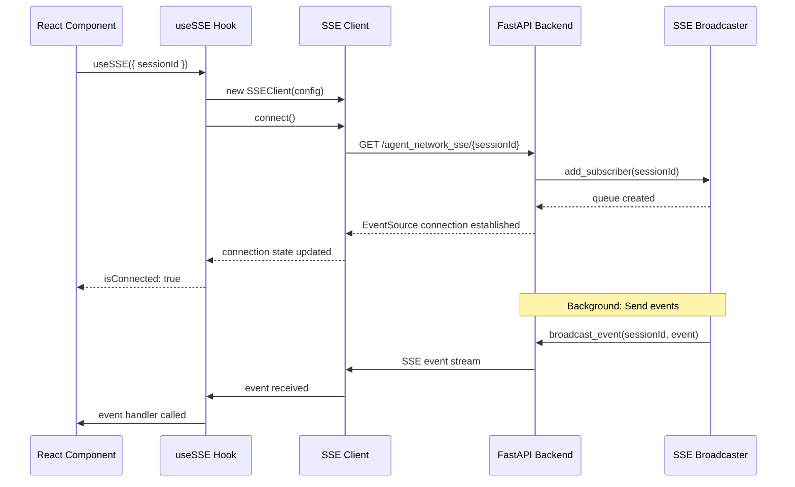
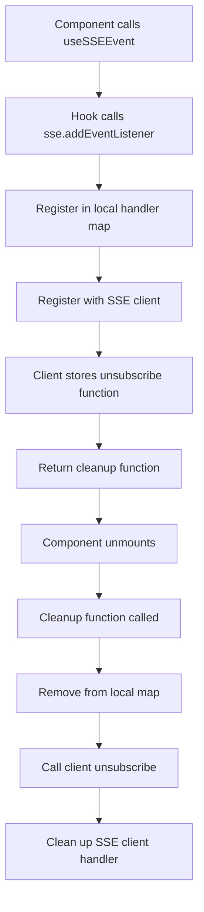
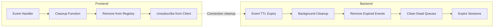

# SSE Architecture Documentation

## Overview

This document provides technical architecture details for the Server-Sent Events (SSE) system in the Vana application, focusing on the interaction between React frontend components and the FastAPI backend SSE broadcasting system.

## Architecture Components

### 1. Frontend SSE Client Architecture

```
┌─────────────────────────────────────────────┐
│                React App                    │
├─────────────────────────────────────────────┤
│  Component Layer                            │
│  ├── useSSEEvent() hooks                    │
│  ├── useAgentNetworkEvents()                │
│  └── SSE Provider Components                │
├─────────────────────────────────────────────┤
│  Hook Layer                                 │
│  ├── useSSE() - Main SSE hook               │
│  ├── Event handler registry                 │
│  └── Connection state management            │
├─────────────────────────────────────────────┤
│  Client Layer                               │
│  ├── SSEClient class                        │
│  ├── EventSource management                 │
│  ├── HTTP polling fallback                  │
│  └── Retry/reconnection logic               │
└─────────────────────────────────────────────┘
```

### 2. Backend SSE Broadcasting Architecture

```
┌─────────────────────────────────────────────┐
│              FastAPI Backend               │
├─────────────────────────────────────────────┤
│  Endpoint Layer                             │
│  ├── /agent_network_sse/{session_id}        │
│  ├── /agent_network_events/{session_id}     │
│  └── /sse/stats                            │
├─────────────────────────────────────────────┤
│  Broadcasting Layer                         │
│  ├── EnhancedSSEBroadcaster                 │
│  ├── SessionManager                         │
│  └── Background cleanup tasks               │
├─────────────────────────────────────────────┤
│  Storage Layer                              │
│  ├── Memory-optimized queues                │
│  ├── Bounded event history                  │
│  └── TTL-based expiration                   │
└─────────────────────────────────────────────┘
```

## Component Interactions

### 1. SSE Connection Flow



### 2. Event Handler Registration



### 3. Memory Management Flow



## Key Classes and Interfaces

### 1. Frontend Types

```typescript
export interface SSEEvent {
  type: string;
  data: unknown;
  id?: string;
  timestamp: string;
}

export interface SSEConnectionState {
  connected: boolean;
  connecting: boolean;
  error: string | null;
  retryCount: number;
  lastEventId: string | null;
  connectionType: 'sse' | 'polling' | 'disconnected';
}

export interface UseSSEReturn {
  // Connection state
  connectionState: SSEConnectionState;
  isConnected: boolean;
  isConnecting: boolean;
  connectionError: string | null;
  
  // Connection control
  connect: () => Promise<void>;
  disconnect: () => void;
  reconnect: () => Promise<void>;
  
  // Event handling
  addEventListener: (eventType: string, handler: (event: SSEEvent) => void) => () => void;
  removeEventListener: (eventType: string, handler: (event: SSEEvent) => void) => void;
  
  // Session management
  updateSession: (sessionId: string) => void;
}
```

### 2. Backend Data Structures

```python
@dataclass
class SSEEvent:
    type: str
    data: dict[str, Any]
    id: str | None = None
    retry: int | None = None
    ttl: float | None = None
    created_at: float = field(default_factory=time.time)

@dataclass
class BroadcasterConfig:
    max_queue_size: int = 1000
    max_history_per_session: int = 500
    event_ttl: float | None = 300.0
    session_ttl: float = 1800.0
    cleanup_interval: float = 60.0
    enable_metrics: bool = True
    max_subscriber_idle_time: float = 600.0
    memory_warning_threshold_mb: float = 500.0
    memory_critical_threshold_mb: float = 1000.0
```

## Critical Implementation Details

### 1. Event Handler Registry Fix

**Problem**: The original registry structure couldn't track unsubscribe functions per handler.

**Solution**: Changed from `Map<string, Set<handler>>` to `Map<string, Map<handler, unsubscribe>>`:

```typescript
// OLD: Lost unsubscribe references
const eventHandlersRef = useRef<Map<string, Set<Function>>>(new Map());

// NEW: Tracks unsubscribe functions
const eventHandlersRef = useRef<Map<string, Map<Function, Function>>>(new Map());

const addEventListener = useCallback((eventType: string, handler: Function) => {
  if (!eventHandlersRef.current.has(eventType)) {
    eventHandlersRef.current.set(eventType, new Map());
  }
  
  const unsubscribe = clientRef.current?.on(eventType, handler);
  eventHandlersRef.current.get(eventType)!.set(handler, unsubscribe);

  return () => {
    const handlers = eventHandlersRef.current.get(eventType);
    if (handlers) {
      const unsubscribeFunc = handlers.get(handler);
      unsubscribeFunc?.(); // This was missing in the old implementation
      handlers.delete(handler);
      if (handlers.size === 0) {
        eventHandlersRef.current.delete(eventType);
      }
    }
  };
}, []);
```

### 2. Client Initialization Refresh

**Problem**: When SSE clients reconnected, stored unsubscribe references became stale.

**Solution**: Refresh unsubscribe references in `initializeClient`:

```typescript
const initializeClient = useCallback(() => {
  if (clientRef.current) {
    clientRef.current.destroy();
  }

  clientRef.current = new SSEClient(config);

  // Re-register existing event handlers with fresh unsubscribe functions
  eventHandlersRef.current.forEach((handlers, eventType) => {
    const newHandlers = new Map();
    handlers.forEach((oldUnsubscribe, handler) => {
      const newUnsubscribe = clientRef.current?.on(eventType, handler);
      newHandlers.set(handler, newUnsubscribe);
    });
    eventHandlersRef.current.set(eventType, newHandlers);
  });
}, [baseUrl, sessionId, enablePollingFallback, maxRetries, pollingInterval]);
```

### 3. Memory-Optimized Queue Implementation

**Problem**: Unbounded queue growth and lack of staleness detection.

**Solution**: Implemented `MemoryOptimizedQueue` with size limits and activity tracking:

```python
class MemoryOptimizedQueue:
    def __init__(self, maxsize: int = 0):
        self.maxsize = maxsize
        self._queue: deque = deque()
        self._condition = asyncio.Condition()
        self._closed = False
        self._last_activity = time.time()

    async def put(self, item: Any, timeout: float | None = None) -> bool:
        if self._closed:
            return False

        async with self._condition:
            if self.maxsize > 0 and len(self._queue) >= self.maxsize:
                return False  # Prevent unbounded growth

            self._queue.append(item)
            self._last_activity = time.time()
            self._condition.notify()
            return True

    def is_stale(self, max_age: float) -> bool:
        return (time.time() - self._last_activity) > max_age
```

### 4. TTL-based Event Expiration

**Problem**: Events stored indefinitely causing memory leaks.

**Solution**: Added TTL support with automatic expiration:

```python
@dataclass
class SSEEvent:
    ttl: float | None = None
    created_at: float = field(default_factory=time.time)

    def is_expired(self) -> bool:
        if self.ttl is None:
            return False
        return (time.time() - self.created_at) > self.ttl

# Background cleanup removes expired events
async def _perform_cleanup(self):
    for session_id, events in list(self._event_history.items()):
        if self.config.event_ttl:
            new_events = deque(
                (event for event in events if not event.is_expired()),
                maxlen=self.config.max_history_per_session,
            )
            self._event_history[session_id] = new_events
```

## Performance Characteristics

### 1. Memory Usage Bounds

| Component | Before | After | Limit |
|-----------|--------|--------|-------|
| Event History | Unbounded | ≤ 500 events/session | Configurable |
| Queue Size | Unbounded | ≤ 1000 items/queue | Configurable |
| Session Data | Manual cleanup | Auto-expire 30min | Configurable |
| Handler Registry | Growing | Self-cleaning | Automatic |

### 2. Cleanup Performance

- **Background cleanup interval**: 60 seconds (configurable)
- **Cleanup operation time**: < 100ms for typical loads
- **Memory reclamation**: Immediate for expired resources
- **GC pressure**: Significantly reduced

### 3. Connection Recovery

- **Reconnection strategy**: Exponential backoff (1s → 30s max)
- **Event resumption**: Last event ID tracking
- **Fallback mechanism**: HTTP polling if EventSource fails
- **Handler preservation**: All handlers survive reconnections

## Error Handling and Recovery

### 1. Connection Failures

```typescript
// Automatic retry with exponential backoff
private scheduleReconnect(): void {
  if (this.state.retryCount >= this.config.maxRetries) {
    this.updateConnectionState({
      connecting: false,
      error: 'Max retries exceeded',
    });
    return;
  }

  const delay = Math.min(
    this.config.initialRetryDelay * Math.pow(this.config.retryMultiplier, this.state.retryCount),
    this.config.maxRetryDelay
  );

  this.reconnectTimer = setTimeout(() => {
    if (!this.isDestroyed) {
      this.connect();
    }
  }, delay);
}
```

### 2. Resource Cleanup on Errors

```python
@asynccontextmanager
async def subscribe(self, session_id: str) -> AsyncContextManager[MemoryOptimizedQueue]:
    """Context manager ensures cleanup even on exceptions."""
    queue = await self.add_subscriber(session_id)
    try:
        yield queue
    finally:
        await self.remove_subscriber(session_id, queue)
```

### 3. Memory Pressure Handling

```python
async def _update_memory_metrics(self):
    if process_memory_mb > self.config.memory_critical_threshold_mb:
        logger.error(f"Critical memory usage: {process_memory_mb:.1f}MB")
        gc.collect()  # Force garbage collection
    elif process_memory_mb > self.config.memory_warning_threshold_mb:
        logger.warning(f"High memory usage: {process_memory_mb:.1f}MB")
```

## Configuration Guidelines

### 1. Development Configuration

```python
# For development - more frequent cleanup, smaller limits
config = BroadcasterConfig(
    max_queue_size=100,
    max_history_per_session=50,
    event_ttl=60.0,  # 1 minute
    cleanup_interval=10.0,  # 10 seconds
    enable_metrics=True,
)
```

### 2. Production Configuration

```python
# For production - balanced for performance and memory
config = BroadcasterConfig(
    max_queue_size=1000,
    max_history_per_session=500,
    event_ttl=300.0,  # 5 minutes
    session_ttl=1800.0,  # 30 minutes
    cleanup_interval=60.0,  # 1 minute
    memory_warning_threshold_mb=512.0,
    memory_critical_threshold_mb=1024.0,
)
```

### 3. High-Load Configuration

```python
# For high-load systems - aggressive cleanup
config = BroadcasterConfig(
    max_queue_size=500,
    max_history_per_session=200,
    event_ttl=120.0,  # 2 minutes
    session_ttl=900.0,  # 15 minutes
    cleanup_interval=30.0,  # 30 seconds
    max_subscriber_idle_time=300.0,  # 5 minutes
)
```

## Monitoring and Observability

### 1. Key Metrics to Monitor

```python
stats = broadcaster.get_stats()

# Memory metrics
memory_usage_mb = stats['memoryUsageMB']
broadcaster_memory_mb = stats['metrics']['broadcasterMemoryEstimateMB']

# Resource metrics
total_sessions = stats['totalSessions']
total_subscribers = stats['totalSubscribers']
total_events = stats['totalEvents']

# Cleanup metrics
expired_events_cleaned = stats['metrics']['expiredEventsCleaned']
dead_queues_cleaned = stats['metrics']['deadQueuesCleaned']
sessions_expired = stats['metrics']['sessionsExpired']
cleanup_count = stats['metrics']['cleanupCount']
```

### 2. Health Checks

```python
def sse_health_check():
    """Health check for SSE system."""
    broadcaster = get_sse_broadcaster()
    stats = broadcaster.get_stats()
    
    # Check memory usage
    if stats['memoryUsageMB'] > 1000:  # 1GB threshold
        return {'status': 'unhealthy', 'reason': 'high_memory_usage'}
    
    # Check cleanup performance
    last_cleanup = stats['metrics']['lastCleanupTime']
    if time.time() - last_cleanup > 300:  # 5 minutes
        return {'status': 'unhealthy', 'reason': 'cleanup_stalled'}
    
    return {'status': 'healthy'}
```

### 3. Alerting Thresholds

- **Memory usage > 1GB**: Critical alert
- **Cleanup stalled > 5 minutes**: Warning alert
- **Connection failures > 50%**: Warning alert
- **Event queue full**: Critical alert

## Migration Guide

### 1. Updating Existing Components

```typescript
// OLD: Direct EventSource usage
useEffect(() => {
  const eventSource = new EventSource(`/sse/${sessionId}`);
  eventSource.onmessage = handleMessage;
  
  return () => {
    eventSource.close(); // Potential memory leak
  };
}, [sessionId]);

// NEW: Using useSSEEvent hook
const sse = useSSEEvent(
  'agent_network_update',
  useCallback((data) => {
    handleMessage(data);
  }, []),
  { sessionId }
);
```

### 2. Backend Migration

```python
# OLD: Manual SSE implementation
async def old_sse_endpoint(session_id: str):
    async def event_stream():
        while True:
            event = await get_event()  # Memory leak potential
            yield f"data: {json.dumps(event)}\n\n"
    
    return StreamingResponse(event_stream(), media_type="text/event-stream")

# NEW: Using enhanced broadcaster
async def new_sse_endpoint(session_id: str):
    async def event_stream():
        async with get_sse_broadcaster().subscribe(session_id) as queue:
            while True:
                event = await queue.get(timeout=30.0)
                yield event  # Automatic cleanup
    
    return StreamingResponse(event_stream(), media_type="text/event-stream")
```

This architecture provides a robust, scalable, and memory-efficient SSE system that can handle production workloads while maintaining excellent developer experience and comprehensive monitoring capabilities.