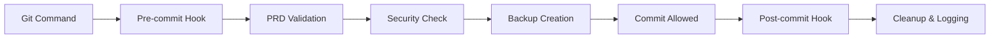

# Git Hooks Integration Guide

Welcome to the comprehensive Git hooks integration guide for the Vana project. This guide will help you understand, install, and use the advanced Git hook system that provides PRD validation, security checks, and automated collaboration features.

## 🚀 Quick Start

### Prerequisites

- Node.js (v16 or higher)
- Git repository initialized
- Access to the Vana project codebase

### Installation

1. Navigate to your Vana project directory:
```bash
cd /path/to/your/vana/project
```

2. Run the installation script:
```bash
./scripts/install-git-hooks.sh
```

3. Verify installation:
```bash
node tests/hooks/integration/git-hook-manager.js status
```

## 📋 System Overview

The Vana Git hooks system provides:

- **PRD (Production-Ready Deployment) Validation**: Ensures code meets production standards
- **Commit Message Validation**: Enforces conventional commit format
- **Security Scanning**: Checks for common security issues
- **Backup Integration**: Automatic backup of modified files
- **Performance Monitoring**: Tracks hook execution performance
- **Bypass Mechanisms**: Controlled override capabilities

## 🛠️ Hook Architecture

### Hook Lifecycle



### Components

1. **Git Hook Manager** (`tests/hooks/integration/git-hook-manager.js`)
   - Central orchestration of all hooks
   - Configuration management
   - Status reporting

2. **PRD Validator** (`tests/hooks/validation/real-prd-validator.js`)
   - Production readiness checks
   - Code quality validation
   - Security compliance

3. **Commit Validator** (`tests/hooks/validation/git-commit-validator.js`)
   - Message format validation
   - Conventional commits enforcement

4. **Backup Manager** (`tests/hooks/integration/file-backup-manager.js`)
   - Automatic file backups
   - Version tracking
   - Recovery capabilities

## ⚙️ Configuration

### Environment Variables

Create a `.env.local` file in your project root:

```bash
# .env.local (root directory)
BRAVE_API_KEY=your_brave_api_key
OPENROUTER_API_KEY=your_openrouter_key
ALLOW_ORIGINS=http://localhost:5173,http://localhost:5174
GOOGLE_CLOUD_PROJECT=your_gcp_project_id

# Hook-specific settings
GIT_HOOKS_ENABLED=true
GIT_HOOKS_STRICT_MODE=false
GIT_HOOKS_LOG_LEVEL=info
```

## Hook Types

### Pre-commit Hook

**Purpose**: Validates code before commit is allowed

**Checks performed**:
- PRD compliance validation
- TypeScript/JavaScript syntax
- Import/export statement validation
- Security vulnerability scanning
- File size limits
- Naming convention compliance

**Configuration**:
```json
{
  "preCommit": {
    "enabled": true,
    "strictMode": false,
    "maxFileSize": "1MB",
    "allowedExtensions": [".ts", ".tsx", ".js", ".jsx", ".md"],
    "excludePatterns": ["node_modules/", ".git/", "dist/"]
  }
}
```

### Post-commit Hook

**Purpose**: Cleanup and logging after successful commit

**Actions performed**:
- Log commit details
- Update performance metrics
- Trigger backup cleanup
- Send notifications (if configured)

### Pre-push Hook

**Purpose**: Final validation before code is pushed to remote

**Checks performed**:
- Branch protection validation
- Remote sync status
- Large file detection
- Sensitive data scanning

## 🔐 Security Features

### Sensitive Data Detection

The hooks automatically scan for:
- API keys and tokens
- Passwords and secrets
- Personal information
- Database connection strings
- Private keys

### Bypass Protection

Bypassing hooks requires:
- Valid reason
- Time-limited access
- Audit logging
- Manager approval (in strict mode)

Example bypass:
```bash
node tests/hooks/integration/git-hook-manager.js bypass "emergency hotfix" 60
```

## 📊 Performance Monitoring

### Metrics Collected

- Hook execution time
- File processing speed
- Memory usage
- Error rates
- Bypass frequency

### Viewing Performance Data

```bash
# Current performance
node tests/hooks/integration/git-hook-manager.js performance

# Historical data
node tests/hooks/integration/git-hook-manager.js metrics --days 7
```

## 🛠️ Backup System

### Automatic Backups

The system automatically creates backups:
- Before any file modification
- On commit operations
- During merge conflicts
- Before hook validation

### Backup Location

Backups are stored in:
```
.claude_workspace/backups/
├── 2024-01-15/
│   ├── pre-commit/
│   └── post-edit/
└── 2024-01-16/
    ├── pre-commit/
    └── post-edit/
```

### Backup Management

```bash
# List backups
node tests/hooks/integration/file-backup-manager.js list

# Restore from backup
node tests/hooks/integration/file-backup-manager.js restore <backup-id>

# Cleanup old backups
node tests/hooks/integration/file-backup-manager.js cleanup --days 30
```

## 🚨 Troubleshooting

### Common Issues

#### Hook Not Executing

**Symptoms**: Git commands complete without hook validation

**Solutions**:
1. Check hook installation:
   ```bash
   ls -la .git/hooks/
   ```

2. Verify permissions:
   ```bash
   chmod +x .git/hooks/pre-commit
   chmod +x .git/hooks/post-commit
   ```

3. Test hook directly:
   ```bash
   .git/hooks/pre-commit
   ```

#### PRD Validation Failures

**Symptoms**: Commits rejected with PRD validation errors

**Solutions**:
1. Review the specific error messages
2. Fix code issues reported
3. Use bypass for emergency situations:
   ```bash
   node tests/hooks/integration/git-hook-manager.js bypass "fixing critical bug" 30
   ```

#### Performance Issues

**Symptoms**: Hooks taking too long to execute

**Solutions**:
1. Check system resources
2. Review excluded patterns
3. Optimize validation rules
4. Consider partial validation mode

### Debug Mode

Enable debug logging:
```bash
export GIT_HOOKS_LOG_LEVEL=debug
git commit -m "test message"
```

### Log Files

Hook logs are stored in:
```
.claude_workspace/logs/
├── git-hooks.log
├── prd-validation.log
└── backup-operations.log
```

## 🔧 Advanced Configuration

### Custom Validation Rules

Create custom PRD validation rules:

```javascript
// .claude_workspace/config/custom-rules.js
module.exports = {
  rules: [
    {
      name: "no-console-log",
      pattern: /console\.log/,
      message: "Remove console.log statements before commit",
      severity: "error"
    },
    {
      name: "required-jsdoc",
      test: (file) => {
        return file.includes('export function') && !file.includes('/**');
      },
      message: "Public functions must have JSDoc comments",
      severity: "warning"
    }
  ]
};
```

### Hook Configuration File

Create `.claude_workspace/config/hooks.json`:

```json
{
  "version": "1.0",
  "hooks": {
    "pre-commit": {
      "enabled": true,
      "timeout": 30000,
      "parallel": true,
      "validators": [
        "prd-compliance",
        "security-scan",
        "syntax-check"
      ]
    },
    "post-commit": {
      "enabled": true,
      "timeout": 5000,
      "actions": [
        "backup-cleanup",
        "performance-log",
        "notification"
      ]
    }
  },
  "validation": {
    "strictMode": false,
    "allowBypass": true,
    "maxBypassDuration": 3600,
    "requiredApproval": false
  },
  "backup": {
    "enabled": true,
    "compression": true,
    "retention": 30,
    "excludePatterns": [
      "*.log",
      "node_modules/",
      ".git/"
    ]
  }
}
```

## 🔄 Integration with CI/CD

### GitHub Actions Integration

The hooks integrate seamlessly with GitHub Actions workflows:

```yaml
name: Git Hooks Validation
on: [push, pull_request]

jobs:
  validate:
    runs-on: ubuntu-latest
    steps:
      - uses: actions/checkout@v4
      - name: Setup Node.js
        uses: actions/setup-node@v4
        with:
          node-version: '18'
      
      - name: Install dependencies
        run: npm install
      
      - name: Install Git hooks
        run: ./scripts/install-git-hooks.sh
      
      - name: Run hook validation
        run: node tests/hooks/integration/git-hook-manager.js validate-all
```

### Pre-commit Integration

For teams using pre-commit framework:

```yaml
# .pre-commit-config.yaml
repos:
  - repo: local
    hooks:
      - id: vana-git-hooks
        name: Vana Git Hooks
        entry: node tests/hooks/integration/git-hook-manager.js validate
        language: system
        stages: [commit]
```

## 📚 Best Practices

### For Developers

1. **Test hooks locally** before pushing
2. **Use descriptive commit messages** following conventional commits
3. **Keep commits atomic** - one logical change per commit
4. **Review PRD validation feedback** and fix issues promptly
5. **Use bypass sparingly** and document reasons

### For Teams

1. **Establish bypass policies** with clear approval processes
2. **Regular hook performance reviews** to optimize validation speed
3. **Custom validation rules** tailored to project requirements
4. **Training sessions** for new team members
5. **Monitor bypass usage** and address common issues

### For Project Maintainers

1. **Keep hooks updated** with latest validation rules
2. **Monitor performance metrics** and optimize as needed
3. **Regular backup cleanup** to manage disk space
4. **Security rule updates** to address new vulnerabilities
5. **Documentation maintenance** to keep guides current

## 📖 Additional Resources

### Documentation

- [Git Hooks Technical Reference](./git-hooks/03-technical-reference.md)
- [Performance Testing Guide](./git-hooks/08-performance-testing.md)
- [FAQ and Troubleshooting](./git-hooks/07-faq-troubleshooting.md)

### Commands Reference

- **Status**: `node tests/hooks/integration/git-hook-manager.js status`
- **Install**: `node tests/hooks/integration/git-hook-manager.js install`
- **Disable**: `node tests/hooks/integration/git-hook-manager.js disable`
- **Bypass**: `node tests/hooks/integration/git-hook-manager.js bypass <reason> <minutes>`
- **Performance**: `node tests/hooks/integration/git-hook-manager.js performance`

### Support

For issues and questions:
1. Check the [FAQ section](./git-hooks/07-faq-troubleshooting.md)
2. Review [troubleshooting guide](./git-hooks/07-faq-troubleshooting.md#troubleshooting)
3. Enable debug logging for detailed information
4. Create an issue in the project repository

---

**Note**: This guide covers the current version of the Vana Git hooks system. For the latest updates and features, check the project documentation and release notes.