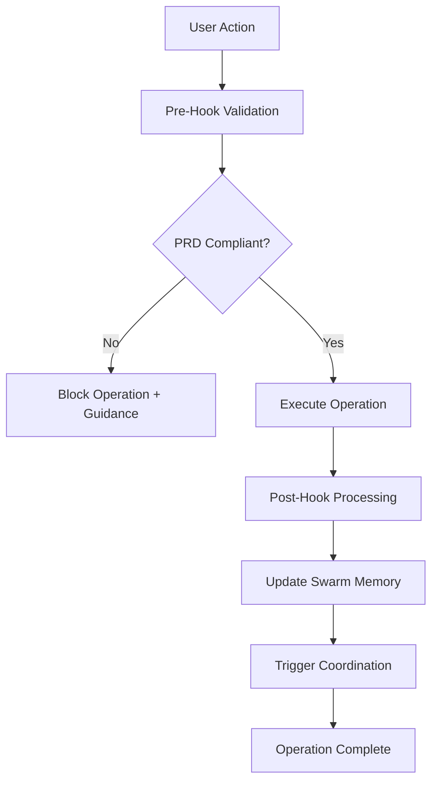

# Git Hook Integration System - User Guide

## 🎯 Overview

The Git hook integration system transforms your development workflow by seamlessly integrating Claude Code file operations with Claude Flow's advanced swarm coordination. This guide shows you how to leverage these hooks in your daily development tasks.

## 🔄 Core Development Workflow

### Understanding Hook-Enabled Development

With hooks enabled, every file operation becomes part of a coordinated workflow:

1. **Pre-Operation Validation**: Before any file is modified, hooks validate against PRD compliance
2. **Real-Time Coordination**: File changes are immediately communicated to active swarm agents
3. **Post-Operation Processing**: After successful operations, hooks update memory and trigger follow-up actions
4. **Continuous Monitoring**: Performance and compliance metrics are tracked automatically

### The Hook Lifecycle



## 🛠️ Working with File Operations

### Write Operations

When you create new files, the hook system automatically:

1. **Validates Content**: Ensures new code follows PRD guidelines
2. **Checks Dependencies**: Verifies proper use of shadcn/ui components
3. **Updates Coordination**: Notifies swarm agents of new files
4. **Tracks Performance**: Measures operation latency and success rates

#### Example: Creating a New Component

```typescript
// ✅ This will PASS validation
import React from 'react'
import { Button } from '@/components/ui/button'
import { Card } from '@/components/ui/card'

export const NewFeature = () => {
  return (
    <Card data-testid="new-feature">
      <Button>New Feature</Button>
    </Card>
  )
}
```

**Hook Output**:
```
🔍 Pre-write validation: components/NewFeature.tsx
✅ PRD compliance check passed (Score: 95/100)
📝 Post-write hook completed: components/NewFeature.tsx
📊 File tracked in swarm memory: swarm/1692123456/NewFeature.tsx
```

```typescript
// ❌ This will be BLOCKED
import React from 'react'
import { CustomButton } from 'custom-ui-lib'  // ← PRD violation

export const BadComponent = () => {
  return <CustomButton>Not Allowed</CustomButton>
}
```

**Hook Output**:
```
🚫 WRITE OPERATION BLOCKED: components/BadComponent.tsx
📋 COMPREHENSIVE BLOCKING GUIDANCE:
=====================================
❌ PRD Violation Detected:
- Custom UI framework usage: 'custom-ui-lib'
- Required: Use shadcn/ui components only

✅ Recommended Fix:
- Replace: import { CustomButton } from 'custom-ui-lib'
- With: import { Button } from '@/components/ui/button'

📚 Additional Guidance:
- All UI components must use shadcn/ui library
- See: https://ui.shadcn.com/docs/components
- Example: <Button variant="default">Text</Button>
=====================================
```

### Edit Operations

When editing existing files:

1. **Simulates Edit**: Hooks preview the edit result before applying
2. **Validates Changes**: Ensures edits maintain or improve PRD compliance
3. **Tracks Delta**: Records what changed and impact on codebase
4. **Updates Agents**: Notifies relevant swarm agents of modifications

#### Example: Editing an Existing File

```bash
# Hooks will automatically validate this edit
# From: <Button>Old Text</Button>
# To:   <Button data-testid="submit-btn">Submit</Button>
```

**Hook Output**:
```
🔍 Pre-edit validation: components/LoginForm.tsx
✅ Edit improves accessibility (added data-testid)
✏️  Post-edit hook completed: components/LoginForm.tsx
📊 Change tracked: +15 chars, +1 accessibility attribute
```

### Read Operations

Even read operations are tracked for audit and coordination:

1. **Access Logging**: Records which files are accessed when
2. **Usage Patterns**: Identifies frequently accessed files
3. **Agent Coordination**: Informs agents about file usage patterns

## 🧠 Swarm Coordination Features

### Agent Communication

Hooks facilitate seamless communication between agents:

```bash
# When you start a task, hooks automatically:
# 1. Initialize task coordination
# 2. Assign appropriate agents
# 3. Set up memory structures
# 4. Begin monitoring

📡 Task initialized: task-1692123456
🤖 Agents assigned: coder, reviewer, tester
🧠 Memory namespace created: swarm/task-1692123456
📊 Performance monitoring started
```

### Memory Management

The hook system maintains persistent memory across sessions:

- **File History**: Tracks all modifications to each file
- **Agent State**: Preserves agent assignments and progress
- **Performance Metrics**: Accumulates execution statistics
- **Learning Data**: Feeds neural pattern training

### Coordination Patterns

Hooks coordinate different development patterns:

#### Sequential Development
```
File Create → Test → Review → Deploy
     ↓         ↓       ↓        ↓
   Hook      Hook    Hook     Hook
```

#### Parallel Development
```
Feature A ←→ Hook ←→ Swarm Memory ←→ Hook ←→ Feature B
Feature C ←→ Hook ←→ Swarm Memory ←→ Hook ←→ Feature D
```

## 📊 Understanding Hook Messages

### Success Messages

```bash
✅ Pre-write validation passed: file.tsx
📝 Post-write hook completed: file.tsx
🧠 Memory updated: swarm/1692123456/file.tsx
📊 Performance: 145ms execution time
```

### Warning Messages

```bash
⚠️  Performance concern detected in file.tsx
💡 Suggestion: Consider component optimization
📈 Compliance score: 85/100 (reduced from performance concern)
```

### Blocking Messages

```bash
🚫 OPERATION BLOCKED: file.tsx
❌ Violations found:
   - Custom UI framework usage
   - Missing accessibility attributes
✅ Suggested fixes:
   - Use shadcn/ui components
   - Add data-testid attributes
📚 Documentation: https://ui.shadcn.com/docs
```

## 🔧 Customizing Hook Behavior

### Hook Configuration Options

You can customize hook behavior by editing `.claude_workspace/config/hooks.json`:

#### Disable Specific Hooks

```json
{
  "hooks": {
    "PreToolUse": [{
      "matcher": "Read",
      "enabled": false,
      "reason": "Disable read operation hooks for performance"
    }]
  }
}
```

#### Adjust Performance Thresholds

```json
{
  "performance": {
    "maxExecutionTime": 1000,
    "memoryThreshold": 50000000,
    "failureRetryCount": 3
  }
}
```

#### Custom Validation Rules

```json
{
  "validation": {
    "prdCompliance": {
      "minScore": 85,
      "blockOnViolation": true,
      "customRules": [
        {
          "pattern": "styled-components",
          "message": "Use Tailwind CSS instead of styled-components",
          "severity": "error"
        }
      ]
    }
  }
}
```

## 🚀 Advanced Workflow Patterns

### TDD with Hooks

Test-Driven Development is enhanced with hooks:

1. **Write Test**: Hook validates test structure and coverage
2. **Implement Code**: Hook ensures implementation follows PRD
3. **Refactor**: Hook maintains compliance during refactoring

```bash
# 1. Create test file
echo 'describe("Component", () => { ... })' > component.test.tsx
# Hook: ✅ Test structure validated

# 2. Implement component
echo 'export const Component = () => { ... }' > component.tsx
# Hook: ✅ Implementation follows PRD

# 3. Refactor
# Hook: ✅ Refactoring maintains compliance
```

### Multi-Agent Development

Coordinate multiple development streams:

```bash
# Agent 1: Frontend
npx claude-flow agent spawn --type frontend-api-specialist

# Agent 2: Backend
npx claude-flow agent spawn --type backend-dev

# Agent 3: Testing
npx claude-flow agent spawn --type tester

# Hooks automatically coordinate between all agents
```

### Performance-Driven Development

Hooks continuously monitor and optimize performance:

```bash
# Hooks track:
# - Bundle size impact
# - Render performance
# - Memory usage
# - Network requests

📊 Performance Impact Analysis:
   Bundle size: +2.3KB (within threshold)
   Render time: +15ms (acceptable)
   Memory: +1.2MB (monitored)
```

## 🛡️ Emergency Procedures

### Disabling Hooks Temporarily

If hooks are blocking critical work:

```bash
# Method 1: Environment variable
export CLAUDE_HOOKS_DISABLED=true

# Method 2: Hook control script
node .claude_workspace/commands/hook-control.js disable

# Method 3: Configuration override
echo '{"hooks": {"enabled": false}}' > .claude_workspace/config/emergency-override.json
```

### Bypassing PRD Validation

For emergency fixes that violate PRD:

```bash
# 1. Document the emergency
echo "Emergency fix: $(date) - Reason: Critical bug fix" >> .claude_workspace/emergency-log.txt

# 2. Disable validation temporarily
export CLAUDE_PRD_VALIDATION_DISABLED=true

# 3. Make necessary changes
# ... your emergency changes ...

# 4. Re-enable validation
unset CLAUDE_PRD_VALIDATION_DISABLED

# 5. Plan remediation
echo "TODO: Fix PRD violations introduced in emergency fix" >> .claude_workspace/todo.txt
```

### Recovery from Hook Failures

If hooks cause system issues:

```bash
# 1. Check hook status
node tests/hooks/validation/real-error-handler.js --diagnose

# 2. Clear problematic hook history
rm -rf .claude_workspace/reports/hook-tests/functional/*

# 3. Reset swarm memory if needed
npx claude-flow memory clear --namespace swarm

# 4. Restart with clean state
npx claude-flow hooks session-restore --clean-start
```

## 📈 Monitoring and Analytics

### Performance Dashboards

View hook performance in real-time:

```bash
# Generate performance report
node tests/hooks/automation/hook-test-runner.js performance

# View in browser
open .claude_workspace/reports/hook-tests/hook-test-report.html
```

### Compliance Tracking

Monitor PRD compliance over time:

```bash
# View compliance trends
node tests/hooks/validation/real-prd-validator.js --report

# Example output:
# Week 1: 89% compliance (23 violations)
# Week 2: 94% compliance (12 violations)
# Week 3: 97% compliance (6 violations)
```

### Agent Coordination Metrics

Track swarm coordination effectiveness:

```bash
# Agent coordination statistics
npx claude-flow swarm status --detailed

# Memory usage and efficiency
npx claude-flow memory usage --analytics
```

## 🎯 Best Practices

### 1. Gradual Adoption

Start with basic hooks and gradually enable advanced features:

```json
{
  "adoption": {
    "week1": ["PostToolUse for Write operations"],
    "week2": ["PreToolUse for validation"],
    "week3": ["Full swarm coordination"],
    "week4": ["Neural pattern training"]
  }
}
```

### 2. Regular Maintenance

Keep the hook system healthy:

```bash
# Weekly maintenance script
#!/bin/bash
echo "🧹 Weekly Hook Maintenance"

# Clear old reports
find .claude_workspace/reports -mtime +7 -delete

# Update performance baselines
node tests/hooks/automation/hook-test-runner.js performance --update-baseline

# Optimize memory usage
npx claude-flow memory compress --namespace swarm

echo "✅ Maintenance complete"
```

### 3. Team Coordination

Share hook configurations across team:

```bash
# Export team configuration
node .claude_workspace/commands/export-config.js --team-preset

# Import on new developer machine
node .claude_workspace/commands/import-config.js --from team-preset.json
```

### 4. Continuous Improvement

Use hook data to improve development process:

```bash
# Analyze patterns monthly
node tests/hooks/analytics/pattern-analyzer.js --period month

# Identify optimization opportunities
node tests/hooks/analytics/optimization-finder.js

# Update PRD based on learnings
node tests/hooks/validation/prd-updater.js --incorporate-learnings
```

## 🔗 Integration with Development Tools

### VS Code Integration

Hooks work seamlessly with VS Code:

- **Real-time validation**: See PRD compliance in status bar
- **Inline suggestions**: Get fix suggestions directly in editor
- **Performance monitoring**: View hook performance in output panel

### CI/CD Integration

Include hooks in your deployment pipeline:

```yaml
# .github/workflows/hooks-validation.yml
name: Hook Validation
on: [push, pull_request]
jobs:
  validate:
    runs-on: ubuntu-latest
    steps:
      - uses: actions/checkout@v3
      - uses: actions/setup-node@v3
      - run: npm ci
      - run: bash tests/hooks/automation/run-hook-tests.sh
```

### IDE Extensions

Available extensions enhance the hook experience:

- **Claude Code Hook Validator**: Real-time PRD compliance checking
- **Swarm Coordination Panel**: Visual agent status and coordination
- **Performance Monitor**: Live hook performance metrics

---

**Next**: [Technical Reference - Architecture and API Documentation](./03-technical-reference.md)