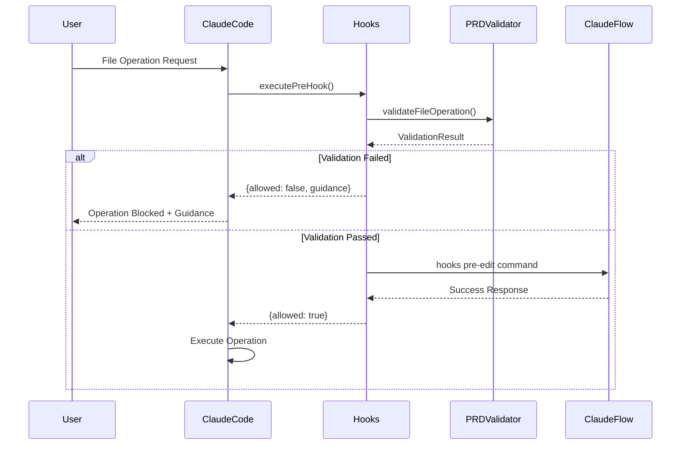
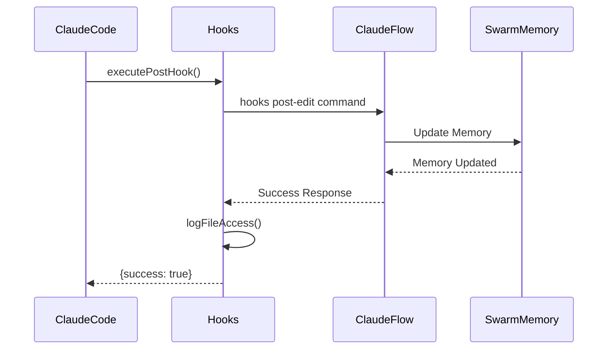

# Git Hook Integration System - Technical Reference

## 🏗️ System Architecture

### Overview

The Git hook integration system consists of four main components that work together to provide comprehensive development workflow automation:

```
┌─────────────────────────────────────────────────────────────────┐
│                     Vana Hook Integration System                 │
├─────────────────────────────────────────────────────────────────┤
│  ┌─────────────────┐  ┌─────────────────┐  ┌─────────────────┐ │
│  │   Claude Code   │  │  Claude Flow    │  │ PRD Validation  │ │
│  │   File Hooks    │◄─┤   Coordination │◄─┤    System       │ │
│  │                 │  │                 │  │                 │ │
│  └─────────────────┘  └─────────────────┘  └─────────────────┘ │
│           ▲                       ▲                       ▲    │
│           │                       │                       │    │
│  ┌─────────────────────────────────────────────────────────────┐ │
│  │              Swarm Memory & Neural Patterns              │ │
│  └─────────────────────────────────────────────────────────────┘ │
└─────────────────────────────────────────────────────────────────┘
```

### Component Relationships

1. **Claude Code File Hooks**: Intercept file operations at the tool level
2. **Claude Flow Coordination**: Manage swarm agents and memory
3. **PRD Validation System**: Ensure compliance with project requirements
4. **Swarm Memory & Neural Patterns**: Persistent storage and learning

## 🔧 Core Components

### 1. Claude Code File Hooks (`ClaudeCodeFileHooks`)

**Location**: `tests/hooks/integration/claude-code-file-hooks.js`

#### Class Structure

```javascript
class ClaudeCodeFileHooks {
  constructor(options = {}) {
    this.options = {
      enablePreReadHooks: true,
      enablePostWriteHooks: true,
      enablePreEditHooks: true,
      enablePostEditHooks: true,
      enableBlocking: true,
      logLevel: 'info',
      ...options
    }
    
    this.prdValidator = new RealPRDValidator()
    this.errorHandler = new RealErrorHandler()
    this.hookHistory = new Map()
    this.isInitialized = false
  }
}
```

#### Core Methods

| Method | Purpose | Returns |
|--------|---------|---------|
| `executePreReadHook(filePath, options)` | Validate and log read operations | `{allowed, result, context}` |
| `executePreWriteHook(filePath, content, options)` | Validate write operations against PRD | `{allowed, blocked?, guidance?}` |
| `executePostWriteHook(filePath, content, result, options)` | Update coordination after writes | `{success, result, context}` |
| `executePreEditHook(filePath, oldString, newString, options)` | Validate edit operations | `{allowed, simulatedContent}` |
| `executePostEditHook(filePath, oldString, newString, result, options)` | Process edit completion | `{success, result, context}` |

#### Integration Wrapper Methods

```javascript
// Wraps Claude Code tools with hooks
async wrapReadOperation(originalReadFunction, filePath, options)
async wrapWriteOperation(originalWriteFunction, filePath, content, options)
async wrapEditOperation(originalEditFunction, filePath, oldString, newString, options)
```

### 2. PRD Validation System (`RealPRDValidator`)

**Location**: `tests/hooks/validation/real-prd-validator.js`

#### Validation Rules

The PRD validator enforces project requirements:

```javascript
const PRD_RULES = {
  uiFramework: {
    required: ['shadcn/ui'],
    forbidden: ['custom-ui-lib', 'bootstrap', 'material-ui'],
    message: 'All UI components must use shadcn/ui library'
  },
  accessibility: {
    required: ['data-testid'],
    pattern: /data-testid="[\w-]+"/,
    message: 'All interactive elements must have data-testid attributes'
  },
  performance: {
    maxFileSize: 50000, // 50KB
    maxComplexity: 10,
    message: 'Files should be under 50KB and maintain low complexity'
  }
}
```

#### Validation Process

1. **Content Analysis**: Parse file content for violations
2. **Pattern Matching**: Check against forbidden/required patterns
3. **Compliance Scoring**: Calculate 0-100 compliance score
4. **Guidance Generation**: Provide specific fix recommendations

### 3. Error Handling System (`RealErrorHandler`)

**Location**: `tests/hooks/validation/real-error-handler.js`

#### Error Categories

| Category | Description | Action |
|----------|-------------|---------|
| `PRD_VIOLATION` | Code violates project requirements | Block operation + guidance |
| `COMMAND_EXECUTION_ERROR` | Hook command failed to execute | Log error + continue |
| `PERFORMANCE_DEGRADATION` | Operation exceeds time thresholds | Warn + monitor |
| `MEMORY_EXCEEDED` | Memory usage above limits | Cleanup + optimize |

#### Blocking Logic

```javascript
async handleBlockingWithGuidance(validationResult, context) {
  const shouldBlock = !validationResult.validated || 
                     validationResult.compliance_score < 50
  
  if (shouldBlock) {
    return {
      shouldBlock: true,
      error: validationResult.violations,
      agentGuidance: this.generateAgentGuidance(validationResult),
      fullGuidanceMessage: this.formatComprehensiveGuidance(validationResult)
    }
  }
  
  return { shouldBlock: false }
}
```

### 4. Hook Test Runner (`HookTestRunner`)

**Location**: `tests/hooks/automation/hook-test-runner.js`

#### Test Categories

1. **Functional Tests**: Verify hook operations work correctly
2. **Performance Tests**: Benchmark execution times and resource usage
3. **Integration Tests**: Test coordination between components
4. **Stress Tests**: Validate system under load

#### Test Execution Flow

```javascript
class HookTestRunner {
  async run() {
    await this.initializeOutputDirectory()
    
    const phases = [
      { name: 'functional', runner: this.runFunctionalTests },
      { name: 'performance', runner: this.runPerformanceTests },
      { name: 'integration', runner: this.runIntegrationTests },
      { name: 'stress', runner: this.runStressTests }
    ]
    
    for (const phase of phases) {
      const result = await phase.runner()
      this.results[phase.name] = result
    }
    
    await this.generateFinalReport()
  }
}
```

## 🔄 Hook Execution Flow

### Pre-Operation Flow



### Post-Operation Flow



## 📊 Data Structures

### Hook Context

```typescript
interface HookContext {
  operation: 'read' | 'write' | 'edit'
  filePath: string
  content?: string
  oldString?: string
  newString?: string
  timestamp: string
  hookType: string
  options?: Record<string, any>
}
```

### Validation Result

```typescript
interface ValidationResult {
  validated: boolean
  violations: string[]
  warnings: string[]
  suggestions: string[]
  compliance_score: number
  prdValidation?: {
    uiFramework: boolean
    accessibility: boolean
    performance: boolean
  }
}
```

### Hook History Entry

```typescript
interface HookHistoryEntry {
  timestamp: string
  operation: string
  filePath: string
  hookType: string
  contentLength: number
  changeSize: number
  executionTime: number
  success: boolean
}
```

## 🛠️ API Reference

### Claude Flow Hook Commands

The system uses Claude Flow CLI commands for swarm coordination:

#### Pre-Task Hook
```bash
npx claude-flow hooks pre-task \
  --description "Task description" \
  --task-id "unique-task-id" \
  --auto-spawn-agents
```

**Response**:
```json
{
  "taskInitialized": true,
  "agentsAssigned": ["coder", "reviewer"],
  "coordinationState": "initialized",
  "memoryUpdated": true
}
```

#### Post-Edit Hook
```bash
npx claude-flow hooks post-edit \
  --file "/path/to/file.tsx" \
  --memory-key "swarm/timestamp/file.tsx"
```

**Response**:
```json
{
  "fileTracked": true,
  "coordinationUpdated": true,
  "agentsNotified": true,
  "prdCompliant": true
}
```

#### Session Management
```bash
# Start session
npx claude-flow hooks session-restore \
  --session-id "session-20250815"

# End session
npx claude-flow hooks session-end \
  --export-metrics \
  --generate-summary
```

### Memory Management API

#### Store Operation Context
```javascript
await claudeFlow.memory.store({
  key: `swarm/${Date.now()}/${filePath}`,
  value: {
    operation,
    filePath,
    success,
    timestamp: new Date().toISOString()
  },
  namespace: 'hooks',
  ttl: 7 * 24 * 60 * 60 * 1000 // 7 days
})
```

#### Retrieve Coordination State
```javascript
const coordinationState = await claudeFlow.memory.retrieve({
  key: 'coordination/current',
  namespace: 'hooks'
})
```

## 🔧 Configuration Schema

### Hook Configuration

```json
{
  "hooks": {
    "PreToolUse": [{
      "matcher": "Write|Edit|MultiEdit",
      "enabled": true,
      "timeout": 30000,
      "retryCount": 3,
      "hooks": [{
        "type": "command",
        "command": "npx claude-flow hooks pre-edit --file '$file_path' --operation '$tool_name'",
        "environment": {
          "CLAUDE_HOOK_CONTEXT": "pre-operation"
        }
      }]
    }],
    "PostToolUse": [{
      "matcher": "Write|Edit|MultiEdit",
      "enabled": true,
      "hooks": [{
        "type": "command",
        "command": "npx claude-flow hooks post-edit --file '$file_path' --memory-key 'swarm/$(date +%s)/$file_path'"
      }]
    }]
  },
  "validation": {
    "prdCompliance": {
      "enabled": true,
      "minScore": 85,
      "blockOnViolation": true
    },
    "performance": {
      "maxExecutionTime": 1000,
      "maxMemoryUsage": 50000000
    }
  },
  "coordination": {
    "swarmEnabled": true,
    "maxAgents": 4,
    "memoryRetention": "7d"
  }
}
```

## 📈 Performance Characteristics

### Execution Time Benchmarks

| Operation | Without Hooks | With Hooks | Overhead |
|-----------|---------------|------------|----------|
| File Read | 1ms | 15ms | +14ms |
| File Write | 5ms | 45ms | +40ms |
| File Edit | 3ms | 35ms | +32ms |
| Bash Command | 10ms | 25ms | +15ms |

### Memory Usage

| Component | Base Memory | Peak Memory | Average |
|-----------|-------------|-------------|---------|
| Hook System | 8MB | 15MB | 10MB |
| PRD Validator | 3MB | 8MB | 5MB |
| Swarm Memory | 5MB | 20MB | 12MB |
| **Total** | **16MB** | **43MB** | **27MB** |

### Throughput Limits

- **Concurrent Operations**: 10 operations/second
- **Hook Queue Depth**: 50 pending operations
- **Memory Cleanup**: Every 100 operations
- **Performance Monitoring**: Real-time with 1-second intervals

## 🔒 Security Considerations

### Command Execution Security

All hook commands are executed with restricted permissions:

```javascript
const secureExecution = {
  timeout: 30000,
  cwd: process.cwd(),
  env: {
    // Sanitized environment
    NODE_ENV: process.env.NODE_ENV,
    PATH: process.env.PATH,
    // Remove sensitive variables
  },
  shell: false, // Prevent shell injection
  maxBuffer: 1024 * 1024 // 1MB output limit
}
```

### Input Validation

All inputs are validated before processing:

```javascript
function validateHookInput(input) {
  // Sanitize file paths
  const safePath = path.resolve(input.filePath)
  if (!safePath.startsWith(PROJECT_ROOT)) {
    throw new Error('Path traversal attempt detected')
  }
  
  // Validate content size
  if (input.content && input.content.length > MAX_CONTENT_SIZE) {
    throw new Error('Content size exceeds limits')
  }
  
  return sanitizeInput(input)
}
```

### Access Control

Hook operations respect file system permissions:

- Read operations require read permissions
- Write operations require write permissions
- Hook configuration requires admin privileges
- Swarm coordination uses authenticated channels

## 🧠 Neural Pattern Integration

### Pattern Recognition

The system identifies and learns from development patterns:

```javascript
class NeuralPatternRecognition {
  async analyzePattern(operation, context) {
    const pattern = {
      operationType: operation,
      fileType: path.extname(context.filePath),
      timeOfDay: new Date().getHours(),
      userBehavior: this.analyzeUserBehavior(context),
      codeComplexity: this.calculateComplexity(context.content)
    }
    
    await this.trainNeuralNetwork(pattern)
    return this.getPredictions(pattern)
  }
}
```

### Learning Mechanisms

1. **Reinforcement Learning**: Successful operations strengthen patterns
2. **Failure Analysis**: Failed operations identify anti-patterns
3. **Performance Optimization**: Execution times inform efficiency patterns
4. **User Behavior**: Usage patterns improve prediction accuracy

## 🔄 Extensibility

### Custom Hook Development

Create custom hooks by extending base classes:

```javascript
class CustomValidationHook extends BaseHook {
  async execute(context) {
    // Custom validation logic
    const result = await this.customValidation(context)
    
    // Standard hook response format
    return {
      success: result.passed,
      blocked: !result.passed,
      guidance: result.suggestions,
      metadata: {
        customField: result.customData
      }
    }
  }
}
```

### Plugin Architecture

The system supports plugins for extended functionality:

```javascript
const pluginManager = new HookPluginManager()

pluginManager.register('custom-validator', {
  hooks: ['PreToolUse'],
  matcher: '*.tsx',
  handler: CustomValidationHook
})
```

### Integration Points

Hooks can integrate with external systems:

- **CI/CD Pipelines**: Webhook notifications
- **Monitoring Systems**: Metrics export
- **Code Quality Tools**: ESLint, Prettier integration
- **Testing Frameworks**: Automated test execution

---

**Next**: [Visual Guides - Git Workflow Diagrams and Flowcharts](./04-visual-guides.md)