# Git Hook Integration System - Visual Guides

## 🎨 System Overview Diagrams

### High-Level Architecture

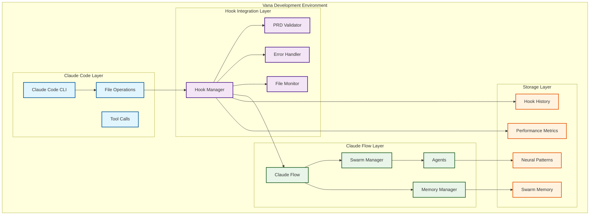

### Component Interaction Flow

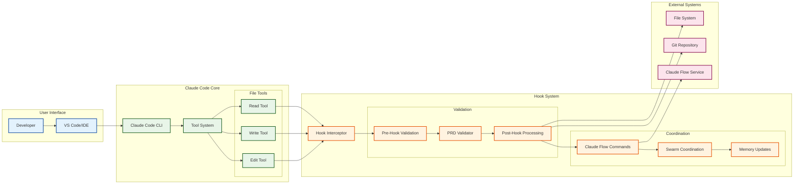

## 🔄 Hook Execution Workflows

### Complete File Write Operation

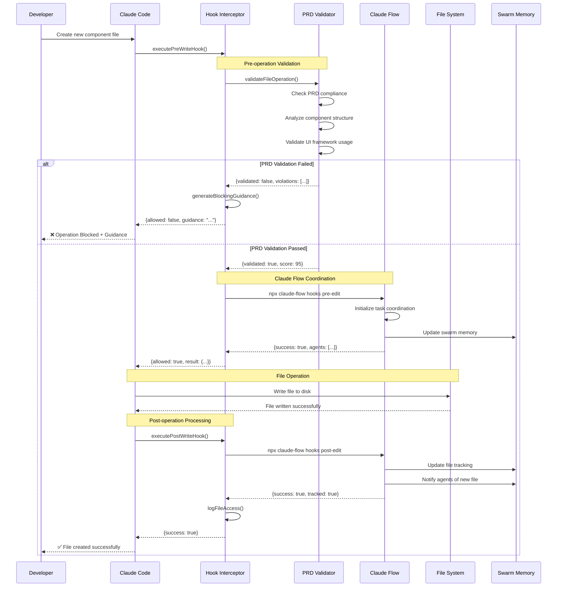

### File Edit Operation with Validation

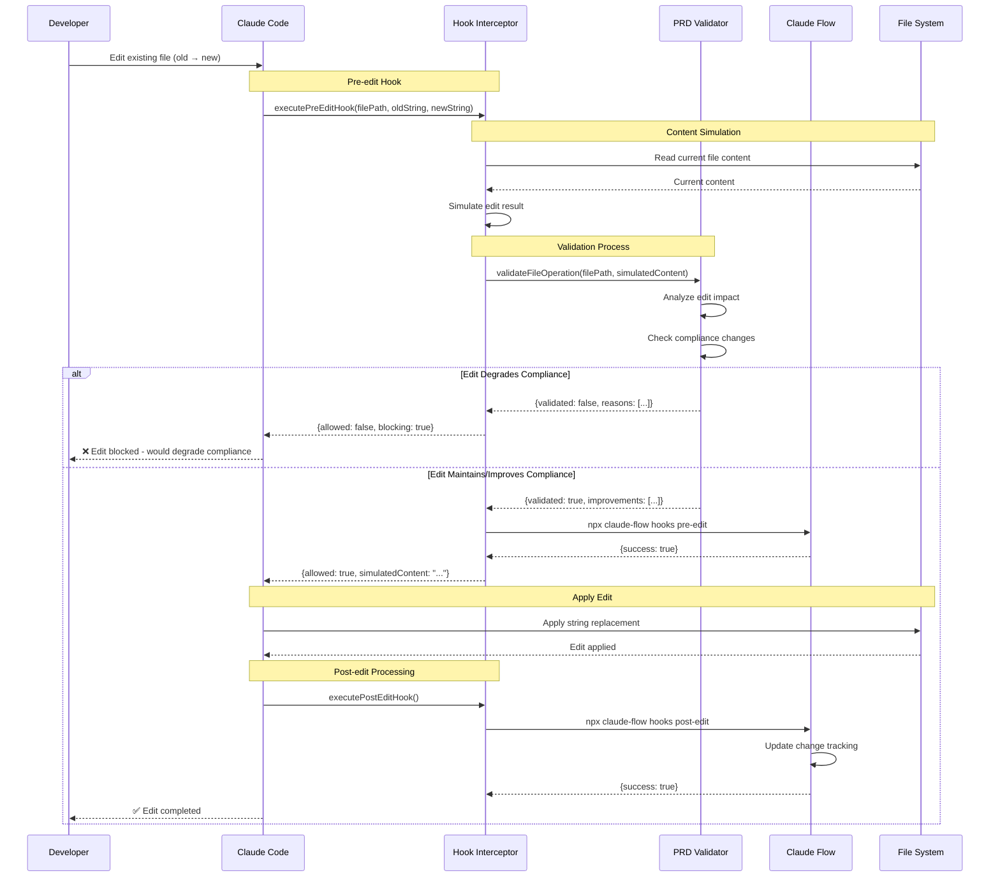

### Agent Coordination During Development

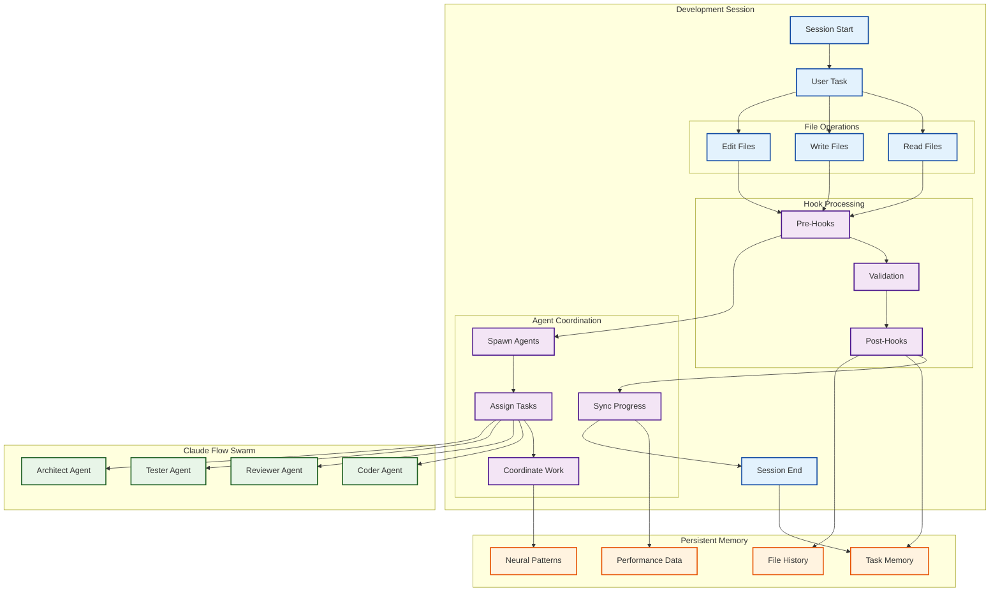

## 🛡️ Validation and Security Flow

### PRD Compliance Validation Process

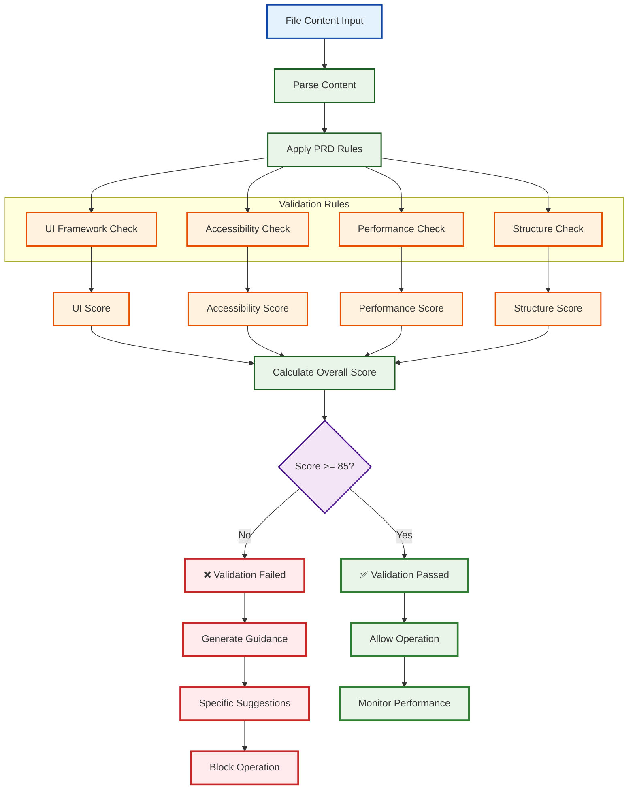

### Security and Permission Flow

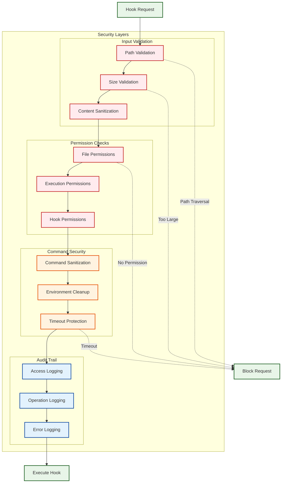

## 📊 Performance and Monitoring Diagrams

### Hook Performance Timeline

```mermaid
gantt
    title Hook Execution Performance Timeline
    dateFormat X
    axisFormat %L ms
    
    section File Operation
    User Request         :0, 5
    
    section Pre-Hook
    Hook Initialization  :5, 15
    PRD Validation      :15, 35
    Claude Flow Cmd     :35, 45
    
    section File I/O
    File System Op      :45, 50
    
    section Post-Hook
    Coordination Update :50, 65
    Memory Update       :65, 75
    Logging            :75, 80
    
    section Response
    Return to User      :80, 85
```

### System Resource Usage

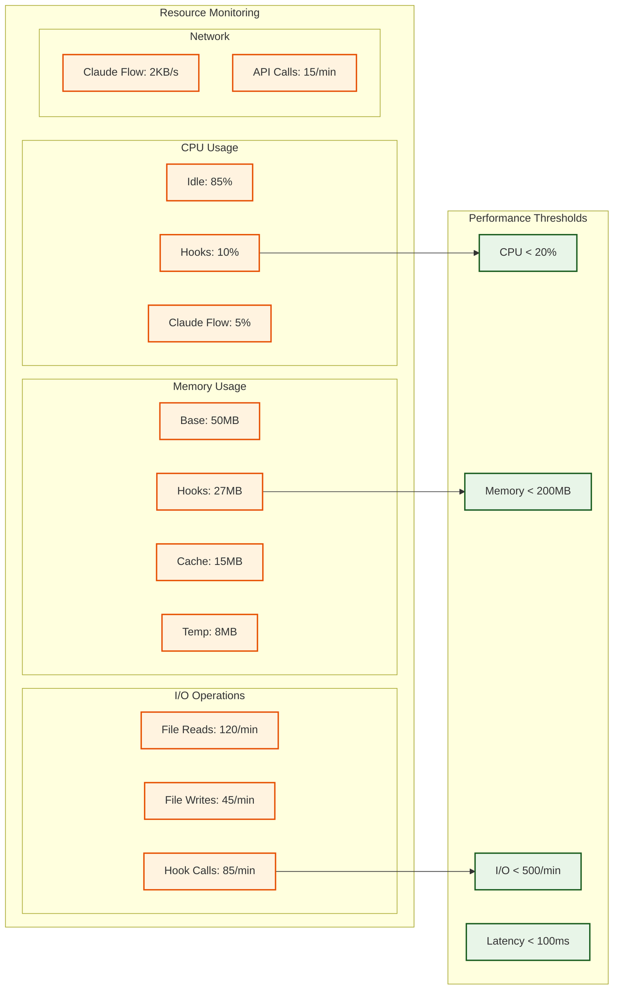

## 🔄 State Transition Diagrams

### Hook System State Machine

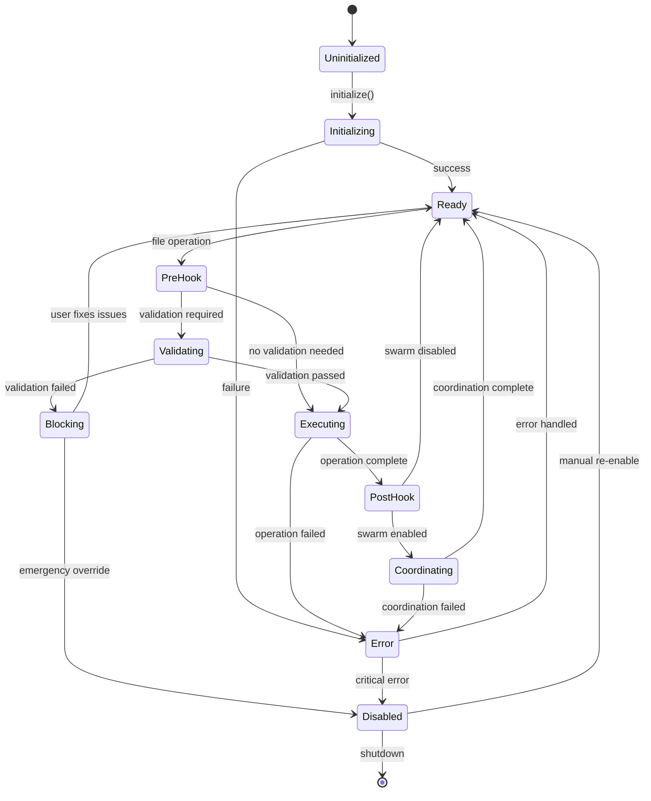

### Agent Coordination State

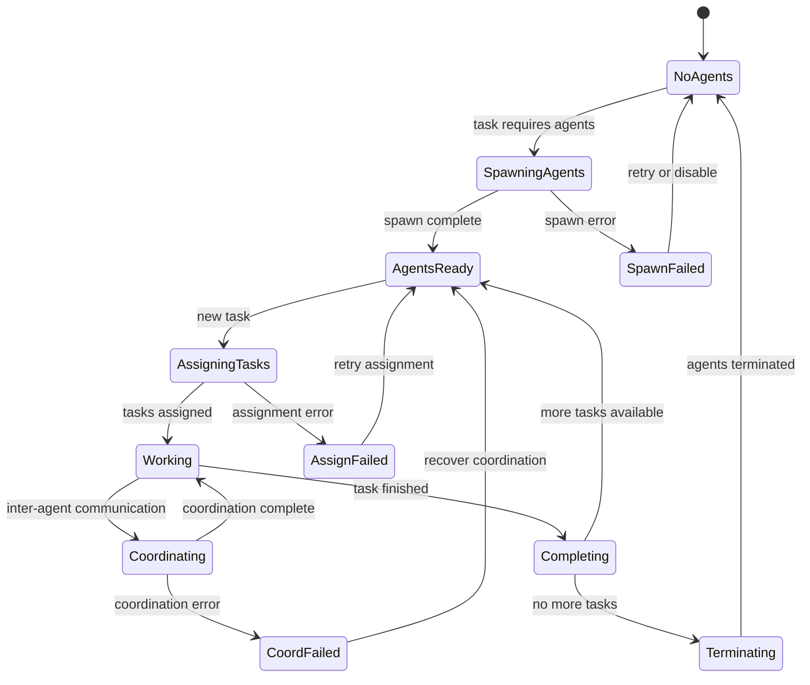

## 🎯 Data Flow Diagrams

### Information Flow Architecture

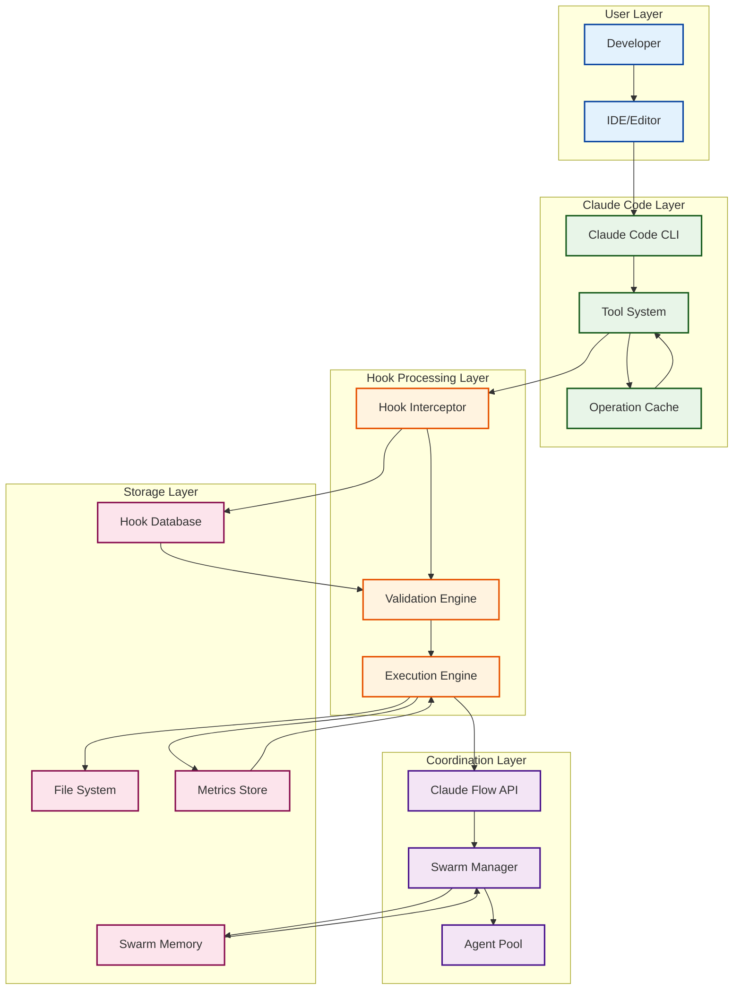

---

**Next**: [Hook Configuration Examples - Practical Configuration Templates](./05-configuration-examples.md)