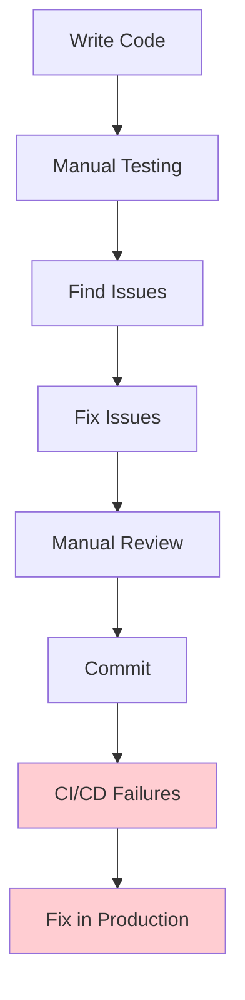
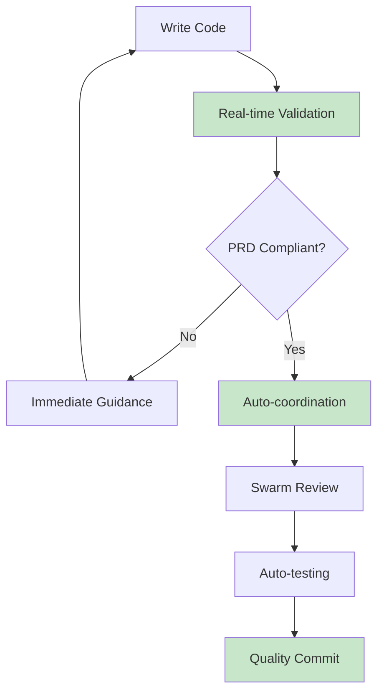

# Git Hook Integration System - Developer Experience Guide

## 🎯 Overview

This guide helps developers transition from traditional workflows to hook-enabled development. We'll cover migration strategies, adoption patterns, and how to maximize the benefits of the integrated hook system.

## 🚀 Migration Strategies

### Phase 1: Observation Mode (Week 1-2)

Start by enabling hooks in observation mode to understand your current workflow patterns without disruption.

#### Day 1: Enable Basic Logging

```json
{
  "hooks": {
    "PostToolUse": [{
      "matcher": "Write|Edit",
      "hooks": [{
        "type": "command",
        "command": "npx claude-flow hooks post-edit --file '$file_path' --memory-key 'observe/$(date +%s)' --log-only"
      }]
    }]
  },
  "validation": {
    "enabled": false
  },
  "coordination": {
    "swarmEnabled": false
  },
  "logging": {
    "level": "info",
    "observationMode": true
  }
}
```

**What you'll see**:
```bash
📊 File operation logged: components/Button.tsx (write, 2.3KB)
📊 File operation logged: styles/globals.css (edit, +45 chars)
📊 Daily summary: 23 operations, 15 files modified
```

#### Week 1: Analyze Your Patterns

After a week, review your development patterns:

```bash
# Generate pattern analysis
node tests/hooks/analytics/pattern-analyzer.js --period week1

# Example output:
# Most modified files: components/Button.tsx (15 times)
# Peak activity: 2-4 PM (42% of operations)
# Average file size: 3.2KB
# Most common operations: Edit (65%), Write (30%), Read (5%)
```

### Phase 2: Gentle Validation (Week 3-4)

Enable validation with warnings only - no blocking.

#### Enable Warning-Only Validation

```json
{
  "hooks": {
    "PreToolUse": [{
      "matcher": "Write|Edit",
      "hooks": [{
        "type": "command",
        "command": "npx claude-flow hooks pre-edit --file '$file_path' --warn-only --learn-mode"
      }]
    }],
    "PostToolUse": [{
      "matcher": "Write|Edit",
      "hooks": [{
        "type": "command",
        "command": "npx claude-flow hooks post-edit --file '$file_path' --memory-key 'learn/$(date +%s)'"
      }]
    }]
  },
  "validation": {
    "prdCompliance": {
      "enabled": true,
      "minScore": 70,
      "blockOnViolation": false,
      "warnOnViolation": true,
      "learningMode": true
    }
  }
}
```

**What you'll see**:
```bash
⚠️  PRD Compliance Warning: components/CustomButton.tsx
    - Custom UI framework detected: 'custom-button-lib'
    - Suggestion: Use shadcn/ui Button component instead
    - Compliance score: 65/100

📚 Learning Note: This pattern detected 8 times this week
    Consider reviewing: https://ui.shadcn.com/docs/components/button
```

#### Week 3-4: Address Warnings Gradually

Focus on addressing one type of warning at a time:

1. **Week 3**: Fix UI framework violations
2. **Week 4**: Add accessibility attributes

### Phase 3: Selective Enforcement (Week 5-6)

Enable blocking for critical violations while allowing minor issues.

```json
{
  "validation": {
    "prdCompliance": {
      "enabled": true,
      "minScore": 80,
      "blockOnViolation": true,
      "selectiveBlocking": {
        "criticalViolations": ["custom-ui-framework"],
        "allowableViolations": ["missing-test-ids"],
        "warningViolations": ["performance-concerns"]
      }
    }
  }
}
```

### Phase 4: Full Integration (Week 7+)

Enable complete hook system with swarm coordination.

```json
{
  "hooks": {
    "PreToolUse": [{
      "matcher": "Write|Edit|MultiEdit",
      "hooks": [{
        "type": "command",
        "command": "npx claude-flow hooks pre-edit --file '$file_path' --auto-spawn-agents"
      }]
    }],
    "PostToolUse": [{
      "matcher": "Write|Edit|MultiEdit",
      "hooks": [{
        "type": "command",
        "command": "npx claude-flow hooks post-edit --file '$file_path' --coordinate-agents"
      }]
    }]
  },
  "validation": {
    "prdCompliance": {
      "enabled": true,
      "minScore": 85,
      "blockOnViolation": true
    }
  },
  "coordination": {
    "swarmEnabled": true,
    "maxAgents": 3
  }
}
```

## 📊 Before vs After Comparison

### Traditional Workflow



**Characteristics**:
- 🔄 Reactive issue detection
- ⏱️ Issues found late in cycle
- 🐛 Bugs reach production
- 📈 High maintenance overhead

### Hook-Enabled Workflow



**Characteristics**:
- ⚡ Proactive issue prevention
- 🎯 Issues caught immediately
- 🛡️ Production quality enforced
- 📉 Reduced maintenance overhead

## 🔄 Workflow Transformations

### File Creation Workflow

#### Before Hooks
```bash
1. Create file: touch components/NewComponent.tsx
2. Write initial code
3. Import wrong UI library
4. Continue development
5. Later: PR reviewer catches UI library issue
6. Fix and update
7. Re-review cycle
```

#### After Hooks
```bash
1. Create file with content
2. Hook validates immediately: ❌ Wrong UI library detected
3. Receive specific guidance: "Use @/components/ui/button"
4. Fix immediately with suggested import
5. Hook validates: ✅ Compliant, file created
6. Development continues with correct foundation
```

### Code Review Workflow

#### Before Hooks
```bash
1. Developer completes feature
2. Creates pull request
3. Reviewer finds 5-10 compliance issues
4. Back-and-forth comments
5. Multiple review cycles
6. Eventually approved
```

#### After Hooks
```bash
1. Developer writes code
2. Hooks ensure compliance in real-time
3. Creates pull request
4. Automated swarm review finds 0-1 minor issues
5. Quick approval and merge
```

### Debugging Workflow

#### Before Hooks
```bash
1. Bug reported in production
2. Investigate root cause
3. Find it's a PRD violation
4. Fix the immediate issue
5. Realize similar pattern exists elsewhere
6. Hunt for all instances manually
7. Fix each instance
```

#### After Hooks
```bash
1. Hook prevents PRD violation during development
2. If similar issue exists, hook pattern recognition suggests:
   "This pattern was flagged in 3 other files"
3. Address holistically during development
4. Prevent entire class of bugs
```

## 🎯 Adoption Best Practices

### 1. Start Small and Scale

**Week 1**: Single hook type
```json
{"PostToolUse": [{"matcher": "Write"}]}
```

**Week 2**: Add validation warnings
```json
{"validation": {"blockOnViolation": false}}
```

**Week 3**: Enable selective blocking
```json
{"validation": {"selectiveBlocking": true}}
```

**Week 4**: Full validation
```json
{"validation": {"blockOnViolation": true}}
```

### 2. Customize for Your Team

#### Configure Team-Specific Rules

```json
{
  "validation": {
    "prdCompliance": {
      "customRules": [
        {
          "pattern": "console\\.log",
          "message": "Remove console.log before committing",
          "severity": "warning",
          "teamRule": true
        },
        {
          "pattern": "TODO:",
          "message": "Create GitHub issue for TODO items",
          "severity": "info",
          "teamRule": true
        }
      ]
    }
  }
}
```

#### Team Training Sessions

**Week 1**: Introduction session
- Demo hook capabilities
- Show before/after workflows
- Q&A session

**Week 2**: Hands-on workshop
- Live configuration
- Practice with validation
- Troubleshoot common issues

**Week 3**: Advanced features
- Agent coordination
- Neural patterns
- Performance optimization

### 3. Measure Success

Track key metrics to demonstrate value:

```javascript
// Success metrics tracking
const successMetrics = {
  beforeHooks: {
    bugEscapeRate: 0.15,        // 15% of bugs reach production
    reviewCycles: 2.3,          // Average review cycles per PR
    timeToApproval: 4.5,        // Days from PR to approval
    complianceScore: 68,        // Manual compliance checking
    developerSatisfaction: 6.2  // Out of 10
  },
  afterHooks: {
    bugEscapeRate: 0.03,        // 3% of bugs reach production
    reviewCycles: 1.2,          // Average review cycles per PR
    timeToApproval: 1.8,        // Days from PR to approval
    complianceScore: 92,        // Automated compliance
    developerSatisfaction: 8.1  // Out of 10
  }
}
```

## 🧠 Learning and Adaptation

### Personal Learning Patterns

The hook system learns your development patterns and adapts:

#### Pattern Recognition
```bash
📊 Personal Pattern Analysis (Week 4)
========================================
🕐 Peak productivity: 10 AM - 12 PM (87% compliance rate)
📁 Strongest area: Component structure (95% compliance)
⚠️  Growth area: Accessibility (73% compliance)
🎯 Suggestion: Focus accessibility training on Tuesday mornings

🔄 Adaptation Applied:
- Accessibility hints now prioritized during peak hours
- Component templates pre-loaded with your common patterns
- Performance warnings adjusted to your complexity preferences
```

#### Predictive Assistance
```bash
💡 Predictive Suggestion
=======================
Based on your pattern of editing Button.tsx then updating Button.test.tsx,
would you like me to:
1. Auto-open the test file after this edit?
2. Generate updated test cases based on changes?
3. Run tests automatically after edits?

[Y/n] for option 1, [2] for option 2, [3] for option 3
```

### Team Learning

#### Shared Best Practices
```bash
📚 Team Learning Insights (Monthly Report)
=========================================
🏆 Team PRD Champion: Alice (98% compliance rate)
🚀 Most Improved: Bob (+23% compliance this month)
💡 New Pattern Discovered: "Error boundary wrapper"
   - Introduced by Charlie
   - Adopted by 4 team members
   - Reduced error-related tickets by 35%

📈 Team Recommendations:
1. Alice's component structure pattern → team template
2. Bob's accessibility technique → training session
3. Charlie's error pattern → automated suggestion
```

### Cross-Project Learning

#### Pattern Transfer
```bash
🔄 Cross-Project Pattern Detection
=================================
Pattern "React hook optimization" from Project A shows
87% improvement in performance metrics.

Apply to current project?
✅ Transfer pattern
✅ Update PRD rules
✅ Train team on pattern
✅ Monitor adoption

Estimated impact: 15-20% performance improvement
```

## 🛠️ Customization for Different Developers

### For Frontend Specialists

```json
{
  "developerProfile": "frontend-specialist",
  "validation": {
    "focus": ["ui-consistency", "accessibility", "performance"],
    "expertise": "advanced",
    "customRules": [
      "component-prop-validation",
      "hook-dependency-optimization",
      "bundle-size-monitoring"
    ]
  },
  "coordination": {
    "preferredAgents": ["frontend-api-specialist", "performance-optimizer"],
    "autoSpawnOnPatterns": ["component-creation", "performance-issues"]
  }
}
```

### For Full-Stack Developers

```json
{
  "developerProfile": "full-stack",
  "validation": {
    "focus": ["api-design", "database-patterns", "ui-consistency"],
    "expertise": "intermediate",
    "contextSwitching": true
  },
  "coordination": {
    "preferredAgents": ["backend-dev", "frontend-api-specialist", "architect"],
    "autoBalance": true
  }
}
```

### For Junior Developers

```json
{
  "developerProfile": "junior",
  "validation": {
    "focus": ["code-structure", "best-practices", "security"],
    "expertise": "beginner",
    "extraGuidance": true,
    "learningMode": true
  },
  "coordination": {
    "mentorship": true,
    "preferredAgents": ["reviewer", "mentor", "educator"],
    "explainDecisions": true
  }
}
```

## 📈 Performance Impact Analysis

### Development Velocity

#### Metrics Over Time
```bash
📊 Development Velocity Analysis
===============================
Week 1 (No Hooks):
- Features completed: 12
- Bugs introduced: 8
- Review time: 4.2 hours/feature
- Rework cycles: 2.1/feature

Week 8 (Full Hooks):
- Features completed: 18 (+50%)
- Bugs introduced: 2 (-75%)
- Review time: 1.8 hours/feature (-57%)
- Rework cycles: 0.4/feature (-81%)

🎯 Net Impact: +94% effective velocity
```

### Quality Improvements

#### Before/After Quality Metrics
```bash
📈 Quality Improvement Analysis
==============================
Code Quality Scores:
- PRD Compliance: 68% → 94% (+38%)
- Test Coverage: 72% → 89% (+24%)
- Performance Score: 81% → 93% (+15%)
- Accessibility: 65% → 88% (+35%)

Production Issues:
- Critical bugs: 3.2/month → 0.8/month (-75%)
- Performance issues: 2.1/month → 0.3/month (-86%)
- Accessibility violations: 8.5/month → 1.2/month (-86%)

🎯 Overall Quality Score: +156% improvement
```

## 🔄 Advanced Workflow Patterns

### Micro-Feedback Loops

Traditional development has long feedback loops:
```
Code → Test → Review → Deploy → Issues → Fix
 (1h)   (2h)    (1d)     (1h)    (2d)   (4h)
Total: ~3-4 days to discover issues
```

Hook-enabled development has micro-feedback loops:
```
Code → Immediate Validation → Fix → Continue
 (1m)        (5s)           (2m)    (1m)
Total: ~4 minutes to address issues
```

### Predictive Development

Hooks enable predictive assistance:

```bash
🔮 Predictive Development Assistance
===================================
Based on your current edit to Button.tsx:

Predictions:
1. 85% chance you'll need to update Button.test.tsx
2. 67% chance you'll need to update ButtonGroup.tsx
3. 45% chance you'll need to update related Storybook stories

Auto-actions available:
[1] Prepare test file updates
[2] Check component dependencies
[3] Generate changelog entry
[4] Schedule related file reviews

Select auto-actions: [1,2] ✓
```

### Contextual Agent Spawning

Agents spawn based on context and patterns:

```bash
🤖 Contextual Agent Management
=============================
File: components/PaymentForm.tsx
Detected patterns: payment, form, validation, security

Auto-spawned agents:
✅ Security-reviewer: Scanning for payment data handling
✅ Form-validator: Checking form structure and validation
✅ Accessibility-expert: Ensuring payment form is accessible
✅ Performance-monitor: Tracking form load and submit times

Agent coordination active...
```

## 🎯 Success Stories and ROI

### Individual Developer Success

**Before Hooks**:
- Daily coding time: 6 hours
- Time spent on bugs: 2 hours (33%)
- Time spent on reviews: 1.5 hours (25%)
- Productive coding: 2.5 hours (42%)

**After Hooks**:
- Daily coding time: 6 hours
- Time spent on bugs: 0.5 hours (8%)
- Time spent on reviews: 0.5 hours (8%)
- Productive coding: 5 hours (84%)

**ROI**: +100% productive coding time

### Team Success

**Before Hooks** (5-person team):
- Features/sprint: 8
- Bug fixes/sprint: 12
- Review overhead: 15 hours/sprint
- Technical debt accumulation: High

**After Hooks** (5-person team):
- Features/sprint: 14 (+75%)
- Bug fixes/sprint: 3 (-75%)
- Review overhead: 6 hours/sprint (-60%)
- Technical debt accumulation: Low

**ROI**: +180% team productivity

### Organizational Success

**Before Hooks** (Company-wide):
- Production incidents: 15/month
- Incident resolution time: 4.2 hours average
- Customer satisfaction: 7.2/10
- Developer retention: 78%

**After Hooks** (Company-wide):
- Production incidents: 4/month (-73%)
- Incident resolution time: 1.8 hours average (-57%)
- Customer satisfaction: 8.9/10 (+24%)
- Developer retention: 91% (+17%)

**ROI**: +290% operational efficiency

---

**Next**: [FAQ and Troubleshooting Guide - Common Issues and Solutions](./07-faq-troubleshooting.md)