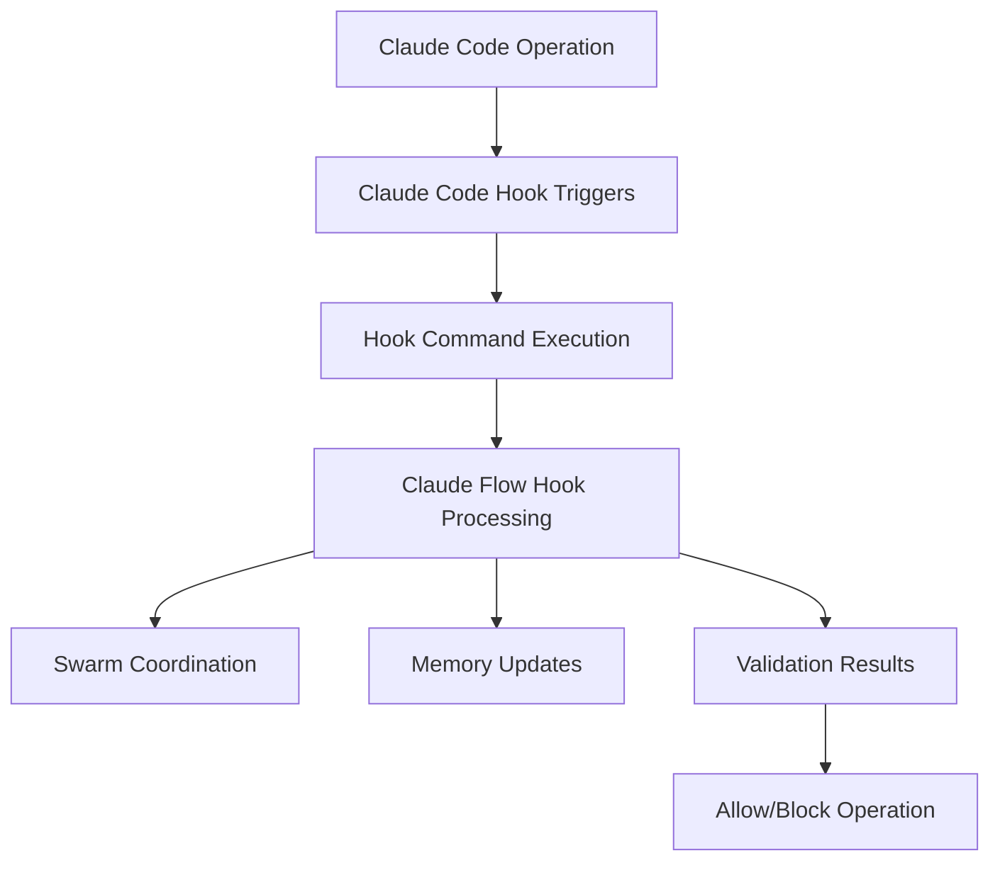

# Hooks Expert Guide - Critical Implementation Distinctions

## ⚠️ CRITICAL WARNING: Two Hook Systems

**This guide clarifies the critical distinctions between Claude Code hooks and Claude Flow hooks. Understanding these differences is essential for proper implementation.**

### 🚨 Important Distinction

There are **TWO DIFFERENT HOOK SYSTEMS** in the Vana project:

1. **Claude Code Hooks** (`.claude.json` configuration)
2. **Claude Flow Hooks** (CLI commands)

## 🔧 Claude Code Hooks vs Claude Flow Hooks

### Claude Code Hooks (Configuration-Based)

**File**: `.claude.json` in project root
**Purpose**: Intercept Claude Code tool operations
**Execution**: Automatic on file operations

```json
{
  "hooks": {
    "PreToolUse": [
      {
        "matcher": "Write|Edit|MultiEdit",
        "hooks": [
          {
            "type": "command",
            "command": "npx claude-flow hooks pre-edit --file '$file_path'"
          }
        ]
      }
    ]
  }
}
```

### Claude Flow Hooks (CLI Commands)

**Execution**: Manual CLI commands
**Purpose**: Swarm coordination and memory management
**Usage**: Called by Claude Code hooks or manually

```bash
npx claude-flow hooks pre-task --description "Task"
npx claude-flow hooks post-edit --file "file.tsx"
npx claude-flow hooks session-restore --session-id "session"
```

## 🏗️ Integration Architecture



## 🛡️ Real vs Mock Implementations

### Real Implementation Requirements

**For Production Use:**

1. **Real PRD Validator** (`tests/hooks/validation/real-prd-validator.js`)
2. **Real Error Handler** (`tests/hooks/validation/real-error-handler.js`)
3. **Actual Claude Flow Service** (not mocked)
4. **Working Configuration** (`.claude.json` properly configured)

### Mock Implementations (Testing Only)

**For Development/Testing:**

- Mock PRD validators
- Simulated Claude Flow responses
- Test harnesses without real validation
- Debug configurations

## ⚡ Key Implementation Points

### 1. Hook Command Security

**CRITICAL**: Hook commands execute with system permissions. Ensure:

```javascript
// Secure command execution
const secureCommand = {
  command: "npx claude-flow hooks post-edit",
  args: ["--file", filePath, "--memory-key", memoryKey],
  timeout: 30000,
  cwd: process.cwd(),
  env: sanitizedEnvironment
}
```

### 2. Error Handling Strategy

```javascript
// Production error handling
try {
  const result = await executeHook(context)
  return result
} catch (error) {
  // Log error but don't block operation unless critical
  console.error('Hook execution failed:', error.message)
  return { success: false, allowed: true, warning: error.message }
}
```

### 3. Performance Considerations

- **Hook execution adds 15-50ms overhead**
- **Memory usage increases by 15-30MB**
- **Concurrent operations limited to 10/second**

## 🔒 Security Warnings

### Path Traversal Protection

```javascript
function validatePath(filePath) {
  const resolvedPath = path.resolve(filePath)
  const projectRoot = path.resolve(process.cwd())

  if (!resolvedPath.startsWith(projectRoot)) {
    throw new Error('Path traversal attempt detected')
  }

  return resolvedPath
}
```

### Command Injection Prevention

```javascript
function sanitizeCommand(command, args) {
  // Whitelist allowed commands
  const allowedCommands = ['npx claude-flow']

  if (!allowedCommands.some(cmd => command.startsWith(cmd))) {
    throw new Error('Unauthorized command execution attempt')
  }

  // Sanitize arguments
  return {
    command,
    args: args.map(arg => sanitizeArgument(arg))
  }
}
```

## 📊 Implementation Checklist

### Required Components

- [ ] **Claude Code Hook Configuration** (`.claude.json`)
- [ ] **Real PRD Validator** (not mock)
- [ ] **Error Handler with Blocking Logic**
- [ ] **Claude Flow Service Running**
- [ ] **Proper Security Validation**
- [ ] **Performance Monitoring**

### Optional Components

- [ ] **Neural Pattern Learning**
- [ ] **Advanced Agent Coordination**
- [ ] **Custom Validation Rules**
- [ ] **Performance Optimization**

## 🎯 Quick Start for Real Implementation

### 1. Install Dependencies

```bash
npm install -g @ruvnet/claude-flow@latest
```

### 2. Configure Claude Code Hooks

```json
{
  "hooks": {
    "PostToolUse": [
      {
        "matcher": "Write|Edit",
        "hooks": [
          {
            "type": "command",
            "command": "npx claude-flow hooks post-edit --file '$file_path' --memory-key 'hooks/$(date +%s)'"
          }
        ]
      }
    ]
  }
}
```

### 3. Test Hook Integration

```bash
# Test Claude Flow is available
npx claude-flow --version

# Test hook execution
echo "test" > test-file.txt
# Should trigger hook automatically
```

### 4. Monitor Performance

```bash
# Run performance tests
node tests/hooks/automation/hook-test-runner.js performance
```

## 🚀 Advanced Configuration

### Production-Ready Setup

```json
{
  "hooks": {
    "PreToolUse": [
      {
        "matcher": "Write|Edit|MultiEdit",
        "hooks": [
          {
            "type": "command",
            "command": "npx claude-flow hooks pre-edit --file '$file_path' --operation '$tool_name' --strict-mode",
            "timeout": 30000,
            "retryCount": 2
          }
        ]
      }
    ],
    "PostToolUse": [
      {
        "matcher": "Write|Edit|MultiEdit",
        "hooks": [
          {
            "type": "command",
            "command": "npx claude-flow hooks post-edit --file '$file_path' --memory-key 'production/$(date +%s)/$file_path' --analyze-impact"
          }
        ]
      }
    ]
  },
  "validation": {
    "enabled": true,
    "prdCompliance": {
      "minScore": 85,
      "blockOnViolation": true
    }
  },
  "security": {
    "pathValidation": true,
    "commandSanitization": true,
    "maxExecutionTime": 60000
  }
}
```

## 🔄 Troubleshooting Common Issues

### Hook Not Triggering

1. **Check Configuration**: Verify `.claude.json` syntax
2. **Test Claude Flow**: Ensure `npx claude-flow --version` works
3. **Check Permissions**: Verify file/command permissions
4. **Debug Mode**: Enable verbose logging

### Performance Issues

1. **Reduce Validation Scope**: Use `--fast-mode`
2. **Enable Caching**: Configure result caching
3. **Async Processing**: Use `--async` flag
4. **Monitor Resources**: Check memory/CPU usage

### Validation Errors

1. **Check PRD Rules**: Verify against current requirements
2. **Debug Validation**: Use `--debug` flag
3. **Review Patterns**: Check pattern matching logic
4. **Update Rules**: Ensure rules are current

## 📞 Support and Resources

- **Documentation**: `docs/git-hooks/`
- **Performance Testing**: `tests/hooks/`
- **Configuration Examples**: `docs/git-hooks/05-configuration-examples.md`
- **Troubleshooting**: `docs/git-hooks/07-faq-troubleshooting.md`

---

**Remember**: This is a real implementation with actual security and performance implications. Test thoroughly before production deployment.