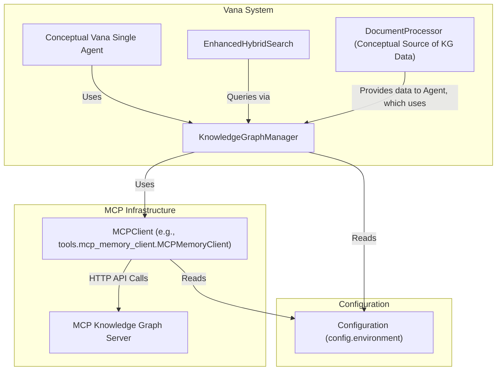

# Knowledge Graph Manager Implementation

[Home](../../index.md) > [Implementation](../index.md) > Knowledge Graph Manager

This document describes the implementation of the `KnowledgeGraphManager` (`tools/knowledge_graph/knowledge_graph_manager.py`). This tool serves as VANA's interface to an MCP (Model Context Protocol) compatible Knowledge Graph server, enabling structured data storage and retrieval.

## Overview

The `KnowledgeGraphManager` provides an abstraction layer over direct MCP API calls, offering methods for common Knowledge Graph operations such as managing entities and relationships. It is a key component for enabling VANA's conceptual agent to build and query a persistent, structured knowledge base.

The current implementation focuses on foundational CRUD (Create, Read, Update, Delete) operations for entities and relationships. Advanced features like automated entity extraction from text, relationship inference, or entity linking directly within the manager are considered future enhancements or responsibilities of other VANA components (e.g., the agent core, `DocumentProcessor` pipeline).

## Architecture

The `KnowledgeGraphManager` interacts with an external or locally hosted MCP server.


*   The `KnowledgeGraphManager` uses an `MCPClient` instance (which might be `tools.mcp_memory_client.MCPMemoryClient` or a similar utility) to handle the actual HTTP communication with the MCP server.
*   Both `KnowledgeGraphManager` and `MCPClient` are configured via `config.environment` (loading from `.env` files).

## Core Class: `KnowledgeGraphManager`

```python
# tools/knowledge_graph/knowledge_graph_manager.py (Conceptual Structure)
from config import environment
# Assuming an MCPClient class exists, e.g., from tools.mcp_memory_client
# from tools.mcp_memory_client import MCPMemoryClient
# from tools.logging.logger import get_logger
# from tools.resilience import CircuitBreaker, CircuitBreakerOpenException # For resilience

# logger = get_logger(__name__)

class KnowledgeGraphManager:
    def __init__(self):
        """
        Initializes the KnowledgeGraphManager.
        It sets up the MCPClient using configurations from environment.py.
        """
        # self.mcp_endpoint = environment.MCP_ENDPOINT
        # self.mcp_namespace = environment.MCP_NAMESPACE
        # self.mcp_api_key = environment.MCP_API_KEY

        # self.mcp_client = MCPMemoryClient(
        #     endpoint=self.mcp_endpoint,
        #     namespace=self.mcp_namespace,
        #     api_key=self.mcp_api_key
        # )

        # Example: Circuit breaker for MCP calls
        # self.cb_mcp = CircuitBreaker(name="mcp_kg_calls", failure_threshold=3, recovery_timeout_seconds=60)

        # logger.info(f"KnowledgeGraphManager initialized for namespace '{self.mcp_namespace}' at '{self.mcp_endpoint}'")
        pass # Placeholder for actual initialization

    # --- Entity Management ---
    def add_entity(self, name: str, entity_type: str, observations: list = None):
        """
        Adds a new entity to the Knowledge Graph.

        Args:
            name (str): The unique name/ID of the entity.
            entity_type (str): The type of the entity (e.g., "Person", "Project").
            observations (list, optional): A list of textual observations about the entity.

        Returns:
            dict or None: Response from MCP server or None on failure.
        """
        # logger.debug(f"Adding entity: Name='{name}', Type='{entity_type}'")
        # payload = {"name": name, "entity_type": entity_type, "observations": observations or []}
        # try:
        #     # response = self.cb_mcp.execute(self.mcp_client.create_entity, payload) # Example with circuit breaker
        #     response = self.mcp_client.create_entity(payload) # Direct call
        #     logger.info(f"Entity '{name}' added/updated. Response: {response}")
        #     return response
        # except CircuitBreakerOpenException as cboe:
        #     logger.error(f"MCP Circuit Breaker open while adding entity '{name}': {cboe}")
        #     return None
        # except Exception as e:
        #     logger.error(f"Error adding entity '{name}': {e}", exc_info=True)
        #     return None
        pass # Placeholder

    def get_entity(self, name: str):
        """
        Retrieves an entity and its details from the Knowledge Graph.
        """
        # logger.debug(f"Getting entity: Name='{name}'")
        # try:
        #     # response = self.cb_mcp.execute(self.mcp_client.get_entity, name)
        #     response = self.mcp_client.get_entity(name)
        #     return response
        # except Exception as e: # Catch specific MCP client errors if defined
        #     logger.error(f"Error getting entity '{name}': {e}", exc_info=True)
        #     return None
        pass # Placeholder

    def update_entity_observations(self, name: str, new_observations: list, append: bool = True):
        """
        Updates observations for an existing entity.
        If append is True, new_observations are added; otherwise, they replace existing ones.
        """
        # logger.debug(f"Updating observations for entity: Name='{name}'")
        # This might involve getting the entity, modifying observations, then calling an update/replace method.
        # Or the MCP API might have a direct "add observations" endpoint.
        # Conceptual:
        # current_entity = self.get_entity(name)
        # if not current_entity: return None
        # if append:
        #    existing_obs = current_entity.get('observations', [])
        #    updated_obs = existing_obs + [obs for obs in new_observations if obs not in existing_obs]
        # else:
        #    updated_obs = new_observations
        # payload = {"name": name, "entity_type": current_entity['entity_type'], "observations": updated_obs}
        # try:
        #     response = self.mcp_client.update_entity(name, payload) # Assuming an update_entity method
        #     return response
        # except Exception as e:
        #     logger.error(f"Error updating entity '{name}': {e}", exc_info=True)
        #     return None
        pass # Placeholder

    def delete_entity(self, name: str):
        """
        Deletes an entity from the Knowledge Graph.
        """
        # logger.debug(f"Deleting entity: Name='{name}'")
        # try:
        #     response = self.mcp_client.delete_entity(name)
        #     return response
        # except Exception as e:
        #     logger.error(f"Error deleting entity '{name}': {e}", exc_info=True)
        #     return None
        pass # Placeholder

    # --- Relationship Management ---
    def add_relation(self, from_entity: str, to_entity: str, relation_type: str):
        """
        Adds a directed relationship between two entities.
        """
        # logger.debug(f"Adding relation: From='{from_entity}', To='{to_entity}', Type='{relation_type}'")
        # payload = {"from_entity": from_entity, "to_entity": to_entity, "relation_type": relation_type}
        # try:
        #     response = self.mcp_client.create_relation(payload)
        #     return response
        # except Exception as e:
        #     logger.error(f"Error adding relation '{from_entity}-{relation_type}-{to_entity}': {e}", exc_info=True)
        #     return None
        pass # Placeholder

    def get_relations(self, entity_name: str = None, relation_type: str = None, direction: str = "all"):
        """
        Retrieves relationships, optionally filtered by entity, type, and direction.
        Direction can be 'incoming', 'outgoing', or 'all'.
        """
        # logger.debug(f"Getting relations for: Entity='{entity_name}', Type='{relation_type}', Direction='{direction}'")
        # params = {"entity_name": entity_name, "relation_type": relation_type, "direction": direction}
        # try:
        #     response = self.mcp_client.get_relations(params=params) # Assuming such a method
        #     return response
        # except Exception as e:
        #     logger.error(f"Error getting relations: {e}", exc_info=True)
        #     return None
        pass # Placeholder

    def delete_relation(self, from_entity: str, to_entity: str, relation_type: str):
        """
        Deletes a specific relationship.
        """
        # logger.debug(f"Deleting relation: From='{from_entity}', To='{to_entity}', Type='{relation_type}'")
        # payload = {"from_entity": from_entity, "to_entity": to_entity, "relation_type": relation_type}
        # try:
        #     response = self.mcp_client.delete_relation(payload) # Assuming such a method
        #     return response
        # except Exception as e:
        #     logger.error(f"Error deleting relation: {e}", exc_info=True)
        #     return None
        pass # Placeholder

    # --- Querying ---
    def search_nodes(self, query: str, entity_type_filter: str = None):
        """
        Performs a search for nodes (entities) in the KG based on a query string.
        Optionally filters by entity type.
        This method's capability heavily depends on the MCP server's search implementation.
        """
        # logger.debug(f"Searching nodes with query: '{query}', TypeFilter='{entity_type_filter}'")
        # params = {"query": query, "entity_type": entity_type_filter}
        # try:
        #     response = self.mcp_client.search_nodes(params=params) # Assuming such a method
        #     return response
        # except Exception as e:
        #     logger.error(f"Error searching nodes: {e}", exc_info=True)
        #     return None
        pass # Placeholder

    # Other potential methods:
    # - batch_add_entities, batch_add_relations
    # - get_neighbors(entity_name, relation_type_filter=None, direction="outgoing")
    # - more complex path or pattern querying if supported by MCPClient/Server
```

### Key Implementation Details:
*   **MCPClient Wrapper:** The `KnowledgeGraphManager` acts as a business-logic wrapper around a more generic `MCPClient`. The `MCPClient` (e.g., `tools.mcp_memory_client.MCPMemoryClient`) would handle the direct HTTP requests (GET, POST, PUT, DELETE) to the MCP server, including authentication headers (API key) and namespace management.
*   **Configuration:** It fetches MCP server details (`MCP_ENDPOINT`, `MCP_NAMESPACE`, `MCP_API_KEY`) from `config.environment`.
*   **Core Operations:** Provides methods for:
    *   Adding, retrieving, updating (e.g., observations), and deleting entities.
    *   Adding, retrieving, and deleting relationships.
*   **Search/Query:** Includes a basic `search_nodes` method. The capabilities of this search depend heavily on the features exposed by the specific MCP server implementation VANA connects to.
*   **Error Handling:** Each method should include `try...except` blocks to catch exceptions from the `MCPClient` (e.g., network errors, API errors from the MCP server) and log them.
*   **Resilience:** Calls to the `MCPClient` should ideally be wrapped with a Circuit Breaker instance (e.g., from `tools.resilience` or `tools.monitoring`) to protect VANA from an unresponsive MCP server.
*   **Logging:** Uses VANA's standard logger (`tools.logging.logger.get_logger(__name__)`) for recording operations, errors, and debug information.

### Entity and Relationship Structure (Assumed by MCP)
The `KnowledgeGraphManager` assumes the MCP server works with:
*   **Entities:** Typically identified by a unique `name` (or ID), having an `entity_type`, and a list of textual `observations`.
*   **Relationships:** Defined by a `from_entity` (name/ID), a `to_entity` (name/ID), and a `relation_type` (a string describing the relationship).

## Integration with Other VANA Components

*   **Conceptual Vana Agent:** The agent is the primary user of `KnowledgeGraphManager` to store learned information and retrieve knowledge to inform its actions.
*   **`EnhancedHybridSearch`:** Uses `KnowledgeGraphManager` (via `search_nodes` or similar query methods) as one of its search backends.
*   **`DocumentProcessor` Pipeline:** While `DocumentProcessor` itself focuses on text extraction and chunking, a subsequent step in an ingestion pipeline (potentially orchestrated by the agent) would use `KnowledgeGraphManager` to store entities and relationships extracted from processed documents. This automated extraction logic (NER, relation extraction) is not part of the current `KnowledgeGraphManager` itself but would use its `add_entity` and `add_relation` methods.

## Performance Considerations

*   **Batch Operations:** For ingesting large amounts of data, the `KnowledgeGraphManager` or underlying `MCPClient` should ideally support batch methods for adding entities and relationships to reduce network overhead. If not, the calling code might need to implement its own batching logic.
*   **Caching:** Caching frequently accessed, relatively static KG data could be considered, but needs careful cache invalidation strategies. This is not typically a core responsibility of the manager itself but could be added as a layer.
*   **MCP Server Performance:** The overall performance of KG operations heavily depends on the responsiveness and efficiency of the connected MCP server.

## Future Enhancements

1.  **Advanced Query Capabilities:** Exposing more sophisticated graph query methods (e.g., Cypher-like queries if the MCP server supports them, pathfinding, pattern matching).
2.  **Schema Management Support:** Methods to define or retrieve entity and relationship types supported by the KG.
3.  **Built-in NLP for Extraction (Optional):** While currently separate, future versions might integrate basic NLP capabilities (e.g., using spaCy) for simple entity/relationship extraction from text, though this might also remain a higher-level agent function.
4.  **Improved Caching:** More sophisticated client-side caching for KG data.
5.  **Transaction Support:** If the MCP server supports transactions for multiple operations, exposing this.
6.  **Enhanced Resilience:** More detailed error classification and fallback strategies.

This implementation provides VANA with a foundational interface to structured knowledge, crucial for its advanced information processing and agent capabilities.
