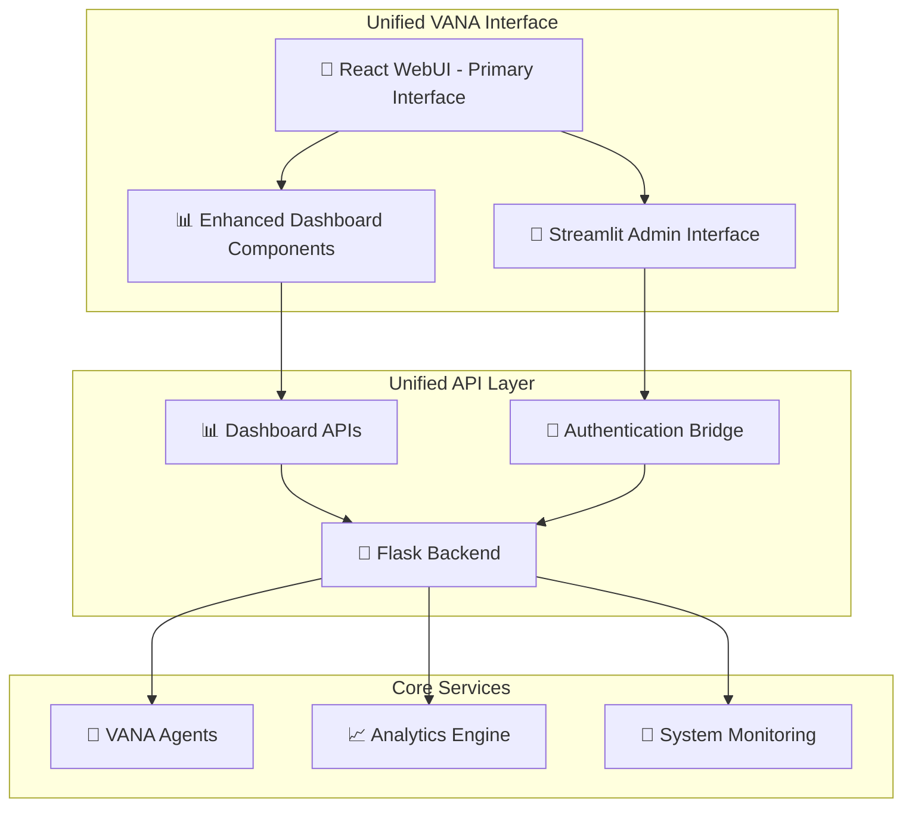

# 🎨 Streamlit-React Dashboard Integration Plan

## 📋 Project Overview

**Objective**: Integrate the advanced Streamlit analytics dashboard with the sophisticated React WebUI to create a unified, comprehensive interface for VANA users.

**Current State**: 
- ✅ React WebUI: Sophisticated chat interface with authentication and basic dashboard
- ✅ Streamlit Dashboard: Advanced analytics with 5 comprehensive monitoring sections
- ✅ Flask Backend: API services connecting both systems

**Target State**: Unified interface where users can seamlessly access both chat functionality and advanced analytics without switching between different applications.

## 🏗️ Technical Architecture



## 🎯 Implementation Phases

### Phase 1: Foundation & API Enhancement (Week 1)
**Priority**: 🔴 IMMEDIATE

#### 1.1 Enhanced Flask API Layer
- **Create unified dashboard API endpoints**
  - `/api/dashboard/agents` - Agent status and performance
  - `/api/dashboard/system` - System health and resources
  - `/api/dashboard/memory` - Memory usage and ADK metrics
  - `/api/dashboard/tasks` - Task execution and history
- **Implement consistent JSON response format**
- **Add real-time data endpoints with WebSocket support**

#### 1.2 Authentication Bridge System
- **JWT token sharing between React and Streamlit**
- **Single sign-on (SSO) implementation**
- **Session management across interfaces**
- **Role-based access control for admin features**

#### 1.3 Shared Configuration Management
- **Unified configuration system**
- **Environment-specific settings**
- **Feature flags for gradual rollout**

#### 1.4 Data Models & Standards
- **Consistent data structures across systems**
- **API documentation with OpenAPI/Swagger**
- **Error handling and response standards**

### Phase 2: React Dashboard Enhancement (Week 2-3)
**Priority**: 🟡 SHORT-TERM

#### 2.1 Enhanced Dashboard Components
- **Agent Performance Dashboard**
  - Real-time agent status indicators
  - Response time charts and metrics
  - Error rate monitoring
  - Agent utilization graphs

- **System Health Monitor**
  - CPU, memory, and disk usage
  - Network traffic visualization
  - Service availability status
  - Alert notifications

- **Memory Analytics**
  - ADK memory performance metrics
  - Cost analysis and projections
  - Session monitoring
  - Memory optimization insights

#### 2.2 Chart Library Integration
- **Chart.js implementation for React components**
- **Responsive design for all screen sizes**
- **Interactive charts with drill-down capabilities**
- **Real-time data updates**

#### 2.3 Navigation Enhancement
- **Seamless switching between chat and dashboard modes**
- **Breadcrumb navigation**
- **Quick access toolbar**
- **Keyboard shortcuts for power users**

### Phase 3: Streamlit Integration (Week 4-5)
**Priority**: 🟢 MEDIUM-TERM

#### 3.1 Iframe Integration
- **Embed Streamlit dashboard in React interface**
- **Responsive iframe sizing and scaling**
- **Cross-frame communication for navigation**
- **Loading states and error handling**

#### 3.2 Authentication Handoff
- **Seamless authentication between React and Streamlit**
- **Token validation and refresh**
- **User context preservation**
- **Security considerations for iframe embedding**

#### 3.3 Deep Linking System
- **Direct links to specific Streamlit views**
- **URL synchronization between interfaces**
- **Bookmark support for dashboard views**
- **Back/forward navigation support**

#### 3.4 Admin Interface Access
- **Role-based access to advanced analytics**
- **Admin-only features and controls**
- **User permission management**
- **Audit logging for admin actions**

### Phase 4: Advanced Features & Optimization (Week 6+)
**Priority**: 🔵 LONG-TERM

#### 4.1 Real-time Data Synchronization
- **WebSocket connections for live updates**
- **Event-driven architecture**
- **Optimistic UI updates**
- **Conflict resolution for concurrent users**

#### 4.2 Advanced User Management
- **Multi-tenant support**
- **Custom dashboard configurations**
- **User preferences and settings**
- **Personalized analytics views**

#### 4.3 Performance Optimization
- **Caching strategies for dashboard data**
- **Lazy loading for complex visualizations**
- **Bundle optimization and code splitting**
- **CDN integration for static assets**

#### 4.4 Testing & Quality Assurance
- **Comprehensive test suite**
- **End-to-end testing with Playwright**
- **Performance testing and benchmarking**
- **Accessibility compliance (WCAG 2.1)**

## 📁 File Structure

```
dashboard/
├── api/
│   ├── dashboard_api.py          # Unified dashboard API endpoints
│   ├── auth_bridge.py           # Authentication sharing system
│   ├── websocket_handler.py     # Real-time data updates
│   └── data_models.py           # Shared data structures
├── frontend/
│   ├── src/
│   │   ├── components/
│   │   │   ├── dashboard/
│   │   │   │   ├── AgentPerformance.js
│   │   │   │   ├── SystemHealth.js
│   │   │   │   ├── MemoryAnalytics.js
│   │   │   │   └── TaskExecution.js
│   │   │   └── streamlit/
│   │   │       ├── StreamlitEmbed.js
│   │   │       └── AuthBridge.js
│   │   ├── services/
│   │   │   ├── dashboardApi.js   # Dashboard API client
│   │   │   └── websocket.js      # WebSocket client
│   │   └── hooks/
│   │       ├── useDashboardData.js
│   │       └── useRealTimeUpdates.js
├── streamlit_integration/
│   ├── auth_handler.py          # Streamlit authentication bridge
│   ├── iframe_wrapper.py        # Embedding utilities
│   └── url_router.py           # Deep linking support
└── shared/
    ├── models.py               # Shared data models
    ├── config.py              # Unified configuration
    └── constants.py           # System constants
```

## 🎯 Success Criteria

### User Experience
- ✅ **Single Interface**: Users access all VANA features through one interface
- ✅ **<2s Load Times**: All dashboard components load within 2 seconds
- ✅ **Responsive Design**: Works seamlessly on desktop, tablet, and mobile
- ✅ **Intuitive Navigation**: Clear, logical flow between chat and analytics

### Technical Performance
- ✅ **Real-time Updates**: Dashboard data updates within 1 second of changes
- ✅ **Concurrent Users**: Support for 50+ simultaneous users
- ✅ **99.9% Uptime**: Reliable service availability
- ✅ **Security**: Secure authentication and data protection

### Functional Completeness
- ✅ **Feature Parity**: All Streamlit analytics available in React interface
- ✅ **Admin Functions**: Complete admin interface for system management
- ✅ **Data Accuracy**: Consistent data across all interface components
- ✅ **Error Handling**: Graceful error handling and recovery

## 🚀 Getting Started

### Immediate Next Steps (Phase 1)
1. **Create enhanced Flask API endpoints** for dashboard data
2. **Implement authentication bridge** between React and Streamlit
3. **Set up shared configuration** and data models
4. **Create basic API documentation** and testing framework

### Development Environment Setup
```bash
# Install additional dependencies
cd dashboard/frontend
npm install chart.js react-chartjs-2 socket.io-client

# Install Python dependencies
cd ../
pip install flask-socketio python-socketio

# Start development servers
npm run start  # React development server
python app.py  # Streamlit dashboard
python flask_app.py  # Flask API server
```

## 📊 Timeline & Milestones

| Phase | Duration | Key Deliverables | Success Metrics |
|-------|----------|------------------|-----------------|
| Phase 1 | Week 1 | Enhanced API, Auth Bridge | API endpoints functional |
| Phase 2 | Week 2-3 | React Dashboard Components | Charts rendering correctly |
| Phase 3 | Week 4-5 | Streamlit Integration | Seamless navigation |
| Phase 4 | Week 6+ | Advanced Features | Performance targets met |

---

**🎉 This integration will create a truly sophisticated, unified interface that combines the best of both React's user experience and Streamlit's analytical power!**
