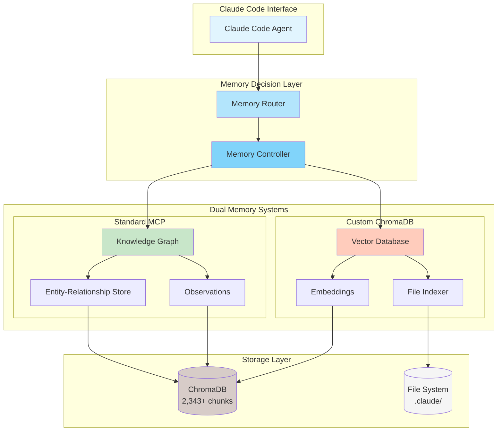
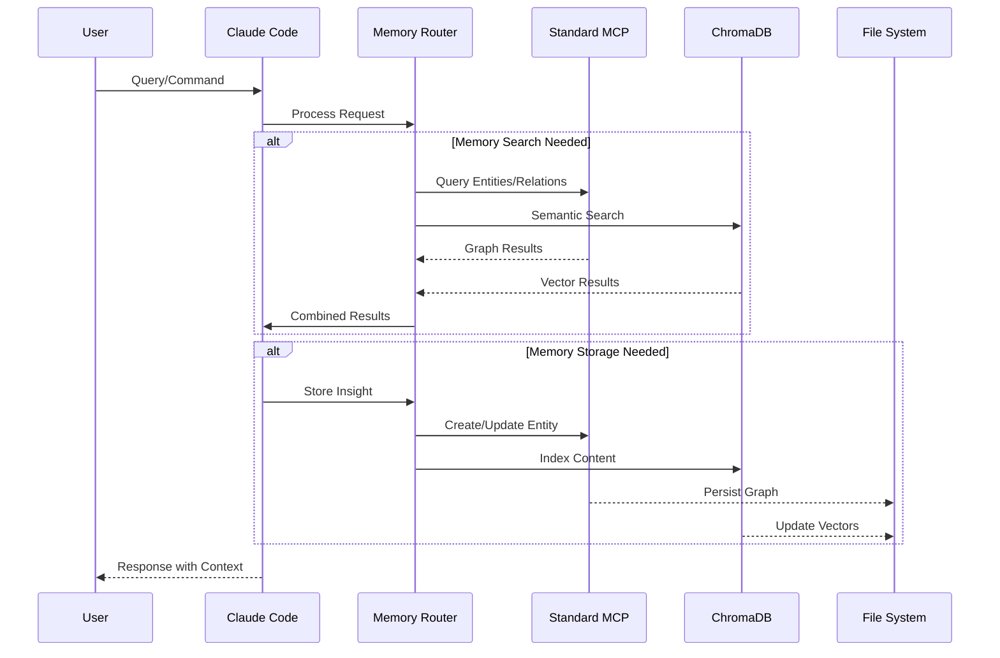
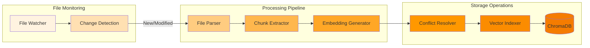
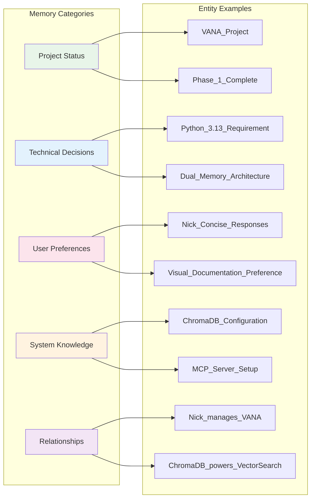
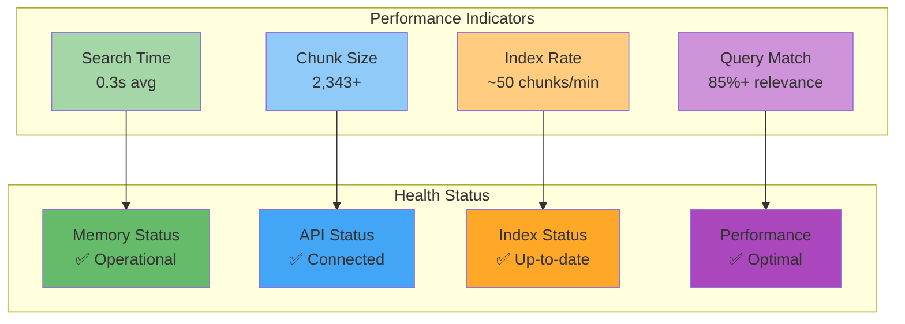
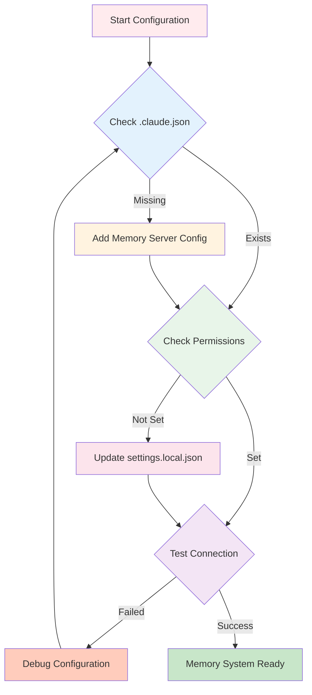

# VANA Memory System Visual Diagrams

## System Architecture Diagram

## Memory Flow Sequence

## Auto-Indexing Process

## Memory Categories & Relationships

## Performance Metrics Dashboard

## Configuration Flow

## Next Steps

These visual diagrams illustrate:
- Overall system architecture
- Data flow sequences
- Auto-indexing pipeline
- Memory categorization
- Performance monitoring
- Configuration process

The next documentation will cover implementation details and deployment procedures.