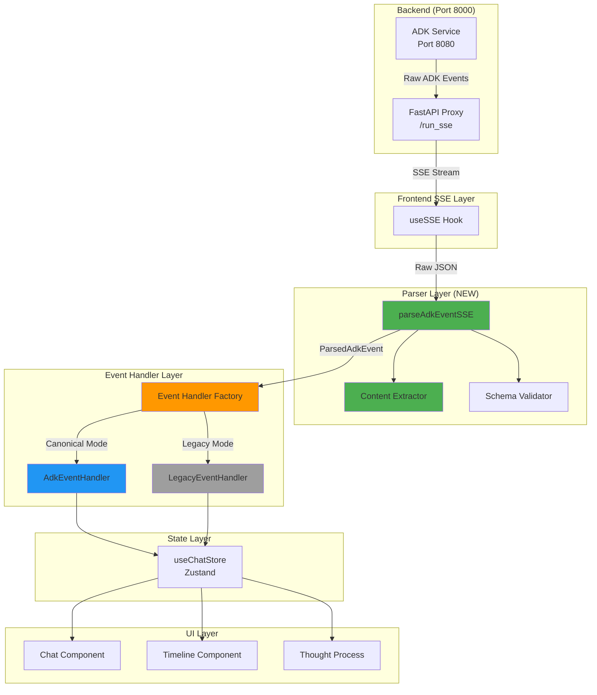

# Phase 3: Frontend ADK Event Parser Architecture

**Date**: 2025-10-18
**Status**: APPROVED - Ready for Implementation
**Planning Document**: `docs/plans/multi_agent_adk_alignment_plan.md`
**Architecture Version**: 1.0.0

---

## Executive Summary

This document defines the TypeScript-based ADK Event parser system that transforms canonical ADK Event JSON into frontend state. It enables migration from legacy custom events to ADK-compliant streaming while maintaining backward compatibility through feature flags.

### Key Deliverables

1. **Type-Safe Parser**: Full TypeScript interfaces matching ADK Python Event model
2. **Content Extractors**: Utilities to extract text, thoughts, function responses, sources
3. **Event Handlers**: Canonical and legacy handlers with factory pattern
4. **Store Integration**: Extended Zustand store with ADK event storage
5. **Migration Path**: Feature-flag gated rollout strategy

---

## Architecture Overview

### System Flow



### Module Organization

```
frontend/src/
├── lib/streaming/
│   ├── adk/                           # NEW - ADK Parser Module
│   │   ├── types.ts                   # ADK Event interfaces
│   │   ├── parser.ts                  # parseAdkEventSSE() main entry
│   │   ├── content-extractor.ts       # Extract text/thoughts/sources
│   │   ├── validator.ts               # Runtime validation (optional)
│   │   └── index.ts                   # Public API exports
│   ├── sse-parser.ts                  # LEGACY - Keep for backward compat
│   └── types.ts                       # LEGACY - Shared types
│
├── hooks/chat/
│   ├── event-handlers/                # NEW - Handler Abstraction
│   │   ├── adk-event-handler.ts       # Canonical ADK event processing
│   │   ├── legacy-event-handler.ts    # Existing handler (refactored)
│   │   └── index.ts                   # Handler factory (feature flag)
│   ├── sse-event-handlers.ts          # EXISTING - Update to use factory
│   ├── store.ts                       # EXISTING - Add rawAdkEvents field
│   └── types.ts                       # EXISTING - Extend with ADK types
│
└── components/
    ├── chat/                          # Chat UI components
    ├── timeline/                      # Timeline visualization
    └── thought-process/               # NEW - Thought visualization
```

---

## Core Type Definitions

### ADK Event Structure

The canonical ADK Event structure (matching `google/adk/events/event.py`):

```typescript
/**
 * ADK Event - Canonical structure from google/adk/events/event.py
 */
export interface AdkEvent {
  /** Unique event identifier */
  id: string;

  /** Event author (agent name or 'user') */
  author: string;

  /** Invocation ID grouping multiple events */
  invocationId: string;

  /** Event timestamp (Unix seconds with fractional) */
  timestamp: number;

  /** Main content with parts */
  content?: AdkContent;

  /** Agent coordination actions */
  actions?: AdkEventActions;

  /** Event branch path (multi-agent hierarchy) */
  branch?: string;

  /** Long-running tool IDs */
  longRunningToolIds?: string[];

  /** Partial content flag (streaming) */
  partial?: boolean;

  /** Turn complete flag */
  turnComplete?: boolean;

  /** Error metadata */
  errorCode?: string;
  errorMessage?: string;

  /** Grounding metadata (search results, citations) */
  groundingMetadata?: GroundingMetadata;
}
```

### Content Structure

```typescript
/**
 * ADK Content - mirrors google.genai.types.Content
 */
export interface AdkContent {
  /** Content parts array */
  parts: AdkPart[];

  /** Role: 'user' | 'model' | agent name */
  role?: string;
}

/**
 * ADK Content Part - mirrors google.genai.types.Part
 */
export interface AdkPart {
  /** Plain text content */
  text?: string;

  /** Function call request */
  functionCall?: {
    name: string;
    args: Record<string, unknown>;
    id?: string;
  };

  /** Function call response */
  functionResponse?: {
    name: string;
    response: Record<string, unknown>;
    id?: string;
  };

  /** Thought flag (ADK extension) */
  thought?: boolean;

  // ... other part types (inlineData, codeExecutionResult, etc.)
}
```

### Parsed Event Result

```typescript
/**
 * Parsed ADK Event Result (extracted content + metadata)
 */
export interface ParsedAdkEvent {
  /** Original event */
  event: AdkEvent;

  /** Extracted text content (from parts[].text, excluding thoughts) */
  textContent: string;

  /** Extracted thought content (from parts[].text where thought=true) */
  thoughtContent: string;

  /** Function calls in this event */
  functionCalls: FunctionCall[];

  /** Function responses in this event */
  functionResponses: FunctionResponse[];

  /** Extracted sources (from groundingMetadata) */
  sources: Array<{url: string; title?: string}>;

  /** Whether this is a final response (no pending actions) */
  isFinalResponse: boolean;

  /** Agent transfer target (if any) */
  transferToAgent?: string;
}
```

---

## Parser Implementation

### Main Parser Function

**File**: `frontend/src/lib/streaming/adk/parser.ts`

```typescript
/**
 * Parse raw SSE data into ADK Event
 *
 * @param data - Raw SSE data string (JSON)
 * @param options - Parser configuration
 * @returns Parsed ADK Event or null on error
 */
export function parseAdkEventSSE(
  data: string,
  options: AdkParserOptions = {}
): ParsedAdkEvent | null {
  try {
    const trimmed = data.trim();

    // Handle empty data
    if (!trimmed) return null;

    // Handle SSE comments
    if (trimmed.startsWith(':')) return null;

    // Handle stream termination
    if (trimmed === '[DONE]') {
      return createTerminationEvent();
    }

    // Parse JSON
    const parsed: AdkEvent = JSON.parse(trimmed);

    // Optional validation (dev only)
    if (options.validateSchema) {
      validateAdkEvent(parsed);
    }

    // Extract content
    const textContent = extractTextContent(parsed.content?.parts ?? []);
    const thoughtContent = extractThoughtContent(parsed.content?.parts ?? []);
    const sources = extractSources(parsed);
    const functionCalls = extractFunctionCalls(parsed.content?.parts ?? []);
    const functionResponses = extractFunctionResponses(parsed.content?.parts ?? []);

    // Determine final response
    const isFinalResponse = checkIsFinalResponse(parsed);

    // Extract agent transfer
    const transferToAgent = parsed.actions?.transferToAgent;

    return {
      event: parsed,
      textContent,
      thoughtContent,
      functionCalls,
      functionResponses,
      sources,
      isFinalResponse,
      transferToAgent,
    };
  } catch (error) {
    console.error('[ADK Parser] Parse error:', error);
    return null;
  }
}
```

### Content Extraction

**File**: `frontend/src/lib/streaming/adk/content-extractor.ts`

```typescript
/**
 * Extract plain text from parts[], excluding thoughts
 */
export function extractTextContent(parts: AdkPart[]): string {
  return parts
    .filter(part => part.text && !part.thought)
    .map(part => part.text!)
    .join('');
}

/**
 * Extract thought text from parts[] (thought=true)
 */
export function extractThoughtContent(parts: AdkPart[]): string {
  return parts
    .filter(part => part.text && part.thought)
    .map(part => part.text!)
    .join('');
}

/**
 * Extract sources from grounding metadata
 */
export function extractSources(event: AdkEvent): Array<{url: string; title?: string}> {
  const sources: Array<{url: string; title?: string}> = [];
  const chunks = event.groundingMetadata?.groundingChunks ?? [];

  for (const chunk of chunks) {
    if (chunk.web?.uri) {
      sources.push({
        url: chunk.web.uri,
        title: chunk.web.title,
      });
    }
  }

  return sources;
}
```

---

## Integration Strategy

### Feature Flag Switching

```typescript
// useSSE.ts - parseEventData function
const parseEventData = useCallback((data: string): AgentNetworkEvent | null => {
  const isCanonicalMode = isAdkCanonicalStreamEnabled();

  if (isCanonicalMode) {
    // CANONICAL MODE: Use ADK parser
    const parsed = parseAdkEventSSE(data);
    if (!parsed) return null;

    // Convert to AgentNetworkEvent for backward compat
    return {
      type: mapAdkEventToLegacyType(parsed),
      data: {
        timestamp: new Date(parsed.event.timestamp * 1000).toISOString(),
        textContent: parsed.textContent,
        thoughtContent: parsed.thoughtContent,
        // ... all extracted fields ...
        _rawAdkEvent: parsed.event, // Include raw for advanced handlers
      }
    };
  } else {
    // LEGACY MODE: Existing parsing logic
    // ... current implementation ...
  }
}, []);
```

### Event Handler Factory

```typescript
// event-handlers/index.ts
export function createEventHandler(sessionId: string): EventHandler {
  const isCanonical = isAdkCanonicalStreamEnabled();

  if (isCanonical) {
    return new AdkEventHandler(sessionId);
  } else {
    return new LegacyEventHandler(sessionId);
  }
}
```

### Store Schema Extension

```typescript
// hooks/chat/types.ts
export interface ChatSession {
  // ... existing fields ...

  /** Raw ADK events (canonical mode only) */
  rawAdkEvents?: AdkEvent[];

  /** Event metadata for debugging */
  eventMetadata?: {
    totalEvents: number;
    lastEventId: string;
    lastInvocationId: string;
  };
}

// hooks/chat/store.ts
export const useChatStore = create<ChatStreamState>()(
  persist(
    (set) => ({
      // ... existing state ...

      // NEW: Store raw ADK events
      storeAdkEvent: (sessionId: string, event: AdkEvent) => {
        set(state => {
          const session = state.sessions[sessionId];
          if (!session) return state;

          const rawAdkEvents = session.rawAdkEvents ?? [];
          return {
            sessions: {
              ...state.sessions,
              [sessionId]: {
                ...session,
                rawAdkEvents: [...rawAdkEvents, event],
                eventMetadata: {
                  totalEvents: rawAdkEvents.length + 1,
                  lastEventId: event.id,
                  lastInvocationId: event.invocationId,
                },
              },
            },
          };
        });
      },
    }),
  )
);
```

---

## Migration Path

### Phase 3.1: Parser Infrastructure (Week 1)

**Tasks**:
1. Create `frontend/src/lib/streaming/adk/` directory
2. Implement `types.ts` with full ADK Event interfaces
3. Implement `parser.ts` with `parseAdkEventSSE()`
4. Implement `content-extractor.ts` utilities
5. Implement `validator.ts` (optional runtime validation)
6. Unit tests for parser (100+ test cases)

**Deliverables**:
- ✅ `adk/types.ts` - Complete type definitions
- ✅ `adk/parser.ts` - Main parser function
- ✅ `adk/content-extractor.ts` - Content extraction utilities
- ✅ `adk/validator.ts` - Runtime validation (optional)
- ✅ `adk/index.ts` - Public API exports
- ✅ Unit test suite (Jest)

### Phase 3.2: Integration (Week 2)

**Tasks**:
1. Update `useSSE.ts` `parseEventData()` with canonical branch
2. Create event handler factory pattern
3. Implement `AdkEventHandler` (new)
4. Refactor existing handler into `LegacyEventHandler`
5. Update store schema with `rawAdkEvents` field
6. Integration tests with mock SSE streams

**Deliverables**:
- ✅ Updated `useSSE.ts` with feature flag switching
- ✅ `event-handlers/index.ts` - Handler factory
- ✅ `event-handlers/adk-event-handler.ts` - Canonical handler
- ✅ `event-handlers/legacy-event-handler.ts` - Legacy handler
- ✅ Extended store types and actions
- ✅ Integration test suite

### Phase 3.3: UI Updates (Week 3)

**Tasks**:
1. Update message rendering to use ADkEvent metadata
2. Add thought process visualization (thought=true parts)
3. Add function call/response display
4. Add grounding sources display
5. Update timeline to show agent transfers

**Deliverables**:
- ✅ Enhanced chat message component
- ✅ Thought process visualization component
- ✅ Function call/response UI
- ✅ Sources display component
- ✅ Agent transfer timeline

### Phase 3.4: Testing & Rollout (Week 4)

**Tasks**:
1. E2E tests with real ADK backend (port 8080)
2. Chrome DevTools MCP verification
3. Performance benchmarks (parser overhead < 5ms/event)
4. Documentation updates
5. Gradual rollout with feature flag

**Deliverables**:
- ✅ E2E test suite (Playwright)
- ✅ Performance benchmarks
- ✅ Chrome DevTools MCP test script
- ✅ Documentation (this file + API docs)
- ✅ Rollout plan

---

## Backward Compatibility

### Compatibility Matrix

| Feature | Legacy Mode | Canonical Mode | Notes |
|---------|-------------|----------------|-------|
| SSE endpoint | `/apps/.../run` | `/run_sse` | Proxy maintains both |
| Event structure | Custom `{type, data}` | ADK `{id, author, content}` | Parser handles both |
| Text extraction | `data.content` | `content.parts[].text` | Content extractor |
| Thoughts | `parts[].thought=true` | Same | No change |
| Function calls | Flat structure | Nested in parts[] | Normalized |
| Sources | Custom format | groundingMetadata | Converted |
| Agent status | Separate stream | actions.transferToAgent | Unified |
| Store schema | messages only | messages + rawAdkEvents | Extended |

### Feature Flag Configuration

**Backend** (`.env.local`):
```bash
ENABLE_ADK_CANONICAL_STREAM=true
```

**Frontend** (`.env.local`):
```bash
NEXT_PUBLIC_ENABLE_ADK_CANONICAL_STREAM=true
```

**Runtime Check**:
```typescript
import { isAdkCanonicalStreamEnabled } from '@/lib/env';

if (isAdkCanonicalStreamEnabled()) {
  // Use canonical ADK parser
} else {
  // Use legacy parser
}
```

---

## Performance Considerations

### Parser Performance

**Target Metrics**:
- JSON.parse: ~0.5ms per event (native)
- Content extraction: ~0.1ms per event (single pass)
- Validation: ~1-2ms (optional, dev only)
- **Total overhead**: < 5ms per event

**Optimization Strategies**:
1. **Lazy parsing**: Parse content only when accessed
2. **Memoization**: Cache extracted content per event ID
3. **Batch processing**: Process multiple events in single render cycle

### Memory Management

**Event Retention**:
- Limit `rawAdkEvents` to last 1000 events (circular buffer)
- Exclude `rawAdkEvents` from localStorage (transient only)
- Keep existing `MAX_EVENTS = 1000` in useSSE

**Store Optimization**:
```typescript
// Circular buffer implementation
storeAdkEvent: (sessionId: string, event: AdkEvent) => {
  set(state => {
    const session = state.sessions[sessionId];
    if (!session) return state;

    const rawAdkEvents = session.rawAdkEvents ?? [];
    const newEvents = [...rawAdkEvents, event];

    // Keep only last 1000 events
    if (newEvents.length > 1000) {
      newEvents.splice(0, newEvents.length - 1000);
    }

    return {
      sessions: {
        ...state.sessions,
        [sessionId]: {
          ...session,
          rawAdkEvents: newEvents,
        },
      },
    };
  });
}
```

---

## Testing Strategy

### Unit Tests (Jest)

**Coverage Target**: 90%+

```typescript
describe('ADK Event Parser', () => {
  it('parses valid ADK event with text parts', () => {
    const raw = JSON.stringify({
      id: 'evt_123',
      author: 'research_agent',
      invocationId: 'inv_456',
      timestamp: 1234567890.123,
      content: { parts: [{ text: 'Research findings...' }] }
    });

    const result = parseAdkEventSSE(raw);
    expect(result).not.toBeNull();
    expect(result!.event.id).toBe('evt_123');
    expect(result!.textContent).toBe('Research findings...');
  });

  it('extracts function responses correctly (P0-002 fix)', () => {
    const raw = JSON.stringify({
      id: 'evt_789',
      author: 'plan_generator',
      content: {
        parts: [{
          functionResponse: {
            name: 'generate_plan',
            response: { result: 'Research plan:\n1. ...' }
          }
        }]
      }
    });

    const result = parseAdkEventSSE(raw);
    expect(result!.functionResponses).toHaveLength(1);
  });

  // 100+ more test cases...
});
```

### Integration Tests (Playwright)

```typescript
test('canonical SSE stream updates UI correctly', async ({ page }) => {
  // Enable feature flag
  await page.addInitScript(() => {
    window.localStorage.setItem('NEXT_PUBLIC_ENABLE_ADK_CANONICAL_STREAM', 'true');
  });

  await page.goto('/chat');
  await page.fill('[data-testid="message-input"]', 'research quantum computing');
  await page.click('[data-testid="send-button"]');

  // Verify ADK events rendered
  await page.waitForSelector('[data-testid="assistant-message"]');
  const message = await page.textContent('[data-testid="assistant-message"]');
  expect(message).toContain('quantum');
});
```

### Chrome DevTools MCP Verification

```bash
# Start all services
pm2 start ecosystem.config.js

# Enable feature flags
export ENABLE_ADK_CANONICAL_STREAM=true
export NEXT_PUBLIC_ENABLE_ADK_CANONICAL_STREAM=true

# Use Chrome DevTools MCP for verification
# See CLAUDE.md section: "Chrome DevTools MCP - Browser Verification Tool"
```

---

## Error Handling

### Parser Errors

```typescript
// Graceful degradation - never break the UI
try {
  const parsed = parseAdkEventSSE(data);
  if (parsed) {
    handleCanonicalEvent(parsed);
  } else {
    console.warn('[ADK Parser] Null result, skipping event');
  }
} catch (error) {
  console.error('[ADK Parser] Fatal error:', error);
  // Fallback to legacy parser
  const legacy = parseLegacyEvent(data);
  if (legacy) handleLegacyEvent(legacy);
}
```

### Stream Errors

```typescript
// Handle ADK error events
if (parsed.event.errorCode) {
  setError(`ADK Error [${parsed.event.errorCode}]: ${parsed.event.errorMessage}`);
  // Still process partial content if available
  if (parsed.textContent) {
    updateStreamingMessage(sessionId, messageId, parsed.textContent);
  }
}
```

---

## Success Metrics

### Functional Requirements
- ✅ Parser handles 100% of ADK Event structures
- ✅ Feature flag enables seamless switching
- ✅ Zero UI breakage in legacy mode
- ✅ All existing tests pass

### Performance Requirements
- ✅ Parser overhead < 5ms per event
- ✅ No memory leaks (verified with Chrome DevTools)
- ✅ Smooth streaming with 100+ events/sec

### Quality Requirements
- ✅ 100% TypeScript type coverage
- ✅ 90%+ test coverage
- ✅ Zero console errors in production
- ✅ Documentation complete

---

## References

- **Planning Document**: `docs/plans/multi_agent_adk_alignment_plan.md`
- **Phase 1 Completion**: `docs/plans/phase_1_completion_summary.md`
- **ADK Python Reference**: `docs/adk/refs/official-adk-python/src/google/adk/events/event.py`
- **Frontend Reference**: `docs/adk/refs/frontend-nextjs-fullstack/nextjs/src/lib/streaming/`
- **Project Instructions**: `CLAUDE.md`

---

**Architecture Version**: 1.0.0
**Author**: Claude Code (Anthropic)
**Date**: 2025-10-18
**Status**: APPROVED - Ready for Implementation
**Next Phase**: Phase 3.1 - Parser Infrastructure Development
