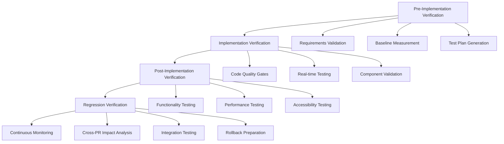

# Truth Verification System for 6-PR UI Fix Implementation Plan

## Overview

This truth verification system ensures each PR in the 6-PR UI fix plan meets specifications, prevents regressions, and maintains code quality. The system uses a multi-layered approach with automated testing, manual verification, and continuous integration.

## System Architecture



## 1. Pre-Implementation Verification

### 1.1 Requirements Validation Framework

**Automated Checks:**
```bash
# Requirement compliance checker
npx truth-verify requirements --pr-plan=6pr-ui-fix.json --validate-specs
```

**Manual Verification Checklist:**
- [ ] PR description matches specification requirements
- [ ] Acceptance criteria are clear and measurable
- [ ] Dependencies between PRs are identified
- [ ] Breaking changes are documented
- [ ] Migration plan exists (if needed)

**Truth Gates:**
1. **Specification Alignment**: Requirements must map 1:1 to identified issues
2. **Scope Boundary**: Each PR must have clear, non-overlapping scope
3. **Dependency Chain**: Dependencies must form a valid DAG (no circular dependencies)

### 1.2 Baseline Measurement Protocol

**Automated Baseline Capture:**
```typescript
// scripts/capture-baseline.ts
interface BaselineMetrics {
  performance: {
    lighthouse: LighthouseScore;
    vitals: CoreWebVitals;
    bundleSize: BundleSizeMetrics;
  };
  functionality: {
    e2eTests: TestResults;
    componentTests: ComponentTestResults;
    accessibility: A11yResults;
  };
  codeQuality: {
    coverage: CoverageMetrics;
    eslintViolations: LintResults;
    typeErrors: TypeCheckResults;
  };
}
```

**Baseline Commands:**
```bash
# Capture complete baseline before any PR work
npm run verify:baseline-capture
npm run test:all -- --reporter=baseline
npm run lighthouse:audit -- --output=baseline
npm run bundle:analyze -- --output=baseline
```

### 1.3 Test Plan Generation

**Automated Test Plan Creation:**
```typescript
// Each PR generates specific test requirements
interface PRTestPlan {
  prId: string;
  scope: string[];
  requiredTests: {
    unit: string[];
    integration: string[];
    e2e: string[];
    visual: string[];
    accessibility: string[];
  };
  regressionRisks: string[];
  performanceTargets: PerformanceTarget[];
}
```

## 2. Implementation Verification

### 2.1 Code Quality Gates

**Pre-Commit Hooks:**
```json
// .husky/pre-commit
#!/bin/sh
. "$(dirname "$0")/_/husky.sh"

# Code quality gates that must pass
npm run lint:fix
npm run type-check
npm run test:affected
npm run verify:component-props
npm run verify:accessibility-standards
```

**Continuous Quality Checks:**
```typescript
// Quality gate definitions
const qualityGates = {
  typescript: {
    noErrors: true,
    strictMode: true,
  },
  eslint: {
    maxWarnings: 0,
    requiredRules: ['accessibility', 'react-hooks', 'security'],
  },
  testing: {
    minCoverage: 85,
    requiredTestTypes: ['unit', 'integration'],
    noSkippedTests: true,
  },
  performance: {
    maxBundleIncrease: '5%',
    noMemoryLeaks: true,
  },
};
```

### 2.2 Real-time Testing Framework

**Component Validation Pipeline:**
```bash
# Runs on every file save during development
npm run verify:hot-reload -- --watch
npm run test:component -- --watch --coverage
npm run storybook:test -- --watch
```

**Integration Test Execution:**
```typescript
// Real-time integration testing
interface IntegrationTestSuite {
  triggers: string[]; // File patterns that trigger tests
  tests: {
    api: string[];
    routing: string[];
    stateManagement: string[];
    crossComponent: string[];
  };
  performance: {
    renderTime: number;
    memoryUsage: number;
    bundleImpact: number;
  };
}
```

### 2.3 Component Validation System

**Shadcn Component Compliance:**
```bash
# Verify shadcn components are properly implemented
npx verify:shadcn-compliance --components=all
npx verify:component-api -- --validate-props
npx verify:accessibility -- --wcag-level=AA
```

**Component Health Checks:**
```typescript
interface ComponentHealthCheck {
  componentName: string;
  checks: {
    propsValidation: boolean;
    accessibilityCompliance: boolean;
    performanceMetrics: PerformanceResult;
    visualRegressionTest: VisualTestResult;
    interactionTests: InteractionTestResult;
  };
}
```

## 3. Post-Implementation Verification

### 3.1 Functionality Testing Protocol

**Automated Functionality Tests:**
```bash
# Full functionality test suite
npm run test:e2e:full
npm run test:integration:complete
npm run test:functionality -- --coverage
```

**Manual Testing Checklist:**
```typescript
interface ManualTestChecklist {
  ui: {
    responsiveDesign: boolean;
    crossBrowserCompatibility: boolean;
    touchInteractions: boolean;
    keyboardNavigation: boolean;
  };
  functionality: {
    userFlows: string[];
    errorHandling: string[];
    edgeCases: string[];
    dataValidation: string[];
  };
  integration: {
    apiIntegration: boolean;
    stateManagement: boolean;
    routing: boolean;
    authentication: boolean;
  };
}
```

### 3.2 Performance Testing Framework

**Performance Benchmarks:**
```bash
# Performance verification suite
npm run lighthouse:audit -- --strategy=mobile,desktop
npm run bundle:analyze -- --compare=baseline
npm run perf:core-vitals
npm run perf:runtime -- --profile=production
```

**Performance Truth Gates:**
```typescript
interface PerformanceTruthGates {
  lighthouse: {
    performance: number; // >= 90
    accessibility: number; // >= 95
    bestPractices: number; // >= 90
    seo: number; // >= 90
  };
  coreWebVitals: {
    LCP: number; // <= 2.5s
    FID: number; // <= 100ms
    CLS: number; // <= 0.1
  };
  bundleSize: {
    maxIncrease: string; // <= 5%
    gzipSize: number; // <= 250KB
  };
}
```

### 3.3 Accessibility Testing Protocol

**Automated Accessibility Tests:**
```bash
# Comprehensive accessibility testing
npm run test:a11y -- --wcag-level=AA
npx axe-core src/components --tags=wcag2a,wcag2aa
npm run test:screen-reader
npm run test:keyboard-navigation
```

**Manual Accessibility Verification:**
```typescript
interface AccessibilityChecklist {
  screenReader: {
    nvda: boolean;
    jaws: boolean;
    voiceOver: boolean;
  };
  keyboardNavigation: {
    tabOrder: boolean;
    escapeKey: boolean;
    enterKey: boolean;
    arrowKeys: boolean;
  };
  visualIndicators: {
    focusVisible: boolean;
    colorContrast: boolean;
    textScaling: boolean;
  };
  semanticMarkup: {
    headingStructure: boolean;
    landmarks: boolean;
    ariaLabels: boolean;
  };
}
```

## 4. Regression Verification Framework

### 4.1 Cross-PR Impact Analysis

**Impact Analysis Engine:**
```typescript
interface CrossPRImpactAnalysis {
  prId: string;
  impactedFiles: string[];
  impactedComponents: string[];
  riskAssessment: {
    breaking: string[];
    medium: string[];
    low: string[];
  };
  requiredTests: string[];
  rollbackPlan: RollbackPlan;
}
```

**Automated Impact Detection:**
```bash
# Analyze impact across PR chain
npm run analyze:cross-pr-impact
npm run test:dependency-graph
npm run verify:api-compatibility
```

### 4.2 Integration Testing Matrix

**Test Matrix Generation:**
```typescript
interface IntegrationTestMatrix {
  prCombinations: {
    prs: string[];
    testSuite: string[];
    expectedResults: TestExpectation[];
  }[];
  scenarios: {
    sequential: TestScenario[];
    parallel: TestScenario[];
    rollback: TestScenario[];
  };
}
```

**Integration Test Execution:**
```bash
# Test all PR combinations
npm run test:integration:matrix
npm run test:e2e:cross-pr
npm run verify:state-consistency
```

### 4.3 Rollback Preparation System

**Automatic Rollback Triggers:**
```typescript
interface RollbackTriggers {
  performanceDegradation: {
    threshold: number;
    metric: string;
  };
  functionalityBreakage: {
    criticalPaths: string[];
    errorThreshold: number;
  };
  accessibilityRegression: {
    wcagViolations: number;
    severity: string[];
  };
}
```

**Rollback Verification:**
```bash
# Verify rollback procedures
npm run verify:rollback-plan
npm run test:rollback:dry-run
npm run verify:data-migration:reverse
```

## 5. Automated Testing Checkpoints

### 5.1 Checkpoint Framework

**Checkpoint Definitions:**
```typescript
interface VerificationCheckpoint {
  id: string;
  stage: 'pre' | 'during' | 'post' | 'regression';
  frequency: 'on-commit' | 'on-push' | 'on-pr' | 'on-merge';
  tests: {
    command: string;
    timeout: number;
    retries: number;
    successCriteria: string;
  }[];
  gates: {
    blocking: boolean;
    requiresManualApproval: boolean;
    notificationChannels: string[];
  };
}
```

**Checkpoint Execution Pipeline:**
```bash
# Checkpoint automation
npm run checkpoint:pre-implementation
npm run checkpoint:implementation
npm run checkpoint:post-implementation
npm run checkpoint:regression
```

### 5.2 Test Automation Scripts

**Core Test Commands:**
```bash
#!/bin/bash
# Truth verification master script

# Pre-implementation verification
verify_pre_implementation() {
    echo "🔍 Running pre-implementation verification..."
    npm run verify:requirements
    npm run capture:baseline
    npm run generate:test-plan
    npm run verify:dependencies
}

# Implementation verification
verify_implementation() {
    echo "⚙️ Running implementation verification..."
    npm run lint:strict
    npm run type-check:strict
    npm run test:unit -- --coverage
    npm run test:integration
    npm run verify:components
}

# Post-implementation verification
verify_post_implementation() {
    echo "✅ Running post-implementation verification..."
    npm run test:e2e:full
    npm run test:a11y:complete
    npm run perf:benchmark
    npm run verify:functionality
}

# Regression verification
verify_regression() {
    echo "🔄 Running regression verification..."
    npm run test:cross-pr-impact
    npm run compare:baseline
    npm run verify:rollback-plan
    npm run test:integration:matrix
}
```

## 6. Manual Verification Procedures

### 6.1 Code Review Checklist

**Architecture Review:**
- [ ] Component structure follows established patterns
- [ ] State management is properly implemented
- [ ] Error boundaries are in place
- [ ] Performance considerations addressed

**Security Review:**
- [ ] No hardcoded secrets or sensitive data
- [ ] Input validation implemented
- [ ] XSS prevention measures in place
- [ ] CSRF protection maintained

**Accessibility Review:**
- [ ] Semantic HTML structure
- [ ] ARIA attributes properly used
- [ ] Keyboard navigation supported
- [ ] Screen reader compatibility

### 6.2 User Experience Testing

**Manual UX Testing Protocol:**
```typescript
interface UXTestingProtocol {
  devices: {
    desktop: string[];
    tablet: string[];
    mobile: string[];
  };
  browsers: {
    chrome: string[];
    firefox: string[];
    safari: string[];
    edge: string[];
  };
  userScenarios: {
    newUser: UserScenario[];
    returningUser: UserScenario[];
    powerUser: UserScenario[];
    accessibilityUser: UserScenario[];
  };
}
```

### 6.3 Stakeholder Sign-off

**Sign-off Requirements:**
- [ ] Product Owner approval on functionality
- [ ] Design team approval on visual implementation
- [ ] Engineering team approval on code quality
- [ ] QA team approval on testing coverage
- [ ] Security team approval on security measures

## 7. CodeRabbit Integration Strategy

### 7.1 CodeRabbit Configuration

**Review Configuration:**
```yaml
# .coderabbit.yml
reviews:
  auto_review: true
  draft_review: true
  review_threshold: 'all'
  
checks:
  - name: 'Truth Verification Gates'
    path: 'scripts/truth-verify.js'
    required: true
  
  - name: 'Component Compliance'
    path: 'scripts/verify-components.js'
    required: true
    
  - name: 'Performance Impact'
    path: 'scripts/perf-check.js'
    required: false
    
rules:
  - pattern: '**/*.tsx'
    reviewers: ['ui-team', 'accessibility-team']
  - pattern: '**/hooks/*.ts'
    reviewers: ['architecture-team']
  - pattern: '**/store/*.ts'
    reviewers: ['state-management-team']
```

### 7.2 Automated Review Triggers

**Review Integration:**
```typescript
interface CodeRabbitIntegration {
  triggers: {
    onPR: boolean;
    onCommit: boolean;
    onFileChange: string[];
  };
  checks: {
    truthVerification: boolean;
    performanceImpact: boolean;
    accessibilityCompliance: boolean;
    securityScan: boolean;
  };
  reporting: {
    summaryFormat: 'detailed' | 'concise';
    includeMetrics: boolean;
    attachArtifacts: boolean;
  };
}
```

### 7.3 Review Quality Gates

**CodeRabbit Quality Gates:**
```bash
# Gates that CodeRabbit enforces
coderabbit check --gate=truth-verification
coderabbit check --gate=performance-impact
coderabbit check --gate=accessibility-compliance
coderabbit check --gate=regression-risk
```

## 8. Verification Reporting System

### 8.1 Report Generation Framework

**Report Structure:**
```typescript
interface VerificationReport {
  prId: string;
  timestamp: string;
  stage: VerificationStage;
  results: {
    automated: AutomatedTestResults;
    manual: ManualTestResults;
    performance: PerformanceResults;
    accessibility: AccessibilityResults;
    security: SecurityResults;
  };
  gates: {
    passed: string[];
    failed: string[];
    warnings: string[];
  };
  recommendations: Recommendation[];
  artifacts: {
    screenshots: string[];
    reports: string[];
    metrics: string[];
  };
}
```

### 8.2 Reporting Commands

**Report Generation:**
```bash
# Generate comprehensive reports
npm run report:truth-verification
npm run report:performance-comparison
npm run report:accessibility-audit
npm run report:regression-analysis
```

### 8.3 Dashboard Integration

**Real-time Dashboard:**
```typescript
interface TruthDashboard {
  prs: {
    id: string;
    stage: string;
    gateStatus: GateStatus;
    riskLevel: 'low' | 'medium' | 'high';
    eta: string;
  }[];
  metrics: {
    passRate: number;
    avgProcessingTime: number;
    regressionRate: number;
    performanceImpact: number;
  };
  alerts: {
    critical: Alert[];
    warnings: Alert[];
  };
}
```

## 9. Implementation Guide

### 9.1 Setup Commands

```bash
# Install truth verification system
npm install --save-dev @truth-verify/core
npm install --save-dev @truth-verify/ui
npm install --save-dev @truth-verify/performance

# Initialize truth verification
npx truth-verify init --project=vana-ui-fix
npx truth-verify configure --6pr-plan
```

### 9.2 Usage Workflow

**Per PR Workflow:**
```bash
# 1. Pre-implementation
npm run verify:pre-impl -- --pr=PR-ID

# 2. During implementation
npm run verify:watch -- --pr=PR-ID

# 3. Pre-commit
npm run verify:commit -- --pr=PR-ID

# 4. Post-implementation
npm run verify:post-impl -- --pr=PR-ID

# 5. Regression check
npm run verify:regression -- --all-prs
```

## 10. Success Metrics

### 10.1 Key Performance Indicators

**Quality Metrics:**
- Zero regression incidents
- 100% accessibility compliance
- Performance degradation < 5%
- Code coverage > 85%

**Process Metrics:**
- Truth gate pass rate > 95%
- Average review cycle time
- Manual verification time reduction
- False positive rate < 2%

**Business Metrics:**
- User satisfaction scores
- Bug escape rate reduction
- Time to deployment
- Rollback frequency

This truth verification system ensures each PR meets specifications, maintains quality standards, and prevents regressions through comprehensive automated and manual verification processes.