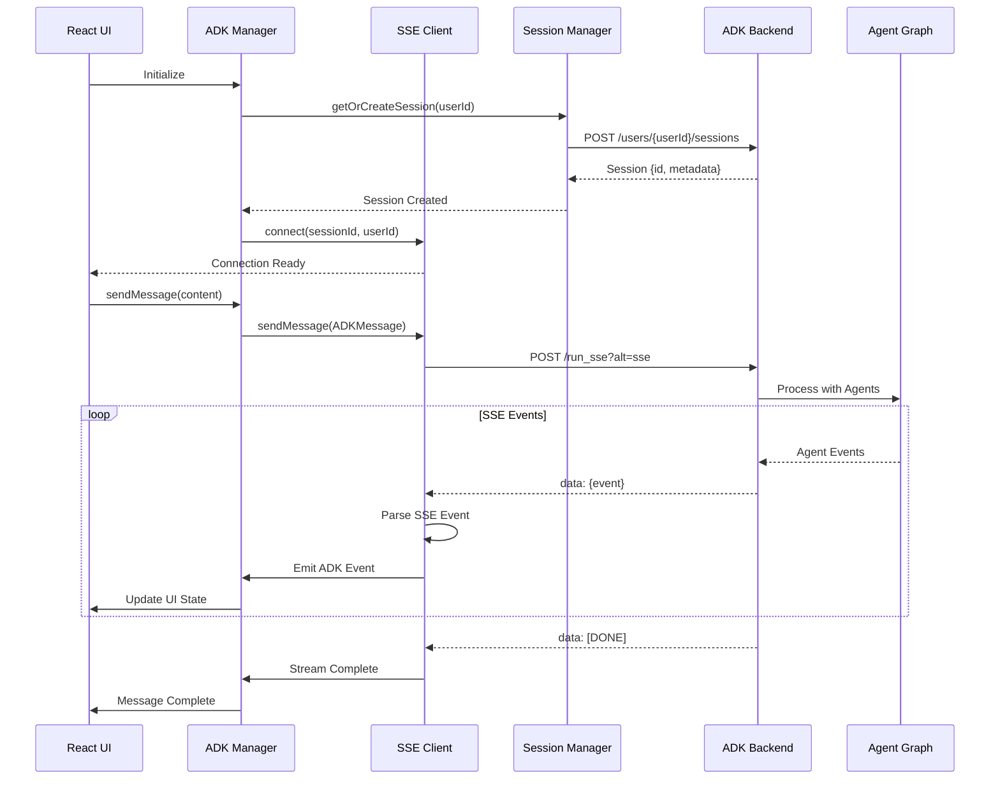
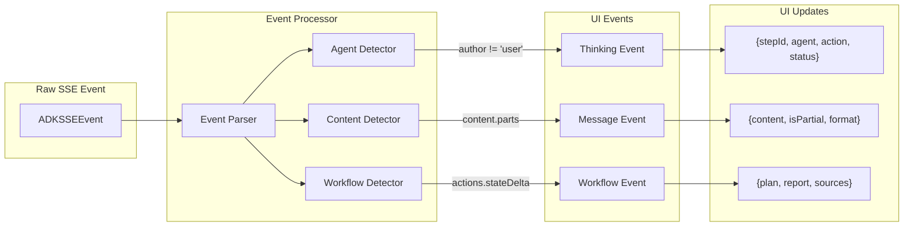
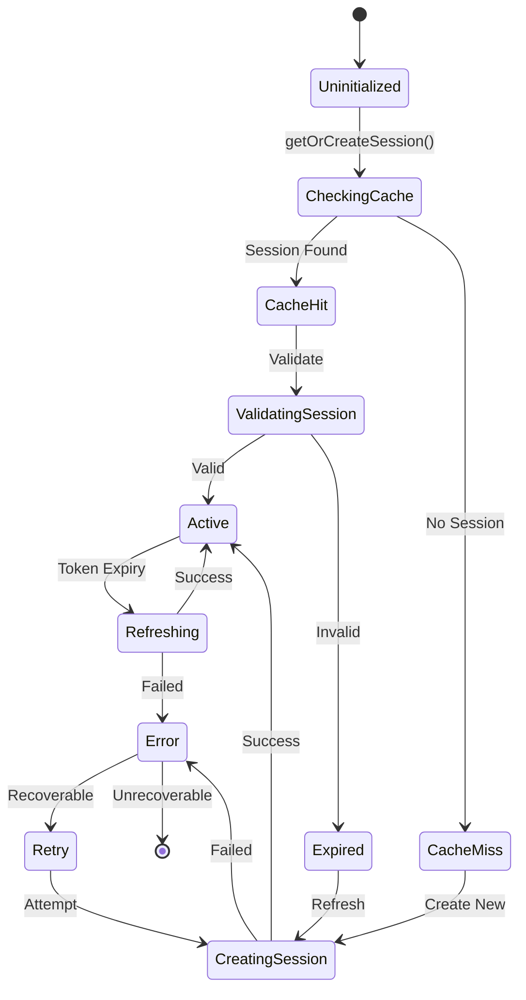
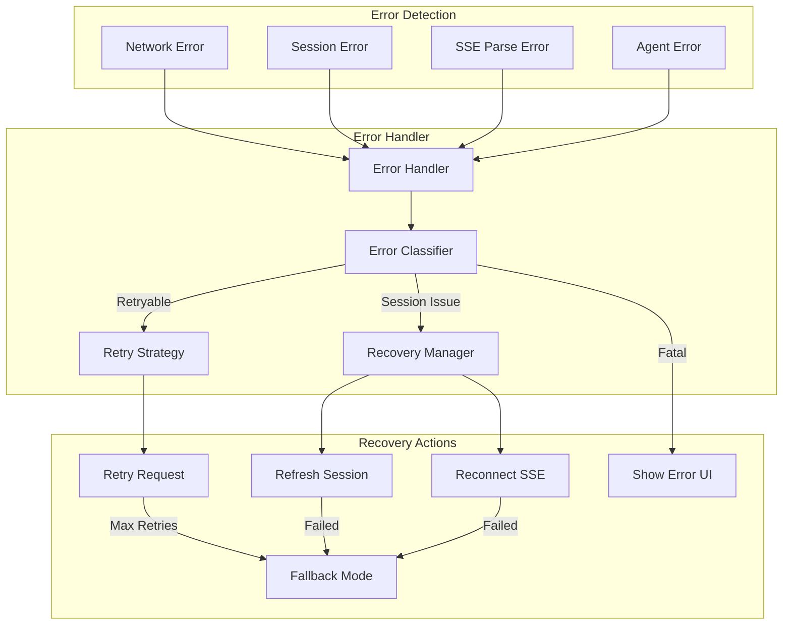
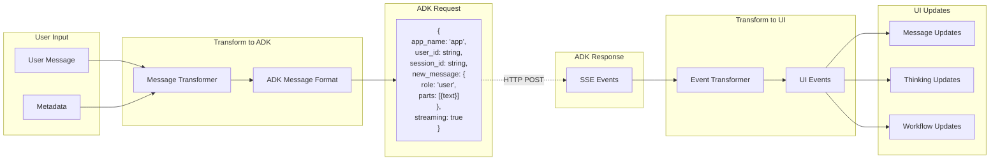
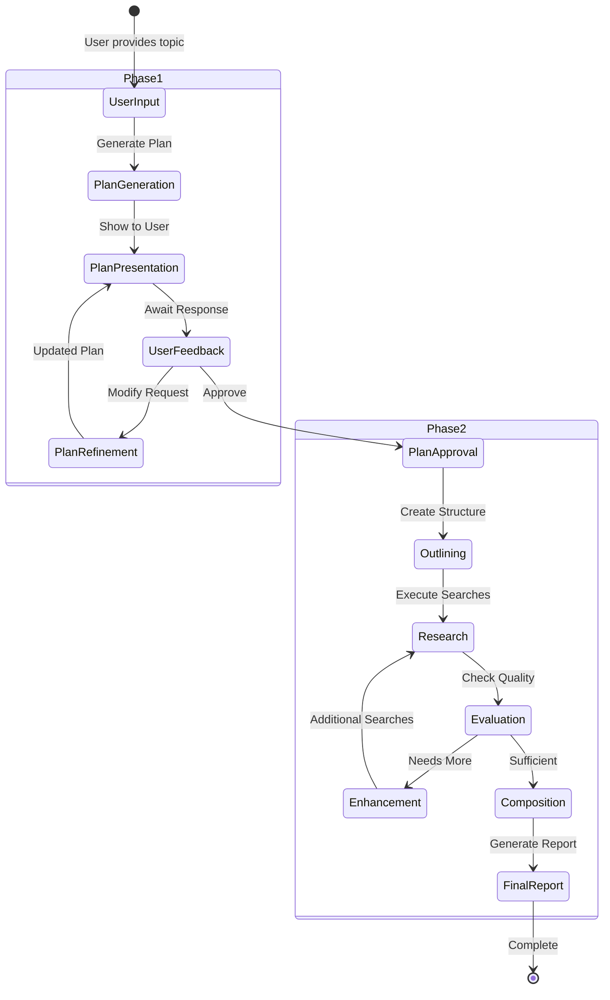
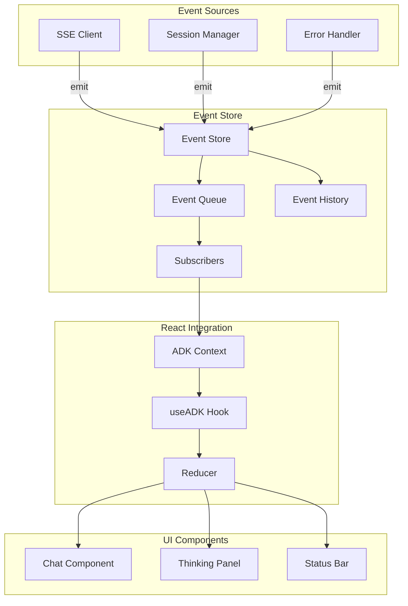
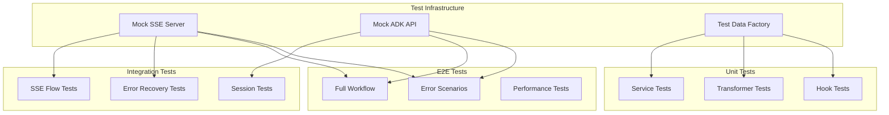
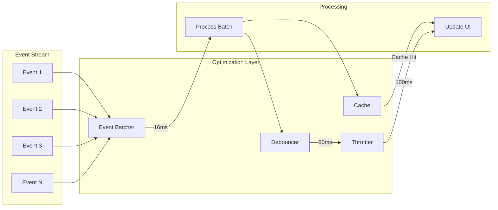

# ADK Integration Architecture Diagrams

## 1. System Architecture Overview

```mermaid
graph TB
    subgraph "Browser"
        subgraph "React Application"
            subgraph "UI Layer"
                CP[Chat Page]
                TP[Thinking Panel]
                MI[Message Input]
                CS[Connection Status]
            end
            
            subgraph "Service Layer"
                AM[ADK Manager]
                SM[Session Manager]
                SC[SSE Client]
                ET[Event Transformer]
                ES[Event Store]
                EH[Error Handler]
            end
            
            subgraph "State Management"
                RC[React Context]
                RH[React Hooks]
                LS[Local Storage]
            end
        end
    end
    
    subgraph "ADK Backend"
        subgraph "FastAPI Server"
            EP1[POST /users/{id}/sessions]
            EP2[POST /run_sse]
            EP3[POST /feedback]
        end
        
        subgraph "Agent System"
            IPA[Interactive Planner Agent]
            PG[Plan Generator]
            SR[Section Researcher]
            RC2[Report Composer]
        end
    end
    
    %% UI Connections
    CP --> AM
    TP --> ES
    MI --> AM
    CS --> SC
    
    %% Service Layer Connections
    AM --> SM
    AM --> SC
    AM --> ET
    SC --> ES
    ET --> ES
    
    %% State Connections
    AM --> RC
    ES --> RC
    SM --> LS
    
    %% Backend Connections
    SM -.->|Create Session| EP1
    SC -.->|SSE Stream| EP2
    AM -.->|Feedback| EP3
    
    %% Agent Flow
    EP2 --> IPA
    IPA --> PG
    IPA --> SR
    SR --> RC2
```

## 2. SSE Event Flow Architecture



## 3. Agent Activity Event Processing



## 4. Session Management Lifecycle



## 5. Error Handling and Recovery Flow



## 6. Message Transformation Pipeline



## 7. Two-Phase Workflow Integration



## 8. Event Store and State Management



## 9. Testing Architecture



## 10. Performance Optimization Flow



These diagrams provide a comprehensive visual representation of the ADK integration architecture, showing:

1. Overall system architecture and component relationships
2. Detailed SSE event flow from user input to UI updates
3. Agent activity processing pipeline
4. Session management state machine
5. Error handling and recovery strategies
6. Message transformation between frontend and ADK formats
7. Two-phase workflow implementation
8. Event store and React state management
9. Testing architecture layers
10. Performance optimization strategies

Each diagram focuses on a specific aspect of the integration, making it easier to understand and implement the various components of the system.