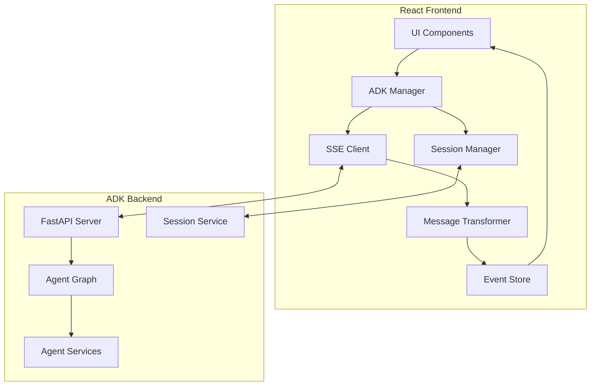

# ADK Integration Architecture for Vana Frontend

## Executive Summary

This document outlines the comprehensive architecture for integrating the new React frontend with the ADK (Agent Development Kit) backend. The design focuses on proper SSE handling, session management, agent communication patterns, and maintaining the two-phase ADK workflow while following React best practices.

## Architecture Overview

### High-Level Data Flow



## Core Components

### 1. ADK Client/Service Layer Structure

#### ADKManager (Main Service Class)
```typescript
// services/adk-manager.ts
export class ADKManager {
  private sseClient: SSEClient;
  private sessionManager: SessionManager;
  private messageTransformer: MessageTransformer;
  private eventStore: EventStore;
  private config: ADKConfig;

  constructor(config: ADKConfig) {
    this.config = config;
    this.sessionManager = new SessionManager(config.apiUrl);
    this.sseClient = new SSEClient(config);
    this.messageTransformer = new MessageTransformer();
    this.eventStore = new EventStore();
    
    this.setupEventHandlers();
  }

  async initialize(userId: string): Promise<void> {
    // Create or retrieve session
    const session = await this.sessionManager.getOrCreateSession(userId);
    
    // Initialize SSE connection
    await this.sseClient.connect(session.sessionId, userId);
  }

  async sendMessage(content: string, metadata?: MessageMetadata): Promise<void> {
    const message = this.messageTransformer.createUserMessage(content, metadata);
    await this.sseClient.sendMessage(message);
  }

  private setupEventHandlers(): void {
    this.sseClient.on('adk:event', this.handleADKEvent.bind(this));
    this.sseClient.on('connection:change', this.handleConnectionChange.bind(this));
  }
}
```

#### Service Layer Architecture
```typescript
// services/index.ts
export interface IADKServices {
  manager: ADKManager;
  session: ISessionService;
  sse: ISSEService;
  transformer: IMessageTransformer;
  eventStore: IEventStore;
}

export class ADKServiceFactory {
  static create(config: ADKConfig): IADKServices {
    const eventStore = new EventStore();
    const transformer = new MessageTransformer();
    const session = new SessionService(config);
    const sse = new SSEService(config, eventStore);
    const manager = new ADKManager({
      session,
      sse,
      transformer,
      eventStore,
      config
    });
    
    return { manager, session, sse, transformer, eventStore };
  }
}
```

### 2. Event Handling Architecture

#### Event Types and Flow
```typescript
// types/adk-events.ts
export enum ADKEventType {
  // Agent Events
  AGENT_THINKING = 'agent:thinking',
  AGENT_ACTION = 'agent:action',
  AGENT_COMPLETE = 'agent:complete',
  
  // Message Events
  MESSAGE_START = 'message:start',
  MESSAGE_CHUNK = 'message:chunk',
  MESSAGE_COMPLETE = 'message:complete',
  
  // Workflow Events
  PLAN_GENERATED = 'workflow:plan_generated',
  PLAN_APPROVED = 'workflow:plan_approved',
  RESEARCH_START = 'workflow:research_start',
  RESEARCH_COMPLETE = 'workflow:research_complete',
  
  // System Events
  SESSION_CREATED = 'system:session_created',
  ERROR = 'system:error',
  CONNECTION_CHANGE = 'system:connection_change'
}

export interface ADKEvent {
  id: string;
  type: ADKEventType;
  timestamp: number;
  sessionId: string;
  data: ADKEventData;
  metadata?: EventMetadata;
}
```

#### Event Processing Pipeline
```typescript
// services/event-processor.ts
export class EventProcessor {
  private handlers: Map<ADKEventType, EventHandler[]> = new Map();
  private middleware: EventMiddleware[] = [];

  async process(rawEvent: ADKSSEEvent): Promise<void> {
    // 1. Transform raw SSE event to ADK event
    const event = this.transformEvent(rawEvent);
    
    // 2. Run through middleware pipeline
    for (const mw of this.middleware) {
      const shouldContinue = await mw(event);
      if (!shouldContinue) return;
    }
    
    // 3. Dispatch to registered handlers
    const handlers = this.handlers.get(event.type) || [];
    await Promise.all(handlers.map(h => h(event)));
  }

  private transformEvent(raw: ADKSSEEvent): ADKEvent {
    // Agent activity detection
    if (raw.author && raw.author !== 'user') {
      return this.createAgentEvent(raw);
    }
    
    // Message content detection
    if (raw.content?.parts) {
      return this.createMessageEvent(raw);
    }
    
    // Workflow state changes
    if (raw.actions?.stateDelta) {
      return this.createWorkflowEvent(raw);
    }
    
    throw new Error('Unknown event type');
  }
}
```

### 3. Session Management

#### Session Lifecycle
```typescript
// services/session-manager.ts
export interface Session {
  id: string;
  userId: string;
  status: SessionStatus;
  metadata: SessionMetadata;
  createdAt: Date;
  lastActivity: Date;
}

export class SessionManager {
  private currentSession: Session | null = null;
  private sessionCache: Map<string, Session> = new Map();
  private persistenceAdapter: ISessionPersistence;

  async getOrCreateSession(userId: string): Promise<Session> {
    // Check cache first
    const cached = this.sessionCache.get(userId);
    if (cached && this.isSessionValid(cached)) {
      return cached;
    }

    // Try to restore from persistence
    const restored = await this.persistenceAdapter.restore(userId);
    if (restored && this.isSessionValid(restored)) {
      this.sessionCache.set(userId, restored);
      return restored;
    }

    // Create new session via ADK
    const session = await this.createSession(userId);
    this.sessionCache.set(userId, session);
    await this.persistenceAdapter.save(session);
    
    return session;
  }

  private async createSession(userId: string): Promise<Session> {
    const response = await fetch(`${this.apiUrl}/apps/app/users/${userId}/sessions`, {
      method: 'POST',
      headers: { 'Content-Type': 'application/json' },
      body: JSON.stringify({
        metadata: {
          clientVersion: CLIENT_VERSION,
          platform: 'web'
        }
      })
    });

    if (!response.ok) {
      throw new SessionCreationError(response);
    }

    const data = await response.json();
    return this.mapResponseToSession(data, userId);
  }

  async refreshSession(session: Session): Promise<Session> {
    // Implement session refresh logic
    // Handle token renewal if needed
  }
}
```

#### Session Persistence Strategy
```typescript
// services/session-persistence.ts
export class SessionPersistence implements ISessionPersistence {
  private storage: Storage;

  constructor(storage: Storage = localStorage) {
    this.storage = storage;
  }

  async save(session: Session): Promise<void> {
    const key = `vana:session:${session.userId}`;
    const data = {
      ...session,
      _saved: Date.now()
    };
    this.storage.setItem(key, JSON.stringify(data));
  }

  async restore(userId: string): Promise<Session | null> {
    const key = `vana:session:${userId}`;
    const data = this.storage.getItem(key);
    
    if (!data) return null;
    
    try {
      const session = JSON.parse(data);
      // Validate session hasn't expired
      if (this.isExpired(session)) {
        this.storage.removeItem(key);
        return null;
      }
      return session;
    } catch {
      return null;
    }
  }
}
```

### 4. SSE Connection Lifecycle Management

#### Connection State Machine
```typescript
// services/sse-connection-manager.ts
export enum ConnectionState {
  DISCONNECTED = 'disconnected',
  CONNECTING = 'connecting',
  CONNECTED = 'connected',
  RECONNECTING = 'reconnecting',
  ERROR = 'error'
}

export class SSEConnectionManager {
  private state: ConnectionState = ConnectionState.DISCONNECTED;
  private eventSource: EventSource | null = null;
  private reconnectTimer: NodeJS.Timeout | null = null;
  private reconnectAttempts = 0;
  
  async connect(config: SSEConfig): Promise<void> {
    this.setState(ConnectionState.CONNECTING);
    
    try {
      // For ADK, we don't maintain persistent EventSource
      // Each message creates its own connection
      this.setState(ConnectionState.CONNECTED);
    } catch (error) {
      this.handleConnectionError(error);
    }
  }

  async sendMessage(message: ADKMessage): Promise<void> {
    if (this.state !== ConnectionState.CONNECTED) {
      throw new Error('Not connected');
    }

    // Create one-time SSE connection for this message
    const response = await fetch(`${this.config.url}/run_sse?alt=sse`, {
      method: 'POST',
      headers: {
        'Content-Type': 'application/json',
        'Accept': 'text/event-stream',
      },
      body: JSON.stringify(message)
    });

    await this.processSSEStream(response);
  }

  private async processSSEStream(response: Response): Promise<void> {
    const reader = response.body?.getReader();
    const decoder = new TextDecoder();
    
    while (true) {
      const { done, value } = await reader.read();
      if (done) break;
      
      const chunk = decoder.decode(value);
      this.processChunk(chunk);
    }
  }

  private handleReconnection(): void {
    this.setState(ConnectionState.RECONNECTING);
    
    const backoff = Math.min(1000 * Math.pow(2, this.reconnectAttempts), 30000);
    this.reconnectTimer = setTimeout(() => {
      this.reconnectAttempts++;
      this.connect(this.lastConfig);
    }, backoff);
  }
}
```

### 5. Message Format Transformations

#### ADK ↔ Frontend Message Mapping
```typescript
// services/message-transformer.ts
export class MessageTransformer {
  // Frontend → ADK transformation
  createADKMessage(
    content: string,
    session: Session,
    metadata?: MessageMetadata
  ): ADKRequestMessage {
    return {
      app_name: 'app',
      user_id: session.userId,
      session_id: session.id,
      new_message: {
        role: 'user',
        parts: [{ text: content }]
      },
      streaming: true,
      metadata: {
        ...metadata,
        client_timestamp: Date.now(),
        client_version: CLIENT_VERSION
      }
    };
  }

  // ADK → Frontend transformation
  transformADKEvent(event: ADKSSEEvent): UIEvent[] {
    const uiEvents: UIEvent[] = [];

    // Handle agent thinking updates
    if (event.author && event.author !== 'user') {
      uiEvents.push(this.createThinkingUpdate(event));
    }

    // Handle content updates
    if (event.content?.parts) {
      uiEvents.push(...this.createContentUpdates(event));
    }

    // Handle workflow state changes
    if (event.actions?.stateDelta) {
      uiEvents.push(...this.createWorkflowUpdates(event));
    }

    return uiEvents;
  }

  private createThinkingUpdate(event: ADKSSEEvent): ThinkingUpdateEvent {
    return {
      type: 'thinking_update',
      data: {
        stepId: `step_${event.author}_${Date.now()}`,
        agent: this.getAgentDisplayName(event.author),
        action: this.extractAction(event),
        status: 'active',
        timestamp: Date.now()
      }
    };
  }

  private createContentUpdates(event: ADKSSEEvent): MessageUpdateEvent[] {
    const updates: MessageUpdateEvent[] = [];
    
    for (const part of event.content.parts) {
      if (part.text) {
        updates.push({
          type: 'message_update',
          data: {
            content: part.text,
            isPartial: event.partial === true,
            format: 'markdown'
          }
        });
      }
      
      if (part.functionCall) {
        updates.push({
          type: 'function_call',
          data: {
            name: part.functionCall.name,
            args: part.functionCall.args
          }
        });
      }
    }
    
    return updates;
  }
}
```

### 6. Error Handling and Retry Strategies

#### Comprehensive Error Handling
```typescript
// services/error-handler.ts
export class ADKErrorHandler {
  private retryConfig: RetryConfig;
  private errorCallbacks: ErrorCallback[] = [];

  async withRetry<T>(
    operation: () => Promise<T>,
    context: ErrorContext
  ): Promise<T> {
    let lastError: Error;
    
    for (let attempt = 0; attempt < this.retryConfig.maxAttempts; attempt++) {
      try {
        return await operation();
      } catch (error) {
        lastError = error as Error;
        
        if (!this.isRetryable(error)) {
          throw this.enhanceError(error, context);
        }
        
        if (attempt < this.retryConfig.maxAttempts - 1) {
          await this.delay(this.calculateBackoff(attempt));
          this.notifyRetry(error, attempt, context);
        }
      }
    }
    
    throw this.enhanceError(lastError!, context);
  }

  private isRetryable(error: any): boolean {
    // Network errors
    if (error.name === 'NetworkError') return true;
    
    // Specific HTTP status codes
    if (error.status && RETRYABLE_STATUS_CODES.includes(error.status)) {
      return true;
    }
    
    // ADK specific errors
    if (error.code && RETRYABLE_ADK_ERRORS.includes(error.code)) {
      return true;
    }
    
    return false;
  }

  private calculateBackoff(attempt: number): number {
    const base = this.retryConfig.baseDelay;
    const multiplier = this.retryConfig.multiplier;
    const maxDelay = this.retryConfig.maxDelay;
    
    const delay = base * Math.pow(multiplier, attempt);
    const jitter = delay * 0.1 * Math.random();
    
    return Math.min(delay + jitter, maxDelay);
  }
}
```

#### Error Recovery Patterns
```typescript
// services/recovery-manager.ts
export class RecoveryManager {
  async recoverSession(error: SessionError): Promise<Session> {
    // Try to recover from local storage
    const cached = await this.sessionCache.getLastValid();
    if (cached) {
      return await this.refreshSession(cached);
    }
    
    // Create new session
    return await this.createFreshSession();
  }

  async recoverConnection(error: ConnectionError): Promise<void> {
    // Clear existing connection
    await this.clearConnection();
    
    // Re-establish with fresh credentials
    const session = await this.sessionManager.getCurrentSession();
    await this.establishConnection(session);
  }

  async recoverFromPartialMessage(error: MessageError): Promise<void> {
    // Store partial content
    await this.messageCache.savePartial(error.partialContent);
    
    // Attempt to resume from last known position
    const resumeToken = error.metadata?.resumeToken;
    if (resumeToken) {
      await this.resumeMessage(resumeToken);
    }
  }
}
```

### 7. Testing Strategies

#### Unit Testing Approach
```typescript
// tests/services/adk-manager.test.ts
describe('ADKManager', () => {
  let adkManager: ADKManager;
  let mockSSEClient: jest.Mocked<SSEClient>;
  let mockSessionManager: jest.Mocked<SessionManager>;

  beforeEach(() => {
    mockSSEClient = createMockSSEClient();
    mockSessionManager = createMockSessionManager();
    
    adkManager = new ADKManager({
      sseClient: mockSSEClient,
      sessionManager: mockSessionManager
    });
  });

  describe('message sending', () => {
    it('should transform and send user messages', async () => {
      const message = 'Research quantum computing';
      await adkManager.sendMessage(message);

      expect(mockSSEClient.sendMessage).toHaveBeenCalledWith(
        expect.objectContaining({
          new_message: {
            role: 'user',
            parts: [{ text: message }]
          }
        })
      );
    });

    it('should handle SSE events correctly', async () => {
      const mockEvent: ADKSSEEvent = {
        author: 'section_researcher',
        content: { parts: [{ text: 'Searching...' }] }
      };

      mockSSEClient.emit('adk:event', mockEvent);

      expect(adkManager.getActiveAgents()).toContain('section_researcher');
    });
  });
});
```

#### Integration Testing
```typescript
// tests/integration/adk-flow.test.ts
describe('ADK Integration Flow', () => {
  let testServer: TestADKServer;
  let adkServices: IADKServices;

  beforeAll(async () => {
    testServer = await TestADKServer.start();
    adkServices = ADKServiceFactory.create({
      apiUrl: testServer.url
    });
  });

  it('should complete full research workflow', async () => {
    const { manager } = adkServices;
    
    // Initialize session
    await manager.initialize('test_user');
    
    // Send research request
    const responsePromise = manager.sendMessage(
      'Research the latest developments in AI'
    );
    
    // Verify workflow events
    const events = await collectEvents(responsePromise, [
      ADKEventType.PLAN_GENERATED,
      ADKEventType.PLAN_APPROVED,
      ADKEventType.RESEARCH_START,
      ADKEventType.RESEARCH_COMPLETE
    ]);
    
    expect(events).toHaveLength(4);
    expect(events[0].type).toBe(ADKEventType.PLAN_GENERATED);
  });
});
```

#### E2E Testing with Mock SSE
```typescript
// tests/e2e/sse-mock-server.ts
export class MockSSEServer {
  async simulateResearchFlow(scenario: TestScenario): Promise<void> {
    const events = this.generateScenarioEvents(scenario);
    
    for (const event of events) {
      await this.sendSSEEvent(event);
      await this.delay(event.delay || 100);
    }
  }

  private generateScenarioEvents(scenario: TestScenario): SSETestEvent[] {
    switch (scenario) {
      case 'full_research':
        return [
          this.plannerThinking(),
          this.planGenerated(),
          this.researcherThinking(),
          this.searchResults(),
          this.reportComposing(),
          this.finalReport()
        ];
      
      case 'error_recovery':
        return [
          this.plannerThinking(),
          this.connectionError(),
          this.reconnecting(),
          this.planGenerated()
        ];
    }
  }
}
```

## Implementation Patterns

### Context Provider Pattern
```typescript
// contexts/ADKContext.tsx
export const ADKContext = React.createContext<IADKServices | null>(null);

export const ADKProvider: React.FC<{ config: ADKConfig }> = ({ 
  config, 
  children 
}) => {
  const services = useMemo(() => ADKServiceFactory.create(config), [config]);
  
  useEffect(() => {
    // Initialize services
    services.manager.initialize();
    
    return () => {
      // Cleanup
      services.manager.disconnect();
    };
  }, [services]);
  
  return (
    <ADKContext.Provider value={services}>
      {children}
    </ADKContext.Provider>
  );
};
```

### Hook Pattern for ADK Integration
```typescript
// hooks/useADK.ts
export function useADK() {
  const services = useContext(ADKContext);
  if (!services) {
    throw new Error('useADK must be used within ADKProvider');
  }
  
  const [state, dispatch] = useReducer(adkReducer, initialState);
  
  useEffect(() => {
    const unsubscribe = services.eventStore.subscribe((event) => {
      dispatch({ type: 'EVENT', payload: event });
    });
    
    return unsubscribe;
  }, [services]);
  
  const sendMessage = useCallback(async (content: string) => {
    dispatch({ type: 'SEND_MESSAGE_START' });
    try {
      await services.manager.sendMessage(content);
    } catch (error) {
      dispatch({ type: 'SEND_MESSAGE_ERROR', payload: error });
    }
  }, [services]);
  
  return {
    ...state,
    sendMessage,
    services
  };
}
```

## Performance Considerations

### Event Batching
```typescript
export class EventBatcher {
  private queue: ADKEvent[] = [];
  private timer: NodeJS.Timeout | null = null;
  
  add(event: ADKEvent): void {
    this.queue.push(event);
    
    if (!this.timer) {
      this.timer = setTimeout(() => this.flush(), 16); // Next frame
    }
  }
  
  private flush(): void {
    const batch = [...this.queue];
    this.queue = [];
    this.timer = null;
    
    this.processBatch(batch);
  }
}
```

### Message Streaming Optimization
```typescript
export class StreamOptimizer {
  private buffer: string = '';
  private updateTimer: NodeJS.Timeout | null = null;
  
  addChunk(chunk: string): void {
    this.buffer += chunk;
    
    // Debounce updates for smooth rendering
    if (this.updateTimer) {
      clearTimeout(this.updateTimer);
    }
    
    this.updateTimer = setTimeout(() => {
      this.emitUpdate(this.buffer);
    }, 50);
  }
}
```

## Security Considerations

### Input Validation
```typescript
export class ADKSecurity {
  validateMessage(content: string): void {
    // Length check
    if (content.length > MAX_MESSAGE_LENGTH) {
      throw new ValidationError('Message too long');
    }
    
    // Content sanitization
    const sanitized = this.sanitizer.clean(content);
    if (sanitized !== content) {
      throw new ValidationError('Invalid content detected');
    }
  }
  
  validateSession(session: Session): void {
    // Session expiry
    if (this.isExpired(session)) {
      throw new SessionError('Session expired');
    }
    
    // Session tampering detection
    if (!this.verifySignature(session)) {
      throw new SecurityError('Invalid session signature');
    }
  }
}
```

## Migration Path

### Phase 1: Core Services
1. Implement ADKManager and SessionManager
2. Create SSEClient with proper error handling
3. Set up MessageTransformer

### Phase 2: Event System
1. Implement EventStore and EventProcessor
2. Create event type mappings
3. Set up event batching

### Phase 3: Integration
1. Create React contexts and providers
2. Implement hooks for component integration
3. Add error boundaries

### Phase 4: Testing
1. Unit tests for all services
2. Integration tests for workflows
3. E2E tests with mock server

## Conclusion

This architecture provides a robust foundation for ADK integration that:
- Properly handles SSE connections and lifecycle
- Manages sessions with persistence and recovery
- Transforms messages between ADK and UI formats
- Provides comprehensive error handling
- Follows React best practices
- Enables thorough testing at all levels

The modular design allows for incremental implementation while maintaining compatibility with the existing ADK backend structure.