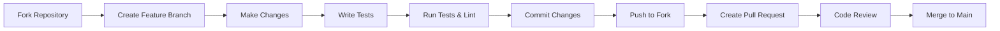

# Contributing to Vana Frontend

Thank you for your interest in contributing to the Vana Frontend! This guide will help you get started with contributing to our React-based AI agent interface.

## Table of Contents

- [Code of Conduct](#code-of-conduct)
- [Getting Started](#getting-started)
- [Development Setup](#development-setup)
- [Contributing Process](#contributing-process)
- [Coding Standards](#coding-standards)
- [Testing Guidelines](#testing-guidelines)
- [Pull Request Process](#pull-request-process)
- [Issue Reporting](#issue-reporting)
- [Community](#community)

---

## Code of Conduct

By participating in this project, you agree to abide by our [Code of Conduct](../CODE_OF_CONDUCT.md). Please read it before contributing.

### Our Standards

- **Be respectful**: Treat all community members with respect and kindness
- **Be inclusive**: Welcome newcomers and help them learn
- **Be constructive**: Provide helpful feedback and suggestions
- **Be patient**: Remember that everyone has different experience levels
- **Be collaborative**: Work together to improve the project

---

## Getting Started

### Prerequisites

Before you begin, ensure you have the following installed:

- **Node.js**: Version 18.0.0 or higher
- **npm**: Version 9.0.0 or higher (comes with Node.js)
- **Git**: For version control
- **VS Code**: Recommended for the best development experience

### Recommended VS Code Extensions

```bash
# Install recommended extensions
code --install-extension bradlc.vscode-tailwindcss
code --install-extension esbenp.prettier-vscode
code --install-extension ms-vscode.vscode-typescript-next
code --install-extension bradlc.vscode-tailwindcss
```

---

## Development Setup

### 1. Fork and Clone

```bash
# Fork the repository on GitHub, then clone your fork
git clone https://github.com/YOUR_USERNAME/vana.git
cd vana/frontend

# Add the original repository as upstream
git remote add upstream https://github.com/vana-project/vana.git
```

### 2. Install Dependencies

```bash
# Install all dependencies
npm install

# Verify installation
npm run type-check
```

### 3. Environment Setup

```bash
# Copy the example environment file
cp .env.example .env.local

# Edit .env.local with your configuration
# At minimum, set VITE_API_URL to your ADK backend URL
```

### 4. Start Development Server

```bash
# Start the development server
npm run dev

# Open another terminal and run tests in watch mode
npm run test
```

The application will be available at http://localhost:5173

---

## Contributing Process

### Workflow Overview



### Step-by-Step Process

1. **Create a Feature Branch**
   ```bash
   # Sync with upstream
   git fetch upstream
   git checkout main
   git merge upstream/main
   
   # Create feature branch
   git checkout -b feature/amazing-feature
   ```

2. **Make Your Changes**
   - Follow our [coding standards](#coding-standards)
   - Write tests for new functionality
   - Update documentation as needed
   - Ensure accessibility compliance

3. **Test Your Changes**
   ```bash
   # Run all tests
   npm run test
   
   # Run tests with coverage
   npm run test:coverage
   
   # Run linting
   npm run lint
   
   # Type checking
   npm run type-check
   ```

4. **Commit Your Changes**
   ```bash
   # Stage your changes
   git add .
   
   # Commit with a descriptive message
   git commit -m "feat: add amazing new feature
   
   - Implement feature X that does Y
   - Add tests for feature X
   - Update documentation"
   ```

5. **Push and Create Pull Request**
   ```bash
   # Push to your fork
   git push origin feature/amazing-feature
   ```
   
   Then create a pull request on GitHub.

---

## Coding Standards

### TypeScript Guidelines

#### Type Safety
- Use strict TypeScript configuration (already configured)
- Avoid `any` types - use proper type definitions
- Prefer interfaces over types for object shapes
- Use generic types where appropriate

```typescript
// ✅ Good
interface UserProps {
  user: User;
  onUserUpdate: (user: User) => void;
}

const UserComponent: React.FC<UserProps> = ({ user, onUserUpdate }) => {
  // Component implementation
};

// ❌ Bad
const UserComponent = ({ user, onUserUpdate }: any) => {
  // Component implementation
};
```

#### Naming Conventions
- **Components**: PascalCase (`ChatInterface`, `MessageList`)
- **Functions/Variables**: camelCase (`sendMessage`, `isLoading`)
- **Constants**: SCREAMING_SNAKE_CASE (`MAX_RETRIES`, `API_ENDPOINTS`)
- **Files**: kebab-case (`chat-interface.tsx`, `message-list.tsx`)

### React Guidelines

#### Component Structure
```typescript
// Standard component structure
interface ComponentProps {
  // Props interface
}

const Component: React.FC<ComponentProps> = ({
  // Destructure props
}) => {
  // Hooks (useState, useEffect, custom hooks)
  
  // Event handlers
  
  // Render logic
  return (
    // JSX
  );
};

// Export
export { Component };
export type { ComponentProps };
```

#### Hooks Usage
```typescript
// ✅ Good - proper dependency arrays
useEffect(() => {
  const handleSSEEvent = (event: SSEEvent) => {
    setMessages(prev => [...prev, event.data]);
  };
  
  const unsubscribe = subscribe('message_update', handleSSEEvent);
  return unsubscribe;
}, [subscribe]); // Proper dependencies

// ✅ Good - memoized callbacks
const handleSubmit = useCallback((message: string) => {
  onMessageSent(message);
}, [onMessageSent]);

// ❌ Bad - missing dependencies
useEffect(() => {
  fetchData();
}, []); // Missing dependencies
```

### CSS/Styling Guidelines

#### Tailwind CSS Best Practices
```tsx
// ✅ Good - semantic classes, proper responsive design
<div className="
  flex flex-col 
  space-y-4 
  p-4 
  bg-background 
  rounded-lg 
  shadow-sm
  md:flex-row 
  md:space-y-0 
  md:space-x-4
">
  <Component />
</div>

// ❌ Bad - too many classes, hard to read
<div className="flex flex-col space-y-4 p-4 bg-white rounded-lg shadow-sm border border-gray-200 md:flex-row md:space-y-0 md:space-x-4 lg:p-6 xl:p-8">
```

#### CSS Variables Usage
```css
/* ✅ Good - use CSS variables for theme consistency */
.custom-component {
  background-color: hsl(var(--background));
  color: hsl(var(--foreground));
  border-color: hsl(var(--border));
}

/* ❌ Bad - hardcoded colors */
.custom-component {
  background-color: #1a1a1a;
  color: #ffffff;
  border-color: #333333;
}
```

---

## Testing Guidelines

### Testing Requirements

All contributions must include appropriate tests:

- **New Components**: Unit tests covering all props and user interactions
- **New Hooks**: Tests covering all return values and side effects
- **New Services**: Tests covering all methods and error cases
- **Bug Fixes**: Tests that reproduce the bug and verify the fix

### Testing Standards

#### Component Testing
```typescript
// ✅ Good - comprehensive component test
describe('ChatInput', () => {
  it('renders with placeholder text', () => {
    render(<ChatInput placeholder="Type a message..." />);
    expect(screen.getByPlaceholderText('Type a message...')).toBeInTheDocument();
  });
  
  it('calls onSubmit when Enter is pressed', async () => {
    const handleSubmit = vi.fn();
    render(<ChatInput onSubmit={handleSubmit} />);
    
    const input = screen.getByRole('textbox');
    await userEvent.type(input, 'Test message{enter}');
    
    expect(handleSubmit).toHaveBeenCalledWith('Test message');
  });
  
  it('does not submit empty messages', async () => {
    const handleSubmit = vi.fn();
    render(<ChatInput onSubmit={handleSubmit} />);
    
    const input = screen.getByRole('textbox');
    await userEvent.type(input, '{enter}');
    
    expect(handleSubmit).not.toHaveBeenCalled();
  });
});
```

#### Test Coverage Requirements
- **Minimum Coverage**: 80% for all new code
- **Critical Paths**: 100% coverage for authentication, message sending, error handling
- **Edge Cases**: Test error states, loading states, empty states

### Running Tests

```bash
# Run all tests
npm run test

# Run tests in watch mode
npm run test --watch

# Run tests with coverage
npm run test:coverage

# Run tests for specific file
npm run test ChatInput.test.tsx
```

---

## Pull Request Process

### Before Submitting

1. **Code Quality Checklist**
   - [ ] All tests pass (`npm run test`)
   - [ ] No linting errors (`npm run lint`)
   - [ ] No type errors (`npm run type-check`)
   - [ ] Code is formatted (`npm run format`)
   - [ ] Test coverage meets requirements
   - [ ] Documentation is updated

2. **Functionality Checklist**
   - [ ] Feature works as expected
   - [ ] Accessibility requirements met
   - [ ] Responsive design works on mobile/tablet/desktop
   - [ ] Performance impact is acceptable
   - [ ] Error cases are handled gracefully

### Pull Request Template

When creating a pull request, use this template:

```markdown
## Description
Brief description of changes made.

## Type of Change
- [ ] Bug fix (non-breaking change that fixes an issue)
- [ ] New feature (non-breaking change that adds functionality)
- [ ] Breaking change (fix or feature that would cause existing functionality to not work as expected)
- [ ] Documentation update

## Testing
- [ ] Unit tests added/updated
- [ ] Integration tests added/updated
- [ ] Manual testing completed
- [ ] Accessibility testing completed

## Screenshots (if applicable)
Add screenshots or GIFs demonstrating the changes.

## Checklist
- [ ] My code follows the project's coding standards
- [ ] I have performed a self-review of my code
- [ ] I have commented my code, particularly in hard-to-understand areas
- [ ] I have made corresponding changes to the documentation
- [ ] My changes generate no new warnings
- [ ] I have added tests that prove my fix is effective or that my feature works
- [ ] New and existing unit tests pass locally with my changes
```

### Review Process

1. **Automated Checks**: All CI checks must pass
2. **Code Review**: At least one maintainer review required
3. **Testing**: Reviewer will test functionality manually
4. **Approval**: Changes approved by maintainer
5. **Merge**: Squash and merge to main branch

---

## Issue Reporting

### Bug Reports

Use the bug report template when reporting issues:

```markdown
**Bug Description**
A clear and concise description of what the bug is.

**To Reproduce**
Steps to reproduce the behavior:
1. Go to '...'
2. Click on '....'
3. Scroll down to '....'
4. See error

**Expected Behavior**
A clear and concise description of what you expected to happen.

**Screenshots**
If applicable, add screenshots to help explain your problem.

**Environment:**
- OS: [e.g. macOS, Windows, Linux]
- Browser: [e.g. Chrome, Firefox, Safari]
- Version: [e.g. 91.0.4472.124]
- Device: [e.g. Desktop, Mobile, Tablet]

**Additional Context**
Add any other context about the problem here.
```

### Feature Requests

Use the feature request template:

```markdown
**Is your feature request related to a problem? Please describe.**
A clear and concise description of what the problem is.

**Describe the solution you'd like**
A clear and concise description of what you want to happen.

**Describe alternatives you've considered**
A clear and concise description of any alternative solutions you've considered.

**Additional context**
Add any other context or screenshots about the feature request here.
```

### Security Issues

**Do not report security vulnerabilities through public GitHub issues.**

Instead, email security@vana-project.com with:
- Description of the vulnerability
- Steps to reproduce
- Potential impact
- Suggested fix (if any)

---

## Community

### Communication Channels

- **GitHub Discussions**: For general questions and discussions
- **GitHub Issues**: For bug reports and feature requests
- **Discord**: For real-time chat and community support
- **Email**: security@vana-project.com for security issues

### Getting Help

If you need help:

1. **Check Documentation**: README, docs folder, and code comments
2. **Search Issues**: Look for existing issues and discussions
3. **Ask Questions**: Create a GitHub discussion or issue
4. **Join Community**: Connect with other contributors on Discord

### Recognition

Contributors are recognized in:
- **Contributors File**: Listed in CONTRIBUTORS.md
- **Release Notes**: Mentioned in changelog for significant contributions
- **GitHub**: Automatic recognition through GitHub's contribution graph

---

## Development Tips

### Common Commands

```bash
# Development
npm run dev              # Start development server
npm run build           # Build for production
npm run preview         # Preview production build

# Testing
npm run test            # Run tests
npm run test:ui         # Run tests with UI
npm run test:coverage   # Run tests with coverage

# Code Quality
npm run lint            # Run ESLint
npm run lint:fix        # Fix ESLint issues
npm run format          # Format code with Prettier
npm run type-check      # TypeScript type checking
```

### Debugging

#### React DevTools
- Install React DevTools browser extension
- Use Profiler tab to identify performance issues
- Use Components tab to inspect component state

#### Performance Profiling
```typescript
// Use React Profiler for performance debugging
import { Profiler } from 'react';

const onRenderCallback = (id, phase, actualDuration) => {
  console.log('Render:', { id, phase, actualDuration });
};

<Profiler id="ChatInterface" onRender={onRenderCallback}>
  <ChatInterface />
</Profiler>
```

#### Bundle Analysis
```bash
# Analyze bundle size
npm run build -- --analyze
```

### VSCode Settings

Recommended settings for VSCode (`.vscode/settings.json`):

```json
{
  "editor.formatOnSave": true,
  "editor.codeActionsOnSave": {
    "source.fixAll.eslint": true
  },
  "typescript.preferences.importModuleSpecifier": "relative",
  "emmet.includeLanguages": {
    "typescript": "html",
    "typescriptreact": "html"
  }
}
```

---

## Questions?

If you have any questions about contributing, please:

1. Check this document first
2. Search existing GitHub issues and discussions
3. Create a new GitHub discussion
4. Reach out on our Discord community

Thank you for contributing to Vana Frontend! 🚀