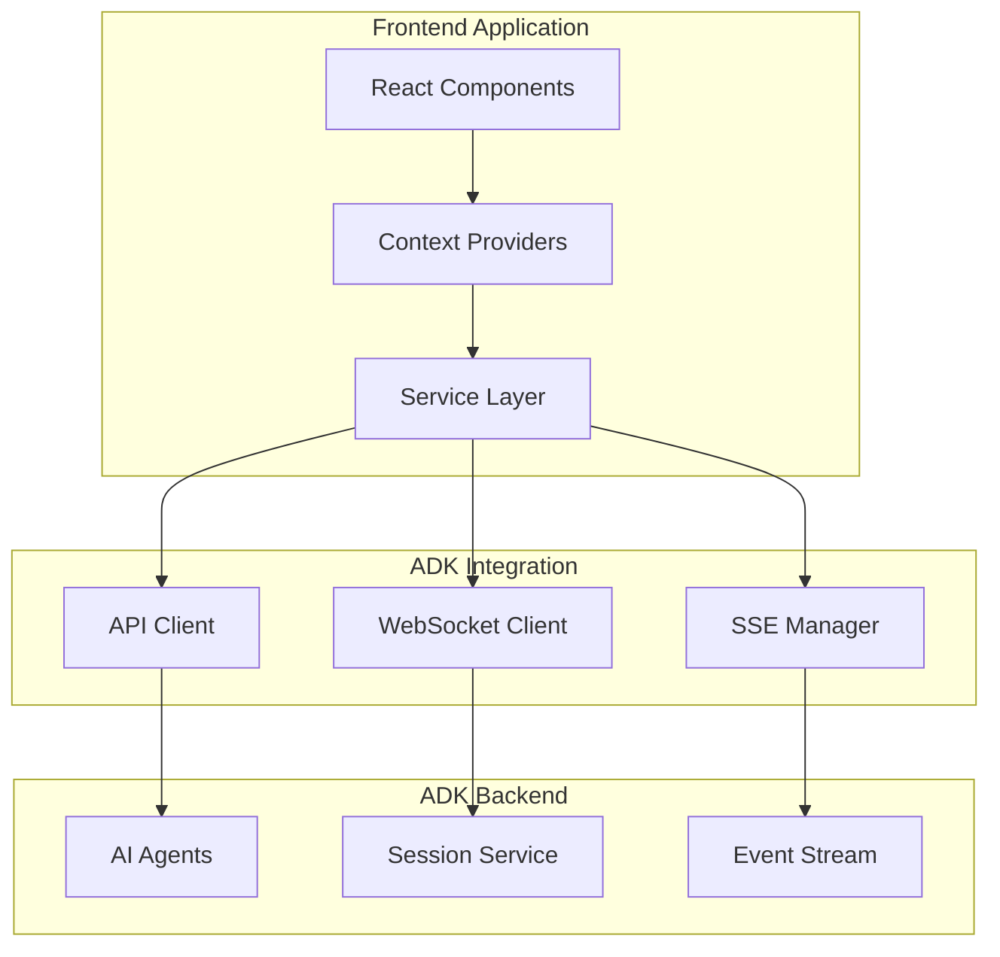

# Vana Frontend

<div align="center">


**Modern React Frontend for Virtual Autonomous Network Agents**

[Quick Start](#quick-start) • [Architecture](#architecture) • [Development](#development) • [Testing](#testing) • [Contributing](#contributing)

</div>

---

## 📋 Table of Contents

- [Overview](#overview)
- [Features](#features)
- [Quick Start](#quick-start)
- [Architecture](#architecture)
  - [Context System](#context-system)
  - [ADK Integration](#adk-integration)
  - [Component Structure](#component-structure)
- [Development](#development)
  - [Prerequisites](#prerequisites)
  - [Installation](#installation)
  - [Available Scripts](#available-scripts)
- [Testing](#testing)
- [Configuration](#configuration)
- [Performance](#performance)
- [Deployment](#deployment)
- [Contributing](#contributing)
- [Documentation](#documentation)
- [License](#license)

---

## 🚀 Overview

The Vana Frontend is a modern, high-performance React application that provides an intuitive interface for Google's Agent Development Kit (ADK). Built with React 19, TypeScript 5.8, and Vite 5.4+, it delivers real-time AI agent interactions through Server-Sent Events (SSE) integration.

### Key Highlights

- **🎯 ADK Native**: Purpose-built for Google Agent Development Kit integration
- **⚡ Real-time**: Server-Sent Events for live agent activity and responses
- **🏗️ Modern Stack**: React 19, TypeScript 5.8, Vite 5.4+, Tailwind CSS 4.1
- **🎨 AI-First UI**: Specialized components for AI interactions (kibo-ui + shadcn/ui)
- **📱 Responsive**: Mobile-first design with adaptive layouts
- **🔒 Type Safe**: 100% TypeScript coverage with strict mode
- **⚡ Performance**: <200KB bundle, 90+ Lighthouse scores
- **🧪 Well Tested**: 80%+ test coverage with Vitest + React Testing Library

---

## ✨ Features

### 🤖 AI Agent Interface
- **Interactive Chat**: Real-time messaging with ADK agents
- **Agent Activity**: Live visualization of agent thinking and actions  
- **Research Timeline**: Progress tracking for multi-step research workflows
- **Session Management**: Persistent research sessions with resume capability

### 🎨 Modern UI/UX
- **AI Components**: Specialized UI components for AI interactions
- **Dark/Light Theme**: Adaptive theming with system preference detection
- **Responsive Design**: Mobile-first with tablet and desktop optimizations
- **Accessibility**: WCAG 2.1 AA compliant with keyboard navigation

### 🔧 Developer Experience
- **Hot Reload**: Instant development feedback with Vite HMR
- **Type Safety**: Comprehensive TypeScript coverage
- **Code Quality**: ESLint + Prettier + Husky pre-commit hooks
- **Testing**: Unit, integration, and E2E testing setup

### 🚀 Performance
- **Bundle Optimization**: Code splitting and tree shaking
- **SSE Streaming**: Efficient real-time data updates
- **Memory Management**: Automatic cleanup and optimized re-renders
- **Progressive Loading**: Lazy loading for improved initial load times

---

## ⚡ Quick Start

### Prerequisites

- Node.js 18+ 
- npm 9+ or yarn 1.22+
- Git

### Installation

```bash
# Clone the repository
git clone https://github.com/vana-project/vana.git
cd vana/frontend

# Install dependencies
npm install

# Set up environment variables
cp .env.example .env.local
# Edit .env.local with your configuration

# Start development server
npm run dev
```

The application will be available at http://localhost:5173

### Environment Variables

```bash
# Required
VITE_API_URL=http://localhost:8000        # ADK backend URL
VITE_WS_URL=ws://localhost:8000/ws        # WebSocket URL

# Optional
VITE_APP_NAME=Vana                        # Application name
VITE_DEBUG_MODE=true                      # Enable debug logging
```

---

## 🏗️ Architecture

### System Overview



### Context System

The application uses a performant context system with split state management:

```typescript
// Context hierarchy
RootProvider
├── AppProvider       // Global UI state, notifications
├── AuthProvider      // Authentication, user management
├── SessionProvider   // ADK sessions, research state
└── SSEProvider      // Real-time events, connections
```

#### Key Features
- **Split Contexts**: Separate state and actions to minimize re-renders
- **Type Safety**: Comprehensive TypeScript definitions
- **Performance**: Memoized actions with proper dependency arrays
- **Persistence**: localStorage integration for preferences and auth

### ADK Integration

#### Service Layer Architecture

```typescript
// Service composition
ADKClient (Unified Interface)
├── SessionService    // Session management
├── SSEManager       // Server-Sent Events
├── MessageTransformer // Format conversion
└── EventStore       // Event storage & debugging
```

#### Connection Pattern
- **Per-Message SSE**: Each message creates a new SSE connection (ADK pattern)
- **Automatic Retry**: Exponential backoff for failed connections
- **Event Streaming**: Real-time agent activity and response updates
- **Session Persistence**: Automatic session restoration and management

### Component Structure

```
src/
├── components/
│   ├── ui/               # Base UI components
│   │   ├── shadcn/       # shadcn/ui components
│   │   ├── kibo-ui/      # AI-specific components
│   │   └── custom/       # Project-specific components
│   ├── features/         # Feature-specific components
│   │   ├── chat/         # Chat interface
│   │   ├── agents/       # Agent management
│   │   └── research/     # Research workflows
│   └── layout/           # Layout components
├── contexts/             # React contexts
├── hooks/               # Custom hooks
├── services/            # ADK integration
├── utils/               # Utility functions
└── types/               # TypeScript definitions
```

---

## 💻 Development

### Prerequisites

- **Node.js**: Version 18.0.0 or higher
- **Package Manager**: npm 9+ (recommended) or yarn 1.22+
- **Git**: For version control
- **VS Code**: Recommended editor with extensions:
  - ES7+ React/Redux/React-Native snippets
  - TypeScript Importer
  - Tailwind CSS IntelliSense
  - ESLint

### Installation

```bash
# Install dependencies
npm install

# Install recommended VS Code extensions
code --install-extension bradlc.vscode-tailwindcss
code --install-extension esbenp.prettier-vscode
```

### Available Scripts

| Command | Description |
|---------|-------------|
| `npm run dev` | Start development server with HMR |
| `npm run build` | Build for production |
| `npm run preview` | Preview production build locally |
| `npm run test` | Run unit tests |
| `npm run test:ui` | Run tests with UI |
| `npm run test:coverage` | Generate test coverage report |
| `npm run lint` | Run ESLint |
| `npm run lint:fix` | Fix ESLint issues |
| `npm run format` | Format code with Prettier |
| `npm run type-check` | Run TypeScript compiler check |

### Development Workflow

```bash
# 1. Start development server
npm run dev

# 2. Make changes to components
# Files are automatically type-checked and linted

# 3. Run tests
npm run test

# 4. Before committing (automatic via husky)
npm run lint:fix
npm run format
npm run type-check
```

### Code Style Guidelines

- **TypeScript**: Strict mode enabled, no `any` types
- **React**: Functional components with hooks
- **Naming**: PascalCase for components, camelCase for variables
- **Imports**: Absolute imports with path mapping
- **Comments**: JSDoc for public APIs, inline for complex logic

---

## 🧪 Testing

### Testing Strategy

The project uses a comprehensive testing approach:

```bash
# Unit Tests (80%+ coverage target)
npm run test

# Integration Tests
npm run test:integration

# Component Testing
npm run test:ui

# Coverage Report
npm run test:coverage
```

### Testing Stack

- **Test Runner**: Vitest (fast, Vite-native)
- **Component Testing**: React Testing Library
- **Mocking**: MSW (Mock Service Worker) for API mocking
- **Assertions**: expect from Vitest
- **DOM Environment**: jsdom

### Test Organization

```
src/
├── components/
│   └── __tests__/          # Component tests
├── contexts/
│   └── __tests__/          # Context tests
├── services/
│   └── __tests__/          # Service tests
├── hooks/
│   └── __tests__/          # Hook tests
└── test/
    ├── setup.ts            # Test configuration
    ├── utils/              # Test utilities
    └── integration/        # Integration tests
```

### Writing Tests

```typescript
// Component test example
import { render, screen } from '@testing-library/react';
import { ChatInterface } from '../ChatInterface';

test('renders chat interface', () => {
  render(<ChatInterface />);
  expect(screen.getByRole('textbox')).toBeInTheDocument();
});

// Hook test example
import { renderHook } from '@testing-library/react';
import { useSSE } from '../useSSE';

test('manages SSE connection', () => {
  const { result } = renderHook(() => useSSE());
  expect(result.current.isConnected).toBe(false);
});
```

---

## ⚙️ Configuration

### Vite Configuration

The project uses Vite for build tooling with these optimizations:

```typescript
// vite.config.ts highlights
export default defineConfig({
  plugins: [react()],
  build: {
    target: 'es2020',
    rollupOptions: {
      output: {
        manualChunks: {
          vendor: ['react', 'react-dom'],
          ui: ['@radix-ui/react-*']
        }
      }
    }
  }
});
```

### Tailwind Configuration

```typescript
// tailwind.config.js
export default {
  content: ['./src/**/*.{js,ts,jsx,tsx}'],
  theme: {
    extend: {
      colors: {
        primary: 'hsl(var(--primary))',
        secondary: 'hsl(var(--secondary))',
        // Vana brand colors
      }
    }
  },
  plugins: [forms, typography]
};
```

### ESLint Configuration

- **Base**: `@eslint/js` recommended rules
- **TypeScript**: Strict type checking enabled
- **React**: React hooks rules and best practices
- **Accessibility**: Basic a11y rules
- **Import**: Proper import/export validation

---

## 🚀 Performance

### Performance Targets

- **Bundle Size**: < 200KB gzipped
- **First Contentful Paint**: < 1.5s
- **Time to Interactive**: < 3s
- **Lighthouse Score**: > 90

### Optimization Strategies

#### Code Splitting
```typescript
// Route-based code splitting
const Dashboard = lazy(() => import('./Dashboard'));
const Settings = lazy(() => import('./Settings'));
```

#### Bundle Analysis
```bash
# Analyze bundle size
npm run build -- --analyze
```

#### Performance Monitoring
- React DevTools for component performance
- Vite bundle analyzer for size optimization
- Lighthouse CI for automated performance testing

### Memory Management

- **Context Optimization**: Split contexts prevent unnecessary re-renders
- **Effect Cleanup**: All useEffect hooks have proper cleanup
- **Event Listeners**: Automatic removal on component unmount
- **Service Cleanup**: Proper disconnection of ADK services

---

## 🚀 Deployment

### Build Process

```bash
# Production build
npm run build

# Preview build locally
npm run preview

# Type check before deployment
npm run type-check
```

### Environment Setup

#### Production Environment Variables
```bash
VITE_API_URL=https://your-production-adk.com
VITE_APP_NAME=Vana
VITE_DEBUG_MODE=false
```

#### Build Output
- **dist/**: Production build files
- **Assets**: Optimized images, fonts, and icons
- **Chunks**: Code-split JavaScript bundles
- **Source Maps**: Available for debugging

### Deployment Options

#### Static Hosting (Recommended)
- Vercel, Netlify, or Cloudflare Pages
- Automatic builds from Git commits
- Environment variable support

#### Docker Deployment
```dockerfile
FROM nginx:alpine
COPY dist/ /usr/share/nginx/html/
EXPOSE 80
```

---

## 🤝 Contributing

We welcome contributions! Please see our [Contributing Guidelines](../CONTRIBUTING.md) for details.

### Development Process

1. **Fork** the repository
2. **Create** a feature branch: `git checkout -b feature/amazing-feature`
3. **Make** your changes following our code style
4. **Test** your changes: `npm run test && npm run lint`
5. **Commit** your changes: `git commit -m 'Add amazing feature'`
6. **Push** to the branch: `git push origin feature/amazing-feature`
7. **Open** a Pull Request

### Code Review Process

- All changes require review before merging
- Automated checks must pass (tests, linting, type checking)
- Performance impact is evaluated
- Documentation is updated as needed

### Reporting Issues

Please use our [issue templates](.github/ISSUE_TEMPLATE/) when reporting bugs or requesting features.

---

## 📚 Documentation

### Additional Documentation

- [API Documentation](./docs/api.md) - Service layer APIs and types
- [Component Guide](./docs/components.md) - UI component usage and examples
- [Architecture Deep Dive](./docs/architecture.md) - Detailed system architecture
- [Performance Guide](./docs/performance.md) - Optimization strategies
- [Testing Guide](./docs/testing.md) - Testing patterns and best practices

### Code Examples

Check the `src/examples/` directory for:
- Context usage patterns
- Service integration examples
- Component composition patterns
- Custom hook implementations

---

## 📄 License

This project is part of Vana and is licensed under the Apache License 2.0 - see the [LICENSE](../LICENSE) file for details.

---

<div align="center">

**Built with ❤️ for the Vana AI Agent Platform**

[Report Issues](https://github.com/vana-project/vana/issues) • [Discussions](https://github.com/vana-project/vana/discussions) • [Documentation](https://github.com/vana-project/vana/wiki)

</div>
