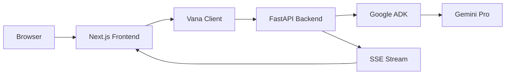

# Vana Integration Documentation

## Overview
This document describes how the Vercel AI Chatbot UI has been integrated with the Vana backend (Python/FastAPI with Google ADK).

## Integration Architecture



## Key Integration Points

### 1. Frontend Components

#### VanaDataStreamProvider
**Location**: `components/vana-data-stream-provider.tsx`

Provides SSE streaming context to all child components:
```typescript
const VanaDataStreamProvider = ({ children }) => {
  // Manages SSE connection
  // Handles incoming messages
  // Provides stream state to components
}
```

#### Chat-Vana Component
**Location**: `components/chat-vana.tsx`

Main chat interface for Vana:
- Handles user input
- Displays messages
- Manages chat state
- Connects to SSE stream

#### useVanaChat Hook
**Location**: `hooks/use-vana-chat.tsx`

Custom hook for chat state management:
```typescript
const useVanaChat = () => {
  // Message history
  // Send message function
  // Connection status
  // Error handling
}
```

### 2. Backend Integration

#### Vana Client
**Location**: `lib/vana-client.ts`

API client for backend communication:
```typescript
class VanaClient {
  checkHealth(): Promise<HealthStatus>
  sendMessage(message: string): Promise<Response>
  createSSEConnection(sessionId: string): EventSource
}
```

#### API Endpoints Used
- `GET /health` - Health check
- `POST /api/chat` - Send messages
- `GET /agent_network_sse/{session_id}` - SSE streaming

### 3. Environment Configuration

#### Required Environment Variables
```env
NEXT_PUBLIC_API_URL=http://localhost:8000
NEXT_PUBLIC_SSE_URL=http://localhost:8000/agent_network_sse
```

## Message Flow

1. **User Input** → Chat-Vana component
2. **Send Message** → VanaClient.sendMessage()
3. **Backend Processing** → FastAPI → Google ADK
4. **Response Stream** → SSE connection
5. **Display Update** → VanaDataStreamProvider → UI

## SSE Event Types

### Incoming Events
```typescript
interface SSEEvent {
  type: 'message' | 'error' | 'done' | 'thinking'
  data: {
    content?: string
    error?: string
    agent?: string
  }
}
```

### Event Handling
```typescript
eventSource.onmessage = (event) => {
  const data = JSON.parse(event.data);
  switch(data.type) {
    case 'message':
      // Append to message stream
      break;
    case 'error':
      // Handle error
      break;
    case 'done':
      // Complete message
      break;
  }
}
```

## Routes

### Main Routes
- `/` - Default chat interface
- `/vana-chat` - Vana-specific chat page
- `/chat/[id]` - Chat with history

### API Routes
- `/api/chat` - Chat API endpoint
- `/api/chat/vana` - Vana-specific API
- `/api/history` - Chat history

## Error Handling

### Connection Errors
```typescript
try {
  await vanaClient.checkHealth();
} catch (error) {
  // Show connection error UI
  // Attempt reconnection
}
```

### SSE Reconnection
```typescript
eventSource.onerror = () => {
  // Close connection
  // Wait and retry
  setTimeout(reconnect, 5000);
}
```

## Testing Integration

### Manual Testing
1. Start backend: `cd app && python server.py`
2. Start frontend: `cd frontend && npm run dev`
3. Navigate to http://localhost:3000/vana-chat
4. Send test messages
5. Verify SSE streaming

### Automated Tests
```bash
# Run integration tests
cd frontend && npm test

# Run E2E tests
npx playwright test tests/routes/vana.test.ts
```

## Performance Considerations

### SSE Connection Management
- Single connection per session
- Automatic reconnection on failure
- Connection pooling for multiple chats

### Message Buffering
- Buffer incoming SSE chunks
- Batch UI updates
- Debounce rapid messages

### Error Recovery
- Exponential backoff for reconnection
- Message queue during disconnection
- Graceful degradation

## Security

### CORS Configuration
Backend must allow frontend origin:
```python
app.add_middleware(
    CORSMiddleware,
    allow_origins=["http://localhost:3000"],
    allow_credentials=True,
    allow_methods=["*"],
    allow_headers=["*"],
)
```

### Authentication (Future)
- JWT tokens for user sessions
- Secure cookie storage
- API key management

## Known Issues & Solutions

### Issue: SSE Connection Drops
**Solution**: Implement heartbeat mechanism and auto-reconnect

### Issue: CORS Errors
**Solution**: Ensure backend CORS configuration includes frontend URL

### Issue: Message Ordering
**Solution**: Add sequence numbers to SSE events

## Future Enhancements

1. **WebSocket Support** - Replace SSE with WebSockets
2. **Message Persistence** - Save chat history to database
3. **Multi-Agent Display** - Show which agent is responding
4. **File Uploads** - Support document and image uploads
5. **Voice Input** - Speech-to-text integration

## Resources

- [Vercel AI SDK Documentation](https://sdk.vercel.ai/docs)
- [Next.js Documentation](https://nextjs.org/docs)
- [FastAPI Documentation](https://fastapi.tiangolo.com/)
- [Google ADK Documentation](https://cloud.google.com/products/ai)

---

*Last Updated: August 31, 2024*