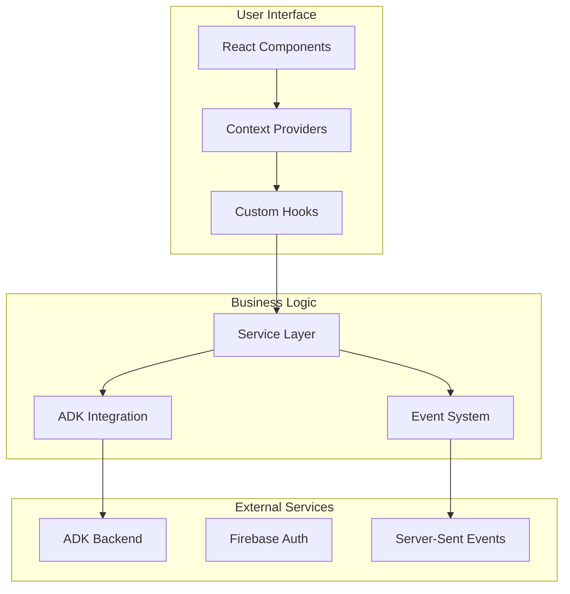

# Vana Frontend Documentation

Welcome to the comprehensive documentation for the Vana Frontend project. This documentation provides everything you need to understand, contribute to, and maintain the React-based AI agent interface.

## 📚 Documentation Overview

### Core Documentation

| Document | Description | Audience |
|----------|-------------|----------|
| **[Main README](../README.md)** | Project overview, quick start, and features | All users |
| **[API Documentation](./api.md)** | Service layer APIs, contexts, and component interfaces | Developers |
| **[Architecture Guide](./architecture.md)** | System design, patterns, and technical decisions | Architects, Senior Developers |
| **[Component Guide](./components.md)** | UI component usage, props, and examples | Frontend Developers |
| **[Developer Guide](./developer-guide.md)** | Comprehensive development workflow and practices | All Developers |

### Specialized Guides

| Document | Description | Audience |
|----------|-------------|----------|
| **[Performance Guide](./performance.md)** | Optimization strategies and monitoring | Performance Engineers |
| **[Testing Guide](./testing.md)** | Testing patterns, utilities, and best practices | QA Engineers, Developers |
| **[Contributing Guide](../CONTRIBUTING.md)** | How to contribute to the project | Contributors |
| **[Changelog](../CHANGELOG.md)** | Version history and migration guides | All users |

---

## 🚀 Quick Navigation

### New to the Project?
1. Start with the **[Main README](../README.md)** for project overview
2. Follow the **[Quick Start Guide](../README.md#quick-start)** to get running
3. Read the **[Developer Guide](./developer-guide.md)** for development workflow

### Building Components?
1. Check the **[Component Guide](./components.md)** for patterns and examples
2. Review the **[API Documentation](./api.md)** for interfaces
3. Follow the **[Testing Guide](./testing.md)** for testing patterns

### Need Technical Details?
1. Study the **[Architecture Guide](./architecture.md)** for system design
2. Review the **[Performance Guide](./performance.md)** for optimization
3. Check the **[API Documentation](./api.md)** for detailed interfaces

### Contributing?
1. Read the **[Contributing Guide](../CONTRIBUTING.md)** for process
2. Check the **[Changelog](../CHANGELOG.md)** for recent changes
3. Follow the **[Testing Guide](./testing.md)** for test requirements

---

## 🏗️ Architecture at a Glance

The Vana Frontend is built with a modern, performance-focused architecture:

### Key Technologies

- **React 19**: Latest React with concurrent features
- **TypeScript 5.8**: Strict type safety throughout
- **Vite 5.4**: Fast build tool and development server
- **Tailwind CSS 4.1**: Utility-first styling with custom design system
- **Vitest**: Fast testing with React Testing Library
- **MSW**: API mocking for reliable tests

### Core Features

- **Real-time AI Interactions**: SSE-based streaming responses
- **Context-based State Management**: Performance-optimized React contexts
- **Comprehensive Service Layer**: Clean ADK integration
- **AI-Specific Components**: Specialized UI for agent interactions
- **Type-Safe Development**: 100% TypeScript coverage
- **Extensive Testing**: 80%+ test coverage with modern testing tools

---

## 📖 Documentation Structure

### By Role

#### **Frontend Developers**
- [Component Guide](./components.md) - UI component patterns
- [API Documentation](./api.md) - Service and context APIs
- [Developer Guide](./developer-guide.md) - Daily development workflow

#### **Backend Developers**
- [API Documentation](./api.md) - Frontend service expectations
- [Architecture Guide](./architecture.md) - Integration patterns
- [Testing Guide](./testing.md) - API testing patterns

#### **DevOps Engineers**
- [Performance Guide](./performance.md) - Build optimization
- [Developer Guide](./developer-guide.md#deployment-guide) - Deployment strategies
- [Architecture Guide](./architecture.md) - Infrastructure requirements

#### **QA Engineers**
- [Testing Guide](./testing.md) - Testing strategies and tools
- [Component Guide](./components.md) - Component behavior specs
- [Developer Guide](./developer-guide.md#debugging-guide) - Debugging techniques

#### **Project Managers**
- [Main README](../README.md) - Project overview and status
- [Changelog](../CHANGELOG.md) - Release history and roadmap
- [Contributing Guide](../CONTRIBUTING.md) - Team process

### By Topic

#### **Getting Started**
1. [Project Setup](../README.md#quick-start)
2. [Development Environment](./developer-guide.md#quick-start)
3. [First Contribution](../CONTRIBUTING.md#getting-started)

#### **Development**
1. [Component Development](./components.md)
2. [Service Integration](./api.md#service-layer-apis)
3. [State Management](./architecture.md#state-management)
4. [Testing Patterns](./testing.md)

#### **Architecture**
1. [System Design](./architecture.md#system-overview)
2. [Context System](./architecture.md#context-architecture)
3. [Performance Patterns](./performance.md)
4. [Security Considerations](./architecture.md#security-considerations)

#### **Operations**
1. [Build and Deploy](./developer-guide.md#deployment-guide)
2. [Performance Monitoring](./performance.md#monitoring-and-profiling)
3. [Troubleshooting](./developer-guide.md#troubleshooting)

---

## 🔧 Common Tasks

### Development Tasks

| Task | Documentation | Quick Command |
|------|---------------|---------------|
| **Start Development** | [Developer Guide](./developer-guide.md#quick-start) | `npm run dev` |
| **Run Tests** | [Testing Guide](./testing.md) | `npm run test` |
| **Build for Production** | [Developer Guide](./developer-guide.md#deployment-guide) | `npm run build` |
| **Create Component** | [Component Guide](./components.md) | Follow component patterns |
| **Debug Issues** | [Developer Guide](./developer-guide.md#debugging-guide) | Use React DevTools |

### Architecture Tasks

| Task | Documentation | Key Concepts |
|------|---------------|--------------|
| **Add New Context** | [Architecture Guide](./architecture.md#context-architecture) | Split state/actions pattern |
| **Create Service** | [API Documentation](./api.md#service-layer-apis) | Service factory pattern |
| **Optimize Performance** | [Performance Guide](./performance.md) | React.memo, useMemo, useCallback |
| **Add Testing** | [Testing Guide](./testing.md) | Unit, integration, E2E patterns |

### Maintenance Tasks

| Task | Documentation | Process |
|------|---------------|---------|
| **Update Dependencies** | [Developer Guide](./developer-guide.md) | Check compatibility, test thoroughly |
| **Performance Audit** | [Performance Guide](./performance.md#monitoring-and-profiling) | Lighthouse, bundle analysis |
| **Security Review** | [Architecture Guide](./architecture.md#security-considerations) | CSP, input validation |
| **Documentation Update** | [Contributing Guide](../CONTRIBUTING.md) | Keep docs in sync with code |

---

## 📚 Learning Path

### For New Team Members

#### Week 1: Foundation
- [ ] Read [Main README](../README.md) for project overview
- [ ] Set up development environment using [Developer Guide](./developer-guide.md#quick-start)
- [ ] Complete first feature following [Contributing Guide](../CONTRIBUTING.md)
- [ ] Review [Architecture Guide](./architecture.md) for system understanding

#### Week 2: Deep Dive
- [ ] Study [Component Guide](./components.md) for UI patterns
- [ ] Learn [API Documentation](./api.md) for service integration
- [ ] Practice [Testing Guide](./testing.md) patterns
- [ ] Review [Performance Guide](./performance.md) best practices

#### Week 3: Advanced Topics
- [ ] Implement complex feature using all guides
- [ ] Contribute to documentation improvements
- [ ] Review [Changelog](../CHANGELOG.md) for project history
- [ ] Understand deployment process

### For Experienced Developers

#### Quick Start
- [ ] Skim [Architecture Guide](./architecture.md) for system design
- [ ] Review [API Documentation](./api.md) for interfaces
- [ ] Check [Component Guide](./components.md) for patterns
- [ ] Follow [Developer Guide](./developer-guide.md) for workflow

---

## 🤝 Getting Help

### Documentation Issues
- **Missing Information**: Create issue with `documentation` label
- **Unclear Instructions**: Submit PR with improvements
- **Outdated Content**: Report via GitHub issue

### Development Help
- **Technical Questions**: Check [GitHub Discussions](https://github.com/vana-project/vana/discussions)
- **Bug Reports**: Use [GitHub Issues](https://github.com/vana-project/vana/issues)
- **Feature Requests**: Submit via GitHub issues with template

### Community Support
- **Discord**: Real-time help and community chat
- **Code Review**: Submit PR for feedback
- **Mentoring**: Connect with maintainers via discussions

---

## 📝 Documentation Maintenance

### Keeping Docs Current
- **Code Changes**: Update relevant docs in same PR
- **New Features**: Add documentation before merging
- **API Changes**: Update API docs and examples
- **Breaking Changes**: Update migration guides

### Documentation Standards
- **Clarity**: Write for the intended audience
- **Examples**: Include working code examples
- **Completeness**: Cover all public APIs
- **Accuracy**: Test all code examples

---

## 🗺️ Roadmap

### Upcoming Documentation
- [ ] **Accessibility Guide**: WCAG compliance patterns
- [ ] **Deployment Cookbook**: Platform-specific guides
- [ ] **Troubleshooting Database**: Common issues and solutions
- [ ] **Video Tutorials**: Walkthrough of complex topics

### Continuous Improvement
- [ ] **User Feedback**: Regular surveys and feedback collection
- [ ] **Analytics**: Track most-used documentation sections
- [ ] **Updates**: Regular review and refresh cycles
- [ ] **Community**: Encourage community contributions

---

**Happy coding! 🚀**

*This documentation is maintained by the Vana Frontend team. For questions or improvements, please contribute via GitHub.*