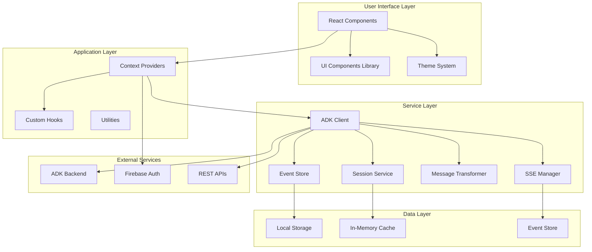
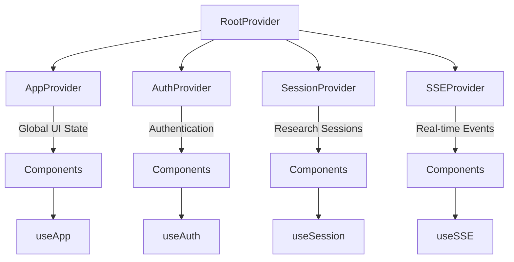
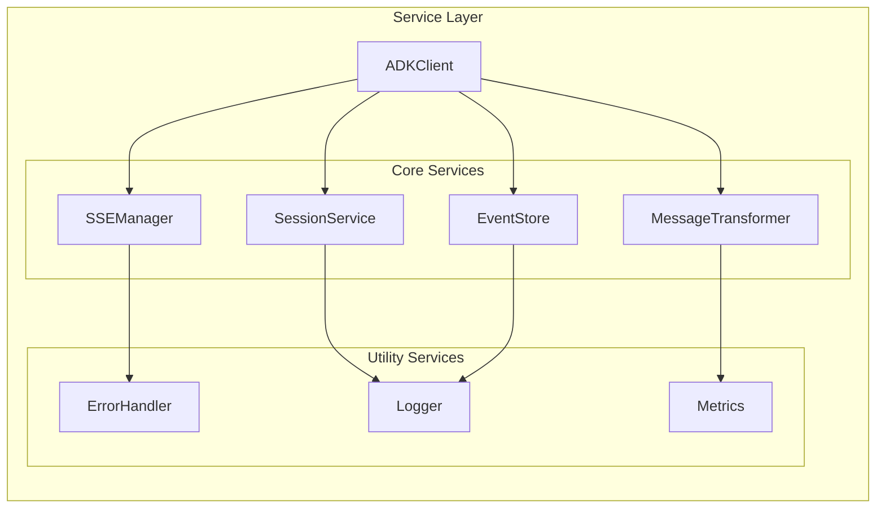
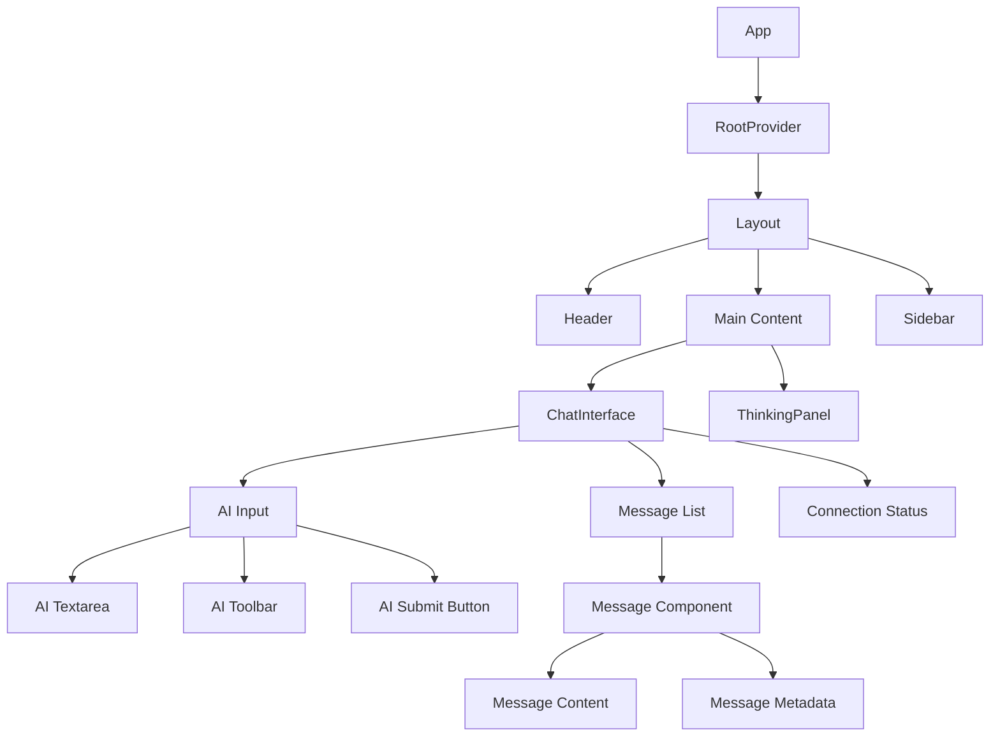
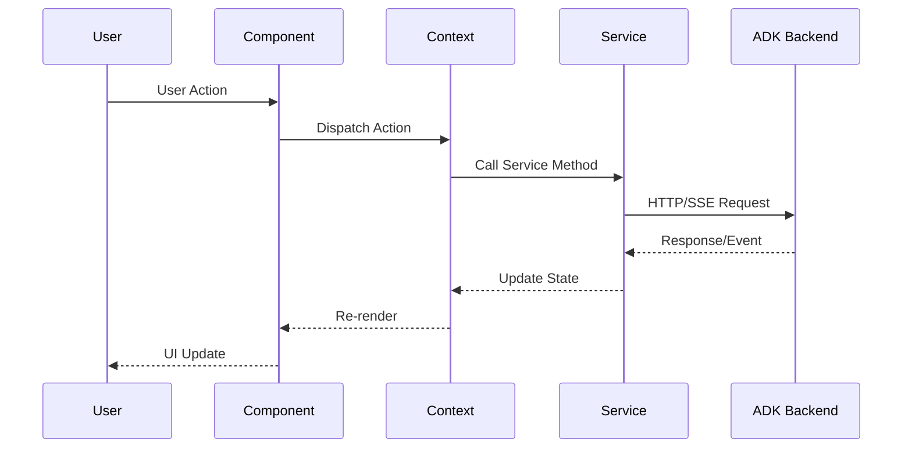
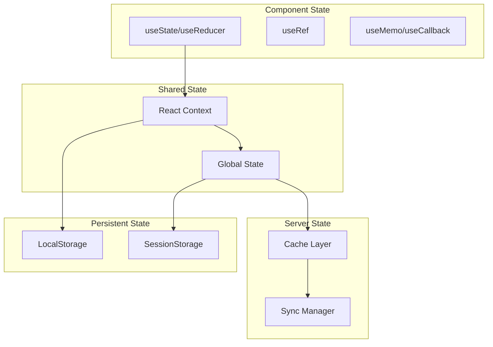
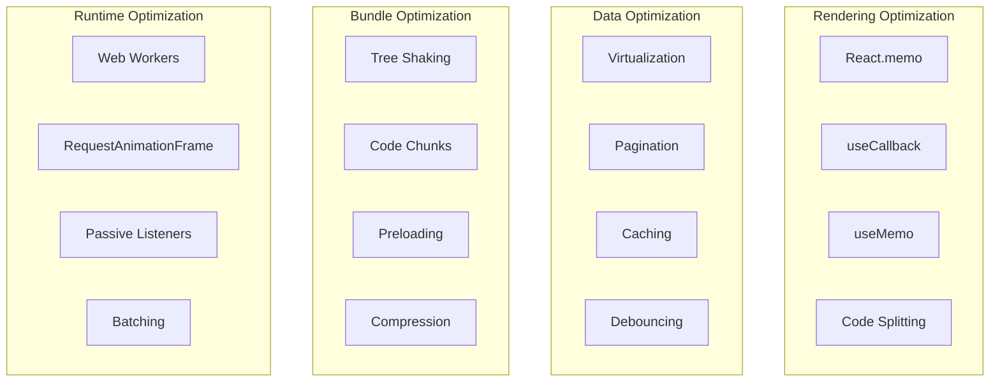
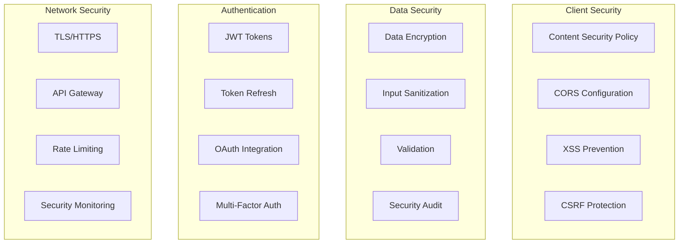
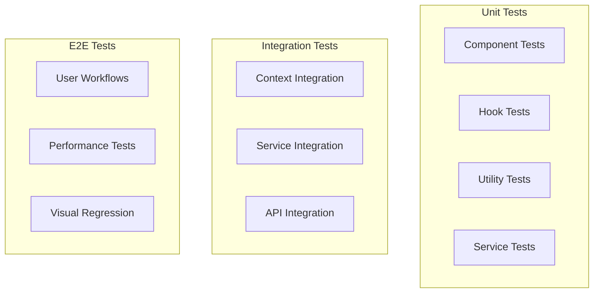

# Architecture Documentation

This document provides a comprehensive overview of the Vana Frontend architecture, design patterns, and implementation details.

## Table of Contents

- [System Overview](#system-overview)
- [Context Architecture](#context-architecture)
- [Service Layer Design](#service-layer-design)
- [Component Architecture](#component-architecture)
- [Data Flow Patterns](#data-flow-patterns)
- [State Management](#state-management)
- [Performance Architecture](#performance-architecture)
- [Security Considerations](#security-considerations)

---

## System Overview

The Vana Frontend follows a modern React architecture with clear separation of concerns, optimized for AI agent interactions and real-time data streaming.

### High-Level Architecture



### Design Principles

1. **Separation of Concerns**: Clear boundaries between UI, business logic, and data access
2. **Unidirectional Data Flow**: Predictable state updates using React patterns
3. **Composition over Inheritance**: Component composition and higher-order patterns
4. **Performance First**: Optimized for real-time updates and minimal re-renders
5. **Type Safety**: Comprehensive TypeScript coverage throughout the stack
6. **Testability**: Architecture supports easy unit and integration testing

---

## Context Architecture

The application uses a hierarchical context system designed for optimal performance and maintainability.

### Context Hierarchy



### Context Design Patterns

#### Split Context Pattern

Each context is split into state and actions to minimize re-renders:

```typescript
// State context - for data that changes frequently
const AppStateContext = createContext<AppState | null>(null);

// Actions context - for stable functions
const AppActionsContext = createContext<AppActions | null>(null);

// Provider combines both contexts
export const AppProvider: React.FC<{ children: React.ReactNode }> = ({ children }) => {
  const [state, dispatch] = useReducer(appReducer, initialState);
  
  const actions = useMemo(() => ({
    updatePreferences: (prefs: Partial<UIPreferences>) => 
      dispatch({ type: 'UPDATE_PREFERENCES', payload: prefs }),
    addNotification: (notification: Notification) =>
      dispatch({ type: 'ADD_NOTIFICATION', payload: notification }),
    // ... other actions
  }), []);

  return (
    <AppStateContext.Provider value={state}>
      <AppActionsContext.Provider value={actions}>
        {children}
      </AppActionsContext.Provider>
    </AppStateContext.Provider>
  );
};
```

#### Context Optimization Strategies

1. **Memoized Actions**: All action functions are memoized to prevent unnecessary re-renders
2. **Selective Updates**: Components only subscribe to the state slices they need
3. **Lazy Initialization**: Contexts initialize only when first accessed
4. **Cleanup Patterns**: Proper cleanup of side effects and event listeners

### Context Responsibilities

| Context | Responsibility | State Scope | Performance Impact |
|---------|---------------|-------------|-------------------|
| **AppContext** | Global UI state, preferences, notifications | Application-wide | Low (infrequent updates) |
| **AuthContext** | User authentication, profile management | Authentication flow | Low (auth state changes) |
| **SessionContext** | Research sessions, ADK integration | Session-specific | Medium (session updates) |
| **SSEContext** | Real-time events, connection management | Event-driven | High (frequent updates) |

---

## Service Layer Design

The service layer provides a clean abstraction over external dependencies and implements the core business logic.

### Service Architecture



### Service Interfaces

#### ADKClient - Unified Service Interface

```typescript
interface IADKClient extends EventEmitter {
  // Lifecycle
  initialize(userId: string): Promise<void>;
  disconnect(): Promise<void>;
  
  // Messaging
  sendMessage(content: string, metadata?: MessageMetadata): Promise<void>;
  
  // Event Management
  subscribeToEvents(events: string[], handler: EventHandler): () => void;
  
  // Status
  isConnected(): boolean;
  getConnectionInfo(): ConnectionInfo;
  
  // Service Access
  getServices(): ADKServices;
}
```

#### Service Factory Pattern

```typescript
interface ADKServices {
  session: ISessionService;
  sse: ISSEManager;
  transformer: IMessageTransformer;
  store: IEventStore;
}

// Factory function for service creation
export function createADKServices(config: ADKConfig): ADKServices {
  const logger = new Logger(config.enableLogging);
  const errorHandler = new ErrorHandler(logger);
  
  return {
    session: new SessionService(config, logger),
    sse: new SSEManager(config, errorHandler),
    transformer: new MessageTransformer(),
    store: new EventStore(config.maxEvents, logger)
  };
}
```

### Service Communication Patterns

#### Event-Driven Communication

Services communicate through events to maintain loose coupling:

```typescript
class SSEManager extends EventEmitter implements ISSEManager {
  async connect(request: SSERequest): Promise<SSEConnection> {
    try {
      const connection = await this.createConnection(request);
      this.emit('connected', { connectionId: connection.id });
      return connection;
    } catch (error) {
      this.emit('error', { error, context: 'connection' });
      throw error;
    }
  }
}

class ADKClient extends EventEmitter implements IADKClient {
  constructor(private services: ADKServices) {
    super();
    
    // Forward events from services
    this.services.sse.on('connected', this.handleSSEConnected.bind(this));
    this.services.sse.on('error', this.handleSSEError.bind(this));
  }
}
```

#### Dependency Injection

Services are injected through the factory pattern, enabling easy testing and configuration:

```typescript
// Production configuration
const services = createADKServices({
  apiUrl: process.env.VITE_API_URL,
  maxRetries: 5,
  enableLogging: true
});

// Test configuration with mocks
const testServices = createADKServices(
  { ...defaultConfig },
  {
    session: mockSessionService,
    sse: mockSSEManager
  }
);
```

---

## Component Architecture

The component architecture follows React best practices with a focus on composition and reusability.

### Component Hierarchy



### Component Design Patterns

#### Compound Components

Complex components use the compound component pattern for flexibility:

```typescript
// ChatInterface compound component
export const ChatInterface = {
  Root: ChatInterfaceRoot,
  Messages: MessageList,
  Input: ChatInput,
  Status: ConnectionStatus,
  Thinking: ThinkingPanel
};

// Usage
<ChatInterface.Root sessionId="session_123">
  <ChatInterface.Status />
  <ChatInterface.Messages />
  <ChatInterface.Thinking />
  <ChatInterface.Input />
</ChatInterface.Root>
```

#### Render Props Pattern

For complex state sharing and customization:

```typescript
interface SSEProviderProps {
  children: (state: SSEState, actions: SSEActions) => React.ReactNode;
}

export const SSEProvider: React.FC<SSEProviderProps> = ({ children }) => {
  const [state, actions] = useSSEState();
  return <>{children(state, actions)}</>;
};

// Usage
<SSEProvider>
  {(sseState, sseActions) => (
    <CustomComponent 
      connectionStatus={sseState.status}
      onReconnect={sseActions.reconnect}
    />
  )}
</SSEProvider>
```

#### Higher-Order Components

For cross-cutting concerns like error boundaries and loading states:

```typescript
// Error boundary HOC
export function withErrorBoundary<P extends object>(
  Component: React.ComponentType<P>
): React.ComponentType<P> {
  return function WrappedComponent(props: P) {
    return (
      <ErrorBoundary>
        <Component {...props} />
      </ErrorBoundary>
    );
  };
}

// Loading state HOC
export function withLoadingState<P extends object>(
  Component: React.ComponentType<P>,
  LoadingComponent: React.ComponentType = DefaultLoader
): React.ComponentType<P & { loading?: boolean }> {
  return function WrappedComponent({ loading, ...props }: P & { loading?: boolean }) {
    if (loading) return <LoadingComponent />;
    return <Component {...(props as P)} />;
  };
}
```

### Component Communication

#### Props Down, Events Up

Components follow the standard React pattern of props down, events up:

```typescript
interface ChatInterfaceProps {
  // Data props (down)
  sessionId: string;
  messages: Message[];
  isLoading: boolean;
  
  // Event props (up)
  onMessageSent: (message: string) => void;
  onSessionChanged: (sessionId: string) => void;
  onError: (error: Error) => void;
}
```

#### Context-Aware Components

Components can access shared state through contexts:

```typescript
const ChatMessage: React.FC<{ message: Message }> = ({ message }) => {
  // Access shared state
  const { user } = useAuth();
  const { theme } = useApp();
  
  // Local state for component-specific concerns
  const [expanded, setExpanded] = useState(false);
  
  return (
    <div className={`message ${theme}`}>
      {/* Component implementation */}
    </div>
  );
};
```

---

## Data Flow Patterns

The application implements unidirectional data flow with clear update patterns.

### Data Flow Architecture



### State Update Patterns

#### Optimistic Updates

For better user experience, the application uses optimistic updates:

```typescript
const useOptimisticMessage = () => {
  const { messages, addMessage, updateMessage } = useSession();
  
  const sendMessageOptimistically = async (content: string) => {
    // Optimistic update
    const tempMessage = {
      id: `temp_${Date.now()}`,
      content,
      role: 'user' as const,
      timestamp: new Date(),
      status: 'sending' as const
    };
    
    addMessage(tempMessage);
    
    try {
      // Actual API call
      const realMessage = await adkClient.sendMessage(content);
      
      // Replace optimistic message with real one
      updateMessage(tempMessage.id, realMessage);
    } catch (error) {
      // Handle error, maybe mark message as failed
      updateMessage(tempMessage.id, { 
        ...tempMessage, 
        status: 'failed',
        error: error.message 
      });
    }
  };
  
  return { sendMessageOptimistically };
};
```

#### Streaming Updates

For real-time data from SSE:

```typescript
const useStreamingResponse = (sessionId: string) => {
  const [streamingMessage, setStreamingMessage] = useState('');
  const { subscribe } = useSSE();
  
  useEffect(() => {
    const unsubscribe = subscribe('message_update', (event) => {
      if (event.data.sessionId === sessionId) {
        setStreamingMessage(prev => {
          if (event.data.isComplete) {
            // Complete message received
            return event.data.content;
          } else {
            // Streaming chunk
            return prev + event.data.chunk;
          }
        });
      }
    });
    
    return unsubscribe;
  }, [sessionId, subscribe]);
  
  return streamingMessage;
};
```

### Caching Strategy

The application implements multiple levels of caching:

#### Memory Cache

```typescript
class MemoryCache<T> {
  private cache = new Map<string, { data: T; expiry: number }>();
  
  set(key: string, data: T, ttlMs: number = 5 * 60 * 1000) {
    this.cache.set(key, {
      data,
      expiry: Date.now() + ttlMs
    });
  }
  
  get(key: string): T | null {
    const item = this.cache.get(key);
    if (!item) return null;
    
    if (Date.now() > item.expiry) {
      this.cache.delete(key);
      return null;
    }
    
    return item.data;
  }
}
```

#### LocalStorage Persistence

```typescript
class PersistentStorage {
  static save<T>(key: string, data: T): void {
    try {
      localStorage.setItem(key, JSON.stringify({
        data,
        timestamp: Date.now()
      }));
    } catch (error) {
      console.warn('Failed to save to localStorage:', error);
    }
  }
  
  static load<T>(key: string, maxAgeMs?: number): T | null {
    try {
      const item = localStorage.getItem(key);
      if (!item) return null;
      
      const { data, timestamp } = JSON.parse(item);
      
      if (maxAgeMs && Date.now() - timestamp > maxAgeMs) {
        localStorage.removeItem(key);
        return null;
      }
      
      return data;
    } catch (error) {
      console.warn('Failed to load from localStorage:', error);
      return null;
    }
  }
}
```

---

## State Management

The application uses a combination of React's built-in state management and external libraries for optimal performance.

### State Architecture



### State Categorization

| State Type | Storage Method | Use Cases | Example |
|------------|---------------|-----------|---------|
| **UI State** | Component useState | Component-specific UI | Modal open/closed, form input |
| **Shared UI** | Context | Cross-component UI | Theme, notifications, sidebar |
| **User Data** | Context + localStorage | User preferences | Settings, saved searches |
| **Session Data** | Context + sessionStorage | Temporary data | Current session, form drafts |
| **Server Data** | Context + cache | API responses | Messages, user profile |

### State Update Patterns

#### Reducer Pattern for Complex State

```typescript
interface SessionState {
  currentSession: ResearchSession | null;
  sessions: ResearchSession[];
  isLoading: boolean;
  error: string | null;
}

type SessionAction = 
  | { type: 'SET_LOADING'; payload: boolean }
  | { type: 'SET_ERROR'; payload: string | null }
  | { type: 'SET_CURRENT_SESSION'; payload: ResearchSession | null }
  | { type: 'ADD_SESSION'; payload: ResearchSession }
  | { type: 'UPDATE_SESSION'; payload: { id: string; updates: Partial<ResearchSession> } }

const sessionReducer = (state: SessionState, action: SessionAction): SessionState => {
  switch (action.type) {
    case 'SET_LOADING':
      return { ...state, isLoading: action.payload };
      
    case 'SET_ERROR':
      return { ...state, error: action.payload, isLoading: false };
      
    case 'SET_CURRENT_SESSION':
      return { ...state, currentSession: action.payload };
      
    case 'ADD_SESSION':
      return { 
        ...state, 
        sessions: [...state.sessions, action.payload],
        currentSession: action.payload
      };
      
    case 'UPDATE_SESSION':
      return {
        ...state,
        sessions: state.sessions.map(session =>
          session.id === action.payload.id
            ? { ...session, ...action.payload.updates }
            : session
        ),
        currentSession: state.currentSession?.id === action.payload.id
          ? { ...state.currentSession, ...action.payload.updates }
          : state.currentSession
      };
      
    default:
      return state;
  }
};
```

#### Immer for Immutable Updates

For complex nested state updates:

```typescript
import { produce } from 'immer';

const complexReducer = produce((draft: ComplexState, action: Action) => {
  switch (action.type) {
    case 'UPDATE_NESTED_PROPERTY':
      draft.nested.deeply.nested.property = action.payload;
      break;
      
    case 'ADD_TO_ARRAY':
      draft.arrayProperty.push(action.payload);
      break;
      
    case 'UPDATE_ARRAY_ITEM':
      const item = draft.arrayProperty.find(item => item.id === action.payload.id);
      if (item) {
        Object.assign(item, action.payload.updates);
      }
      break;
  }
});
```

---

## Performance Architecture

The application is architected for optimal performance with real-time updates and large datasets.

### Performance Strategy



### Rendering Optimization

#### Memoization Strategy

```typescript
// Component memoization
const ExpensiveComponent = React.memo<Props>(({ data, onAction }) => {
  // Expensive computation
  const processedData = useMemo(() => {
    return expensiveDataProcessing(data);
  }, [data]);
  
  // Stable callback reference
  const handleAction = useCallback((actionData: ActionData) => {
    onAction(actionData);
  }, [onAction]);
  
  return (
    <div>
      {processedData.map(item => (
        <Item key={item.id} data={item} onAction={handleAction} />
      ))}
    </div>
  );
}, (prevProps, nextProps) => {
  // Custom comparison function
  return prevProps.data === nextProps.data &&
         prevProps.onAction === nextProps.onAction;
});
```

#### Virtual Scrolling

For large message lists:

```typescript
import { FixedSizeList as List } from 'react-window';

const VirtualizedMessageList: React.FC<{ messages: Message[] }> = ({ messages }) => {
  const Row = useCallback(({ index, style }: { index: number; style: CSSProperties }) => (
    <div style={style}>
      <MessageComponent message={messages[index]} />
    </div>
  ), [messages]);
  
  return (
    <List
      height={600}
      itemCount={messages.length}
      itemSize={80}
      overscanCount={5}
    >
      {Row}
    </List>
  );
};
```

### Data Flow Optimization

#### Event Batching

```typescript
class EventBatcher {
  private batch: SSEEvent[] = [];
  private timeoutId: number | null = null;
  
  constructor(
    private onFlush: (events: SSEEvent[]) => void,
    private batchSize = 10,
    private batchTimeout = 16 // ~60fps
  ) {}
  
  add(event: SSEEvent) {
    this.batch.push(event);
    
    if (this.batch.length >= this.batchSize) {
      this.flush();
    } else if (!this.timeoutId) {
      this.timeoutId = window.setTimeout(() => this.flush(), this.batchTimeout);
    }
  }
  
  private flush() {
    if (this.batch.length > 0) {
      this.onFlush([...this.batch]);
      this.batch = [];
    }
    
    if (this.timeoutId) {
      clearTimeout(this.timeoutId);
      this.timeoutId = null;
    }
  }
}
```

#### Request Deduplication

```typescript
class RequestDeduplicator {
  private pendingRequests = new Map<string, Promise<any>>();
  
  async deduplicate<T>(key: string, requestFn: () => Promise<T>): Promise<T> {
    if (this.pendingRequests.has(key)) {
      return this.pendingRequests.get(key) as Promise<T>;
    }
    
    const promise = requestFn().finally(() => {
      this.pendingRequests.delete(key);
    });
    
    this.pendingRequests.set(key, promise);
    return promise;
  }
}
```

### Bundle Optimization

#### Dynamic Imports

```typescript
// Route-based code splitting
const ChatInterface = lazy(() => import('./components/ChatInterface'));
const SettingsPanel = lazy(() => import('./components/SettingsPanel'));

// Feature-based code splitting
const loadAdvancedFeatures = () => import('./features/advanced');

// Conditional loading
const loadDebugTools = () => {
  if (process.env.NODE_ENV === 'development') {
    return import('./tools/debug');
  }
  return Promise.resolve({ default: () => null });
};
```

#### Preloading Strategy

```typescript
// Preload critical routes
const preloadCriticalRoutes = () => {
  if ('requestIdleCallback' in window) {
    requestIdleCallback(() => {
      import('./components/ChatInterface');
      import('./components/ThinkingPanel');
    });
  } else {
    setTimeout(() => {
      import('./components/ChatInterface');
      import('./components/ThinkingPanel');
    }, 1000);
  }
};

// Preload on user interaction
const handleMouseEnter = () => {
  import('./components/ExpensiveComponent');
};
```

---

## Security Considerations

The architecture includes security measures to protect user data and prevent common vulnerabilities.

### Security Architecture



### Security Implementation

#### Input Sanitization

```typescript
import DOMPurify from 'dompurify';

class SecurityUtils {
  static sanitizeHTML(html: string): string {
    return DOMPurify.sanitize(html, {
      ALLOWED_TAGS: ['p', 'br', 'strong', 'em', 'code', 'pre'],
      ALLOWED_ATTR: ['class']
    });
  }
  
  static sanitizeInput(input: string): string {
    return input
      .replace(/[<>]/g, '') // Remove angle brackets
      .trim()
      .substring(0, 10000); // Limit length
  }
  
  static validateJSON(json: string): boolean {
    try {
      JSON.parse(json);
      return true;
    } catch {
      return false;
    }
  }
}
```

#### Secure Storage

```typescript
class SecureStorage {
  private static readonly ENCRYPTION_KEY = 'user-specific-key';
  
  static setSecure(key: string, value: any): void {
    try {
      const encrypted = this.encrypt(JSON.stringify(value));
      localStorage.setItem(key, encrypted);
    } catch (error) {
      console.error('Failed to store secure data:', error);
    }
  }
  
  static getSecure<T>(key: string): T | null {
    try {
      const encrypted = localStorage.getItem(key);
      if (!encrypted) return null;
      
      const decrypted = this.decrypt(encrypted);
      return JSON.parse(decrypted);
    } catch (error) {
      console.error('Failed to retrieve secure data:', error);
      return null;
    }
  }
  
  private static encrypt(text: string): string {
    // Implementation would use a proper encryption library
    // This is a simplified example
    return btoa(text);
  }
  
  private static decrypt(encrypted: string): string {
    // Implementation would use a proper decryption library
    // This is a simplified example
    return atob(encrypted);
  }
}
```

#### Content Security Policy

```typescript
// CSP configuration for the application
const cspConfig = {
  'default-src': ["'self'"],
  'script-src': ["'self'", "'unsafe-inline'", 'https://apis.google.com'],
  'style-src': ["'self'", "'unsafe-inline'", 'https://fonts.googleapis.com'],
  'font-src': ["'self'", 'https://fonts.gstatic.com'],
  'img-src': ["'self'", 'data:', 'https:'],
  'connect-src': ["'self'", 'https://api.example.com', 'wss://api.example.com'],
  'frame-src': ["'none'"],
  'object-src': ["'none'"],
  'base-uri': ["'self'"],
  'form-action': ["'self'"]
};
```

### Data Privacy

#### GDPR Compliance

```typescript
class PrivacyManager {
  static async requestDataExport(userId: string): Promise<UserData> {
    // Export all user data in a portable format
    const userData = await this.collectUserData(userId);
    return this.formatForExport(userData);
  }
  
  static async deleteUserData(userId: string): Promise<void> {
    // Permanently delete all user data
    await Promise.all([
      this.deleteFromDatabase(userId),
      this.deleteFromCache(userId),
      this.deleteFromStorage(userId),
      this.deleteFromLogs(userId)
    ]);
  }
  
  static async updateConsentPreferences(
    userId: string, 
    preferences: ConsentPreferences
  ): Promise<void> {
    // Update user's privacy preferences
    await this.saveConsentPreferences(userId, preferences);
    
    // Apply preferences to data collection
    this.applyPrivacySettings(preferences);
  }
}
```

---

## Testing Architecture

The architecture supports comprehensive testing at all levels.

### Testing Strategy



### Testable Architecture Patterns

The architecture enables easy testing through:

1. **Dependency Injection**: Services can be easily mocked
2. **Pure Functions**: Utilities and transformers are pure functions
3. **Isolated Components**: Components have clear boundaries
4. **Event-Driven**: Asynchronous behavior is testable through events

---

This architecture documentation provides a comprehensive overview of the Vana Frontend system design. For implementation details, see the [API Documentation](./api.md) and component-specific documentation.