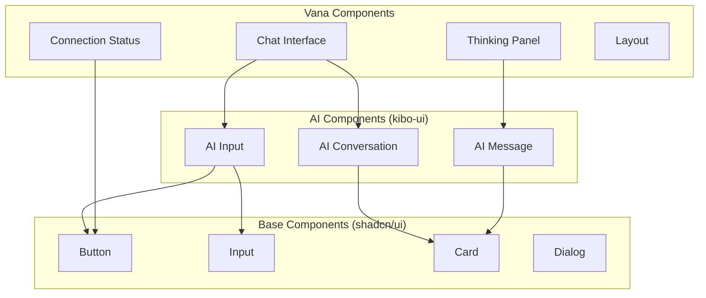

# Component Guide

This guide provides comprehensive documentation for all UI components in the Vana Frontend, including usage examples, props, and customization options.

## Table of Contents

- [Component Library Overview](#component-library-overview)
- [AI-Specific Components](#ai-specific-components)
- [Layout Components](#layout-components)
- [UI Components](#ui-components)
- [Feature Components](#feature-components)
- [Styling and Theming](#styling-and-theming)
- [Component Development Guidelines](#component-development-guidelines)

---

## Component Library Overview

The Vana Frontend uses a hybrid component library approach:

- **shadcn/ui**: Base components (buttons, inputs, dialogs)
- **kibo-ui**: AI-specific components (AI input, conversation)
- **Custom Components**: Vana-specific components (chat interface, thinking panel)

### Component Architecture



---

## AI-Specific Components

These components are designed specifically for AI interactions and agent communication.

### AIInput Suite

A comprehensive input system for AI conversations.

#### AIInput (Main Component)

```typescript
interface AIInputProps {
  // Content
  value?: string;
  placeholder?: string;
  maxLength?: number;
  
  // Behavior
  onSubmit: (message: string) => void;
  onCancel?: () => void;
  disabled?: boolean;
  loading?: boolean;
  
  // Features
  enableFileUpload?: boolean;
  enableVoiceInput?: boolean;
  enableMarkdown?: boolean;
  
  // Customization
  variant?: 'default' | 'compact' | 'full';
  className?: string;
  
  // Advanced
  modelConfig?: ModelConfig;
  tools?: Tool[];
}
```

**Usage Example:**

```tsx
import { AIInput } from '@/components/ui/kibo-ui/ai/input';

function ChatComponent() {
  const [message, setMessage] = useState('');
  const [isLoading, setIsLoading] = useState(false);
  
  const handleSubmit = async (content: string) => {
    setIsLoading(true);
    try {
      await sendMessage(content);
    } finally {
      setIsLoading(false);
    }
  };
  
  return (
    <AIInput
      value={message}
      onSubmit={handleSubmit}
      loading={isLoading}
      placeholder="Ask your AI agent anything..."
      enableFileUpload
      enableMarkdown
      variant="full"
      className="w-full"
    />
  );
}
```

#### AIInputTextarea

The core textarea component with AI-specific features.

```typescript
interface AIInputTextareaProps {
  value: string;
  onChange: (value: string) => void;
  placeholder?: string;
  maxLength?: number;
  autoResize?: boolean;
  minRows?: number;
  maxRows?: number;
  className?: string;
}
```

**Features:**
- Auto-resizing based on content
- Markdown syntax highlighting
- Smart paste handling for files/images
- Keyboard shortcuts (Cmd+Enter to submit)

#### AIInputToolbar

Toolbar with AI-specific actions and tools.

```typescript
interface AIInputToolbarProps {
  // Tools
  onFileUpload?: (files: File[]) => void;
  onVoiceInput?: () => void;
  onClearInput?: () => void;
  
  // State
  hasContent?: boolean;
  isRecording?: boolean;
  
  // Configuration
  enabledTools?: ('file' | 'voice' | 'clear')[];
  className?: string;
}
```

**Usage Example:**

```tsx
<AIInputToolbar
  onFileUpload={handleFileUpload}
  onVoiceInput={startVoiceRecording}
  onClearInput={() => setValue('')}
  hasContent={value.length > 0}
  enabledTools={['file', 'voice', 'clear']}
/>
```

### AIConversation

Component for displaying AI conversations with proper formatting.

```typescript
interface AIConversationProps {
  // Data
  messages: Message[];
  isLoading?: boolean;
  
  // Display
  showTimestamps?: boolean;
  showAvatars?: boolean;
  groupByTime?: boolean;
  
  // Interaction
  onMessageAction?: (messageId: string, action: string) => void;
  onRetry?: (messageId: string) => void;
  
  // Customization
  className?: string;
  messageClassName?: string;
  
  // Virtual scrolling
  virtualized?: boolean;
  height?: number;
}
```

**Usage Example:**

```tsx
import { AIConversation } from '@/components/ui/kibo-ui';

function ChatInterface() {
  const { messages, isLoading } = useSession();
  
  const handleMessageAction = (messageId: string, action: string) => {
    switch (action) {
      case 'copy':
        copyToClipboard(getMessageContent(messageId));
        break;
      case 'regenerate':
        regenerateMessage(messageId);
        break;
    }
  };
  
  return (
    <AIConversation
      messages={messages}
      isLoading={isLoading}
      showTimestamps
      showAvatars
      onMessageAction={handleMessageAction}
      onRetry={regenerateMessage}
      virtualized
      height={600}
      className="flex-1"
    />
  );
}
```

### AIMessage Components

Individual message components with AI-specific formatting.

#### AIMessage

```typescript
interface AIMessageProps {
  message: Message;
  showTimestamp?: boolean;
  showAvatar?: boolean;
  showActions?: boolean;
  onAction?: (action: string) => void;
  className?: string;
}
```

#### AIThinking

Shows agent thinking/processing state.

```typescript
interface AIThinkingProps {
  agent?: string;
  action?: string;
  status?: 'thinking' | 'processing' | 'complete';
  details?: string;
  showProgress?: boolean;
  className?: string;
}
```

**Usage Example:**

```tsx
<AIThinking
  agent="Research Agent"
  action="Searching for quantum computing papers"
  status="processing"
  showProgress
  className="mb-4"
/>
```

#### AIReasoning

Displays agent reasoning and step-by-step thinking.

```typescript
interface AIReasoningProps {
  steps: ReasoningStep[];
  currentStep?: number;
  expandable?: boolean;
  showConfidence?: boolean;
  className?: string;
}
```

---

## Layout Components

Components that handle application layout and structure.

### Layout (Main Layout)

The primary layout component that wraps the entire application.

```typescript
interface LayoutProps {
  children: React.ReactNode;
  sidebar?: React.ReactNode;
  header?: React.ReactNode;
  footer?: React.ReactNode;
  className?: string;
}
```

**Usage Example:**

```tsx
import { Layout } from '@/components/Layout';
import { Sidebar } from '@/components/Sidebar';
import { Header } from '@/components/Header';

function App() {
  return (
    <Layout
      header={<Header />}
      sidebar={<Sidebar />}
    >
      <main className="flex-1 p-6">
        <Routes>
          {/* Your routes */}
        </Routes>
      </main>
    </Layout>
  );
}
```

### Header

Application header with navigation and user controls.

```typescript
interface HeaderProps {
  // Navigation
  showNavigation?: boolean;
  navigationItems?: NavigationItem[];
  
  // User controls
  showUserMenu?: boolean;
  showNotifications?: boolean;
  
  // Branding
  logo?: React.ReactNode;
  title?: string;
  
  // Actions
  actions?: React.ReactNode;
  className?: string;
}
```

### Sidebar

Collapsible sidebar for navigation and additional controls.

```typescript
interface SidebarProps {
  // State
  open?: boolean;
  onToggle?: (open: boolean) => void;
  
  // Content
  items?: SidebarItem[];
  footer?: React.ReactNode;
  
  // Behavior
  collapsible?: boolean;
  defaultCollapsed?: boolean;
  
  // Styling
  variant?: 'default' | 'floating' | 'overlay';
  className?: string;
}
```

---

## UI Components

Base UI components built on shadcn/ui with Vana-specific styling.

### Button

Enhanced button component with Vana styling.

```typescript
interface ButtonProps extends React.ButtonHTMLAttributes<HTMLButtonElement> {
  variant?: 'default' | 'destructive' | 'outline' | 'secondary' | 'ghost' | 'link';
  size?: 'default' | 'sm' | 'lg' | 'icon';
  loading?: boolean;
  icon?: React.ReactNode;
  className?: string;
}
```

**Usage Example:**

```tsx
import { Button } from '@/components/ui/button';

function ActionBar() {
  return (
    <div className="flex gap-2">
      <Button variant="default" loading={isSubmitting}>
        Send Message
      </Button>
      <Button variant="outline" size="sm">
        Clear
      </Button>
      <Button variant="ghost" size="icon">
        <SettingsIcon />
      </Button>
    </div>
  );
}
```

### Card

Container component for grouping related content.

```typescript
interface CardProps {
  // Content
  title?: string;
  description?: string;
  children: React.ReactNode;
  
  // Actions
  actions?: React.ReactNode;
  onAction?: (action: string) => void;
  
  // Styling
  variant?: 'default' | 'elevated' | 'outlined';
  className?: string;
}
```

### Input

Enhanced input component with validation and styling.

```typescript
interface InputProps extends React.InputHTMLAttributes<HTMLInputElement> {
  // Validation
  error?: string;
  success?: boolean;
  
  // Enhancements
  icon?: React.ReactNode;
  suffix?: React.ReactNode;
  
  // Styling
  variant?: 'default' | 'filled' | 'outlined';
  size?: 'sm' | 'default' | 'lg';
}
```

---

## Feature Components

Complex components that implement specific application features.

### ChatInterface

The main chat interface component.

```typescript
interface ChatInterfaceProps {
  // Session
  sessionId: string;
  
  // Configuration
  config?: ChatConfig;
  placeholder?: string;
  
  // Features
  enableFileUpload?: boolean;
  enableVoiceInput?: boolean;
  showThinking?: boolean;
  showConnectionStatus?: boolean;
  
  // Events
  onMessageSent?: (message: string) => void;
  onSessionChange?: (sessionId: string) => void;
  onError?: (error: Error) => void;
  
  // Styling
  className?: string;
  height?: string;
}
```

**Complete Usage Example:**

```tsx
import { ChatInterface } from '@/components/ChatInterface';
import { useSession } from '@/contexts';

function ChatPage() {
  const { currentSession, sendMessage, error } = useSession();
  
  const handleMessageSent = async (message: string) => {
    try {
      await sendMessage(message);
    } catch (error) {
      console.error('Failed to send message:', error);
    }
  };
  
  if (!currentSession) {
    return <div>No active session</div>;
  }
  
  return (
    <div className="h-screen flex flex-col">
      <ChatInterface
        sessionId={currentSession.id}
        enableFileUpload
        enableVoiceInput
        showThinking
        showConnectionStatus
        onMessageSent={handleMessageSent}
        onError={(error) => console.error('Chat error:', error)}
        className="flex-1"
        height="100%"
      />
    </div>
  );
}
```

### ThinkingPanel

Displays agent activity and reasoning in real-time.

```typescript
interface ThinkingPanelProps {
  // Data
  activities: AgentActivity[];
  currentAgent?: string;
  
  // Display
  showDetails?: boolean;
  autoScroll?: boolean;
  maxItems?: number;
  groupByAgent?: boolean;
  
  // Interaction
  onActivityClick?: (activity: AgentActivity) => void;
  onClearHistory?: () => void;
  onExport?: () => void;
  
  // Styling
  variant?: 'panel' | 'sidebar' | 'modal';
  className?: string;
  height?: string;
}
```

**Usage Example:**

```tsx
import { ThinkingPanel } from '@/components/ThinkingPanel';
import { useSSE } from '@/contexts';

function ResearchDashboard() {
  const [activities, setActivities] = useState<AgentActivity[]>([]);
  const { subscribe } = useSSE();
  
  useEffect(() => {
    const unsubscribe = subscribe('thinking_update', (event) => {
      setActivities(prev => [...prev, event.data]);
    });
    
    return unsubscribe;
  }, [subscribe]);
  
  return (
    <div className="grid grid-cols-2 gap-4 h-screen">
      <ChatInterface sessionId="current" />
      <ThinkingPanel
        activities={activities}
        showDetails
        autoScroll
        maxItems={50}
        groupByAgent
        onClearHistory={() => setActivities([])}
        variant="sidebar"
        className="border-l"
      />
    </div>
  );
}
```

### ConnectionStatus

Shows real-time connection status with the ADK backend.

```typescript
interface ConnectionStatusProps {
  // Status
  status: ConnectionStatus;
  showDetails?: boolean;
  
  // Display
  position?: 'top-left' | 'top-right' | 'bottom-left' | 'bottom-right';
  variant?: 'badge' | 'banner' | 'modal';
  
  // Actions
  onRetry?: () => void;
  onSettings?: () => void;
  onDismiss?: () => void;
  
  // Styling
  className?: string;
}
```

**Usage Example:**

```tsx
import { ConnectionStatus } from '@/components/ConnectionStatus';
import { useSSE } from '@/contexts';

function App() {
  const { connection, reconnect } = useSSE();
  
  return (
    <div className="app">
      <ConnectionStatus
        status={connection}
        showDetails
        position="top-right"
        variant="badge"
        onRetry={reconnect}
        onSettings={() => openSettingsModal()}
      />
      {/* Rest of app */}
    </div>
  );
}
```

---

## Styling and Theming

### Theme System

The application uses a CSS variables-based theme system with semantic color naming.

#### CSS Variables

```css
:root {
  /* Background Colors */
  --background: 0 0% 10%;
  --background-element: 0 0% 18%;
  --background-input: 0 0% 23%;
  
  /* Brand Colors */
  --primary: 224 100% 75%;
  --secondary: 273 60% 70%;
  --accent: 32 90% 65%;
  
  /* Semantic Colors */
  --success: 142 76% 36%;
  --warning: 38 92% 50%;
  --error: 0 84% 60%;
  
  /* Text Colors */
  --foreground: 0 0% 95%;
  --muted-foreground: 0 0% 60%;
}
```

#### Theme Usage in Components

```tsx
// Using theme classes
<div className="bg-background text-foreground">
  <Card className="bg-background-element">
    <Button className="bg-primary text-primary-foreground">
      Primary Action
    </Button>
  </Card>
</div>

// Using CSS variables directly
<div style={{ 
  backgroundColor: 'hsl(var(--background-element))',
  color: 'hsl(var(--foreground))'
}}>
  Custom styled content
</div>
```

### Component Variants

Most components support multiple variants for different use cases:

```tsx
// Button variants
<Button variant="default">Default</Button>
<Button variant="outline">Outline</Button>
<Button variant="ghost">Ghost</Button>

// Input variants
<Input variant="default" />
<Input variant="filled" />
<Input variant="outlined" />

// Card variants
<Card variant="default">Standard card</Card>
<Card variant="elevated">Elevated card</Card>
<Card variant="outlined">Outlined card</Card>
```

### Responsive Design

Components are built with mobile-first responsive design:

```tsx
<div className="
  grid 
  grid-cols-1 
  md:grid-cols-2 
  lg:grid-cols-3 
  gap-4 
  p-4
">
  <Card className="col-span-1 md:col-span-2 lg:col-span-1">
    Mobile: full width
    Tablet: 2 columns
    Desktop: 1 column
  </Card>
</div>
```

---

## Component Development Guidelines

### Component Structure

Follow this structure when creating new components:

```typescript
// ComponentName.tsx
import React from 'react';
import { cn } from '@/lib/utils';

interface ComponentNameProps {
  // Required props first
  children: React.ReactNode;
  
  // Optional props with defaults
  variant?: 'default' | 'alternative';
  size?: 'sm' | 'md' | 'lg';
  
  // Event handlers
  onAction?: (data: any) => void;
  
  // HTML attributes (when extending HTML elements)
  className?: string;
}

const ComponentName = React.forwardRef<
  HTMLDivElement,
  ComponentNameProps
>(({ 
  children,
  variant = 'default',
  size = 'md',
  onAction,
  className,
  ...props 
}, ref) => {
  return (
    <div
      ref={ref}
      className={cn(
        // Base styles
        'component-base-styles',
        // Variant styles
        {
          'variant-styles': variant === 'default',
          'alternative-styles': variant === 'alternative',
        },
        // Size styles
        {
          'text-sm': size === 'sm',
          'text-base': size === 'md',
          'text-lg': size === 'lg',
        },
        // Custom className
        className
      )}
      {...props}
    >
      {children}
    </div>
  );
});

ComponentName.displayName = 'ComponentName';

export { ComponentName };
export type { ComponentNameProps };
```

### Best Practices

1. **TypeScript First**: Always define proper TypeScript interfaces
2. **Composition**: Use composition over inheritance
3. **Accessibility**: Include proper ARIA attributes
4. **Performance**: Use React.memo for expensive components
5. **Testing**: Write tests for complex components
6. **Documentation**: Include JSDoc comments for public APIs

### Component Testing

```typescript
// ComponentName.test.tsx
import { render, screen, fireEvent } from '@testing-library/react';
import { ComponentName } from './ComponentName';

describe('ComponentName', () => {
  it('renders children correctly', () => {
    render(<ComponentName>Test content</ComponentName>);
    expect(screen.getByText('Test content')).toBeInTheDocument();
  });
  
  it('applies variant classes correctly', () => {
    const { container } = render(
      <ComponentName variant="alternative">Content</ComponentName>
    );
    expect(container.firstChild).toHaveClass('alternative-styles');
  });
  
  it('calls onAction when interacted with', () => {
    const mockAction = jest.fn();
    render(<ComponentName onAction={mockAction}>Content</ComponentName>);
    
    fireEvent.click(screen.getByText('Content'));
    expect(mockAction).toHaveBeenCalled();
  });
});
```

### Storybook Stories

```typescript
// ComponentName.stories.tsx
import type { Meta, StoryObj } from '@storybook/react';
import { ComponentName } from './ComponentName';

const meta: Meta<typeof ComponentName> = {
  title: 'Components/ComponentName',
  component: ComponentName,
  parameters: {
    layout: 'centered',
  },
  tags: ['autodocs'],
  argTypes: {
    variant: {
      control: { type: 'select' },
      options: ['default', 'alternative'],
    },
  },
};

export default meta;
type Story = StoryObj<typeof meta>;

export const Default: Story = {
  args: {
    children: 'Default component',
  },
};

export const Alternative: Story = {
  args: {
    variant: 'alternative',
    children: 'Alternative variant',
  },
};
```

---

This component guide provides comprehensive documentation for building and using components in the Vana Frontend. For implementation details and API references, see the [API Documentation](./api.md).