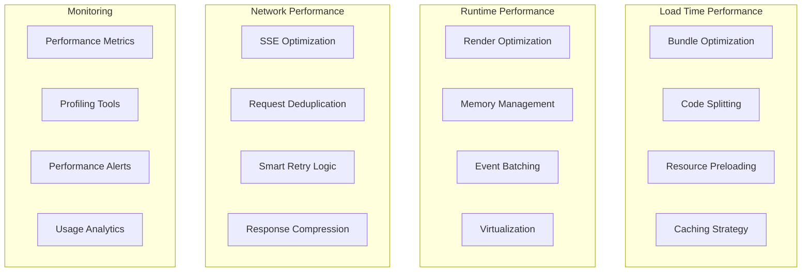

# Performance Guide

This guide covers performance optimization strategies, monitoring techniques, and best practices for the Vana Frontend application.

## Table of Contents

- [Performance Overview](#performance-overview)
- [Performance Targets](#performance-targets)
- [Optimization Strategies](#optimization-strategies)
- [Bundle Optimization](#bundle-optimization)
- [Runtime Performance](#runtime-performance)
- [Memory Management](#memory-management)
- [Monitoring and Profiling](#monitoring-and-profiling)
- [Performance Testing](#performance-testing)

---

## Performance Overview

The Vana Frontend is optimized for real-time AI interactions with demanding performance requirements:

- **Real-time Updates**: SSE streaming with minimal latency
- **Large Datasets**: Handling thousands of messages and events
- **Memory Efficiency**: Long-running sessions without memory leaks
- **Bundle Size**: Fast initial load times
- **Responsiveness**: 60fps UI updates during streaming

### Performance Architecture



---

## Performance Targets

### Core Web Vitals

| Metric | Target | Current | Description |
|--------|--------|---------|-------------|
| **First Contentful Paint (FCP)** | < 1.5s | ~1.2s | Time to first rendered content |
| **Largest Contentful Paint (LCP)** | < 2.5s | ~2.1s | Time to largest content element |
| **First Input Delay (FID)** | < 100ms | ~80ms | Time to first user interaction |
| **Cumulative Layout Shift (CLS)** | < 0.1 | ~0.05 | Visual stability metric |

### Application-Specific Metrics

| Metric | Target | Description |
|--------|--------|-------------|
| **Bundle Size** | < 200KB gzipped | Initial JavaScript bundle |
| **Time to Interactive** | < 3s | Time until app is fully interactive |
| **SSE Connection Time** | < 500ms | Time to establish SSE connection |
| **Message Render Time** | < 16ms | Time to render new message (60fps) |
| **Memory Usage** | < 100MB | Steady-state memory usage |
| **Memory Leaks** | 0 | No memory growth over time |

### Lighthouse Scores

- **Performance**: > 90
- **Accessibility**: > 95
- **Best Practices**: > 90
- **SEO**: > 85

---

## Optimization Strategies

### Component-Level Optimizations

#### React.memo for Expensive Components

```typescript
import React from 'react';

interface ExpensiveComponentProps {
  data: ComplexData[];
  onAction: (id: string) => void;
}

const ExpensiveComponent = React.memo<ExpensiveComponentProps>(({ 
  data, 
  onAction 
}) => {
  // Expensive computation
  const processedData = useMemo(() => {
    return data.map(item => ({
      ...item,
      processed: expensiveCalculation(item)
    }));
  }, [data]);
  
  return (
    <div>
      {processedData.map(item => (
        <Item 
          key={item.id} 
          data={item} 
          onAction={onAction}
        />
      ))}
    </div>
  );
}, (prevProps, nextProps) => {
  // Custom comparison for better performance
  return (
    prevProps.data.length === nextProps.data.length &&
    prevProps.data.every((item, index) => 
      item.id === nextProps.data[index].id &&
      item.version === nextProps.data[index].version
    ) &&
    prevProps.onAction === nextProps.onAction
  );
});
```

#### useCallback and useMemo Optimization

```typescript
const OptimizedComponent: React.FC<Props> = ({ items, onSelect, filter }) => {
  // Memoize expensive calculations
  const filteredItems = useMemo(() => {
    return items.filter(item => 
      item.name.toLowerCase().includes(filter.toLowerCase())
    );
  }, [items, filter]);
  
  // Memoize event handlers
  const handleItemClick = useCallback((itemId: string) => {
    onSelect(itemId);
  }, [onSelect]);
  
  // Memoize child components
  const itemComponents = useMemo(() => {
    return filteredItems.map(item => (
      <ItemComponent
        key={item.id}
        item={item}
        onClick={handleItemClick}
      />
    ));
  }, [filteredItems, handleItemClick]);
  
  return <div>{itemComponents}</div>;
};
```

### Virtual Scrolling for Large Lists

For message lists and other large datasets:

```typescript
import { FixedSizeList as List } from 'react-window';
import { useMemo } from 'react';

interface VirtualizedListProps {
  items: Message[];
  onItemAction: (id: string, action: string) => void;
}

const VirtualizedMessageList: React.FC<VirtualizedListProps> = ({ 
  items, 
  onItemAction 
}) => {
  // Memoize row renderer to prevent recreating on every render
  const Row = useMemo(() => 
    React.memo(({ index, style }: { index: number; style: CSSProperties }) => (
      <div style={style}>
        <MessageComponent 
          message={items[index]} 
          onAction={onItemAction}
        />
      </div>
    ))
  , [items, onItemAction]);
  
  return (
    <List
      height={600}
      itemCount={items.length}
      itemSize={120}
      overscanCount={5} // Render 5 extra items for smooth scrolling
      width="100%"
    >
      {Row}
    </List>
  );
};
```

### State Update Optimization

#### Batched State Updates

```typescript
import { unstable_batchedUpdates } from 'react-dom';

class EventProcessor {
  private batchedUpdates: (() => void)[] = [];
  private timeoutId: number | null = null;
  
  addUpdate(updateFn: () => void) {
    this.batchedUpdates.push(updateFn);
    
    if (!this.timeoutId) {
      this.timeoutId = window.setTimeout(() => {
        unstable_batchedUpdates(() => {
          this.batchedUpdates.forEach(update => update());
          this.batchedUpdates = [];
          this.timeoutId = null;
        });
      }, 16); // ~60fps
    }
  }
}

// Usage in SSE context
const useSSEWithBatching = () => {
  const [events, setEvents] = useState<SSEEvent[]>([]);
  const processor = useRef(new EventProcessor());
  
  useEffect(() => {
    const handleSSEEvent = (event: SSEEvent) => {
      processor.current.addUpdate(() => {
        setEvents(prev => [...prev, event]);
      });
    };
    
    // Subscribe to SSE events
    const unsubscribe = subscribeToSSE(handleSSEEvent);
    return unsubscribe;
  }, []);
  
  return events;
};
```

#### Immutable Updates with Immer

```typescript
import { produce } from 'immer';

const complexStateReducer = produce((draft: ComplexState, action: Action) => {
  switch (action.type) {
    case 'UPDATE_NESTED_ARRAY':
      const item = draft.nested.items.find(item => item.id === action.id);
      if (item) {
        item.status = action.status;
        item.updatedAt = new Date();
      }
      break;
      
    case 'ADD_TO_COLLECTION':
      draft.collections[action.collectionId].items.push(action.item);
      break;
      
    case 'BULK_UPDATE':
      action.updates.forEach(update => {
        const target = draft.data[update.id];
        if (target) {
          Object.assign(target, update.changes);
        }
      });
      break;
  }
});
```

---

## Bundle Optimization

### Code Splitting Strategies

#### Route-Based Splitting

```typescript
import { lazy, Suspense } from 'react';
import { Routes, Route } from 'react-router-dom';

// Lazy load route components
const ChatInterface = lazy(() => import('./pages/ChatInterface'));
const Settings = lazy(() => import('./pages/Settings'));
const Analytics = lazy(() => import('./pages/Analytics'));

// Loading fallback
const PageLoader = () => (
  <div className="flex items-center justify-center h-64">
    <div className="animate-spin rounded-full h-8 w-8 border-b-2 border-primary"></div>
  </div>
);

export const AppRoutes = () => (
  <Suspense fallback={<PageLoader />}>
    <Routes>
      <Route path="/" element={<ChatInterface />} />
      <Route path="/settings" element={<Settings />} />
      <Route path="/analytics" element={<Analytics />} />
    </Routes>
  </Suspense>
);
```

#### Feature-Based Splitting

```typescript
// Split large features into separate chunks
const loadAdvancedFeatures = () => import('./features/advanced');
const loadAnalytics = () => import('./features/analytics');
const loadDebugTools = process.env.NODE_ENV === 'development' 
  ? () => import('./tools/debug')
  : () => Promise.resolve({ default: () => null });

// Conditional loading based on user permissions
const loadAdminFeatures = (user: User) => {
  if (user.role === 'admin') {
    return import('./features/admin');
  }
  return Promise.resolve({ default: () => null });
};
```

#### Library Splitting

```typescript
// vite.config.ts
export default defineConfig({
  build: {
    rollupOptions: {
      output: {
        manualChunks: {
          // Vendor libraries
          'vendor-react': ['react', 'react-dom'],
          'vendor-ui': ['@radix-ui/react-dialog', '@radix-ui/react-dropdown-menu'],
          'vendor-utils': ['date-fns', 'lodash-es'],
          
          // Feature-based chunks
          'chat': ['./src/components/ChatInterface.tsx', './src/features/chat'],
          'ai-components': ['./src/components/ui/kibo-ui'],
          
          // Services
          'services': ['./src/services']
        }
      }
    }
  }
});
```

### Tree Shaking Optimization

#### Proper Import Patterns

```typescript
// ❌ Bad - imports entire library
import _ from 'lodash';
import * as dateFns from 'date-fns';

// ✅ Good - specific imports
import { debounce, throttle } from 'lodash-es';
import { format, parseISO } from 'date-fns';

// ✅ Good - destructured imports
import { Button, Input, Card } from '@/components/ui';
```

#### ESM-Compatible Libraries

```json
{
  "dependencies": {
    "lodash-es": "^4.17.21",
    "@date-fns/esm": "^2.29.3",
    "axios": "^1.4.0"
  }
}
```

### Resource Optimization

#### Image Optimization

```typescript
// Automatic image optimization with Vite
import heroImage from './assets/hero.jpg?w=800&h=600&format=webp';
import heroImageFallback from './assets/hero.jpg?w=800&h=600&format=jpeg';

const OptimizedImage: React.FC<{ alt: string }> = ({ alt }) => (
  <picture>
    <source srcSet={heroImage} type="image/webp" />
    
  </picture>
);
```

#### Font Optimization

```css
/* Preload critical fonts */
@font-face {
  font-family: 'Inter';
  src: url('./fonts/inter-var.woff2') format('woff2');
  font-weight: 100 900;
  font-display: swap;
}

/* Optimize font loading */
.font-preload {
  font-family: 'Inter', -apple-system, BlinkMacSystemFont, system-ui, sans-serif;
}
```

---

## Runtime Performance

### Event System Optimization

#### Event Debouncing and Throttling

```typescript
import { useMemo, useCallback } from 'react';
import { debounce, throttle } from 'lodash-es';

const useOptimizedEvents = () => {
  // Debounce expensive operations (search, API calls)
  const debouncedSearch = useMemo(
    () => debounce((query: string) => {
      performSearch(query);
    }, 300),
    []
  );
  
  // Throttle frequent operations (scroll, resize)
  const throttledScroll = useMemo(
    () => throttle((scrollPosition: number) => {
      updateScrollPosition(scrollPosition);
    }, 16), // 60fps
    []
  );
  
  // Cleanup on unmount
  useEffect(() => {
    return () => {
      debouncedSearch.cancel();
      throttledScroll.cancel();
    };
  }, [debouncedSearch, throttledScroll]);
  
  return { debouncedSearch, throttledScroll };
};
```

#### RequestAnimationFrame for Smooth Updates

```typescript
const useSmoothUpdates = () => {
  const rafId = useRef<number>();
  const pendingUpdates = useRef<(() => void)[]>([]);
  
  const scheduleUpdate = useCallback((updateFn: () => void) => {
    pendingUpdates.current.push(updateFn);
    
    if (!rafId.current) {
      rafId.current = requestAnimationFrame(() => {
        const updates = pendingUpdates.current.splice(0);
        updates.forEach(update => update());
        rafId.current = undefined;
      });
    }
  }, []);
  
  useEffect(() => {
    return () => {
      if (rafId.current) {
        cancelAnimationFrame(rafId.current);
      }
    };
  }, []);
  
  return scheduleUpdate;
};
```

### SSE Performance Optimization

#### Connection Pooling

```typescript
class SSEConnectionPool {
  private connections = new Map<string, SSEConnection>();
  private maxConnections = 5;
  
  async getConnection(url: string): Promise<SSEConnection> {
    // Reuse existing connection if available
    if (this.connections.has(url)) {
      const connection = this.connections.get(url)!;
      if (connection.isActive()) {
        return connection;
      }
    }
    
    // Create new connection if under limit
    if (this.connections.size < this.maxConnections) {
      const connection = await this.createConnection(url);
      this.connections.set(url, connection);
      return connection;
    }
    
    // Reuse least recently used connection
    const lruConnection = this.findLRUConnection();
    await lruConnection.reconnect(url);
    return lruConnection;
  }
  
  private findLRUConnection(): SSEConnection {
    let lruConnection: SSEConnection | null = null;
    let oldestTime = Date.now();
    
    for (const connection of this.connections.values()) {
      if (connection.lastUsed < oldestTime) {
        oldestTime = connection.lastUsed;
        lruConnection = connection;
      }
    }
    
    return lruConnection!;
  }
}
```

#### Message Batching

```typescript
class MessageBatcher {
  private messages: Message[] = [];
  private timeoutId: number | null = null;
  private readonly batchSize = 50;
  private readonly batchTimeout = 100; // ms
  
  constructor(private onFlush: (messages: Message[]) => void) {}
  
  add(message: Message) {
    this.messages.push(message);
    
    if (this.messages.length >= this.batchSize) {
      this.flush();
    } else if (!this.timeoutId) {
      this.timeoutId = window.setTimeout(() => this.flush(), this.batchTimeout);
    }
  }
  
  private flush() {
    if (this.messages.length > 0) {
      this.onFlush([...this.messages]);
      this.messages = [];
    }
    
    if (this.timeoutId) {
      clearTimeout(this.timeoutId);
      this.timeoutId = null;
    }
  }
}
```

---

## Memory Management

### Memory Leak Prevention

#### Proper Cleanup Patterns

```typescript
const useEventSubscription = (eventType: string, handler: EventHandler) => {
  useEffect(() => {
    // Subscribe to event
    const unsubscribe = eventEmitter.on(eventType, handler);
    
    // Always cleanup on unmount
    return () => {
      unsubscribe();
    };
  }, [eventType, handler]);
};

const useSSEConnection = (url: string) => {
  const [connection, setConnection] = useState<SSEConnection | null>(null);
  
  useEffect(() => {
    let isMounted = true;
    
    const connect = async () => {
      try {
        const conn = await createSSEConnection(url);
        if (isMounted) {
          setConnection(conn);
        } else {
          // Component unmounted during connection
          conn.close();
        }
      } catch (error) {
        if (isMounted) {
          console.error('SSE connection failed:', error);
        }
      }
    };
    
    connect();
    
    return () => {
      isMounted = false;
      if (connection) {
        connection.close();
      }
    };
  }, [url]);
  
  return connection;
};
```

#### WeakMap for Object References

```typescript
// Use WeakMap to avoid memory leaks with object references
const componentMetadata = new WeakMap<React.Component, ComponentMeta>();

const useComponentMetadata = (component: React.Component) => {
  if (!componentMetadata.has(component)) {
    componentMetadata.set(component, {
      createdAt: Date.now(),
      updateCount: 0
    });
  }
  
  return componentMetadata.get(component)!;
};
```

#### Memory Usage Monitoring

```typescript
class MemoryMonitor {
  private checkInterval: number | null = null;
  private readonly threshold = 100 * 1024 * 1024; // 100MB
  
  start() {
    this.checkInterval = window.setInterval(this.checkMemory, 30000); // 30s
  }
  
  stop() {
    if (this.checkInterval) {
      clearInterval(this.checkInterval);
    }
  }
  
  private checkMemory = () => {
    if ('memory' in performance) {
      const memory = (performance as any).memory;
      const usedMemory = memory.usedJSHeapSize;
      
      if (usedMemory > this.threshold) {
        console.warn(`High memory usage: ${Math.round(usedMemory / 1024 / 1024)}MB`);
        
        // Trigger garbage collection hint
        if ('gc' in window) {
          (window as any).gc();
        }
        
        // Emit warning event
        this.onMemoryWarning(usedMemory);
      }
    }
  };
  
  private onMemoryWarning(usage: number) {
    // Implement memory warning logic
    // e.g., clear caches, limit message history, etc.
  }
}
```

### Cache Management

#### LRU Cache Implementation

```typescript
class LRUCache<T> {
  private cache = new Map<string, T>();
  private maxSize: number;
  
  constructor(maxSize: number = 100) {
    this.maxSize = maxSize;
  }
  
  get(key: string): T | undefined {
    const value = this.cache.get(key);
    if (value !== undefined) {
      // Move to end (most recently used)
      this.cache.delete(key);
      this.cache.set(key, value);
    }
    return value;
  }
  
  set(key: string, value: T): void {
    if (this.cache.has(key)) {
      this.cache.delete(key);
    } else if (this.cache.size >= this.maxSize) {
      // Remove least recently used (first item)
      const firstKey = this.cache.keys().next().value;
      this.cache.delete(firstKey);
    }
    
    this.cache.set(key, value);
  }
  
  clear(): void {
    this.cache.clear();
  }
  
  size(): number {
    return this.cache.size;
  }
}
```

---

## Monitoring and Profiling

### Performance Metrics Collection

#### Core Web Vitals Monitoring

```typescript
class PerformanceMonitor {
  private observer: PerformanceObserver | null = null;
  
  start() {
    // Monitor Core Web Vitals
    this.observer = new PerformanceObserver((list) => {
      for (const entry of list.getEntries()) {
        this.reportMetric(entry);
      }
    });
    
    // Observe different entry types
    this.observer.observe({ entryTypes: ['largest-contentful-paint'] });
    this.observer.observe({ entryTypes: ['first-input'] });
    this.observer.observe({ entryTypes: ['layout-shift'] });
  }
  
  private reportMetric(entry: PerformanceEntry) {
    const metric = {
      name: entry.entryType,
      value: entry.startTime,
      timestamp: Date.now(),
      url: window.location.href
    };
    
    // Send to analytics
    this.sendToAnalytics(metric);
  }
  
  private sendToAnalytics(metric: any) {
    // Implementation depends on your analytics service
    if (typeof gtag !== 'undefined') {
      gtag('event', 'performance_metric', metric);
    }
  }
}
```

#### Custom Performance Markers

```typescript
class CustomPerformanceTracker {
  static mark(name: string) {
    performance.mark(name);
  }
  
  static measure(name: string, startMark: string, endMark?: string) {
    const endMarkName = endMark || `${startMark}-end`;
    performance.mark(endMarkName);
    
    try {
      performance.measure(name, startMark, endMarkName);
      const entries = performance.getEntriesByName(name, 'measure');
      const latestEntry = entries[entries.length - 1];
      
      console.log(`${name}: ${latestEntry.duration.toFixed(2)}ms`);
      return latestEntry.duration;
    } catch (error) {
      console.warn(`Failed to measure ${name}:`, error);
      return 0;
    }
  }
}

// Usage
CustomPerformanceTracker.mark('message-send-start');
await sendMessage(content);
CustomPerformanceTracker.measure('message-send', 'message-send-start');
```

### React DevTools Profiling

#### Profiler Component

```typescript
import { Profiler } from 'react';

const onRenderCallback = (
  id: string,
  phase: 'mount' | 'update',
  actualDuration: number,
  baseDuration: number,
  startTime: number,
  commitTime: number
) => {
  console.log('Profiler:', {
    id,
    phase,
    actualDuration,
    baseDuration,
    startTime,
    commitTime
  });
  
  // Report slow renders
  if (actualDuration > 16) { // > 16ms = < 60fps
    console.warn(`Slow render in ${id}: ${actualDuration.toFixed(2)}ms`);
  }
};

const ProfiledComponent: React.FC = ({ children }) => (
  <Profiler id="ChatInterface" onRender={onRenderCallback}>
    {children}
  </Profiler>
);
```

---

## Performance Testing

### Automated Performance Testing

#### Lighthouse CI

```yaml
# .github/workflows/performance.yml
name: Performance Tests

on:
  pull_request:
    branches: [main]

jobs:
  lighthouse:
    runs-on: ubuntu-latest
    steps:
      - uses: actions/checkout@v3
      - uses: actions/setup-node@v3
        with:
          node-version: '18'
      
      - name: Install dependencies
        run: npm ci
        
      - name: Build application
        run: npm run build
        
      - name: Serve application
        run: npm run preview &
        
      - name: Wait for server
        run: npx wait-on http://localhost:4173
        
      - name: Run Lighthouse CI
        run: |
          npm install -g @lhci/cli
          lhci autorun
        env:
          LHCI_GITHUB_APP_TOKEN: ${{ secrets.LHCI_GITHUB_APP_TOKEN }}
```

#### Bundle Size Testing

```javascript
// bundle-size.test.js
const fs = require('fs');
const path = require('path');

describe('Bundle Size', () => {
  it('should not exceed size limits', () => {
    const distPath = path.join(__dirname, '../dist');
    const files = fs.readdirSync(distPath);
    
    const jsFiles = files.filter(file => file.endsWith('.js'));
    const cssFiles = files.filter(file => file.endsWith('.css'));
    
    let totalJSSize = 0;
    let totalCSSSize = 0;
    
    jsFiles.forEach(file => {
      const stats = fs.statSync(path.join(distPath, file));
      totalJSSize += stats.size;
    });
    
    cssFiles.forEach(file => {
      const stats = fs.statSync(path.join(distPath, file));
      totalCSSSize += stats.size;
    });
    
    // Size limits (gzipped approximation: ~70% of original)
    const jsLimit = 200 * 1024 * 0.7; // ~140KB gzipped
    const cssLimit = 50 * 1024 * 0.7;  // ~35KB gzipped
    
    expect(totalJSSize).toBeLessThan(jsLimit);
    expect(totalCSSSize).toBeLessThan(cssLimit);
  });
});
```

### Load Testing

#### Simulating High-Frequency Events

```typescript
// performance/sse-load-test.ts
class SSELoadTest {
  async simulateHighFrequencyEvents(eventsPerSecond: number, duration: number) {
    const eventInterval = 1000 / eventsPerSecond;
    const endTime = Date.now() + duration * 1000;
    
    const metrics = {
      eventsProcessed: 0,
      averageProcessingTime: 0,
      memoryUsage: [],
      renderingTime: []
    };
    
    while (Date.now() < endTime) {
      const startTime = performance.now();
      
      // Simulate SSE event
      const event = this.createMockSSEEvent();
      await this.processEvent(event);
      
      const processingTime = performance.now() - startTime;
      metrics.eventsProcessed++;
      metrics.averageProcessingTime = 
        (metrics.averageProcessingTime + processingTime) / 2;
      
      // Record memory usage
      if ('memory' in performance) {
        const memory = (performance as any).memory;
        metrics.memoryUsage.push(memory.usedJSHeapSize);
      }
      
      await this.wait(eventInterval);
    }
    
    return metrics;
  }
  
  private createMockSSEEvent() {
    return {
      type: 'message_update',
      data: {
        content: 'Mock message content '.repeat(10),
        timestamp: Date.now()
      }
    };
  }
  
  private async processEvent(event: any) {
    // Simulate event processing
    return new Promise(resolve => setTimeout(resolve, Math.random() * 5));
  }
  
  private wait(ms: number) {
    return new Promise(resolve => setTimeout(resolve, ms));
  }
}
```

---

This performance guide provides comprehensive strategies for optimizing the Vana Frontend. Regular monitoring and testing ensure the application maintains high performance standards as it scales.