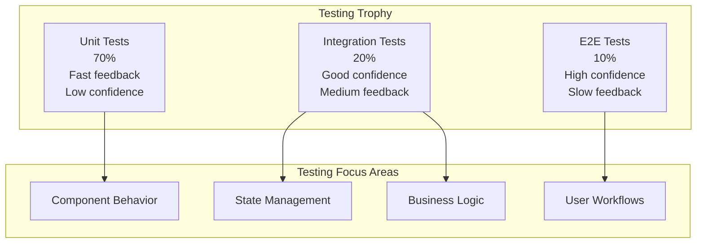

# Testing Guide

This guide covers testing strategies, patterns, and best practices for the Vana Frontend application.

## Table of Contents

- [Testing Philosophy](#testing-philosophy)
- [Testing Stack](#testing-stack)
- [Testing Types](#testing-types)
- [Component Testing](#component-testing)
- [Context Testing](#context-testing)
- [Service Testing](#service-testing)
- [Integration Testing](#integration-testing)
- [E2E Testing](#e2e-testing)
- [Testing Utilities](#testing-utilities)
- [Best Practices](#best-practices)

---

## Testing Philosophy

The Vana Frontend follows a comprehensive testing strategy based on the Testing Trophy:



### Core Principles

1. **Fast Feedback**: Unit tests provide immediate feedback during development
2. **Comprehensive Coverage**: Target 80%+ test coverage across all test types
3. **User-Centric**: Tests focus on user behavior rather than implementation details
4. **Maintainable**: Tests are easy to understand and update
5. **Reliable**: Tests are deterministic and don't flake

---

## Testing Stack

### Core Testing Tools

| Tool | Purpose | Usage |
|------|---------|-------|
| **Vitest** | Test runner and framework | Unit and integration tests |
| **React Testing Library** | Component testing utilities | DOM queries and interactions |
| **MSW** | API mocking | HTTP request interception |
| **@testing-library/user-event** | User interaction simulation | Click, type, keyboard events |
| **jsdom** | DOM environment | Browser API simulation |

### Configuration

#### Vitest Configuration

```typescript
// vitest.config.ts
import { defineConfig } from 'vitest/config';
import react from '@vitejs/plugin-react';
import { resolve } from 'path';

export default defineConfig({
  plugins: [react()],
  test: {
    globals: true,
    environment: 'jsdom',
    setupFiles: ['./src/test/setup.ts'],
    coverage: {
      provider: 'v8',
      reporter: ['text', 'json', 'html'],
      include: ['src/**/*.{ts,tsx}'],
      exclude: [
        'src/**/*.test.{ts,tsx}',
        'src/**/*.stories.{ts,tsx}',
        'src/test/**',
        'src/types/**'
      ],
      threshold: {
        global: {
          branches: 80,
          functions: 80,
          lines: 80,
          statements: 80
        }
      }
    }
  },
  resolve: {
    alias: {
      '@': resolve(__dirname, 'src')
    }
  }
});
```

#### Test Setup

```typescript
// src/test/setup.ts
import '@testing-library/jest-dom';
import { cleanup } from '@testing-library/react';
import { afterEach, beforeAll, afterAll } from 'vitest';
import { server } from './mocks/server';

// MSW server setup
beforeAll(() => server.listen());
afterEach(() => {
  cleanup();
  server.resetHandlers();
});
afterAll(() => server.close());

// Mock IntersectionObserver
global.IntersectionObserver = class IntersectionObserver {
  constructor() {}
  disconnect() {}
  observe() {}
  unobserve() {}
};

// Mock ResizeObserver
global.ResizeObserver = class ResizeObserver {
  constructor() {}
  disconnect() {}
  observe() {}
  unobserve() {}
};

// Mock matchMedia
Object.defineProperty(window, 'matchMedia', {
  writable: true,
  value: vi.fn().mockImplementation(query => ({
    matches: false,
    media: query,
    onchange: null,
    addListener: vi.fn(),
    removeListener: vi.fn(),
    addEventListener: vi.fn(),
    removeEventListener: vi.fn(),
    dispatchEvent: vi.fn(),
  })),
});
```

---

## Testing Types

### Unit Tests (70% of tests)

Focus on individual components, hooks, and utility functions in isolation.

#### Component Unit Tests

```typescript
// components/Button.test.tsx
import { render, screen } from '@testing-library/react';
import { userEvent } from '@testing-library/user-event';
import { Button } from './Button';

describe('Button', () => {
  it('renders with correct text', () => {
    render(<Button>Click me</Button>);
    expect(screen.getByRole('button', { name: 'Click me' })).toBeInTheDocument();
  });
  
  it('calls onClick when clicked', async () => {
    const handleClick = vi.fn();
    render(<Button onClick={handleClick}>Click me</Button>);
    
    await userEvent.click(screen.getByRole('button'));
    expect(handleClick).toHaveBeenCalledTimes(1);
  });
  
  it('applies variant classes correctly', () => {
    render(<Button variant="outline">Outline Button</Button>);
    expect(screen.getByRole('button')).toHaveClass('variant-outline');
  });
  
  it('is disabled when loading', () => {
    render(<Button loading>Loading Button</Button>);
    expect(screen.getByRole('button')).toBeDisabled();
  });
  
  it('shows loading spinner when loading', () => {
    render(<Button loading>Loading Button</Button>);
    expect(screen.getByTestId('loading-spinner')).toBeInTheDocument();
  });
});
```

#### Hook Unit Tests

```typescript
// hooks/useSSE.test.ts
import { renderHook, act } from '@testing-library/react';
import { useSSE } from './useSSE';
import { SSEProvider } from '@/contexts/SSEContext';

const mockSSEContext = {
  connection: { status: 'disconnected' },
  subscribe: vi.fn(),
  unsubscribe: vi.fn(),
  connect: vi.fn(),
  disconnect: vi.fn()
};

const wrapper = ({ children }: { children: React.ReactNode }) => (
  <SSEProvider value={mockSSEContext}>
    {children}
  </SSEProvider>
);

describe('useSSE', () => {
  beforeEach(() => {
    vi.clearAllMocks();
  });
  
  it('returns connection status', () => {
    const { result } = renderHook(() => useSSE(), { wrapper });
    expect(result.current.connection.status).toBe('disconnected');
  });
  
  it('subscribes to events correctly', () => {
    const { result } = renderHook(() => useSSE(), { wrapper });
    const handler = vi.fn();
    
    act(() => {
      result.current.subscribe('message_update', handler);
    });
    
    expect(mockSSEContext.subscribe).toHaveBeenCalledWith('message_update', handler);
  });
  
  it('unsubscribes on unmount', () => {
    const { result, unmount } = renderHook(() => useSSE(), { wrapper });
    const handler = vi.fn();
    
    act(() => {
      result.current.subscribe('message_update', handler);
    });
    
    unmount();
    
    expect(mockSSEContext.unsubscribe).toHaveBeenCalledWith('message_update', handler);
  });
});
```

### Integration Tests (20% of tests)

Test how multiple components work together and interact with services.

#### Context Integration Tests

```typescript
// contexts/__tests__/integration.test.tsx
import { render, screen, act } from '@testing-library/react';
import { userEvent } from '@testing-library/user-event';
import { RootProvider } from '@/contexts/RootProvider';
import { ChatInterface } from '@/components/ChatInterface';
import { server } from '@/test/mocks/server';
import { rest } from 'msw';

const TestApp = () => (
  <RootProvider>
    <ChatInterface sessionId="test-session" />
  </RootProvider>
);

describe('Context Integration', () => {
  it('handles complete message flow', async () => {
    // Mock successful message sending
    server.use(
      rest.post('/api/run_sse', (req, res, ctx) => {
        return res(
          ctx.json({
            success: true,
            messageId: 'msg-123'
          })
        );
      })
    );
    
    render(<TestApp />);
    
    // Find input and send message
    const input = screen.getByPlaceholderText(/ask your ai agent/i);
    await userEvent.type(input, 'Test message');
    await userEvent.click(screen.getByRole('button', { name: /send/i }));
    
    // Verify message appears in chat
    expect(await screen.findByText('Test message')).toBeInTheDocument();
    
    // Verify loading state
    expect(screen.getByText(/thinking/i)).toBeInTheDocument();
  });
  
  it('handles error states correctly', async () => {
    // Mock error response
    server.use(
      rest.post('/api/run_sse', (req, res, ctx) => {
        return res(
          ctx.status(500),
          ctx.json({ error: 'Server error' })
        );
      })
    );
    
    render(<TestApp />);
    
    const input = screen.getByPlaceholderText(/ask your ai agent/i);
    await userEvent.type(input, 'Test message');
    await userEvent.click(screen.getByRole('button', { name: /send/i }));
    
    // Verify error message appears
    expect(await screen.findByText(/failed to send message/i)).toBeInTheDocument();
  });
});
```

---

## Component Testing

### Testing Patterns

#### Testing Component Props

```typescript
// components/MessageComponent.test.tsx
import { render, screen } from '@testing-library/react';
import { MessageComponent } from './MessageComponent';

const mockMessage = {
  id: 'msg-1',
  role: 'user' as const,
  content: 'Hello, AI!',
  timestamp: new Date('2023-01-01T10:00:00Z')
};

describe('MessageComponent', () => {
  it('renders user message correctly', () => {
    render(<MessageComponent message={mockMessage} />);
    
    expect(screen.getByText('Hello, AI!')).toBeInTheDocument();
    expect(screen.getByText('You')).toBeInTheDocument(); // User label
  });
  
  it('renders AI message correctly', () => {
    const aiMessage = { ...mockMessage, role: 'assistant' as const };
    render(<MessageComponent message={aiMessage} />);
    
    expect(screen.getByText('AI Agent')).toBeInTheDocument(); // AI label
  });
  
  it('shows timestamp when enabled', () => {
    render(<MessageComponent message={mockMessage} showTimestamp />);
    
    expect(screen.getByText(/10:00/)).toBeInTheDocument();
  });
  
  it('hides timestamp when disabled', () => {
    render(<MessageComponent message={mockMessage} showTimestamp={false} />);
    
    expect(screen.queryByText(/10:00/)).not.toBeInTheDocument();
  });
});
```

#### Testing Component Events

```typescript
// components/ChatInput.test.tsx
import { render, screen } from '@testing-library/react';
import { userEvent } from '@testing-library/user-event';
import { ChatInput } from './ChatInput';

describe('ChatInput', () => {
  it('calls onSubmit when Enter is pressed', async () => {
    const handleSubmit = vi.fn();
    render(<ChatInput onSubmit={handleSubmit} />);
    
    const input = screen.getByRole('textbox');
    await userEvent.type(input, 'Test message{enter}');
    
    expect(handleSubmit).toHaveBeenCalledWith('Test message');
  });
  
  it('does not submit empty messages', async () => {
    const handleSubmit = vi.fn();
    render(<ChatInput onSubmit={handleSubmit} />);
    
    const input = screen.getByRole('textbox');
    await userEvent.type(input, '{enter}');
    
    expect(handleSubmit).not.toHaveBeenCalled();
  });
  
  it('clears input after submission', async () => {
    const handleSubmit = vi.fn();
    render(<ChatInput onSubmit={handleSubmit} />);
    
    const input = screen.getByRole('textbox') as HTMLTextAreaElement;
    await userEvent.type(input, 'Test message{enter}');
    
    expect(input.value).toBe('');
  });
});
```

#### Testing Component State

```typescript
// components/ThinkingPanel.test.tsx
import { render, screen } from '@testing-library/react';
import { userEvent } from '@testing-library/user-event';
import { ThinkingPanel } from './ThinkingPanel';

const mockActivities = [
  {
    id: '1',
    agent: 'Research Agent',
    action: 'Searching',
    status: 'running' as const,
    startTime: new Date()
  },
  {
    id: '2',
    agent: 'Writer Agent',
    action: 'Composing',
    status: 'completed' as const,
    startTime: new Date(),
    endTime: new Date()
  }
];

describe('ThinkingPanel', () => {
  it('renders all activities', () => {
    render(<ThinkingPanel activities={mockActivities} />);
    
    expect(screen.getByText('Research Agent')).toBeInTheDocument();
    expect(screen.getByText('Writer Agent')).toBeInTheDocument();
  });
  
  it('shows/hides details when toggled', async () => {
    render(<ThinkingPanel activities={mockActivities} showDetails />);
    
    const toggleButton = screen.getByRole('button', { name: /hide details/i });
    await userEvent.click(toggleButton);
    
    expect(screen.getByRole('button', { name: /show details/i })).toBeInTheDocument();
  });
  
  it('filters activities by status', () => {
    render(
      <ThinkingPanel 
        activities={mockActivities} 
        filter={{ status: 'completed' }}
      />
    );
    
    expect(screen.getByText('Writer Agent')).toBeInTheDocument();
    expect(screen.queryByText('Research Agent')).not.toBeInTheDocument();
  });
});
```

---

## Context Testing

### Testing Context Providers

```typescript
// contexts/__tests__/AuthContext.test.tsx
import { render, screen, act } from '@testing-library/react';
import { userEvent } from '@testing-library/user-event';
import { AuthProvider, useAuth } from '../AuthContext';
import { server } from '@/test/mocks/server';
import { rest } from 'msw';

const TestComponent = () => {
  const { user, signIn, signOut, isLoading } = useAuth();
  
  return (
    <div>
      {isLoading && <div>Loading...</div>}
      {user ? (
        <div>
          <span>Welcome, {user.name}</span>
          <button onClick={signOut}>Sign Out</button>
        </div>
      ) : (
        <button onClick={() => signIn({ email: 'test@example.com', password: 'password' })}>
          Sign In
        </button>
      )}
    </div>
  );
};

const renderWithProvider = () =>
  render(
    <AuthProvider>
      <TestComponent />
    </AuthProvider>
  );

describe('AuthContext', () => {
  beforeEach(() => {
    localStorage.clear();
  });
  
  it('starts with no user', () => {
    renderWithProvider();
    expect(screen.getByRole('button', { name: /sign in/i })).toBeInTheDocument();
  });
  
  it('signs in successfully', async () => {
    server.use(
      rest.post('/api/auth/signin', (req, res, ctx) => {
        return res(
          ctx.json({
            user: { id: '1', name: 'Test User', email: 'test@example.com' },
            token: 'mock-token'
          })
        );
      })
    );
    
    renderWithProvider();
    
    await userEvent.click(screen.getByRole('button', { name: /sign in/i }));
    
    expect(screen.getByText('Loading...')).toBeInTheDocument();
    expect(await screen.findByText('Welcome, Test User')).toBeInTheDocument();
  });
  
  it('handles sign in errors', async () => {
    server.use(
      rest.post('/api/auth/signin', (req, res, ctx) => {
        return res(
          ctx.status(401),
          ctx.json({ error: 'Invalid credentials' })
        );
      })
    );
    
    renderWithProvider();
    
    await userEvent.click(screen.getByRole('button', { name: /sign in/i }));
    
    expect(await screen.findByText(/invalid credentials/i)).toBeInTheDocument();
  });
  
  it('persists user in localStorage', async () => {
    const mockUser = { id: '1', name: 'Test User', email: 'test@example.com' };
    
    server.use(
      rest.post('/api/auth/signin', (req, res, ctx) => {
        return res(ctx.json({ user: mockUser, token: 'mock-token' }));
      })
    );
    
    renderWithProvider();
    
    await userEvent.click(screen.getByRole('button', { name: /sign in/i }));
    await screen.findByText('Welcome, Test User');
    
    expect(JSON.parse(localStorage.getItem('vana_user') || '{}')).toEqual(mockUser);
  });
});
```

### Testing Context Interactions

```typescript
// contexts/__tests__/SessionContext.test.tsx
import { render, screen, act } from '@testing-library/react';
import { SessionProvider, useSession } from '../SessionContext';
import { SSEProvider } from '../SSEContext';
import { createMockSSEContext } from '@/test/utils/mock-services';

const mockSSEContext = createMockSSEContext();

const TestComponent = () => {
  const { createSession, sendMessage, currentSession, messages } = useSession();
  
  return (
    <div>
      <button onClick={() => createSession({ title: 'Test Session' })}>
        Create Session
      </button>
      <button onClick={() => sendMessage('Test message')}>
        Send Message
      </button>
      {currentSession && <div>Session: {currentSession.title}</div>}
      {messages.map(msg => (
        <div key={msg.id}>{msg.content}</div>
      ))}
    </div>
  );
};

const renderWithProviders = () =>
  render(
    <SSEProvider value={mockSSEContext}>
      <SessionProvider>
        <TestComponent />
      </SessionProvider>
    </SSEProvider>
  );

describe('SessionContext', () => {
  beforeEach(() => {
    vi.clearAllMocks();
  });
  
  it('creates session and updates context', async () => {
    renderWithProviders();
    
    await userEvent.click(screen.getByRole('button', { name: /create session/i }));
    
    expect(await screen.findByText('Session: Test Session')).toBeInTheDocument();
  });
  
  it('sends message and subscribes to SSE updates', async () => {
    renderWithProviders();
    
    // Create session first
    await userEvent.click(screen.getByRole('button', { name: /create session/i }));
    await screen.findByText('Session: Test Session');
    
    // Send message
    await userEvent.click(screen.getByRole('button', { name: /send message/i }));
    
    // Verify SSE subscription
    expect(mockSSEContext.subscribe).toHaveBeenCalledWith(
      'message_update',
      expect.any(Function)
    );
  });
});
```

---

## Service Testing

### Testing Service Classes

```typescript
// services/__tests__/adk-client.test.ts
import { ADKClient } from '../adk-client';
import { createMockServices } from '@/test/utils/mock-services';

describe('ADKClient', () => {
  let client: ADKClient;
  let mockServices: ReturnType<typeof createMockServices>;
  
  beforeEach(() => {
    mockServices = createMockServices();
    client = new ADKClient(mockServices);
  });
  
  afterEach(() => {
    vi.clearAllMocks();
  });
  
  it('initializes successfully', async () => {
    mockServices.session.createSession.mockResolvedValue({
      id: 'session-1',
      userId: 'user-1',
      createdAt: new Date()
    });
    
    await client.initialize('user-1');
    
    expect(mockServices.session.createSession).toHaveBeenCalledWith('user-1');
    expect(client.isConnected()).toBe(true);
  });
  
  it('sends message and triggers SSE connection', async () => {
    await client.initialize('user-1');
    
    mockServices.sse.connect.mockResolvedValue({
      id: 'conn-1',
      status: 'connected'
    });
    
    await client.sendMessage('Test message');
    
    expect(mockServices.sse.connect).toHaveBeenCalledWith(
      expect.objectContaining({
        body: expect.objectContaining({
          newMessage: {
            parts: [{ text: 'Test message' }],
            role: 'user'
          }
        })
      })
    );
  });
  
  it('handles errors gracefully', async () => {
    mockServices.session.createSession.mockRejectedValue(
      new Error('Session creation failed')
    );
    
    await expect(client.initialize('user-1')).rejects.toThrow('Session creation failed');
    expect(client.isConnected()).toBe(false);
  });
  
  it('emits events correctly', async () => {
    await client.initialize('user-1');
    
    const eventHandler = vi.fn();
    client.on('message_update', eventHandler);
    
    // Simulate SSE event
    const mockEvent = {
      type: 'message_update',
      data: { content: 'Response chunk' }
    };
    
    mockServices.sse.emit('event', mockEvent);
    
    expect(eventHandler).toHaveBeenCalledWith(mockEvent.data);
  });
});
```

### Testing Async Services

```typescript
// services/__tests__/session-service.test.ts
import { SessionService } from '../session-service';
import { rest } from 'msw';
import { server } from '@/test/mocks/server';

describe('SessionService', () => {
  let service: SessionService;
  
  beforeEach(() => {
    service = new SessionService({
      apiUrl: 'http://localhost:8000',
      maxRetries: 3
    });
  });
  
  it('creates session via API', async () => {
    const mockSession = {
      id: 'session-1',
      userId: 'user-1',
      createdAt: '2023-01-01T00:00:00Z'
    };
    
    server.use(
      rest.post('http://localhost:8000/api/sessions', (req, res, ctx) => {
        return res(ctx.json(mockSession));
      })
    );
    
    const session = await service.createSession('user-1');
    
    expect(session).toEqual({
      ...mockSession,
      createdAt: new Date(mockSession.createdAt)
    });
  });
  
  it('retries on failure', async () => {
    let attemptCount = 0;
    
    server.use(
      rest.post('http://localhost:8000/api/sessions', (req, res, ctx) => {
        attemptCount++;
        if (attemptCount < 3) {
          return res(ctx.status(500));
        }
        return res(ctx.json({ id: 'session-1', userId: 'user-1' }));
      })
    );
    
    const session = await service.createSession('user-1');
    
    expect(attemptCount).toBe(3);
    expect(session.id).toBe('session-1');
  });
  
  it('saves to localStorage on creation', async () => {
    server.use(
      rest.post('http://localhost:8000/api/sessions', (req, res, ctx) => {
        return res(ctx.json({ id: 'session-1', userId: 'user-1' }));
      })
    );
    
    await service.createSession('user-1');
    
    const savedSession = localStorage.getItem('vana_session');
    expect(JSON.parse(savedSession || '{}')).toMatchObject({
      id: 'session-1',
      userId: 'user-1'
    });
  });
});
```

---

## Testing Utilities

### Custom Render Helpers

```typescript
// test/utils/render-helpers.tsx
import React from 'react';
import { render, RenderOptions } from '@testing-library/react';
import { RootProvider } from '@/contexts/RootProvider';
import { BrowserRouter } from 'react-router-dom';

interface CustomRenderOptions extends Omit<RenderOptions, 'wrapper'> {
  initialEntries?: string[];
  withRouter?: boolean;
  contextValues?: {
    auth?: Partial<AuthContextValue>;
    session?: Partial<SessionContextValue>;
    sse?: Partial<SSEContextValue>;
  };
}

const AllTheProviders: React.FC<{
  children: React.ReactNode;
  options?: CustomRenderOptions;
}> = ({ children, options = {} }) => {
  const { withRouter = true, initialEntries = ['/'] } = options;
  
  const content = withRouter ? (
    <BrowserRouter>
      {children}
    </BrowserRouter>
  ) : children;
  
  return (
    <RootProvider>
      {content}
    </RootProvider>
  );
};

export const customRender = (
  ui: React.ReactElement,
  options: CustomRenderOptions = {}
) => {
  return render(ui, {
    wrapper: (props) => <AllTheProviders {...props} options={options} />,
    ...options
  });
};

// Re-export everything
export * from '@testing-library/react';
export { customRender as render };
```

### Mock Service Factory

```typescript
// test/utils/mock-services.ts
import { vi } from 'vitest';
import type { ADKServices } from '@/services';

export const createMockServices = (): jest.Mocked<ADKServices> => ({
  session: {
    createSession: vi.fn(),
    getSession: vi.fn(),
    updateSession: vi.fn(),
    deleteSession: vi.fn(),
    saveToStorage: vi.fn(),
    loadFromStorage: vi.fn(),
    clearStorage: vi.fn()
  },
  sse: {
    connect: vi.fn(),
    disconnect: vi.fn(),
    getActiveConnections: vi.fn(),
    subscribe: vi.fn(),
    unsubscribe: vi.fn(),
    getConnectionStatus: vi.fn(),
    on: vi.fn(),
    off: vi.fn(),
    emit: vi.fn()
  },
  transformer: {
    transformToADKRequest: vi.fn(),
    transformFromADKEvent: vi.fn(),
    transformThinkingUpdate: vi.fn(),
    transformMessageUpdate: vi.fn(),
    transformWorkflowUpdate: vi.fn()
  },
  store: {
    addEvent: vi.fn(),
    getEvents: vi.fn(),
    clearEvents: vi.fn(),
    getSessionEvents: vi.fn(),
    clearSessionEvents: vi.fn(),
    enableDebugMode: vi.fn(),
    disableDebugMode: vi.fn(),
    getDebugInfo: vi.fn(),
    exportEvents: vi.fn()
  }
});

export const createMockSSEContext = () => ({
  connection: { status: 'connected' as const },
  isConnected: true,
  reconnectAttempts: 0,
  subscribe: vi.fn(() => vi.fn()), // Returns unsubscribe function
  unsubscribe: vi.fn(),
  connect: vi.fn(),
  disconnect: vi.fn(),
  reconnect: vi.fn(),
  getRecentEvents: vi.fn(() => []),
  clearEventHistory: vi.fn()
});
```

### Event Simulators

```typescript
// test/utils/event-simulators.ts
import type { SSEEvent, UIEvent } from '@/types';

export class SSEEventSimulator {
  static createMessageUpdate(content: string, isComplete = false): SSEEvent {
    return {
      id: `event-${Date.now()}`,
      event: 'message_update',
      data: {
        content,
        isComplete,
        timestamp: new Date().toISOString()
      },
      timestamp: new Date(),
      retry: 0
    };
  }
  
  static createThinkingUpdate(agent: string, action: string): SSEEvent {
    return {
      id: `event-${Date.now()}`,
      event: 'thinking_update',
      data: {
        agent,
        action,
        status: 'running',
        timestamp: new Date().toISOString()
      },
      timestamp: new Date(),
      retry: 0
    };
  }
  
  static createWorkflowUpdate(phase: string, progress: number): SSEEvent {
    return {
      id: `event-${Date.now()}`,
      event: 'workflow_update',
      data: {
        phase,
        progress,
        currentStep: `Step in ${phase}`,
        timestamp: new Date().toISOString()
      },
      timestamp: new Date(),
      retry: 0
    };
  }
  
  static createErrorEvent(error: string): SSEEvent {
    return {
      id: `event-${Date.now()}`,
      event: 'error',
      data: {
        error,
        timestamp: new Date().toISOString()
      },
      timestamp: new Date(),
      retry: 0
    };
  }
}

export class UserEventSimulator {
  static async sendMessage(input: HTMLElement, message: string) {
    const { userEvent } = await import('@testing-library/user-event');
    await userEvent.clear(input);
    await userEvent.type(input, message);
    await userEvent.keyboard('{Enter}');
  }
  
  static async uploadFile(input: HTMLInputElement, file: File) {
    const { userEvent } = await import('@testing-library/user-event');
    await userEvent.upload(input, file);
  }
  
  static async clickAndWait(element: HTMLElement, delay = 100) {
    const { userEvent } = await import('@testing-library/user-event');
    await userEvent.click(element);
    await new Promise(resolve => setTimeout(resolve, delay));
  }
}
```

---

## Best Practices

### Test Organization

#### Descriptive Test Names

```typescript
// ✅ Good - describes what the test does
describe('ChatInput', () => {
  it('submits message when Enter key is pressed', () => {});
  it('does not submit empty messages', () => {});
  it('clears input after successful submission', () => {});
  it('shows error message when submission fails', () => {});
});

// ❌ Bad - unclear what the test does
describe('ChatInput', () => {
  it('works correctly', () => {});
  it('handles enter', () => {});
  it('test submit', () => {});
});
```

#### Test Structure (AAA Pattern)

```typescript
it('submits message when Enter key is pressed', async () => {
  // Arrange
  const handleSubmit = vi.fn();
  render(<ChatInput onSubmit={handleSubmit} />);
  const input = screen.getByRole('textbox');
  
  // Act
  await userEvent.type(input, 'Test message{enter}');
  
  // Assert
  expect(handleSubmit).toHaveBeenCalledWith('Test message');
});
```

### Test Data Management

#### Test Factories

```typescript
// test/factories/message-factory.ts
export const MessageFactory = {
  build: (overrides: Partial<Message> = {}): Message => ({
    id: `msg-${Math.random().toString(36).substr(2, 9)}`,
    role: 'user',
    content: 'Test message',
    timestamp: new Date(),
    ...overrides
  }),
  
  buildMany: (count: number, overrides: Partial<Message> = {}): Message[] => {
    return Array.from({ length: count }, (_, index) =>
      MessageFactory.build({ ...overrides, id: `msg-${index}` })
    );
  },
  
  userMessage: (content: string): Message =>
    MessageFactory.build({ role: 'user', content }),
    
  aiMessage: (content: string): Message =>
    MessageFactory.build({ role: 'assistant', content })
};

// Usage
const messages = MessageFactory.buildMany(5);
const userMsg = MessageFactory.userMessage('Hello, AI!');
```

### Mock Management

#### Smart Mocks

```typescript
// test/mocks/smart-mocks.ts
export class SmartADKClientMock {
  private messages: Message[] = [];
  private eventHandlers = new Map<string, Function[]>();
  
  async sendMessage(content: string): Promise<void> {
    // Add user message
    const userMessage = MessageFactory.userMessage(content);
    this.messages.push(userMessage);
    
    // Simulate processing delay
    await new Promise(resolve => setTimeout(resolve, 10));
    
    // Add AI response
    const aiMessage = MessageFactory.aiMessage(`Response to: ${content}`);
    this.messages.push(aiMessage);
    
    // Emit events
    this.emit('message_update', { message: aiMessage });
  }
  
  on(event: string, handler: Function): void {
    if (!this.eventHandlers.has(event)) {
      this.eventHandlers.set(event, []);
    }
    this.eventHandlers.get(event)!.push(handler);
  }
  
  private emit(event: string, data: any): void {
    const handlers = this.eventHandlers.get(event) || [];
    handlers.forEach(handler => handler(data));
  }
  
  getMessages(): Message[] {
    return [...this.messages];
  }
  
  reset(): void {
    this.messages = [];
    this.eventHandlers.clear();
  }
}
```

### Performance Testing

#### Measuring Render Performance

```typescript
// test/performance/render-performance.test.ts
import { render } from '@testing-library/react';
import { MessageList } from '@/components/MessageList';
import { MessageFactory } from '@/test/factories';

describe('MessageList Performance', () => {
  it('renders large message list efficiently', () => {
    const messages = MessageFactory.buildMany(1000);
    
    const startTime = performance.now();
    render(<MessageList messages={messages} />);
    const endTime = performance.now();
    
    const renderTime = endTime - startTime;
    expect(renderTime).toBeLessThan(100); // 100ms threshold
  });
  
  it('updates efficiently when new message is added', () => {
    const initialMessages = MessageFactory.buildMany(500);
    const { rerender } = render(<MessageList messages={initialMessages} />);
    
    const startTime = performance.now();
    const updatedMessages = [...initialMessages, MessageFactory.build()];
    rerender(<MessageList messages={updatedMessages} />);
    const endTime = performance.now();
    
    const updateTime = endTime - startTime;
    expect(updateTime).toBeLessThan(16); // 60fps = ~16ms per frame
  });
});
```

---

This testing guide provides comprehensive strategies for testing the Vana Frontend. Regular testing ensures code quality, prevents regressions, and builds confidence in the application's reliability.