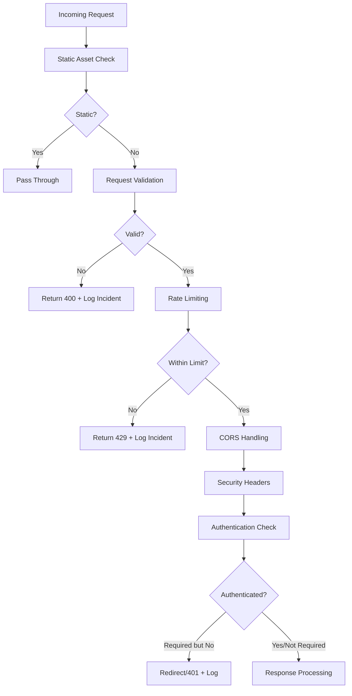

# Security Middleware Implementation Guide

## Overview

The enhanced `middleware-working.ts` provides comprehensive security protection for the Vana frontend application. This middleware implements multiple layers of security controls that work together to protect against various attack vectors.

## Security Features Implemented

### 1. Content Security Policy (CSP)
- **Strict nonce-based CSP** with dynamic nonce generation
- **Environment-aware policies** (development vs production)
- **SSE endpoint support** in connect-src directives
- **Sandboxed script execution** with strict-dynamic
- **CSP violation reporting** to `/api/csp-report`

### 2. Rate Limiting
- **Endpoint-specific rate limits**:
  - API endpoints: 100 requests/minute
  - SSE connections: 10 connections/minute  
  - Auth endpoints: 20 requests/5 minutes
  - Default: 200 requests/minute
- **IP-based tracking** with proper proxy header support
- **Automatic cleanup** of expired rate limit entries
- **Rate limit headers** in responses (X-RateLimit-*)

### 3. CORS Configuration
- **SSE-specific CORS headers** with proper credentials support
- **Environment-aware origin validation**
- **Preflight request handling** (OPTIONS method)
- **Endpoint-type specific configurations**
- **Long-lived preflight caching** for performance

### 4. Request Validation
- **SQL injection detection** using pattern matching
- **XSS attempt detection** in URLs and headers
- **Path traversal protection** against directory attacks
- **Command injection prevention** 
- **Suspicious header validation**
- **Risk level assessment** (low, medium, high)

### 5. Authentication Middleware
- **Multi-token support** (cookies, bearer tokens)
- **JWT payload validation** (Edge Runtime compatible)
- **Token expiration checking**
- **Role-based access control** for admin routes
- **Automatic token cleanup** on expiration/invalidity
- **Authentication status propagation** via headers

### 6. Security Logging and Monitoring
- **Comprehensive incident logging** with structured data
- **IP-based incident tracking** with risk escalation
- **Attack pattern detection** and alerting
- **Security event correlation**
- **Development-friendly logging** with production readiness

## Architecture



## Configuration

### Rate Limits
```typescript
const RATE_LIMITS = {
  api: { requests: 100, window: 60000 },     // 100/min for API
  sse: { requests: 10, window: 60000 },      // 10/min for SSE  
  auth: { requests: 20, window: 300000 },    // 20/5min for auth
  default: { requests: 200, window: 60000 }  // 200/min default
};
```

### Security Patterns
```typescript
const SECURITY_PATTERNS = {
  sqlInjection: /(union|select|insert|update|delete|drop|create|alter|exec|script)/i,
  xss: /<script|javascript:|on\w+=/i,
  pathTraversal: /\.\.[\\/\\]|\.[\\/\\]\.[\\/\\]/,
  commandInjection: /[;&|`$(){}\\[\\]]/,
  suspiciousHeaders: /[<>"']/
};
```

### Public Routes
```typescript
const PUBLIC_ROUTES = [
  '/', '/auth/login', '/auth/callback', '/auth/error',
  '/terms', '/privacy', '/support',
  '/api/auth/token', '/api/auth/refresh', 
  '/api/auth/logout', '/api/auth/cookie',
  '/api/csp-report'
];
```

## Security Headers Applied

### Core Security Headers
- `Content-Security-Policy`: Comprehensive CSP with nonce support
- `X-Content-Type-Options`: nosniff (prevent MIME type sniffing)
- `X-Frame-Options`: DENY (prevent clickjacking)
- `Referrer-Policy`: strict-origin-when-cross-origin
- `Strict-Transport-Security`: HTTPS enforcement (production only)

### Cross-Origin Policies
- `Cross-Origin-Embedder-Policy`: credentialless
- `Cross-Origin-Opener-Policy`: same-origin
- `Cross-Origin-Resource-Policy`: same-site

### Permissions Policy
Restricts browser features: camera, microphone, geolocation, payment, USB, sensors, interest-cohort (FLoC disabled).

### Rate Limiting Headers
- `X-RateLimit-Limit`: Maximum requests allowed
- `X-RateLimit-Remaining`: Remaining requests in window
- `X-RateLimit-Reset`: Window reset timestamp
- `Retry-After`: Seconds until retry allowed (on 429)

## SSE Endpoint Protection

### Special CORS Configuration
```typescript
// SSE-specific headers
headers['Cache-Control'] = 'no-cache';
headers['Connection'] = 'keep-alive';
headers['X-Accel-Buffering'] = 'no';
headers['Access-Control-Allow-Headers'] = [
  'Cache-Control', 'Authorization', 'Content-Type', 
  'Last-Event-ID', 'Accept'
].join(', ');
```

### CSP Integration
SSE endpoints are explicitly allowed in the `connect-src` directive:
```
connect-src 'self' http://localhost:8000/agent_network_sse 
           http://localhost:8000/agent_network_events 
           http://localhost:8000/api/sse
```

## Security Incident Logging

### Incident Types Tracked
- `REQUEST_VALIDATION_FAILED`: Malicious patterns detected
- `SUSPICIOUS_REQUEST`: Medium/high risk requests
- `RATE_LIMIT_EXCEEDED`: Rate limiting violations
- `UNAUTHENTICATED_ACCESS_ATTEMPT`: Auth required but missing
- `EXPIRED_TOKEN_ACCESS`: Expired token usage
- `UNAUTHORIZED_ADMIN_ACCESS`: Admin route access denied
- `AUTHENTICATION_ERROR`: Token validation failures

### Log Structure
```typescript
{
  timestamp: "2023-XX-XXTXX:XX:XX.XXXZ",
  clientIP: "192.168.1.100", 
  userAgent: "Mozilla/5.0...",
  url: "https://example.com/api/endpoint",
  method: "POST",
  incidentType: "REQUEST_VALIDATION_FAILED",
  incidentCount: 1,
  // ... additional incident-specific details
}
```

### Risk Escalation
- **Single incidents**: Logged as warnings
- **5+ incidents from same IP**: Flagged as high risk
- **Automatic tracking**: Per-IP incident counters
- **Production integration**: Ready for external logging services

## Authentication Flow

### Token Sources (Priority Order)
1. **Authorization header**: `Bearer <token>`
2. **id_token cookie**: JWT ID token
3. **access_token cookie**: Access token

### JWT Validation
- **Edge Runtime compatible**: No external dependencies
- **Safe base64 decoding**: Proper padding handling
- **Expiration checking**: Time-based validation
- **Role extraction**: For authorization decisions

### Admin Route Protection
- **Prefix-based**: `/admin/*` routes
- **Role requirement**: `admin` role in JWT payload
- **Defense in depth**: Both middleware and route-level checks

## Monitoring and Debugging

### Development Logging
```bash
🔒 Middleware running for: /api/test from IP: 192.168.1.100
✅ API request processed: POST /api/test from 192.168.1.100
🔐 Authenticated request: user@example.com -> /dashboard
```

### Production Logging
- **Structured JSON logs**: For external log aggregation
- **Security incident alerts**: For SOC/SIEM integration
- **Performance metrics**: Rate limit efficiency
- **CSP violation reports**: Via `/api/csp-report`

## Performance Considerations

### Edge Runtime Optimization
- **No external dependencies**: All functionality built-in
- **Efficient pattern matching**: Compiled regex patterns
- **Memory management**: Automatic rate limit cleanup
- **Minimal overhead**: Early static asset bypass

### Caching Strategy
- **Rate limit storage**: In-memory with TTL
- **CSP nonce generation**: Per-request unique values
- **CORS preflight caching**: 1-24 hour cache headers
- **Header reuse**: Efficient header object construction

## Production Deployment

### Environment Variables
```bash
NODE_ENV=production
FRONTEND_URL=https://yourdomain.com
BACKEND_URL=https://api.yourdomain.com
BACKEND_WSS_URL=wss://api.yourdomain.com
```

### Redis Integration (Recommended)
For production deployments, replace in-memory storage:
```typescript
// Replace rateLimitStore with Redis client
const redis = new Redis(process.env.REDIS_URL);

// Store rate limits in Redis with TTL
await redis.setex(`rate_limit:${key}`, ttl, JSON.stringify(data));
```

### Monitoring Integration
```typescript
// Example: DataDog integration
import { StatsD } from 'hot-shots';
const statsd = new StatsD();

// Log metrics
statsd.increment('security.incident', 1, [`type:${incidentType}`]);
statsd.histogram('security.rate_limit.usage', remaining);
```

## Testing

### Unit Tests
The included test suite (`__tests__/middleware-security.test.ts`) covers:
- IP address extraction from various headers
- Rate limiting functionality with time windows
- Request validation against malicious patterns
- CORS header generation for different endpoint types
- Authentication flow with valid/invalid tokens
- Security header application

### Integration Testing
```bash
cd frontend
npm test middleware-security.test.ts
```

### Manual Security Testing
```bash
# Test rate limiting
for i in {1..101}; do curl -H "X-Forwarded-For: 192.168.1.1" http://localhost:3000/api/test; done

# Test SQL injection detection  
curl "http://localhost:3000/api/test?id=1' UNION SELECT * FROM users--"

# Test XSS detection
curl "http://localhost:3000/api/test?data=<script>alert(1)</script>"
```

## Security Best Practices

### Recommended Additions
1. **Web Application Firewall (WAF)**: Add Cloudflare/AWS WAF for additional protection
2. **DDoS Protection**: Implement upstream DDoS mitigation
3. **SSL/TLS Configuration**: Use proper SSL configuration with HSTS
4. **Security Scanning**: Regular vulnerability assessments
5. **Log Monitoring**: Real-time security event monitoring

### Compliance Considerations
- **GDPR**: IP address logging requires proper privacy notices
- **CCPA**: User data handling in security logs
- **SOX**: Audit trail requirements for financial data
- **HIPAA**: Enhanced protection for healthcare applications

## Troubleshooting

### Common Issues

#### CSP Violations
```javascript
// Check browser console for CSP errors
// Verify nonce propagation to components
console.log(document.querySelector('[nonce]')?.getAttribute('nonce'));
```

#### CORS Errors
```javascript
// Check preflight request handling
// Verify origin in allowed origins list
// Confirm SSE endpoint CORS headers
```

#### Rate Limit Issues
```javascript
// Check rate limit headers in response
// Verify IP address extraction
// Monitor rate limit storage
```

#### Authentication Failures
```javascript
// Check JWT token format and expiration
// Verify cookie security settings
// Confirm token in correct header/cookie
```

This comprehensive security middleware provides enterprise-grade protection while maintaining performance and usability. Regular security audits and updates are recommended to stay current with emerging threats.