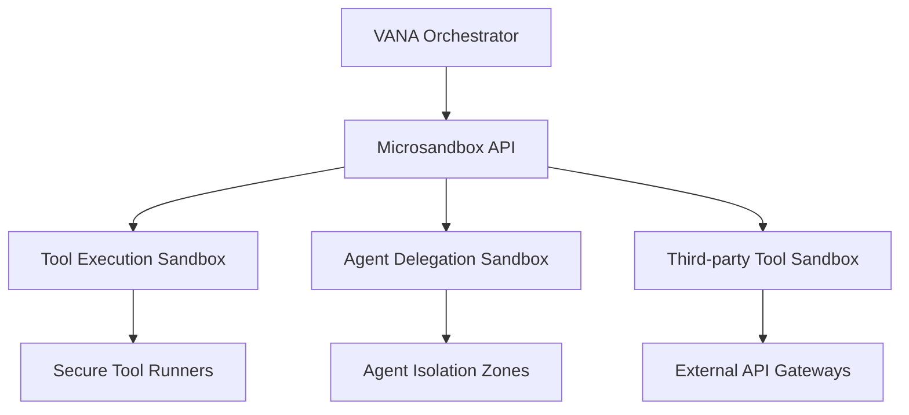

# Microsandbox Integration Plan for VANA Agent System

## 1. System Architecture

## 2. Implementation Steps

### Phase 1: Core Integration
1. **Sandbox API Layer** (New module in `lib/mcp_server/`)
   - Create `sandbox_api.py` with secure invocation methods
   - Implement sandbox lifecycle management

2. **Tool Execution Wrappers** (Modify `lib/_tools/`)
   - Add sandbox invocation to:
     - `adk_execute_third_party_tool`
     - `adk_code_generation_tool`
     - `adk_web_search_tool`

3. **Agent Delegation Security** (Modify `adk_transfer_to_agent`)
   - Add sandbox isolation for agent-to-agent communication
   - Implement permission-based agent interaction model

### Phase 2: Security Enhancement
1. **Resource Isolation**
   - Filesystem isolation for file operations
   - Network restrictions for web tools
   - Memory limits for code generation

2. **Monitoring Integration**
   - Connect to existing `monitoring_agent`
   - Add sandbox-specific metrics to dashboard

### Phase 3: Performance Optimization
1. Sandbox pooling for frequent operations
2. Caching mechanisms for repeated tool executions
3. Async sandbox operations for long-running tasks

## 3. Security Implications

### Benefits:
- ✅ Isolate third-party code execution
- ✅ Prevent tool chain attacks
- ✅ Contain agent privilege escalation

### Risks:
- ⚠️ Added complexity in debugging
- ⚠️ Potential performance overhead
- ⚠️ Sandbox escape vulnerabilities

### Mitigations:
- Use hardware-assisted virtualization
- Implement strict resource quotas
- Add layered security audits

## 4. Compatibility Assessment

### Well-suited Components:
- Third-party tool execution
- Code generation outputs
- Web research tools
- Agent delegation

### Requires Modification:
- Session state sharing (needs secure serialization)
- Long-running tools (needs sandbox persistence)
- File operations (needs virtualized filesystem)

### Trade-offs:
- **Security vs Performance**: Sandboxing adds overhead but improves security
- **Flexibility vs Control**: More restrictions increase safety but limit capabilities

## Next Steps

1. Review this architecture plan
2. Upon approval, we'll:
   - Create detailed technical specifications
   - Implement in code mode
   - Integrate with monitoring system
   - Conduct security audits