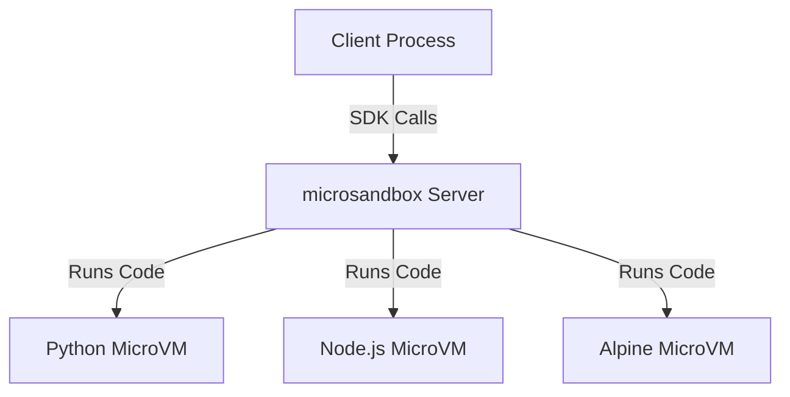

# microsandbox Repository Analysis

## 1. Core Functionality and Purpose
- Provides **secure execution of untrusted code** (AI-generated, user submissions, experimental)
- Solves security vulnerabilities of traditional approaches:
  - Local execution (malicious script risk)
  - Containers (kernel breakout vulnerability)
  - Traditional VMs (slow boot times)
  - Cloud solutions (limited flexibility)
- Key capabilities:
  - ✅ **Strong Isolation**: Hardware-level VM isolation via microVMs
  - ⚡ **Instant Startup**: <200ms boot times
  - 🏠 **Self-Hosted**: Full infrastructure control
  - 📦 **OCI Compatible**: Standard container image support
  - 🤖 **AI-Ready**: Built-in MCP support

## 2. Technical Architecture


**Key Components:**
- **microsandbox Server**: Manages microVM lifecycle
- **microVMs**: Firecracker-based lightweight VMs
- **SDKs**: Python, JavaScript, Rust implementations
- **Sandboxfile**: Project configuration manifest
- **OCI Images**: Pre-built environments (Python, Node.js, Alpine)

**Dependencies:**
- Firecracker (microVM runtime)
- Docker (for OCI image handling)
- Platform support: macOS/Linux (Windows WIP)

## 3. Installation and Local Usage
**Requirements:**
- macOS or Linux system
- Docker installed
- Minimum 4GB RAM (recommended)

**Quick Start:**
```bash
# Install CLI
curl -sSL https://get.microsandbox.dev | sh

# Start server (development mode)
msb server start --dev

# Pull Python environment
msb pull microsandbox/python

# Execute Python code
msx python
```

**Project Workflow:**
1. Initialize project: `msb init`
2. Configure sandboxes in `Sandboxfile`
3. Run environments: `msr [sandbox-name]`
4. Install as system executable: `msi [image]:[name]`

## 4. API/Extension Points
**SDK Integration:**
```python
from microsandbox import PythonSandbox

async with PythonSandbox.create() as sb:
    await sb.run("import antigravity")
    await sb.run("print('Hello from secure env!')")
```

**MCP Protocol Support:**
- Direct integration with AI tools via Model Context Protocol
- Supports tool execution definitions
- Resource access via standardized URIs

**Custom Environment Images:**
- Build custom OCI images
- Extend with specialized dependencies
- Share via registry

**Web Browsing Agent:**
- Automated web navigation
- Form handling
- Data extraction

**App Hosting:**
- Instant deployment of prototypes
- Resource-limited environments
- Automatic cleanup