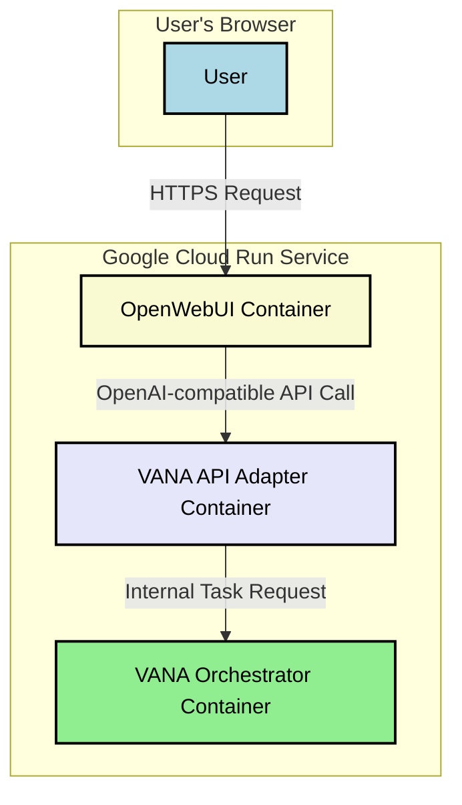

# Plan: Integrating OpenWebUI with the VANA Multi-Agent System

This document outlines the detailed, structured plan to use OpenWebUI as a modern frontend for the VANA system. The core of this plan is a decoupled architecture that uses a lightweight API adapter to bridge the two systems, allowing them to remain independent while working together seamlessly.

## 1. High-Level Architecture

The proposed architecture consists of three main components deployed as a multi-container application on Google Cloud Run. This approach is a best practice for microservice-style deployments and is well-supported by Google Cloud.



*   **OpenWebUI:** The user-facing web interface. It will be configured to talk to our custom API adapter.
*   **VANA API Adapter:** A lightweight FastAPI server that exposes an OpenAI-compatible `/v1/chat/completions` endpoint. It receives requests from OpenWebUI, translates them into tasks for the VANA system, and streams the results back.
*   **VANA Orchestrator:** The core VANA application (the existing ADK-based system), running as a separate container.

## 2. The VANA API Adapter

This is the only new code we need to write. It's a small, self-contained service.

### `vana-api-adapter/main.py`
```python
from fastapi import FastAPI
from fastapi.responses import StreamingResponse
import requests
import json

app = FastAPI()

# The internal URL for the VANA Orchestrator service
VANA_ORCHESTRATOR_URL = "http://vana-orchestrator:8080/execute" 

@app.post("/v1/chat/completions")
async def chat_completions(request: dict):
    # Extract the user's prompt from the OpenAI-compatible request
    user_prompt = request["messages"][-1]["content"]

    # Prepare the task request for the VANA Orchestrator
    vana_task = {"prompt": user_prompt}

    def stream_vana_response():
        # Use requests to call the VANA Orchestrator
        # The response from VANA is expected to be a stream of JSON objects
        with requests.post(VANA_ORCHESTRATOR_URL, json=vana_task, stream=True) as r:
            for chunk in r.iter_content(chunk_size=None):
                # We need to transform VANA's output into the OpenAI streaming format
                # This is a simplified example. The exact transformation will
                # depend on the structure of VANA's streaming output.
                response_chunk = {
                    "choices": [{
                        "delta": {
                            "content": chunk.decode('utf-8')
                        }
                    }]
                }
                yield f"data: {json.dumps(response_chunk)}\n\n"

    return StreamingResponse(stream_vana_response(), media_type="text/event-stream")
```

### `vana-api-adapter/Dockerfile`
```dockerfile
FROM python:3.13-slim

WORKDIR /app

COPY requirements.txt .
RUN pip install --no-cache-dir -r requirements.txt

COPY . .

CMD ["uvicorn", "main:app", "--host", "0.0.0.0", "--port", "8080"]
```

### `vana-api-adapter/requirements.txt`
```
fastapi
uvicorn
requests
```

## 3. Deployment on Google Cloud Run

We will use a single `cloudbuild.yaml` file to define and deploy our three-container application.

### `cloudbuild.yaml`
```yaml
steps:
- name: 'gcr.io/cloud-builders/docker'
  args: ['build', '-t', 'gcr.io/$PROJECT_ID/open-webui', './open-webui']
- name: 'gcr.io/cloud-builders/docker'
  args: ['build', '-t', 'gcr.io/$PROJECT_ID/vana-api-adapter', './vana-api-adapter']
- name: 'gcr.io/cloud-builders/docker'
  args: ['build', '-t', 'gcr.io/$PROJECT_ID/vana-orchestrator', '.'] # Assumes VANA Dockerfile is in root

- name: 'gcr.io/cloud-builders/docker'
  args: ['push', 'gcr.io/$PROJECT_ID/open-webui']
- name: 'gcr.io/cloud-builders/docker'
  args: ['push', 'gcr.io/$PROJECT_ID/vana-api-adapter']
- name: 'gcr.io/cloud-builders/docker'
  args: ['push', 'gcr.io/$PROJECT_ID/vana-orchestrator']

- name: 'gcr.io/google.com/cloudsdktool/cloud-sdk'
  entrypoint: gcloud
  args:
  - 'run'
  - 'deploy'
  - 'vana-frontend-service'
  - '--image'
  - 'gcr.io/$PROJECT_ID/open-webui'
  - '--region'
  - 'us-central1'
  - '--platform'
  - 'managed'
  - '--allow-unauthenticated'
  - '--set-env-vars'
  - 'OPENAI_API_BASE_URL=http://localhost:8080/v1,OPENAI_API_KEY=dummy-key' # Point OpenWebUI to the adapter
  - '--container'
  - 'open-webui'
  - '--add-container'
  - 'vana-api-adapter'
  - '--image'
  - 'gcr.io/$PROJECT_ID/vana-api-adapter'
  - '--set-env-vars'
  - 'VANA_ORCHESTRATOR_URL=http://localhost:8081/execute' # Point adapter to the orchestrator
  - '--port'
  - '8080'
  - '--depends-on'
  - 'vana-orchestrator'
  - '--add-container'
  - 'vana-orchestrator'
  - '--image'
  - 'gcr.io/$PROJECT_ID/vana-orchestrator'
  - '--port'
  - '8081'

images:
- 'gcr.io/$PROJECT_ID/open-webui'
- 'gcr.io/$PROJECT_ID/vana-api-adapter'
- 'gcr.io/$PROJECT_ID/vana-orchestrator'
```

## 4. Step-by-Step Implementation Plan

1.  **Prepare the Codebase:**
    *   Create a new directory `vana-api-adapter` and place the `main.py`, `Dockerfile`, and `requirements.txt` inside it.
    *   Clone the OpenWebUI repository into an `open-webui` directory.
    *   Ensure the root of the VANA project has a working `Dockerfile` for the main application.
2.  **Configure Google Cloud:**
    *   Ensure you have a Google Cloud project with the Cloud Run and Cloud Build APIs enabled.
    *   Authenticate your local gcloud CLI.
3.  **Run the Deployment:**
    *   From the root of the project, run the command: `gcloud builds submit --config cloudbuild.yaml .`
4.  **Access the Application:**
    *   Once the deployment is complete, Google Cloud Run will provide a public URL for the `vana-frontend-service`. Accessing this URL will open the OpenWebUI interface, which will be fully connected to your VANA backend.

This plan provides a clear, robust, and scalable path to using OpenWebUI as the frontend for VANA, respecting the integrity of both systems while enabling them to work together effectively.

## 5. Frontend Implementation Strategy (Phased Approach)

Given the two distinct UI modes (Basic and Advanced), we will adopt a phased implementation approach to deliver value incrementally and manage complexity.

### Phase 1: Minimum Viable Product (MVP) with Basic UI

The goal of this phase is to get a functional, polished product into users' hands as quickly as possible.

1.  **Implement the "Basic UI":**
    *   We will use OpenWebUI's default chat components as the foundation.
    *   We will develop the "Canvas" as a separate, collapsible panel that appears next to the main chat window.
2.  **Backend Support for Basic Mode:**
    *   The VANA API Adapter and Orchestrator will be configured to support this mode by streaming the final, formatted report to the Canvas.

### Phase 2: Advanced UI and Feature Enhancement

Once the Basic UI is stable and validated, we will build the advanced features.

1.  **Implement the "Advanced UI":**
    *   Develop the custom three-panel layout (User Chat, Team Log, Task Plan) as a new component within OpenWebUI.
2.  **Implement Mode Switching:**
    *   Add a toggle button to the UI that allows users to seamlessly switch between the Basic and Advanced layouts.
3.  **Enhance Backend for Advanced Mode:**
    *   The VANA Orchestrator will be enhanced to stream real-time log and plan updates, in addition to the final result.
    *   The VANA API Adapter will be updated to handle these new event types and route them to the correct panels in the Advanced UI.

This phased approach allows us to deliver a working, valuable product quickly with Phase 1, while providing a clear roadmap for building out the full, sophisticated vision in Phase 2.
